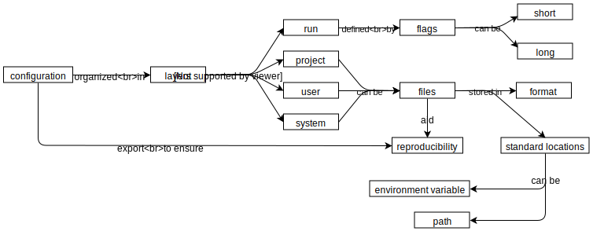
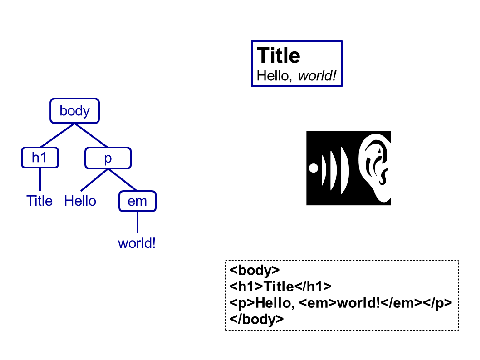

--- 
title: "Merely Useful"
author: "Dhavide Aruliah, Madeleine Bonsma-Fisher, Jonathan Dursi, Kate Hertweck, Katy Huff, Damien Irving, Luke Johnston, Christina Koch, Sara Mahallati, Brandeis Marshall, Joel Ostblom, Matt Turk, Elizabeth Wickes, Charlotte Wickham, and Greg Wilson"
date: "2019-07-29"
site: bookdown::bookdown_site
documentclass: book
lot: yes
lof: yes
bibliography: [book.bib]
citation-package: none
link-citations: yes
github-repo: merely-useful/merely-useful.github.io
description: "Merely Useful"
---


# Overview {#overview}

> It's still magic even if you know how it's done.
>
> -- Terry Pratchett

FIXME: general introduction

-   Be able to do the steps in @Yenn2019.

## Why isn't all of this normal already? {#overview-against}

Nobody argues that research should be irreproducible or unsustainable,
but "not against it" and actively supporting it are very different things.
Academia doesn't yet know how to reward people for writing useful software,
so while you may be thanked,
the extra effort you put in may not translate into job security or decent pay.

And some people still argue against openness,
Being open is a big step toward a (non-academic) career path,
which is where approximately 80% of PhDs go,
and for those staying in academia,
open work is cited more often than closed (FIXME: citation).
However,
some people still worry that if they make their data and code generally available,
someone else will use it and publish a result they have come up with themselves.
This is almost unheard of in practice,
but that doesn't stop people using it as a boogeyman.

Other people are afraid of looking foolish or incompetent by sharing code that might contain bugs.
This isn't just [impostor syndrome](glossary.html#impostor-syndrome):
members of marginalized groups are frequently judged more harshly than others (FIXME: CITE).

## Acknowledgments {#overview-ack}

This book owes its existence to
the hundreds of researchers we met through [Software Carpentry][swc] and [Data Carpentry][dc].
We are also grateful to [Insight Data Science][insight] for sponsoring the early stages of this work,
to everyone who has contributed,
and to:

-   *Practical Computing for Biologists* @Hadd2010
-   "A Quick Guide to Organizing Computational Biology Projects" @Nobl2009
-   "Ten Simple Rules for Making Research Software More Robust" @Tasc2017
-   "Best Practices for Scientific Computing" @Wils2014
-   "Good Enough Practices in Scientific Computing" @Wils2017

<!--chapter:end:index.Rmd-->


# Novice Goals {#novice-goals}

This outline describes the questions that the novice courses on R and Python will answer.
The advanced course can then assume that learners have hands-on experience with these topics
but nothing more.

## Personas

### Anya

**Anya** is a professor of neuropsychology
who is responsible for teaching her department's introduction to statistics
to 1100 first-year students every year.
(Students complain that the Stats department's introductory course is too theoretical
and requires more programming knowledge than they have.)
When she finds time for it,
her research focuses on color perception in infants.

Over the past nine years,
Anya has designed and run a dozen experiments on 50-100 infant subjects each
and analyzed the results using SPSS and more recently R
(which she taught herself during a sabbatical).
She has never taken a programming course,
and suffers from impostor syndrome when talking to colleagues who are using things like GitHub and R Markdown.

Anya would like to figure out how to use R to teach her intro stats course,
which currently uses a mixture of Excel and SPSS.
She would like to learn more about time series analysis to support her research,
and about tools like Git and R Markdown.

This guide has modular lessons and exercises that she can adapt to use in her course,
and suggestions for how to make learning interactive with a large class size.
She also finds helpful instructions for applying time series analysis to data using R.

### Exton

**Exton** taught business at a community college before joining a friend's startup,
and now does community management for a company that builds healthcare software.
He still teaches Marketing 101 every year to help people with backgrounds like his.

Exton uses Excel to keep track of who is registered for webinars, workshops, and training sessions.
Some of these spreadsheets are created from CSV files
produced by a web-scraping script a summer intern wrote for him a couple of years ago.
Exton doesn't think of himself as a programmer,
but spends hours creating complicated lookup tables in multi-sheet spreadsheets
to help him figure out how many webinar attendees turn into community contributors,
who answers forum posts most frequently,
and so on.

Exton knows there are better ways to do what he's doing,
but feels overwhelmed by the flood of blog posts, tweets, and "helpful" recommendations
he receives from members of the company's engineering team.
He wants someone to tell him where he should start and how long it will take whatever he learns to pay off.

Exton finds 'Merely Useful' after some Googling,
and sees an example of data analysis with spreadsheet data that looks really similar to what he's trying to do.
He carefully works through that particular example,
then goes back and works through some of the earlier material in the book.
He can tell that it won't take long to get this to work with his data.

### Irwin

**Irwin**, 18, is five months into an undergraduate degree in urban planning.
He's read lots of gushing articles in *Wired* about data science,
and was excited by the prospect of learning how to do it,
but dropped his CS 101 course after six weeks because nothing made sense.
(His university's computer science department uses Haskell as an introductory programming language...)
He is doing better in Anya's course (which he is taking as an elective)
but still spends most of his time copying, pasting, and swearing.

Irwin did well in his high school math classes,
and built himself a home page with HTML and CSS in a weekend workshop in grade 11.
He knows how to do simple calculations in Excel,
has accounts on nine different social media sites,
and attends all of his morning classes online.

Anya mentions this guide in one of her classes,
and Irwin downloads the PDF to read on the bus.
He loves the examples that use urban data,
and right away he has tons of ideas about where to get more cool data to analyze.
His urban data science blog is already taking shape in his head.

### Camilla

**Camilla** recently started a job as an assistant professor.
Her department (Medieval Studies) is trying to develop a digital humanities data-science-heavy undergraduate program,
and the undergraduate chair thinks that Camilla has the most programming experience in the department
and has asked her to develop an introduction to programming course for humanities students.

Camilla has dabbled in natural language processing and has learned Python over the course of her previous work,
but she has no experience teaching progamming
and she's not sure what the best way is to teach beginners.
She doesn't want to start from scratch to create a course out of nothing.
She also isn't sure which programming language the new program should focus on.

She finds 'Merely Useful' and feels relieved:
she can pretty much use the book as-is for her course.
She looks up the examples of text and image analysis
and compares how both R and Python approach those kinds of data
to help her make a decision about which language to teach.

### Jordan

**Jordan** is a third-year undergraduate student in ecology.
Two months ago she started working part-time for a professor in her department,
and she's beginning to collect and analyze data from her own experiments with fruit flies.
Her professor has asked her to learn R to do her analysis
and suggested that she sign up for the introduction to quantitative data analysis in R course
that the ecology department offers.
The course is just starting,
and it uses 'Merely Useful' as the textbook.

Jordan can't wait to apply her new programming knowledge to her data,
so she starts reading ahead and trying to use her own data in some of the book's examples.
As she works through examples,
she realizes that she'll need to change a few things about how she records her data in spreadsheets
so that it will be easier to analyze in R.

## Getting started

-   What are the different ways I can interact with software?
    -   console
    -   scripts
-   How can I find and view help?
    -   In the IDE
    -   Stack Overflow
-   How can I inspect data while I'm working on it?
    -   table viewers

## Data manipulation

-   How can I read tabular data into a program?
    -   what CSV is, where it comes from, and why people use it
    -   reading files
-   How can I select subsets of my data?
    -   select
    -   filter
    -   arrange
    -   Boolean conditions
-   How can I calculate new values?
    -   mutate
    -   ifelse
-   How can I tell what's gone wrong in my programs?
    -   reading error messages
    -   the difference between syntax and runtime errors
-   How can I operate on subsets of my data?
    -   group
    -   summarize
    -   split-apply-combine
-   How can I work with two or more datasets?
    -   join
-   How can I save my results?
    -   writing files
-   What *isn't* included?
    -   anything other than reasonably tidy tabular data
    -   map
    -   loops and conditionals

## Plotting

-   Why plot?
    -   summary statistics can mislead
    -   [Anscombe's Quartet and the DataSaurus dozen][anscombe-datasaurus]
-   What are the core elements of every plot?
    -   data
    -   geometric objects
    -   aesthetic mapping
-   How can I create different kinds of plots?
    -   scatter plot
    -   line plot
    -   histogram
    -   bar plot
    -   which to use when
-   How can I plot multiple datasets at once?
    -   grouping
    -   faceting
-   How can I make misleading plots?
    -   showing a single central tendency data point instead of the individual observations
    -   saturated plots instead of for example violins or 2D histograms
    -   picking unreasonable axes limits to intentionally misrepresent the underlying data
    -   not using perceptually uniform colormaps to indicate quantities
    -   not thinking about color blindness
-   What *isn't* included?
    -   outliers
    -   interactive plots
    -   maps
    -   3D visualization

## Development

-   How can I make my own functions?
    -   declaring functions
    -   declaring parameters
    -   default values
    -   common conventions
-   How can I make my programs tell me that something has gone wrong?
    -   validation (did we build the right thing) vs. verification (did we build the thing correctly)
    -   assertions for sanity checks
-   How can I ask for help?
    -   creating a reproducible example (reprex)
-   How do I install software?
    -   what *is* a package?
    -   package manager
-   What *isn't* included?
    -   code browsers, multiple cursors, and other fancy IDE tricks
    -   virtual environments
    -   debuggers

## Data analysis

-   How can I represent and manage missing values?
    -   NA
-   How can I get a feel for my data?
    -   summary statistics
-   How can I create a simple model of my data?
    -   formulas
    -   linear regression
        -   adding a best fit straight line on a scatterplot
        -   understanding what the error bands on a "best fit" straight line mean
    -   k-means cluster analysis
    -   frame these as exploratory tools for revealing structure in the data, rather than modelling or inferential tools
-   How can I put people at risk?
    -   algorithmic bias
    -   de-anonymization
-   What *isn't* included?
    -   statistical tests
    -   multiple linear regression
    -   anything with "machine learning" in its name

## Version control

-   What is a version control system?
    -   a smarter kind of backup
-   What goes where and why?
    -   local vs. remote storage (physically)
    -   local vs. remote storage (ethical/privacy issues)
-   How do I track my work locally?
    -   diff
    -   add
    -   commit
    -   log
-   How do I view or recover an old version of a file?
    -   diff
    -   checkout
-   How do I save work remotely?
    -   push and pull
-   How do I manage conflicts?
    -   merge
-   What *isn't* included?
    -   forking
    -   branching
    -   pull requests
    -   git reflow --substantive --single-afferent-cycle --ia-ia-rebase-fhtagn ...

## Publishing

-   How do static websites work?
    -   URLs
    -   servers
    -   request/response cycle
    -   pages
-   How do I create a simple HTML page?
    -   head/body
    -   basic elements
    -   images
    -   links
    -   relative vs. absolute paths
-   How can I create a simple website?
    -   GitHub pages
-   How can I give pages a standard appearance?
    -   layouts
-   How can I avoid writing all those tags?
    -   Markdown
-   How can I share values between pages?
    -   flat per-site and per-page configuration
    -   variable expansion
-   What *isn't* included?
    -   templating
    -   filters
    -   inclusions

## Reproducibility

-   How can I make programs easy to read?
    -   coding style
    -   linters
    -   documentation
-   How can I make programs easy to re-use?
    -   Taschuk's Rules
-   How can I combine explanations, code, and results?
    -   notebooks
-   Where does stuff actually live on my computer?
    -   directory structure on Windows and Unix
    -   absolute vs. relative paths
    -   significance of the working directory
    -   data on disk vs. data in memory
-   How should I organize my projects?
    -   Noble's Rules
    -   RStudio projects
-   How should I keep track of my data?
    -   simple manifests
-   What *isn't* included?
    -   build tools (Make and its kin)
    -   continuous integration
    -   documentation generators

## Collaboration

-   What kinds of licenses are there?
    -   open vs. closed
    -   copyright
-   Who gets to decide what license to use?
    -   it depends...
-   What license should I use for my publications?
    -   CC-something
-   What license should I use for my software?
    -   MIT/BSD vs. GPL
-   What license should I use for my data?
    -   CC0
-   How should I identify myself and my work?
    -   DOIs
    -   ORCIDs
-   How do I credit someone else's code?
    -   citing packages, citing something from GitHub, giving credit for someone's answer on StackOverflow...
-   What's the difference between open and welcoming?
    -   evidence for systematic exclusion
    -   mechanics of exclusion
-   How can I help create a level playing field?
    -   what's wrong with deficit models
    -   allyship, advocacy, and sponsorship
    -   Code of Conduct (remove negatives)
    -   [curb cuts][curb-cuts] (adding positives for some people helps everyone else too)
-   What *isn't* included?
    -   how to run a meeting
    -   community management
    -   mental health
    -   assessment of this course


<!--chapter:end:novice-goals.Rmd-->


# (PART) Novice R Material {-}

# Introduction {#novice-r-intro}

**Note: we will include this introduction in the novice Python material as well.**

FIXME: general introduction.

## Who are these lessons for? {#novice-r-intro-personas}

### Exton Excel

1.  Exton taught business at a community college for several years,
    and now does community management for an event management company.
    He still teaches Marketing 101 every year to help people with backgrounds like his.
2.  Exton uses Excel to keep track of who is registered for webinars, workshops, and training sessions.
    He doesn't think of himself as a programmer,
    but spends hours creating complicated lookup tables to figure out
    how many webinar attendees turn into community contributors,
    who answers forum posts most frequently,
    and so on.
3.  Exton knows there are better ways to do what he's doing,
    but feels overwhelmed by the blog posts, tweets, and “helpful” recommendations
    from the company's engineering team.
4.  Exton is a single parent;
    the one evening a week he spends teaching is the only out-of-work time
    he can take away from family responsibilities.

### Nina Newbie

1.  Nina is 18 years old and in the first year of an undergraduate degree in urban planning.
    She has read lots of gushing articles about data science,
    and was excited by the prospect of learning how to do it,
    but dropped her CS 101 course after six weeks because nothing made sense.
    She is doing better in her intro to statistics (which uses a little bit of R),
    but still spends most of her time copying, pasting, and swearing.
2.  Nina did well in her high school math classes,
    and built herself a home page with HTML and CSS in a weekend workshop in grade 11.
    She has accounts on nine different social media site,
    and attends all of her morning classes online.
3.  Nina wants self-paced tutorials with practice exercises,
    plus forums where she can ask for help.
4.  After a few bruising conversations with CS majors,
    Nina is reluctant to reveal how little she knows about programming:
    she would rather get a low grade and blame it on partying
    than let her classmates see that she is floundering.

## What will these lessons teach you? {#novice-r-intro-goals}

During this course, you will learn how to:

-   Write programs in R that read data, clean it up, perform simple statistical analyses on it.
-   Build visualizations to help you understand your data and communicate your findings.
-   Find and install R packages to help you do these things.
-   Create software that other people can understand and re-run.
-   Track your work in version control using Git and GitHub.
-   Publish your results on a web site using R Markdown and GitHub Pages.
-   Make your data, software, and reports citable using ORCIDs and DOIs, and cite the work of others.
-   Select open source and Creative Commons licenses that allow you and others to share data, software, and reports.
-   Be an active participant in open, inclusive projects.

### What do you need to have and know to start? {#novice-r-intro-prereq}

This course assumes that you:

-   Have a laptop that you can install software on, or access to a web-based programming system like [rstudio.cloud][rstudio-cloud].
-   Know what mean and variance are.
-   Are willing to invest about 30 hours in reading or lectures and another 100 hours doing practice exercises.

We have tried to make these lessons accessible to people with visual or motor challenges,
but recognize that some parts (particularly data visualization) may still be difficult.
We welcome suggestions for improvements.

## What examples will we use? {#novice-r-intro-example}

FIXME: introduce running examples

## What's the big picture? (#novice-r-intro-bigpicture}

We now swim in a sea of data and generate more each day.
That data can help us understand the world,
but it can also be used to manipulate us and invade our privacy.
Learning how to analyze data will help you do the former
and guard against the latter.

This course is therefore about *people*, *programs*, and *data*.
Data can live in three places (FIXME: diagram)

1.  In the computer's memory.
    It has to be here for the computer to use it,
    but when a program stops running or the computer is shut down,
    the contents of memory evaporate.

2.  On the computer's hard drive.
    This is much larger than memory---terabytes instead of gigabytes---and
    its contents are organized into *files* and *directories* (also called *folders*).
    What's on the hard drive stays there even when programs aren't running or the computer is switched off.
    A program must *read* data from files into memory to work with it,
    and *write* data to files to save it permanently.

3.  On some other computer on the network.
    "The cloud" and "the web" are just other people's computers;
    if we want to use data that's on the other side of a URL,
    we need to download it (i.e., copy it to our hard drive)
    or read it directly into memory (which is called [streaming](glossary.html#streaming-data)).

Programs also live in three places (FIXME: enhanced diagram)

1.  In the computer's memory.
    A program has to be in memory for the computer to run it.

2.  On the computer's hard drive.
    A program is a file like any other.
    Instead of containing text, pixels, or CO2 measurements,
    it contains instructions.
    In order for the computer to run it,
    those instructions have to be copied into memory.
    (This is part of what your computer is doing when it launches an application.)
    Your program typically uses other pieces of software
    called [packages](glossary.html#package) or [libraries](glossary.html#library)
    that provide common operations like searching in text,
    changing the colors of pixels,
    or calculating averages.
    When your program is loaded into memory,
    your computer also loads those packages.

3.  On some other computer on the network.
    R and Python both have catalogs of packages that people have written and shared.
    In order to use one of these,
    you must [install](glossary.html#install) it on your computer
    by copying its files from the catalog site to your hard drive.
    There's usually more to this than simply copying one file,
    so R and Python both come with tools to help you find, install, and manage packages.

Finally, we come to people (FIXME: enhanced diagram)

1.  This course starts by teaching you how to write programs that run on your computer,
    analyze data that is on your computer or on the web,
    and use packages written by other people.

2.  It will also teach you how to write programs that your collaborators can understand and run.
    (One of those collaborators is your future self,
    who will be grateful three months from now that you did the right thing today.)
    These skills will make you a productive member of a small team,
    and this course will also explain how to make such teams open and inclusive.

3.  The third group of people includes collaborators or reviewers
    who want to [reproduce](glossary.html#reproducible-research) your work.
    This course will show you how to publish your results on the web
    and how to get credit for your work and give it to others.


<!--chapter:end:novice-r-intro.Rmd-->


# Practice

We have covered a lot in the last few lessons,
so this one presents some practice exercises to ground what we have learned
and introduce a few more commonly-used functions.

## Working with a single tidy table

1. Load the tidyverse collection of package and the `here` package for constructing paths:


```r
library(tidyverse)
```

```
## ── Attaching packages ────────────────────────────────── tidyverse 1.2.1 ──
```

```
## ✔ ggplot2 3.2.0     ✔ purrr   0.3.2
## ✔ tibble  2.1.3     ✔ dplyr   0.8.3
## ✔ tidyr   0.8.3     ✔ stringr 1.4.0
## ✔ readr   1.3.1     ✔ forcats 0.4.0
```

```
## ── Conflicts ───────────────────────────────────── tidyverse_conflicts() ──
## ✖ dplyr::filter() masks stats::filter()
## ✖ dplyr::lag()    masks stats::lag()
```

```r
library(here)
```

```
## here() starts at /home/travis/build/merely-useful/merely-useful.github.io
```

2. Use `here::here` to construct a path to a file and `readr::read_csv` to read that file:


```r
path <- here::here("data", "person.csv")
person <- readr::read_csv(path)
```

```
## Parsed with column specification:
## cols(
##   person_id = col_character(),
##   personal_name = col_character(),
##   family_name = col_character()
## )
```

```r
person
```

```
## # A tibble: 5 x 3
##   person_id personal_name family_name
##   <chr>     <chr>         <chr>      
## 1 dyer      William       Dyer       
## 2 pb        Frank         Pabodie    
## 3 lake      Anderson      Lake       
## 4 roe       Valentina     Roerich    
## 5 danforth  Frank         Danforth
```

*Read `survey/site.csv`.*

3. Count rows and columns using `nrow` and `ncol`:


```r
nrow(person)
```

```
## [1] 5
```

```r
ncol(person)
```

```
## [1] 3
```

*How many rows and columns are in the site data?*

4. Format strings using `glue::glue`:


```r
print(glue::glue("person has {nrow(person)} rows and {ncol(person)} columns"))
```

```
## person has 5 rows and 3 columns
```

*Print a nicely-formatted summary of the number of rows and columns in the site data.*

5. Use `colnames` to get the names of columns and `paste` to join strings together:


```r
print(glue::glue("person columns are {paste(colnames(person), collapse = ' ')}"))
```

```
## person columns are person_id personal_name family_name
```

*Print a nicely-formatted summary of the names of the columns in the site data.*

6. Use `dplyr::select` to create a new table with a subset of columns by name:


```r
dplyr::select(person, family_name, personal_name)
```

```
## # A tibble: 5 x 2
##   family_name personal_name
##   <chr>       <chr>        
## 1 Dyer        William      
## 2 Pabodie     Frank        
## 3 Lake        Anderson     
## 4 Roerich     Valentina    
## 5 Danforth    Frank
```

*Create a table with just the latitudes and longitudes of sites.*

7. Use `dplyr::filter` to create a new table with a subset of rows by values:


```r
dplyr::filter(person, family_name < "M")
```

```
## # A tibble: 3 x 3
##   person_id personal_name family_name
##   <chr>     <chr>         <chr>      
## 1 dyer      William       Dyer       
## 2 lake      Anderson      Lake       
## 3 danforth  Frank         Danforth
```

*Create a table with only sites south of -48 degrees.*

8. Use the pipe operator `%>%` to combine operations:


```r
person %>%
  dplyr::select(family_name, personal_name) %>%
  dplyr::filter(family_name < "M")
```

```
## # A tibble: 3 x 2
##   family_name personal_name
##   <chr>       <chr>        
## 1 Dyer        William      
## 2 Lake        Anderson     
## 3 Danforth    Frank
```

*Create a table with only the latitudes and longitudes of sites south of -48 degrees.*

9. Use `dplyr::mutate` to create a new column with calculated values and `stringr::str_length` to calculate string length:


```r
person %>%
  dplyr::mutate(name_length = stringr::str_length(family_name))
```

```
## # A tibble: 5 x 4
##   person_id personal_name family_name name_length
##   <chr>     <chr>         <chr>             <int>
## 1 dyer      William       Dyer                  4
## 2 pb        Frank         Pabodie               7
## 3 lake      Anderson      Lake                  4
## 4 roe       Valentina     Roerich               7
## 5 danforth  Frank         Danforth              8
```

*Look at the help for the built-in function `round` and then use it to create a table with latitudes and longitudes rounded to integers.*

10. Use `dplyr::arrange` to order rows and (optionally) `dplyr::desc` to impose descending order:


```r
person %>%
  dplyr::mutate(name_length = stringr::str_length(family_name)) %>%
  dplyr::arrange(dplyr::desc(name_length))
```

```
## # A tibble: 5 x 4
##   person_id personal_name family_name name_length
##   <chr>     <chr>         <chr>             <int>
## 1 danforth  Frank         Danforth              8
## 2 pb        Frank         Pabodie               7
## 3 roe       Valentina     Roerich               7
## 4 dyer      William       Dyer                  4
## 5 lake      Anderson      Lake                  4
```

*Create a table sorted by decreasing longitude (i.e., most negative longitude last).*

## Working with grouped data

1. Read `survey/measurements.csv` and look at the data with `View`:


```r
measurements <- readr::read_csv(here::here("data", "measurements.csv"))
```

```
## Parsed with column specification:
## cols(
##   visit_id = col_double(),
##   visitor = col_character(),
##   quantity = col_character(),
##   reading = col_double()
## )
```


```r
View(measurements)
```

2. Find rows where `reading` is not NA, save as `cleaned`, and report how many rows were removed:


```r
cleaned <- measurements %>%
  dplyr::filter(!is.na(reading))
nrow(measurements) - nrow(cleaned)
```

```
## [1] 1
```

*Rewrite the filter expression to select rows where the visitor and quantity are not NA either and report the total number of rows removed.*


3. Group measurements by quantity measured and count the number of each (the column is named `n` automatically):


```r
cleaned %>%
  dplyr::group_by(quantity) %>%
  dplyr::count()
```

```
## # A tibble: 3 x 2
## # Groups:   quantity [3]
##   quantity     n
##   <chr>    <int>
## 1 rad          8
## 2 sal          7
## 3 temp         3
```

*Group by person and quantity measured.*

4. Find the minimum, average, and maximum for each quantity:


```r
cleaned %>%
  dplyr::group_by(quantity) %>%
  dplyr::summarize(low = min(reading), mid = mean(reading), high = max(reading))
```

```
## # A tibble: 3 x 4
##   quantity    low    mid  high
##   <chr>     <dbl>  <dbl> <dbl>
## 1 rad        1.46   6.56  11.2
## 2 sal        0.05   9.24  41.6
## 3 temp     -21.5  -18.7  -16
```

*Look at the range for each combination of person and quantity.*

5. Rescale salinity measurements that are greater than 1:


```r
cleaned <- cleaned %>%
  dplyr::mutate(reading = ifelse(quantity == 'sal' & reading > 1.0, reading/100, reading))
cleaned
```

```
## # A tibble: 18 x 4
##    visit_id visitor quantity reading
##       <dbl> <chr>   <chr>      <dbl>
##  1      619 dyer    rad        9.82 
##  2      619 dyer    sal        0.13 
##  3      622 dyer    rad        7.8  
##  4      622 dyer    sal        0.09 
##  5      734 pb      rad        8.41 
##  6      734 lake    sal        0.05 
##  7      734 pb      temp     -21.5  
##  8      735 pb      rad        7.22 
##  9      751 pb      rad        4.35 
## 10      751 pb      temp     -18.5  
## 11      752 lake    rad        2.19 
## 12      752 lake    sal        0.09 
## 13      752 lake    temp     -16    
## 14      752 roe     sal        0.416
## 15      837 lake    rad        1.46 
## 16      837 lake    sal        0.21 
## 17      837 roe     sal        0.225
## 18      844 roe     rad       11.2
```

*Do the same calculation use `case_when`.*

6. Read `visited.csv`, drop the NAs and store in `visits`.  Use `anti_join()` to find the measurements in `cleaned` that don't have matches in `visits`:


```r
visits <- readr::read_csv(here::here("data", "visited.csv")) %>%
  dplyr::filter(!is.na(visit_date)) 
```

```
## Parsed with column specification:
## cols(
##   visit_id = col_double(),
##   site_id = col_character(),
##   visit_date = col_date(format = "")
## )
```

```r
cleaned %>% anti_join(visits)
```

```
## Joining, by = "visit_id"
```

```
## # A tibble: 4 x 4
##   visit_id visitor quantity reading
##      <dbl> <chr>   <chr>      <dbl>
## 1      752 lake    rad        2.19 
## 2      752 lake    sal        0.09 
## 3      752 lake    temp     -16    
## 4      752 roe     sal        0.416
```

*Are there any sites in `visits` that don't have matches in `cleaned`?*

7. Join `visits` with the cleaned-up table of readings:


```r
cleaned <- visits %>% 
  dplyr::inner_join(cleaned, by = c("visit_id" = "visit_id"))
cleaned
```

```
## # A tibble: 14 x 6
##    visit_id site_id visit_date visitor quantity reading
##       <dbl> <chr>   <date>     <chr>   <chr>      <dbl>
##  1      619 DR-1    1927-02-08 dyer    rad        9.82 
##  2      619 DR-1    1927-02-08 dyer    sal        0.13 
##  3      622 DR-1    1927-02-10 dyer    rad        7.8  
##  4      622 DR-1    1927-02-10 dyer    sal        0.09 
##  5      734 DR-3    1930-01-07 pb      rad        8.41 
##  6      734 DR-3    1930-01-07 lake    sal        0.05 
##  7      734 DR-3    1930-01-07 pb      temp     -21.5  
##  8      735 DR-3    1930-01-12 pb      rad        7.22 
##  9      751 DR-3    1930-02-26 pb      rad        4.35 
## 10      751 DR-3    1930-02-26 pb      temp     -18.5  
## 11      837 MSK-4   1932-01-14 lake    rad        1.46 
## 12      837 MSK-4   1932-01-14 lake    sal        0.21 
## 13      837 MSK-4   1932-01-14 roe     sal        0.225
## 14      844 DR-1    1932-03-22 roe     rad       11.2
```

*Join `visited.csv` with `site.csv` to get (date, latitude, longitude) triples for site visits.*

7. Find the dates of the highest radiation reading at each site:


```r
cleaned %>%
  dplyr::filter(quantity == "rad") %>%
  dplyr::group_by(site_id) %>%
  dplyr::mutate(max_rad = max(reading)) %>%
  dplyr::filter(reading == max_rad)
```

```
## # A tibble: 3 x 7
## # Groups:   site_id [3]
##   visit_id site_id visit_date visitor quantity reading max_rad
##      <dbl> <chr>   <date>     <chr>   <chr>      <dbl>   <dbl>
## 1      734 DR-3    1930-01-07 pb      rad         8.41    8.41
## 2      837 MSK-4   1932-01-14 lake    rad         1.46    1.46
## 3      844 DR-1    1932-03-22 roe     rad        11.2    11.2
```

Another way to do it:


```r
cleaned %>%
  dplyr::filter(quantity == "rad") %>%
  dplyr::group_by(site_id) %>%
  dplyr::top_n(1, reading) %>%
  dplyr::select(site_id, visit_date, reading)
```

```
## # A tibble: 3 x 3
## # Groups:   site_id [3]
##   site_id visit_date reading
##   <chr>   <date>       <dbl>
## 1 DR-3    1930-01-07    8.41
## 2 MSK-4   1932-01-14    1.46
## 3 DR-1    1932-03-22   11.2
```

*Explain why this __doesn't__ work.*


```r
cleaned %>%
  dplyr::filter(quantity == "rad") %>%
  dplyr::group_by(site_id) %>%
  dplyr::summarize(max_rad = max(reading)) %>%
  dplyr::ungroup() %>%
  dplyr::filter(reading == max_rad)
```

```
## Error: object 'reading' not found
```

8. Normalize radiation against the highest radiation seen per site:


```r
cleaned %>%
  dplyr::filter(quantity == "rad") %>%
  dplyr::group_by(site_id) %>%
  dplyr::mutate(
    max_rad = max(reading),
    frac_rad = reading / max_rad) %>%
  dplyr::select(visit_id, site_id, visit_date, frac_rad)
```

```
## # A tibble: 7 x 4
## # Groups:   site_id [3]
##   visit_id site_id visit_date frac_rad
##      <dbl> <chr>   <date>        <dbl>
## 1      619 DR-1    1927-02-08    0.873
## 2      622 DR-1    1927-02-10    0.693
## 3      734 DR-3    1930-01-07    1    
## 4      735 DR-3    1930-01-12    0.859
## 5      751 DR-3    1930-02-26    0.517
## 6      837 MSK-4   1932-01-14    1    
## 7      844 DR-1    1932-03-22    1
```

*Normalize salinity against mean salinity by site.*

9. Find stepwise change in radiation per site by date:


```r
cleaned %>%
  dplyr::filter(quantity == "rad") %>%
  dplyr::group_by(site_id) %>%
  dplyr::mutate(delta_rad = reading - dplyr::lag(reading)) %>%
  dplyr::arrange(site_id, visit_date)
```

```
## # A tibble: 7 x 7
## # Groups:   site_id [3]
##   visit_id site_id visit_date visitor quantity reading delta_rad
##      <dbl> <chr>   <date>     <chr>   <chr>      <dbl>     <dbl>
## 1      619 DR-1    1927-02-08 dyer    rad         9.82     NA   
## 2      622 DR-1    1927-02-10 dyer    rad         7.8      -2.02
## 3      844 DR-1    1932-03-22 roe     rad        11.2       3.45
## 4      734 DR-3    1930-01-07 pb      rad         8.41     NA   
## 5      735 DR-3    1930-01-12 pb      rad         7.22     -1.19
## 6      751 DR-3    1930-02-26 pb      rad         4.35     -2.87
## 7      837 MSK-4   1932-01-14 lake    rad         1.46     NA
```

*Find length of time between visits by site.*

10. Find sites that experience any stepwise increase in radiation between visits:


```r
cleaned %>%
  dplyr::filter(quantity == "rad") %>%
  dplyr::group_by(site_id) %>%
  dplyr::mutate(delta_rad = reading - dplyr::lag(reading)) %>%
  dplyr::filter(!is.na(delta_rad)) %>%
  dplyr::summarize(any_increase = any(delta_rad > 0)) %>%
  dplyr::filter(any_increase)
```

```
## # A tibble: 1 x 2
##   site_id any_increase
##   <chr>   <lgl>       
## 1 DR-1    TRUE
```

*Find sites with visits more than one year apart.*

## Creating charts

We will use data on the mass and home range area (HRA) of various species from:

> Tamburello N, Côté IM, Dulvy NK (2015) Data from: Energy and the scaling of animal space use. Dryad Digital Repository.
> https://doi.org/10.5061/dryad.q5j65


```r
hra <- readr::read_csv(here::here("data", "home-range-database.csv"))
```

```
## Parsed with column specification:
## cols(
##   .default = col_character(),
##   mean.mass.g = col_double(),
##   log10.mass = col_double(),
##   mean.hra.m2 = col_double(),
##   log10.hra = col_double(),
##   preymass = col_double(),
##   log10.preymass = col_double(),
##   PPMR = col_double()
## )
```

```
## See spec(...) for full column specifications.
```

```r
head(hra)
```

```
## # A tibble: 6 x 24
##   taxon common.name class order family genus species primarymethod N    
##   <chr> <chr>       <chr> <chr> <chr>  <chr> <chr>   <chr>         <chr>
## 1 lake… american e… acti… angu… angui… angu… rostra… telemetry     16   
## 2 rive… blacktail … acti… cypr… catos… moxo… poecil… mark-recaptu… <NA> 
## 3 rive… central st… acti… cypr… cypri… camp… anomal… mark-recaptu… 20   
## 4 rive… rosyside d… acti… cypr… cypri… clin… fundul… mark-recaptu… 26   
## 5 rive… longnose d… acti… cypr… cypri… rhin… catara… mark-recaptu… 17   
## 6 rive… muskellunge acti… esoc… esoci… esox  masqui… telemetry     5    
## # … with 15 more variables: mean.mass.g <dbl>, log10.mass <dbl>,
## #   alternative.mass.reference <chr>, mean.hra.m2 <dbl>, log10.hra <dbl>,
## #   hra.reference <chr>, realm <chr>, thermoregulation <chr>,
## #   locomotion <chr>, trophic.guild <chr>, dimension <chr>,
## #   preymass <dbl>, log10.preymass <dbl>, PPMR <dbl>,
## #   prey.size.reference <chr>
```

1. Look at how mass is distributed:


```r
ggplot2::ggplot(hra, mapping = aes(x = mean.mass.g)) +
  ggplot2::geom_histogram()
```

```
## `stat_bin()` using `bins = 30`. Pick better value with `binwidth`.
```

<!-- -->

Try again with `log10.mass`:


```r
ggplot2::ggplot(hra, mapping = aes(x = log10.mass)) +
  ggplot2::geom_histogram()
```

```
## `stat_bin()` using `bins = 30`. Pick better value with `binwidth`.
```

<!-- -->

*Create histograms showing the distribution of home range area using linear and log scales.*

2. Change the visual appearance of a chart:


```r
ggplot2::ggplot(hra, mapping = aes(x = log10.mass)) +
  ggplot2::geom_histogram(bins = 100) +
  ggplot2::ggtitle("Frequency of Species Masses") +
  ggplot2::xlab("Log10 of Mass") +
  ggplot2::ylab("Number of Species") +
  ggplot2::theme_minimal()
```

<!-- -->

*Show the distribution of home range areas with a dark background.*

3. Create a scatterplot showing the relationship between mass and home range area:


```r
ggplot2::ggplot(hra, mapping = aes(x = log10.mass, y = log10.hra)) +
  ggplot2::geom_point()
```

<!-- -->

*Create a similar scatterplot showing the relationship between the raw values rather than the log values.*

4. Colorize scatterplot points by class:


```r
hra %>%
  dplyr::mutate(class_fct = as.factor(class)) %>%
  ggplot2::ggplot(mapping = aes(x = log10.mass, y = log10.hra, color = class_fct)) +
  ggplot2::geom_point(alpha = 0.5)
```

<!-- -->

*Group by order and experiment with different alpha values.*

5. Create a faceted plot:


```r
hra %>%
  dplyr::mutate(class_fct = as.factor(class)) %>%
  ggplot2::ggplot(mapping = aes(x = log10.mass, y = log10.hra, color = class_fct)) +
  ggplot2::geom_point(alpha = 0.5) +
  ggplot2::facet_wrap(vars(class_fct))
```

<!-- -->

*Create a plot faceted by order for just the reptiles.*

6. Fit a linear regression to the logarithmic data for birds:


```r
hra %>%
  dplyr::filter(class == "aves") %>%
  ggplot2::ggplot(mapping = aes(x = log10.mass, y = log10.hra)) +
  ggplot2::geom_point(alpha = 0.5) +
  ggplot2::geom_smooth(method = lm, color = 'red', se = FALSE)
```

<!-- -->

*Fit a line to the raw data for birds rather than the logarithmic data.*

7. Create a violin plot of mass by order for birds:


```r
hra %>%
  dplyr::filter(class == "aves") %>%
  dplyr::mutate(order_fct = as.factor(order)) %>%
  ggplot2::ggplot(mapping = aes(x = order_fct, y = log10.mass, color = order_fct)) +
  ggplot2::geom_violin()
```

<!-- -->

*Rotate the labels on the X axis to make this readable, then explain the gaps.*

8. Display the same data as a boxplot:


```r
hra %>%
  dplyr::filter(class == "aves") %>%
  dplyr::mutate(order_fct = as.factor(order)) %>%
  ggplot2::ggplot(mapping = aes(x = order_fct, y = log10.mass, color = order_fct)) +
  ggplot2::geom_boxplot()
```

<!-- -->

*Fix the labels and remove orders that only contain one species.*

9. Save the linear regression plot for birds as a PNG:


```r
hra %>%
  dplyr::filter(class == "aves") %>%
  ggplot2::ggplot(mapping = aes(x = log10.mass, y = log10.hra)) +
  ggplot2::geom_point(alpha = 0.5) +
  ggplot2::geom_smooth(method = lm, color = 'red', se = FALSE)
```

<!-- -->

```r
ggsave(here::here("birds.png"))
```

```
## Saving 7 x 5 in image
```

*Save the plot as SVG scaled to be 8cm wide.*

10. Create a horizontal histogram with 50 bins:


```r
ggplot2::ggplot(hra, mapping = aes(x = log10.mass)) +
  ggplot2::geom_histogram(bins = 50) +
  ggplot2::coord_flip()
```

<!-- -->

*Use `stat_summary` to summarize the relationship between mass and home range area by class.*


<!--chapter:end:novice-r-practice.Rmd-->


# (PART) Novice Python Material {-}

# Introduction {#novice-py-intro}

FIXME: general introduction.

## Who are these lessons for? {#novice-py-intro-personas}

FIXME: personas

### Summary

FIXME: elevator pitch

### Prerequisites

FIXME: prerequisites

## What does "done" look like? {#novice-py-intro-goals}

FIXME: end goal

## What will we use as running examples? {#novice-py-intro-example}

FIXME: introduce running examples


<!--chapter:end:novice-py-intro.Rmd-->


# RSE Goals {#rse-goals}

This outline describes the questions that the second course will answer.
It assumes learners have completed the novice course, 
which means they know:

-   how to write code (in Python or R) that reads, analyses and plots a dataset,
-   how to write and run unit tests,
-   how to publish a static website using GitHub Pages,
-   how to organize the files in a small project,
-   the basics of licensing, and
-   the basics of good behavior.

## Personas

### Beatrice

**Beatrice** completed a Master's in library science five years ago,
and has worked since then for a small NGO.
She did some statistics during her degree,
and has learned some R and Python by doing data science courses online,
but has no formal training in programming.
Beatrice would like to tidy up the scripts, data sets, and reports she has created
in order to share them with her colleagues.
These lessons will show her how to do this and what "done" looks like.

### Jun

**Jun** completed an Insight Data Science fellowship last year after doing a PhD in Geology,
and now works for a company that does forensic audits.
He has used a variety of machine learning and visualization software,
and has made a few small contributions to a couple of open source R packages.
He would now like to make his own code available to others;
this guide will show him how such projects should be organized.

### Sami

**Sami** learned a fair bit of numerical programming while doing a BSc in applied math,
then started working for the university's supercomputing center.
Over the past few years,
the kinds of applications they are being asked to support have shifted from fluid dynamics to data analysis.
This guide will teach them how to build and run data pipelines
so that they can teach those skills to their users.

## The Unix Shell

Based on <http://swcarpentry.github.io/shell-novice/>
and <https://merely-useful.github.io/still-magic/en/shell.html>

-   How do I navigate my filesystem?
    -   moving about (cd, ls)
    -   files and directories (ls, cp, mkdir, mv, rm)
    -   paths (., .., absolute, relative, special) 
-   How do I examine and/or edit a text file?
    -   difference between text and binary files
    -   running a text editor
    -   operating on text (cat, wc, head, tail, etc)
    -   wildcards
    -   finding things (find, grep, locate)
-   How do I combine multiple commands?
    -   pipes and filters
    -   redirection to/from files
    -   loops
-   Variables
    -   define a variable
    -   use a variable
    -   what's with all the quotes?
-   Shell scripts
    -   read/write/execute file permissions
    -   `#!` lines
    -   using command-line arguments in scripts
    -   job control (&, control-c)
-   Shortcuts
    -   tab completion
    -   previous commands (up arrow, control-r)
    -   history
-   Getting help
    -   --help, man
-   Customising your shell experience
    -   .bashrc
-   Working remotely
    -   scp/rsync and ssh
    -   key pairs
-   Bonus material: non-standard commands you might find useful (tree, htop, autojump, fd, etc)

## Automating analyses

Based on <http://swcarpentry.github.io/make-novice/>
and <https://merely-useful.github.io/still-magic/en/automate.html>

-   How do I write a simple Makefile? 
-   How can I abbreviate the rules in my Makefiles? 
-   How can I write a Makefile to update things when my scripts have changed rather than my input files?
-   How can I define rules to operate on similar files? 
    -   Pattern rules
-   How can I eliminate redundancy in my Makefiles?
    -   Variables
    -   Functions
-   How should I document a Makefile?
-   What other tools can I use?
    -   drake for R
    -   snakemake for Python

## Reusable software

Based on <https://merely-useful.github.io/still-magic/en/configure.html>
and <https://merely-useful.github.io/still-magic/en/logging.html>

-   How do I parse the command line from within a Python script?
    -   basic structure of python scripts
    -   argparse
-   How would I implement a configuration file?
    -   as a data structure (JSON)
    -   as key/value pairs (YAML)
-   How would I report my program's progress?
    -   logging levels
    -   logging channels
    -   configuration
    -   progress bars such as tqdm
-   How do I document my programs?
    -   documentation generators
    -   docstrings in Python
    -   roxygen in R

## Version control

(The novice materials teach it with a GUI.)
Based on <http://swcarpentry.github.io/git-novice/>

-   Version control at the command line
    -   Checking progress: git status, diff, log
    -   Commit cycle: git add, commit, push, pull
-   How do I do multiple things at once?
    -   branches
    -   branch naming
    -   branch management conventions (like feature branches)
-   How do I suggest changes to other people's code?
    -   forking repositories
    -   creating pull requests
    -   reviewing pull requests

## Testing

Based on <http://katyhuff.github.io/python-testing/>,
and <https://merely-useful.github.io/still-magic/en/unit.html>

-   Why should I test my code?
-   How do I implement tests/checks at specific points within my code?
    -   assertions (brief, this is covered in novice course)
    -   exceptions
-   How can I write and manage tests for my software?
    -   unit tests
    -   test runners
-   What tests should I write for my software?
    -   edge cases
    -   fails when it should
    -   bugs become tests
-   How can I run commands automatically every time a repository is updated?
    -   continuous integration
    -   Travis
-   How can I tell what I have and haven't tested?
    -   coverage
-   What *isn't* included?
    -   legal liabilities

## Packaging

Based on <https://carpentrieslab.github.io/python-aos-lesson/01-conda/>
and <https://merely-useful.github.io/still-magic/en/package.html>

-   How do I install and manage my Python environment?
    -   Python distributions (Anaconda)
    -   Package managers (pip, conda)
    -   conda environments
-   How can I write a package that can be installed via pip?
-   How do I write a package that can be shared on CRAN?
-   How do version numbers work?
-   How can I put documentation for my package on the web? (e.g. Sphinx / Read The Docs for Python, pkgdown for R)

## Project management

-   How can **we** keep track of who's doing what and what's still to be done?
    -   issue tracking
    -   issue tagging as lightweight workflow
-   How can **we** figure out what to build next?
    -   planning vs. agile
    -   3x3 prioritization
-   How can **we** make decisions?
    -   how to run a meeting
    -   project governance
    -   strategies for handling difficult project members

## Other topics we have committed to considering 

- SQL: <https://github.com/merely-useful/merely-useful.github.io/issues/70>
- Regular expressions: <https://github.com/merely-useful/merely-useful.github.io/issues/71>
- JSON: <https://github.com/merely-useful/merely-useful.github.io/issues/72>

## What have we left out?

-   Object-oriented programming
-   Nonstandard evaluation (in R)
-   Refactoring
-   Profiling and performance tuning
-   Time management and the effects of overwork
-   Everything with "parallel" in its name...

<!--chapter:end:rse-goals.Rmd-->


# (PART) RSE Material {-}

# RSE Introduction {#rse-intro}

As research becomes more computing intensive,
researchers need more computing skills so that:

-   other people (including your future self) can re-do your analyses;
-   you and the people using your results can be confident that they're correct; and
-   re-using your software is easier than rewriting it.

Most books and courses about software engineering are aimed at product development,
but research has different aims and needs.
A research programmer's goal is to answer a question;
she might build software in order to do that,
but the software is only a means to an end.

But just as some astronomers spend their entire careers designing better telescopes,
some researchers choose to spend their time building software
that will primarily be used by their colleagues.
People who do this may be called [research software engineers](glossary.html#rse) (RSEs)
or [data engineers](glossary.html#data-engineering),
and the aim of these lessons is to help you get ready for these roles---to go from
writing code on your own, for your own use,
to working in a small team creating tools to help your entire field advance.

One of the many challenges you will face is
to find the appropriate mix of tools and methods for each problem you have to solve.
If you want to reformat a handful of text files so that your program can read them in,
you shouldn't bother writing a comprehensive test suite or setting up automated builds.
On the other hand,
if you *don't* do this,
and that "handful of text files" turns into a pile,
and then a mountain,
you will quickly reach a point where you wish you had.
We hope this training will help you understand what challenges have already been solved
and where to find those solutions
so that when you need them,
you'll be able to find them.

## Who are these lessons for? {#rse-intro-personas}

Amira
:   completed a Master's in library science five years ago,
    and has worked since then for a small NGO.
    She did some statistics during her degree,
    and has learned some R and Python by doing data science courses online,
    but has no formal training in programming.
    Amira would like to tidy up the scripts, data sets, and reports she has created
    in order to share them with her colleagues.
    These lessons will show her how to do this and what "done" looks like.

Jun
:   completed an [Insight Data Science][insight] fellowship last year after doing a PhD in Geology,
    and now works for a company that does forensic audits.
    He has used a variety of machine learning and visualization software,
    and has made a few small contributions to a couple of open source R packages.
    He would now like to make his own code available to others;
    this guide will show him how such projects should be organized.

Sami
:   learned a fair bit of numerical programming while doing a BSc in applied math,
    then started working for the university's supercomputing center.
    Over the past few years,
    the kinds of applications they are being asked to support
    have shifted from fluid dynamics to data analysis.
    This guide will teach them how to build and run data pipelines
    so that they can teach those skills to their users.

### Summary

For researchers and data scientists who can build and run programs that are three or four pages long,
and who want to be more productive and have more confidence in their results,
this guide
provides a pragmatic, tools-based introduction to program design and maintenance.
Unlike books and courses aimed at computer scientists and professional software developers,
this guide uses data analysis as a motivating example
and assumes that the learner's ultimate goal is to answer questions rather than ship products.

### Prerequisites

Learners must be comfortable with the basics of
the [Unix shell][swc-shell], [Python][swc-python] or [R][swc-r], and [Git][swc-git].
They will need a personal computer with Internet access,
the Bash shell,
Python 3,
and a GitHub account.

## What does "done" look like? {#rse-intro-done}

In order to answer the question posed in this section's title,
we need to distinguish between three key ideas.
The first is [open science](glossary.html#open-science),
which aims to make research methods and results available for everyone to read and re-use.
The second is [reproducible research](glossary.html#reproducible-research),
which means that anyone with access to the raw materials can easily reproduce the results.
Openness and reproducibility are closely related,
but are *not* the same thing:

-   If you share my data and analysis scripts,
    but haven't documented the manual steps in the analysis,
    your work is open but not reproducible.
-   If you completely automate the analysis,
    but it's only available to people in you company or lab,
    it's reproducible but not open.

The third key idea is [sustainability](glossary.html#sustainability).
A piece of software is being sustained
if people are using it, fixing it, and improving it
rather than replacing it.
Sustainability isn't just a property of the software:
it also depends on the culture of its actual and potential users.
If "share, mend, and extend" is woven into the fabric of their culture,
even Fortran-77 can thrive
(though of course good tooling and packaging can lower costs and barriers to entry).
Conversely,
it doesn't matter whether a library has automated tests and is properly packaged
if potential users suffer from [Not Invented Here](glossary.html#not-invented-here) syndrome.
More importantly,
if the software is being maintained by a couple of post-docs
who are being paid a fraction of what they could earn in industry,
and who have no realistic hope of promotion because their field looks down on tool building,
those people will eventually move on
and their software will start to suffer from [bit rot](glossary.html#bit-rot).

What ties these three ideas together is the notion of
[computational competence](glossary.html#computational-competence),
which is the the programming equivalent of good laboratory skills.
Software is just another kind of lab equipment;
just as an archaeologist should know how to prepare and catalog an artefact,
any researcher writing software should know how to make their work reproducible
and share it with the world
without staying up until dawn.

> **Why "Computational Competence"?**
>
> The term [computational thinking](glossary.html#computational-thinking)
> has been widely used since @Wing2006 introduced it a decade ago.
> It has also been used in such a wide variety of ways
> that no one really knows what it means.
> We therefore prefer to talk about computational competence---about
> someone's ability to do computing well.

## What will this course accomplish? {#rse-intro-coverage}

The goal of this course is to help you produce more correct results in less time and with less effort:
stakeholders will be confident that you did things the right way,
which in turn will allow them to be confident in your results,
and you and others will be able to re-use your data, software, and reports instead of constantly rewriting them.
To achieve this, we will cover:

-   Writing code that is readable, testable, and maintainable
-   Automating analyses with build tools
-   Checking and demonstrating correctness via automated tests
-   Publishing science in the 21st Century
-   Using a branch-per-feature workflow, rebasing, and tags to manage work
-   Organizing the code, data, results, and reports in a small or medium-sized project

These lessons can be used for self-study
by people who are taking part in something like the [Insight Data Science][insight] Fellows Program,
or as part of a one-semester course for graduate students or senior undergraduates.
You will know you're done when:

1.  You are reasonably confident that your results are correct.
    This is not the same as "absolutely sure":
    our goal is to make digital work
    as trustworthy as lab experiments or careful manual analysis.
2.  Your software can be used by other people without heroic effort,
    I.e., people you have never met can find it
    and figure out how to install it and use it
    in less time than it would take them to write something themselves.
3.  Small changes and extensions are easy
    so that your software can grow as your problems and questions evolve.

## What will we use as running examples? {#rse-intro-example}

In order to make this material as accessible as possible,
we will use two text processing problems as running examples.
The first is an exploration of [Zipf's Law][zipfs-law],
which states that frequency of a word is inversely proportional to rank,
i.e.,
that the second most common word in some text
occurs half as often as most common,
the third most common occurs a third as often,
and so on.
We will write some simple software to test a corpus of text against this rule.
The files we will use are taken from the [Project Gutenberg][gutenberg]
and contain this many words:

| Book                            | Words  |
| ------------------------------- | -----: |
| anne_of_green_gables.txt        | 105642 |
| common_sense.txt                |  24999 |
| count_of_monte_cristo.txt       | 464226 |
| dracula.txt                     | 164424 |
| emma.txt                        | 160458 |
| ethan_frome.txt                 |  37732 |
| frankenstein.txt                |  78098 |
| jane_eyre.txt                   | 188455 |
| life_of_frederick_douglass.txt  |  43789 |
| moby_dick.txt                   | 215830 |
| mysterious_affair_at_styles.txt |  59604 |
| pride_and_prejudice.txt         | 124974 |
| sense_and_sensibility.txt       | 121590 |
| sherlock_holmes.txt             | 107533 |
| time_machine.txt                |  35524 |
| treasure_island.txt             |  71616 |

This is how often the most common words appear in this corpus as a whole:

| Word | Count |
| ---- | ----: |
| the  | 97278 |
| and  | 59385 |
| to   | 56028 |
| of   | 55190 |
| I    | 45680 |
| a    | 40483 |
| in   | 30030 |
| was  | 24512 |
| that | 24386 |
| you  | 22123 |
| it   | 21420 |

The frequencies aren't an exact match---we would expect about 48,600 occurrences of "and", for example---but
there certainly seems to be a decay curve of some kind.
We'll look more closely at this data as we go along.

The second project is a simple form of [computational stylometry](glossary.html#computational-stylometry).
Different writers have different styles;
can a computer detect those differences,
and if so,
can it determine who the likely author of a text actually was?
Computational stylometry has been used to explore
which parts of Shakespeare's plays might have been written by other people,
which presidential tweets were composed by other people,
and who wrote incriminating emails in several high-profile legal cases.

The authors of our books are listed below.
Three of them were purportedly written by Jane Austen;
we will see if the similarity measures we develop show that.

| Author                      | Book                            |
| ----------------------------| ------------------------------- |
| Jane Austen                 | emma.txt                        |
| Jane Austen                 | pride_and_prejudice.txt         |
| Jane Austen                 | sense_and_sensibility.txt       |
| Charlotte Brontë            | jane_eyre.txt                   |
| Agatha Christie             | mysterious_affair_at_styles.txt |
| Frederick Douglass          | life_of_frederick_douglass.txt  |
| Arthur Conan Doyle          | sherlock_holmes.txt             |
| Alexandre Dumas             | count_of_monte_cristo.txt       |
| Herman Melville             | moby_dick.txt                   |
| Lucy Maud Montgomery        | anne_of_green_gables.txt        |
| Thomas Paine                | common_sense.txt                |
| Mary Wollstonecraft Shelley | frankenstein.txt                |
| Robert Louis Stevenson      | treasure_island.txt             |
| Bram Stoker                 | dracula.txt                     |
| H. G. Wells                 | time_machine.txt                |
| Edith Wharton               | ethan_frome.txt                 |


<!--chapter:end:rse-intro.Rmd-->


# Bash Shell {#bash}

## Questions {#bash-questions}


- What is a command shell and why would I use one?

- How can I move around on my computer?
- How can I see what files and directories I have?
- How can I specify the location of a file or directory on my computer?

- How can I create, copy, and delete files and directories?
- How can I edit files?

- How can I combine existing commands to do new things?

- How can I perform the same actions on many different files?

- How can I save and re-use commands?

- How can I find files?
- How can I find things in files?

## Objectives {#bash-objectives}


- Introduction  
  - Explain how the shell relates to the keyboard, the screen, the operating system, and users' programs.
  - Explain when and why command-line interfaces should be used instead of graphical interfaces.
  - Explain the steps in the shell's read-run-print cycle.
  - Identify the actual command, options, and filenames in a command-line call.
  - Demonstrate the use of tab completion and explain its advantages.

- Navigating files and directories  
  - Explain the similarities and differences between a file and a directory.
  - Translate an absolute path into a relative path and vice versa.
  - Construct absolute and relative paths that identify specific files and directories.

- Working with files and directories  
  - Create a directory hierarchy that matches a given diagram.
  - Create files in that hierarchy using an editor or by copying and renaming existing files.
  - Delete, copy and move specified files and/or directories.

- Pipes and filters  
  - Redirect a command's output to a file.
  - Process a file instead of keyboard input using redirection.
  - Construct command pipelines with two or more stages.
  - Explain what usually happens if a program or pipeline isn't given any input to process.
  - Explain Unix's 'small pieces, loosely joined' philosophy.

- Loops  
  - Write a loop that applies one or more commands separately to each file in a set of files.
  - Trace the values taken on by a loop variable during execution of the loop.
  - Explain the difference between a variable's name and its value.
  - Explain why spaces and some punctuation characters shouldn't be used in file names.
  - Demonstrate how to see what commands have recently been executed.
  - Re-run recently executed commands without retyping them.

- Shell scripts  
  - Write a shell script that runs a command or series of commands for a fixed set of files.
  - Run a shell script from the command line.
  - Write a shell script that operates on a set of files defined by the user on the command line.
  - Create pipelines that include shell scripts you, and others, have written.

- Finding things  
  - Use `grep` to select lines from text files that match simple patterns.
  - Use `find` to find files whose names match simple patterns.
  - Use the output of one command as the command-line argument(s) to another command.
  - Explain what is meant by 'text' and 'binary' files, and why many common tools don't handle the latter well.

## Introduction {#bash-intro}

At a high level, computers do four things:

-   run programs
-   store data
-   communicate with each other, and
-   interact with us

They can do the last of these in many different ways,
including through a keyboard and mouse, touch screen interfaces, or using speech recognition systems.
While touch and voice interfaces are becoming more commonplace, most interaction is still
done using traditional screens, mice, touchpads and keyboards.

The **graphical user interface** (GUI) is the most widely used way to interact with
personal computers. We give instructions (to run a program, to copy a file, to create
a new folder/directory) with the convenience of a few mouse clicks. This way of interacting
with a computer is intuitive and very easy to learn. But this way of giving instructions to
a computer scales very poorly if we are to give a large stream of instructions, even if they
are similar or identical. For example, suppose we needed to copy the third line of each of a thousand
text files stored in thousand different directories and paste it into a single file
line by line. Using the traditional GUI approach of mouse clicks, this task would take several hours.

This is where we can take advange of the shell -- a **command-line interface** --
to make such repetitive tasks automatic and fast. It can take a single instruction and
repeat it (as is or with some modification) as many times as we want. The task in
the example above could be accomplished in a few minutes at most.

The heart of a command-line interface is a **read-evaluate-print loop**. It is called
so because when you type a command and press <kbd>Return</kbd> (also known as <kbd>Enter</kbd>) the shell
reads your command,
evaluates (or "executes") it,
prints the output of your command,
then loops back and waits for you to enter another command.

### The shell

The shell is a program which runs other programs rather than doing calculations itself.
Those programs can be as complicated as climate modeling software and as simple as a
program that creates a new directory. The simple programs which are used to perform
stand alone tasks are usually refered to as commands.
The most popular Unix shell is Bash, (the Bourne Again SHell -- so-called because
it's derived from a shell written by Stephen Bourne).
Bash is the default shell on most modern implementations of Unix
and in most packages that provide Unix-like tools for Windows.

When the shell is first opened, you are presented with a **prompt**,
indicating that the shell is waiting for input.

```shell
$
```

The shell typically uses `$ ` as the prompt, but may use a different symbol.
In the examples for this lesson, we'll show the prompt as `$ `.
Most importantly:
when typing commands, either from these lessons or from other sources,
*do not type the prompt*, only the commands that follow it.

So let's try our first command, which will tell us our username:

```shell
$ whoami
```

```text
beatrice
```

(Beatrice is one of the learner personas described earlier.)


### Is it difficult?

It is a different model of interacting than a GUI, and that
will take some effort -- and some time -- to learn.
A GUI presents you with choices and you select one.
With a **command line interface** (CLI) the choices are combinations of commands and parameters,
more like words in a language than buttons on a screen.
They are not presented to you so you must learn a few,
like learning some vocabulary in a new language.
But a small number of commands gets you a long way,
and we'll cover those essential few in this lesson.


### Flexibility and automation

The grammar of a shell allows you to combine existing tools into powerful
pipelines and handle large volumes of data automatically. Sequences of
commands can be written into a *script*, improving the reproducibility of
workflows and allowing you to repeat them easily.

In addition, the command line is often the easiest way to interact with remote machines and supercomputers.
Familiarity with the shell is near essential to run a variety of specialized tools and resources
including high-performance computing systems.
As clusters and cloud computing systems become more popular for scientific data crunching,
being able to interact with the shell is becoming a necessary skill.
We can build on the command-line skills covered here
to tackle a wide range of scientific questions and computational challenges.


## Navigating Files and Directories {#bash-navigation}

The part of the operating system responsible for managing files and directories
is called the **file system**.
It organizes our data into files,
which hold information,
and directories (also called "folders"),
which hold files or other directories.

Several commands are frequently used to create, inspect, rename, and delete files and directories.
To start exploring them, we'll go to our open shell window.

First let's find out where we are by running a command called `pwd`
(which stands for "print working directory"). Directories are like *places* -- at any time
while we are using the shell we are in exactly one place, called
our **current working directory**. Commands mostly read and write files in the
current working directory, so knowing where you are before running
a command is important.

```shell
$ pwd
```

```text
/Users/beatrice
```

Here,
the computer's response is `/Users/beatrice`,
which is Beatrice's **home directory**:

> **Home Directory Variation**
>
> The home directory path will look different on different operating systems.
> On Linux it may look like `/home/beatrice`,
> and on Windows it will be similar to `C:\Documents and Settings\beatrice` or
> `C:\Users\beatrice`.
> (Note that it may look slightly different for different versions of Windows.)
> In future examples, we've used Mac output as the default - Linux and Windows
> output may differ slightly, but should be generally similar.

To understand what a "home directory" is,
let's have a look at how the file system as a whole is organized.  For the
sake of this example, we'll be
illustrating the filesystem on Beatrice's computer.  After this
illustration, you'll be learning commands to explore your own filesystem,
which will be constructed in a similar way, but not be exactly identical.

On Beatrice's computer, the filesystem looks like this:

*TODO: Figure - The File System [../fig/filesystem.svg](https://github.com/swcarpentry/shell-novice/blob/gh-pages/fig/filesystem.svg)*


At the top is the **root directory**
that holds everything else.
We refer to it using a slash character, `/`, on its own;
this is the leading slash in `/Users/beatrice`.

Inside that directory are several other directories:
`bin` (which is where some built-in programs are stored),
`data` (for miscellaneous data files),
`Users` (where users' personal directories are located),
`tmp` (for temporary files that don't need to be stored long-term),
and so on.

We know that our current working directory `/Users/beatrice` is stored inside `/Users`
because `/Users` is the first part of its name.
Similarly,
we know that `/Users` is stored inside the root directory `/`
because its name begins with `/`.

> **Slashes**
>
> Notice that there are two meanings for the `/` character.
> When it appears at the front of a file or directory name,
> it refers to the root directory. When it appears *inside* a name,
> it's just a separator.

Underneath `/Users`,
we find one directory for each user with an account on this machine,
namely Beatrice, Jun and Sami.

*TODO: Figure - Home Directories [../fig/home-directories.svg](https://github.com/swcarpentry/shell-novice/blob/gh-pages/fig/home-directories.svg)*

The user Jun's files are stored in `/Users/jun`,
user Sami's in `/Users/sami`,
and Beatrice's in `/Users/beatrice`.  Because Beatrice is the user in our
examples here, this is why we get `/Users/beatrice` as our home directory.
Typically, when you open a new command prompt you will be in
your home directory to start.

Now let's learn the command that will let us see the contents of our
own filesystem.  We can see what's in our home directory by running `ls`,
which stands for "listing":

```shell
$ ls
```

```text
Applications Documents    Library      Music        Public
Desktop      Downloads    Movies       Pictures
```

(Again, your results may be slightly different depending on your operating
system and how you have customized your filesystem.)

`ls` prints the names of the files and directories in the current directory.
We can make its output more comprehensible by using the `-F` **option**
(also known as a **switch** or a **flag**) ,
which tells `ls` to classify the output
by adding a marker to file and directory names to indicate what they are:
- a trailing `/` indicates that this is a directory
- `*` indicates an executable (i.e. a program we can run)

Depending on your default options,
the shell might also use colors to indicate whether each entry is a file or
directory.

```shell
$ ls -F
```

```text
Applications/ Documents/    Library/      Music/        Public/
Desktop/      Downloads/    Movies/       Pictures/
```

Here,
we can see that our home directory contains mostly **sub-directories**.
Any names in your output that don't have a classification symbol
are plain old **files**.


### General syntax of a shell command

Consider the command below as a general example of a command,
which we will dissect into its component parts:

```shell
$ ls -F /
```


`ls` is the **command**, with an **option** `-F` and an
**argument** `/`.
We've already encountered options (also called **switches** or **flags**) which
either start with a single dash (`-`) or two dashes (`--`), and they change the behaviour of a command.
Arguments tell the command what to operate on (e.g. files and directories).
Sometimes options and arguments are referred to as **parameters**.
A command can be called with more than one option and more than one argument: but a
command doesn't always require an argument or an option.

Each part is separated by spaces: if you omit the space
between `ls` and `-F` the shell will look for a command called `ls-F`, which
doesn't exist. Also, capitalization can be important: `ls -r` is different to `ls -R`.

Putting all that together, our command above gives us a listing
of files and directories in the root directory `/`.
An example of the output you might get from the above command is given below:

```shell
$ ls -F /
Applications/         System/
Library/              Users/
Network/              Volumes/
```

### Getting help

`ls` has lots of other **options**. There are two common ways to find out how
to use a command and what options it accepts:

1. We can pass a `--help` option to the command, such as: `$ ls --help`

2. We can read its manual with `man`, such as: `$ man ls`

Depending on your environment you might find that only one of these works
(either `man` or `--help`).
We'll describe both ways below.


#### The `--help` option

Many bash commands, and programs that people have written that can be
run from within bash, support a `--help` option to display more
information on how to use the command or program.

```shell
$ ls --help
```

```text
Usage: ls [OPTION]... [FILE]...
List information about the FILEs (the current directory by default).
Sort entries alphabetically if none of -cftuvSUX nor --sort is specified.

Mandatory arguments to long options are mandatory for short options too.
  -a, --all                  do not ignore entries starting with .
  -A, --almost-all           do not list implied . and ..
      --author               with -l, print the author of each file
  -b, --escape               print C-style escapes for nongraphic characters
      --block-size=SIZE      scale sizes by SIZE before printing them; e.g.,
                               '--block-size=M' prints sizes in units of
                               1,048,576 bytes; see SIZE format below
  -B, --ignore-backups       do not list implied entries ending with ~
  -c                         with -lt: sort by, and show, ctime (time of last
                               modification of file status information);
                               with -l: show ctime and sort by name;
                               otherwise: sort by ctime, newest first
  -C                         list entries by columns
      --color[=WHEN]         colorize the output; WHEN can be 'always' (default
                               if omitted), 'auto', or 'never'; more info below
  -d, --directory            list directories themselves, not their contents
  -D, --dired                generate output designed for Emacs' dired mode
  -f                         do not sort, enable -aU, disable -ls --color
  -F, --classify             append indicator (one of */=>@|) to entries
      --file-type            likewise, except do not append '*'
      --format=WORD          across -x, commas -m, horizontal -x, long -l,
                               single-column -1, verbose -l, vertical -C
      --full-time            like -l --time-style=full-iso
  -g                         like -l, but do not list owner
      --group-directories-first
                             group directories before files;
                               can be augmented with a --sort option, but any
                               use of --sort=none (-U) disables grouping
  -G, --no-group             in a long listing, don't print group names
  -h, --human-readable       with -l and/or -s, print human readable sizes
                               (e.g., 1K 234M 2G)
      --si                   likewise, but use powers of 1000 not 1024
  -H, --dereference-command-line
                             follow symbolic links listed on the command line
      --dereference-command-line-symlink-to-dir
                             follow each command line symbolic link
                               that points to a directory
      --hide=PATTERN         do not list implied entries matching shell PATTERN
                               (overridden by -a or -A)
      --indicator-style=WORD  append indicator with style WORD to entry names:
                               none (default), slash (-p),
                               file-type (--file-type), classify (-F)
  -i, --inode                print the index number of each file
  -I, --ignore=PATTERN       do not list implied entries matching shell PATTERN
  -k, --kibibytes            default to 1024-byte blocks for disk usage
  -l                         use a long listing format
  -L, --dereference          when showing file information for a symbolic
                               link, show information for the file the link
                               references rather than for the link itself
  -m                         fill width with a comma separated list of entries
  -n, --numeric-uid-gid      like -l, but list numeric user and group IDs
  -N, --literal              print raw entry names (don't treat e.g. control
                               characters specially)
  -o                         like -l, but do not list group information
  -p, --indicator-style=slash
                             append / indicator to directories
  -q, --hide-control-chars   print ? instead of nongraphic characters
      --show-control-chars   show nongraphic characters as-is (the default,
                               unless program is 'ls' and output is a terminal)
  -Q, --quote-name           enclose entry names in double quotes
      --quoting-style=WORD   use quoting style WORD for entry names:
                               literal, locale, shell, shell-always,
                               shell-escape, shell-escape-always, c, escape
  -r, --reverse              reverse order while sorting
  -R, --recursive            list subdirectories recursively
  -s, --size                 print the allocated size of each file, in blocks
  -S                         sort by file size, largest first
      --sort=WORD            sort by WORD instead of name: none (-U), size (-S),
                               time (-t), version (-v), extension (-X)
      --time=WORD            with -l, show time as WORD instead of default
                               modification time: atime or access or use (-u);
                               ctime or status (-c); also use specified time
                               as sort key if --sort=time (newest first)
      --time-style=STYLE     with -l, show times using style STYLE:
                               full-iso, long-iso, iso, locale, or +FORMAT;
                               FORMAT is interpreted like in 'date'; if FORMAT
                               is FORMAT1<newline>FORMAT2, then FORMAT1 applies
                               to non-recent files and FORMAT2 to recent files;
                               if STYLE is prefixed with 'posix-', STYLE
                               takes effect only outside the POSIX locale
  -t                         sort by modification time, newest first
  -T, --tabsize=COLS         assume tab stops at each COLS instead of 8
  -u                         with -lt: sort by, and show, access time;
                               with -l: show access time and sort by name;
                               otherwise: sort by access time, newest first
  -U                         do not sort; list entries in directory order
  -v                         natural sort of (version) numbers within text
  -w, --width=COLS           set output width to COLS.  0 means no limit
  -x                         list entries by lines instead of by columns
  -X                         sort alphabetically by entry extension
  -Z, --context              print any security context of each file
  -1                         list one file per line.  Avoid '\n' with -q or -b
      --help     display this help and exit
      --version  output version information and exit

The SIZE argument is an integer and optional unit (example: 10K is 10*1024).
Units are K,M,G,T,P,E,Z,Y (powers of 1024) or KB,MB,... (powers of 1000).

Using color to distinguish file types is disabled both by default and
with --color=never.  With --color=auto, ls emits color codes only when
standard output is connected to a terminal.  The LS_COLORS environment
variable can change the settings.  Use the dircolors command to set it.

Exit status:
 0  if OK,
 1  if minor problems (e.g., cannot access subdirectory),
 2  if serious trouble (e.g., cannot access command-line argument).

GNU coreutils online help: <http://www.gnu.org/software/coreutils/>
Full documentation at: <http://www.gnu.org/software/coreutils/ls>
or available locally via: info '(coreutils) ls invocation'
```

> **Unsupported command-line options**
>
> If you try to use an option that is not supported, `ls` and other commands
> will usually print an error message similar to:
>
> ```shell
> $ ls -j
> ```
>
> ```text
> ls: invalid option -- 'j'
> Try 'ls --help' for more information.
> ```

#### The `man` command

The other way to learn about `ls` is to type
```shell
$ man ls
```

This will display a description
of the `ls` command and its options and, if you're lucky, some examples
of how to use it.

To navigate through the `man` pages,
you may use <kbd>↑</kbd> and <kbd>↓</kbd> to move line-by-line,
or try <kbd>B</kbd> and <kbd>Spacebar</kbd> to skip up and down by a full page.
To search for a character or word in the `man` pages,
use <kbd>/</kbd> followed by the character or word you are searching for.
Sometimes a search will result in multiple hits.
If so, you can move between hits using <kbd>N</kbd>
(for moving forward) and <kbd>Shift</kbd>+<kbd>N</kbd> (for moving backward).

To quit the `man` pages, press <kbd>Q</kbd>.

> **Assistance on the web**
>
> Of course there is a third way to access help for commands:
> searching the internet via your web browser.
> In many cases the first results from your search will be 
> [Stack Overflow](https://stackoverflow.com/questions/tagged/bash)
> pages where someone has already asked (and hopefully had answered)
> a question similar to yours.
>
> GNU provides links to its
> [manuals](http://www.gnu.org/manual/manual.html) including the
> [core GNU utilities](http://www.gnu.org/software/coreutils/manual/coreutils.html),
> which covers many commands introduced within this lesson.
> There's also a community effort known as the [TLDR pages](https://tldr.sh/)
> that aims to simplify the default man pages with practical examples.

### Looking around and moving about

We can also use `ls` to see the contents of a different directory.  Let's take a
look at our `Desktop` directory by running `ls -F Desktop`,
i.e.,
the command `ls` with the `-F` **option** and the **argument**  `Desktop`.
The argument `Desktop` tells `ls` that
we want a listing of something other than our current working directory:

```shell
$ ls -F Desktop
```

```text
data-shell/
```

Your output should be a list of all the files and sub-directories on your
Desktop, including the `data-shell` directory you downloaded at
the [setup for this lesson](http://swcarpentry.github.io/shell-novice/setup.html).
Take a look at your Desktop to confirm that your output is accurate.

Now that we know the `data-shell` directory is located on our Desktop, we
can do two things.

First, we can look at its contents, using the same strategy as before, passing
a directory name to `ls`:

```shell
$ ls -F Desktop/data-shell
```

```text
creatures/          molecules/          notes.txt           solar.pdf
data/               north-pacific-gyre/ pizza.cfg           writing/
```

Second, we can actually change our location to a different directory, so
we are no longer located in
our home directory.

The command to change locations is `cd` followed by a
directory name to change our working directory.
`cd` stands for "change directory",
which is a bit misleading:
the command doesn't change the directory,
it changes the shell's idea of what directory we are in.

Let's say we want to move to the `data` directory we saw above.  We can
use the following series of commands to get there:

```shell
$ cd Desktop
$ cd data-shell
$ cd data
```

These commands will move us from our home directory onto our Desktop, then into
the `data-shell` directory, then into the `data` directory.
You will notice that `cd` doesn't print anything.
This is normal.
Many shell commands will not output anything to the screen when successfully executed.
But if we run `pwd` after it, we can see that we are now in `/Users/beatrice/Desktop/data-shell/data`.
If we run `ls` without arguments now,
it lists the contents of `/Users/beatrice/Desktop/data-shell/data`,
because that's where we now are:

```shell
$ pwd
```

```text
/Users/beatrice/Desktop/data-shell/data
```

```shell
$ ls -F
```

```text
amino-acids.txt   elements/     pdb/	        salmon.txt
animals.txt       morse.txt     planets.txt     sunspot.txt
```


We now know how to go down the directory tree, but
how do we go up?  We might try the following:

```shell
$ cd data-shell
```

```text
-bash: cd: data-shell: No such file or directory
```

But we get an error!  Why is this?

With our methods so far,
`cd` can only see sub-directories inside your current directory.  There are
different ways to see directories above your current location; we'll start
with the simplest.

There is a shortcut in the shell to move up one directory level
that looks like this:

```shell
$ cd ..
```

`..` is a special directory name meaning
"the directory containing this one",
or more succinctly,
the **parent** of the current directory.
Sure enough,
if we run `pwd` after running `cd ..`, we're back in `/Users/beatrice/Desktop/data-shell`:

```shell
$ pwd
```

```text
/Users/beatrice/Desktop/data-shell
```

The special directory `..` doesn't usually show up when we run `ls`.  If we want
to display it, we can give `ls` the `-a` option:

```shell
$ ls -F -a
```

```text
./   .bash_profile  data/       north-pacific-gyre/  pizza.cfg  thesis/
../  creatures/     molecules/  notes.txt            solar.pdf  writing/
```

`-a` stands for "show all";
it forces `ls` to show us file and directory names that begin with `.`,
such as `..` (which, if we're in `/Users/beatrice`, refers to the `/Users` directory)
As you can see,
it also displays another special directory that's just called `.`,
which means "the current working directory".
It may seem redundant to have a name for it,
but we'll see some uses for it soon.

Note that in most command line tools, multiple options can be combined
with a single `-` and no spaces between the options: `ls -F -a` is
equivalent to `ls -Fa`.

> **Other Hidden Files**
>
> In addition to the hidden directories `..` and `.`, you may also see a file
> called `.bash_profile`. This file usually contains shell configuration
> settings. You may also see other files and directories beginning
> with `.`. These are usually files and directories that are used to configure
> different programs on your computer. The prefix `.` is used to prevent these
> configuration files from cluttering the terminal when a standard `ls` command
> is used.

> **Orthogonality**
>
> The special names `.` and `..` don't belong to `cd`;
> they are interpreted the same way by every program.
> For example,
> if we are in `/Users/beatrice/data`,
> the command `ls ..` will give us a listing of `/Users/beatrice`.
> When the meanings of the parts are the same no matter how they're combined,
> programmers say they are **orthogonal**:
> Orthogonal systems tend to be easier for people to learn
> because there are fewer special cases and exceptions to keep track of.

So these are the basic commands for navigating the filesystem on your computer:
`pwd`, `ls` and `cd`.  Let's explore some variations on those commands. 
What happens if you type `cd` on its own, without giving a directory?

```shell
$ cd
```

How can you check what happened?  `pwd` gives us the answer:

```shell
$ pwd
```

```text
/Users/beatrice
```

It turns out that `cd` without an argument will return you to your home directory,
which is great if you've gotten lost in your own filesystem.

Let's try returning to the `data` directory from before.  Last time, we used
three commands, but we can actually string together the list of directories
to move to `data` in one step:

```shell
$ cd Desktop/data-shell/data
```

Check that we've moved to the right place by running `pwd` and `ls -F`

If we want to move up one level from the data directory, we could use `cd ..`.  But
there is another way to move to any directory, regardless of your
current location.

So far, when specifying directory names, or even a directory path (as above),
we have been using **relative paths**.  When you use a relative path with a command
like `ls` or `cd`, it tries to find that location  from where we are,
rather than from the root of the file system.

However, it is possible to specify the **absolute path** to a directory by
including its entire path from the root directory, which is indicated by a
leading slash.  The leading `/` tells the computer to follow the path from
the root of the file system, so it always refers to exactly one directory,
no matter where we are when we run the command.

This allows us to move to our `data-shell` directory from anywhere on
the filesystem (including from inside `data`).  To find the absolute path
we're looking for, we can use `pwd` and then extract the piece we need
to move to `data-shell`.

```shell
$ pwd
```

```text
/Users/beatrice/Desktop/data-shell/data
```

```shell
$ cd /Users/beatrice/Desktop/data-shell
```

Run `pwd` and `ls -F` to ensure that we're in the directory we expect.

> **Two More Shortcuts**
>
> The shell interprets the character `~` (tilde) at the start of a path to
> mean "the current user's home directory". For example, if Beatrice's home
> directory is `/Users/beatrice`, then `~/data` is equivalent to
> `/Users/beatrice/data`. This only works if it is the first character in the
> path: `here/there/~/elsewhere` is *not* `here/there/Users/beatrice/elsewhere`.
>
> Another shortcut is the `-` (dash) character.  `cd` will translate `-` into
> *the previous directory you were in*, which is faster than having to remember,
> then type, the full path.  This is a *very* efficient way of moving back
> and forth between directories. The difference between `cd ..` and `cd -` is
> that the former brings you *up*, while the latter brings you *back*. You can
> think of it as the *Last Channel* button on a TV remote.


## Working With Files and Directories {#bash-working}

### Creating directories 
 
We now know how to explore files and directories,
but how do we create them in the first place?

Step one: see where we are and what we already have.
Let's go back to our `data-shell` directory on the Desktop
and use `ls -F` to see what it contains:

```shell
$ pwd
```

```text
/Users/beatrice/Desktop/data-shell
```

```shell
$ ls -F
```

```text
creatures/  data/  molecules/  north-pacific-gyre/  notes.txt  pizza.cfg  solar.pdf  writing/
```

Let's create a new directory called `thesis` using the command `mkdir thesis`
(which has no output):

```shell
$ mkdir thesis
```

As you might guess from its name,
`mkdir` means "make directory".
Since `thesis` is a relative path
(i.e., does not have a leading slash, like `/what/ever/thesis`),
the new directory is created in the current working directory:

```shell
$ ls -F
```

```text
creatures/  data/  molecules/  north-pacific-gyre/  notes.txt  pizza.cfg  solar.pdf  thesis/  writing/
```

> **Two ways of doing the same thing**
>
> Using the shell to create a directory is no different than using a file explorer.
> If you open the current directory using your operating system's graphical file explorer,
> the `thesis` directory will appear there too.
> While the shell and the file explorer are two different ways of interacting with the files,
> the files and directories themselves are the same.


> **Good names for files and directories**
>
> Complicated names of files and directories can make your life painful
> when working on the command line. Here we provide a few useful
> tips for the names of your files.
>
> 1. Don't use spaces.
>
>    Spaces can make a name more meaningful,
>    but since spaces are used to separate arguments on the command line
>    it is better to avoid them in names of files and directories.
>    You can use `-` or `_` instead (e.g. `north-pacific-gyre/` rather than `north pacific gyre/`).
>
> 2. Don't begin the name with `-` (dash).
>
>    Commands treat names starting with `-` as options.
>
> 3. Stick with letters, numbers, `.` (period or 'full stop'), `-` (dash) and `_` (underscore).
>
>    Many other characters have special meanings on the command line.
>    We will learn about some of these during this lesson.
>    There are special characters that can cause your command to not work as
>    expected and can even result in data loss.
>
> If you need to refer to names of files or directories that have spaces
> or other special characters, you should surround the name in quotes (`""`).


Since we've just created the `thesis` directory, there's nothing in it yet:

```shell
$ ls -F thesis
```

### Create a text file

Let's change our working directory to `thesis` using `cd`,
then run a text editor called Nano to create a file called `draft.txt`:

```shell
$ cd thesis
$ nano draft.txt
```

> **Which Editor?**
>
> When we say, "`nano` is a text editor," we really do mean "text": it can
> only work with plain character data, not tables, images, or any other
> human-friendly media. We use it in examples because it is one of the 
> least complex text editors. However, because of this trait, it may 
> not be powerful enough or flexible enough for the work you need to do
> after this workshop. On Unix systems (such as Linux and Mac OS X),
> many programmers use [Emacs](http://www.gnu.org/software/emacs/) or
> [Vim](http://www.vim.org/) (both of which require more time to learn), 
> or a graphical editor such as
> [Sublime Text](https://www.sublimetext.com/). On Windows, a popular editor is
> [Notepad++](http://notepad-plus-plus.org/).  Windows also has a built-in
> editor called `notepad` that can be run from the command line in the same
> way as `nano` for the purposes of this lesson.  
>
> No matter what editor you use, you will need to know where it searches
> for and saves files. If you start it from the shell, it will (probably)
> use your current working directory as its default location. If you use
> your computer's start menu, it may want to save files in your desktop or
> documents directory instead. You can change this by navigating to
> another directory the first time you "Save As..."


Let's type in a few lines of text.
Once we're happy with our text,
we can press <kbd>Ctrl</kbd>+<kbd>O</kbd>
(press the Ctrl or Control key and, while holding it down, press the O key)
to write our data to disk
(we'll be asked what file we want to save this to:
press <kbd>Return</kbd> to accept the suggested default of `draft.txt`).

*TODO: Figure - Nano in Action [../fig/nano-screenshot.png](https://github.com/swcarpentry/shell-novice/blob/gh-pages/fig/nano-screenshot.png)*

Once our file is saved, we can use `Ctrl-X` to quit the editor and
return to the shell.

> **Control, Ctrl, or ^ Key**
>
> The Control key is also called the "Ctrl" key. There are various ways
> in which using the Control key may be described. For example, you may
> see an instruction to press the Control key and, while holding it down,
> press the X key, described as any of:
>
> * `Control-X`
> * `Control+X`
> * `Ctrl-X`
> * `Ctrl+X`
> * `^X`
> * `C-x`
>
> In nano, along the bottom of the screen you'll see `^G Get Help ^O WriteOut`.
> This means that you can use `Control-G` to get help and `Control-O` to save your
> file.

`nano` doesn't leave any output on the screen after it exits,
but `ls` now shows that we have created a file called `draft.txt`:

```shell
$ ls
```

```text
draft.txt
```

> **What's In A Name?**
>
> You may have noticed that all of Beatrice's files are named "something dot
> something", and in this part of the lesson, we always used the extension
> `.txt`.  This is just a convention: we can call a file `mythesis` or
> almost anything else we want. However, most people use two-part names
> most of the time to help them (and their programs) tell different kinds
> of files apart. The second part of such a name is called the
> **filename extension**, and indicates
> what type of data the file holds: `.txt` signals a plain text file, `.pdf`
> indicates a PDF document, `.cfg` is a configuration file full of parameters
> for some program or other, `.png` is a PNG image, and so on.
>
> This is just a convention, albeit an important one. Files contain
> bytes: it's up to us and our programs to interpret those bytes
> according to the rules for plain text files, PDF documents, configuration
> files, images, and so on.
>
> Naming a PNG image of a whale as `whale.mp3` doesn't somehow
> magically turn it into a recording of whalesong, though it *might*
> cause the operating system to try to open it with a music player
> when someone double-clicks it.


### Moving files and directories

Returning to the `data-shell` directory,

```shell
cd ~/Desktop/data-shell/
```

In our `thesis` directory we have a file `draft.txt`
which isn't a particularly informative name,
so let's change the file's name using `mv`,
which is short for "move":

```shell
$ mv thesis/draft.txt thesis/quotes.txt
```

The first argument tells `mv` what we're "moving",
while the second is where it's to go.
In this case,
we're moving `thesis/draft.txt` to `thesis/quotes.txt`,
which has the same effect as renaming the file.
Sure enough,
`ls` shows us that `thesis` now contains one file called `quotes.txt`:

```shell
$ ls thesis
```

```text
quotes.txt
```

One has to be careful when specifying the target file name, since `mv` will
silently overwrite any existing file with the same name, which could
lead to data loss. An additional option, `mv -i` (or `mv --interactive`),
can be used to make `mv` ask you for confirmation before overwriting.

Note that `mv` also works on directories.

Let's move `quotes.txt` into the current working directory.
We use `mv` once again,
but this time we'll just use the name of a directory as the second argument
to tell `mv` that we want to keep the filename,
but put the file somewhere new.
(This is why the command is called "move".)
In this case,
the directory name we use is the special directory name `.` that we mentioned earlier.

```shell
$ mv thesis/quotes.txt .
```

The effect is to move the file from the directory it was in to the current working directory.
`ls` now shows us that `thesis` is empty:

```shell
$ ls thesis
```

Further,
`ls` with a filename or directory name as an argument only lists that file or directory.
We can use this to see that `quotes.txt` is still in our current directory:

```shell
$ ls quotes.txt
```

```text
quotes.txt
```

### Copying files and directories

The `cp` command works very much like `mv`,
except it copies a file instead of moving it.
We can check that it did the right thing using `ls`
with two paths as arguments --- like most Unix commands,
`ls` can be given multiple paths at once:

```shell
$ cp quotes.txt thesis/quotations.txt
$ ls quotes.txt thesis/quotations.txt
```

```text
quotes.txt   thesis/quotations.txt
```

We can also copy a directory and all its contents by using the
[recursive](https://en.wikipedia.org/wiki/Recursion) option `-r`,
e.g. to back up a directory:

```shell
$ cp -r thesis thesis_backup
```

We can check the result by listing the contents of both the `thesis` and `thesis_backup` directory:

```shell
$ ls thesis thesis_backup
```

```text
thesis:
quotations.txt

thesis_backup:
quotations.txt
```


### Removing files and directories

Returning to the `data-shell` directory,
let's tidy up this directory by removing the `quotes.txt` file we created.
The Unix command we'll use for this is `rm` (short for 'remove'):

```shell
$ rm quotes.txt
```

We can confirm the file has gone using `ls`:

```shell
$ ls quotes.txt
```

```text
ls: cannot access 'quotes.txt': No such file or directory
```

> **Deleting Is Forever**
>
> The Unix shell doesn't have a trash bin that we can recover deleted
> files from (though most graphical interfaces to Unix do).  Instead,
> when we delete files, they are unlinked from the file system so that
> their storage space on disk can be recycled. Tools for finding and
> recovering deleted files do exist, but there's no guarantee they'll
> work in any particular situation, since the computer may recycle the
> file's disk space right away.


If we try to remove the `thesis` directory using `rm thesis`,
we get an error message:

```shell
$ rm thesis
```

```text
rm: cannot remove `thesis': Is a directory
```

This happens because `rm` by default only works on files, not directories.

`rm` can remove a directory *and all its contents* if we use the 
recursive option `-r`, and it will do so *without any confirmation prompts*:

```shell
$ rm -r thesis
```

Given that there is no way to retrieve files deleted using the shell,
`rm -r` *should be used with great caution* (you might consider adding the interactive option `rm -r -i`).

### Operations with multiple files and directories

Oftentimes one needs to copy or move several files at once.
This can be done by providing a list of individual filenames,
or specifying a naming pattern using wildcards.  

> **Wildcards**
>
> `*` is a **wildcard**, which matches zero or more  characters.
> Let's consider the `data-shell/molecules` directory:
> `*.pdb` matches `ethane.pdb`, `propane.pdb`, and every
> file that ends with '.pdb'. On the other hand, `p*.pdb` only matches
> `pentane.pdb` and `propane.pdb`, because the 'p' at the front only
> matches filenames that begin with the letter 'p'.
>
> `?` is also a wildcard, but it matches exactly one character.
> So `?ethane.pdb` would match `methane.pdb` whereas
> `*ethane.pdb` matches both `ethane.pdb`, and `methane.pdb`.
>
> Wildcards can be used in combination with each other
> e.g. `???ane.pdb` matches three characters followed by `ane.pdb`,
> giving `cubane.pdb  ethane.pdb  octane.pdb`.
>
> When the shell sees a wildcard, it expands the wildcard to create a
> list of matching filenames *before* running the command that was
> asked for. As an exception, if a wildcard expression does not match
> any file, Bash will pass the expression as an argument to the command
> as it is. For example typing `ls *.pdf` in the `molecules` directory
> (which contains only files with names ending with `.pdb`) results in
> an error message that there is no file called `*.pdf`.
> However, generally commands like `wc` and `ls` see the lists of
> file names matching these expressions, but not the wildcards
> themselves. It is the shell, not the other programs, that deals with
> expanding wildcards, and this is another example of orthogonal design.


## Pipes and Filters {#bash-pipes}

Now that we know a few basic commands,
we can finally look at the shell's most powerful feature:
the ease with which it lets us combine existing programs in new ways.
We'll start with a directory called `molecules`
that contains six files describing some simple organic molecules.
The `.pdb` extension indicates that these files are in Protein Data Bank format,
a simple text format that specifies the type and position of each atom in the molecule.

```shell
$ ls molecules
```

```text
cubane.pdb    ethane.pdb    methane.pdb
octane.pdb    pentane.pdb   propane.pdb
```

Let's go into that directory with `cd` and run the command `wc *.pdb`.
`wc` is the "word count" command:
it counts the number of lines, words, and characters in files (from left to right, in that order).

The `*` in `*.pdb` matches zero or more characters,
so the shell turns `*.pdb` into a list of all `.pdb` files in the current directory:

```shell
$ cd molecules
$ wc *.pdb
```

```text
  20  156  1158  cubane.pdb
  12  84   622   ethane.pdb
   9  57   422   methane.pdb
  30  246  1828  octane.pdb
  21  165  1226  pentane.pdb
  15  111  825   propane.pdb
 107  819  6081  total
```

If we run `wc -l` instead of just `wc`,
the output shows only the number of lines per file:

```shell
$ wc -l *.pdb
```

```text
  20  cubane.pdb
  12  ethane.pdb
   9  methane.pdb
  30  octane.pdb
  21  pentane.pdb
  15  propane.pdb
 107  total
```

> **Why Isn't It Doing Anything?**
>
> What happens if a command is supposed to process a file, but we
> don't give it a filename? For example, what if we type:
>
> ```shell
> $ wc -l
> ```
>
> but don't type `*.pdb` (or anything else) after the command? 
> Since it doesn't have any filenames, `wc` assumes it is supposed to
> process standard input, so it just sits there and waits for us to give
> it some data interactively. From the outside, though, all we see is it
> sitting there: the command doesn't appear to do anything.
>
> If you make this kind of mistake, you can escape out of this state by holding down 
> the control key (<kbd>Ctrl</kbd>) and typing the letter <kbd>C</kbd>
> once and letting go of the <kbd>Ctrl</kbd> key.
> <kbd>Ctrl</kbd>+<kbd>C</kbd>

We can also use `-w` to get only the number of words,
or `-c` to get only the number of characters.

Which of these files contains the fewest lines?
It's an easy question to answer when there are only six files,
but what if there were 6000?
Our first step toward a solution is to run the command:

```shell
$ wc -l *.pdb > lengths.txt
```

The greater than symbol, `>`, tells the shell to **redirect** the command's output
to a file instead of printing it to the screen. (This is why there is no screen output:
everything that `wc` would have printed has gone into the
file `lengths.txt` instead.)  The shell will create
the file if it doesn't exist. If the file exists, it will be
silently overwritten, which may lead to data loss and thus requires
some caution.
`ls lengths.txt` confirms that the file exists:

```shell
$ ls lengths.txt
```

```text
lengths.txt
```

We can now send the content of `lengths.txt` to the screen using `cat lengths.txt`.
`cat` stands for "concatenate":
it prints the contents of files one after another.
There's only one file in this case,
so `cat` just shows us what it contains:

```shell
$ cat lengths.txt
```

```text
  20  cubane.pdb
  12  ethane.pdb
   9  methane.pdb
  30  octane.pdb
  21  pentane.pdb
  15  propane.pdb
 107  total
```


> **Output Page by Page**
>
> We'll continue to use `cat` in this lesson, for convenience and consistency,
> but it has the disadvantage that it always dumps the whole file onto your screen.
> More useful in practice is the command `less`,
> which you use with `less lengths.txt`.
> This displays a screenful of the file, and then stops.
> You can go forward one screenful by pressing the spacebar,
> or back one by pressing `b`.  Press `q` to quit.


Now let's use the `sort` command to sort its contents.

We will also use the `-n` option to specify that the sort is
numerical instead of alphanumerical.
This does *not* change the file;
instead, it sends the sorted result to the screen:

```shell
$ sort -n lengths.txt
```

```text
  9  methane.pdb
 12  ethane.pdb
 15  propane.pdb
 20  cubane.pdb
 21  pentane.pdb
 30  octane.pdb
107  total
```

We can put the sorted list of lines in another temporary file called `sorted-lengths.txt`
by putting `> sorted-lengths.txt` after the command,
just as we used `> lengths.txt` to put the output of `wc` into `lengths.txt`.
Once we've done that,
we can run another command called `head` to get the first few lines in `sorted-lengths.txt`:

```shell
$ sort -n lengths.txt > sorted-lengths.txt
$ head -n 1 sorted-lengths.txt
```

```text
  9  methane.pdb
```

Using `-n 1` with `head` tells it that
we only want the first line of the file;
`-n 20` would get the first 20,
and so on.
Since `sorted-lengths.txt` contains the lengths of our files ordered from least to greatest,
the output of `head` must be the file with the fewest lines.

> **Redirecting to the same file**
>
> It's a very bad idea to try redirecting
> the output of a command that operates on a file
> to the same file. For example:
>
> ```shell
> $ sort -n lengths.txt > lengths.txt
> ```
>
> Doing something like this may give you
> incorrect results and/or delete
> the contents of `lengths.txt`.


If you think this is confusing,
you're in good company:
even once you understand what `wc`, `sort`, and `head` do,
all those intermediate files make it hard to follow what's going on.
We can make it easier to understand by running `sort` and `head` together:

```shell
$ sort -n lengths.txt | head -n 1
```

```text
  9  methane.pdb
```

The vertical bar, `|`, between the two commands is called a **pipe**.
It tells the shell that we want to use
the output of the command on the left
as the input to the command on the right.
The computer might create a temporary file if it needs to,
or copy data from one program to the other in memory,
or something else entirely;
we don't have to know or care.

Nothing prevents us from chaining pipes consecutively.
That is, we can for example send the output of `wc` directly to `sort`,
and then the resulting output to `head`.
Thus we first use a pipe to send the output of `wc` to `sort`:

```shell
$ wc -l *.pdb | sort -n
```

```text
   9 methane.pdb
  12 ethane.pdb
  15 propane.pdb
  20 cubane.pdb
  21 pentane.pdb
  30 octane.pdb
 107 total
```

And now we send the output of this pipe, through another pipe, to `head`, so that the full pipeline becomes:

```shell
$ wc -l *.pdb | sort -n | head -n 1
```

```text
   9  methane.pdb
```

This is exactly like a mathematician nesting functions like *log(3x)*
and saying "the log of three times *x*".
In our case,
the calculation is "head of sort of line count of `*.pdb`".


Here's what actually happens behind the scenes when we create a pipe.
When a computer runs a program --- any program --- it creates a **process**
in memory to hold the program's software and its current state.
Every process has an input channel called **standard input**.
(By this point, you may be surprised that the name is so memorable, but don't worry:
most Unix programmers call it "stdin").
Every process also has a default output channel called **standard output**
(or "stdout"). A second output channel called **standard error** (stderr) also
exists. This channel is typically used for error or diagnostic messages, and it
allows a user to pipe the output of one program into another while still receiving
error messages in the terminal.

The shell is actually just another program.
Under normal circumstances,
whatever we type on the keyboard is sent to the shell on its standard input,
and whatever it produces on standard output is displayed on our screen.
When we tell the shell to run a program,
it creates a new process
and temporarily sends whatever we type on our keyboard to that process's standard input,
and whatever the process sends to standard output to the screen.

Here's what happens when we run `wc -l *.pdb > lengths.txt`.
The shell starts by telling the computer to create a new process to run the `wc` program.
Since we've provided some filenames as arguments,
`wc` reads from them instead of from standard input.
And since we've used `>` to redirect output to a file,
the shell connects the process's standard output to that file.

If we run `wc -l *.pdb | sort -n` instead,
the shell creates two processes
(one for each process in the pipe)
so that `wc` and `sort` run simultaneously.
The standard output of `wc` is fed directly to the standard input of `sort`;
since there's no redirection with `>`,
`sort`'s output goes to the screen.
And if we run `wc -l *.pdb | sort -n | head -n 1`,
we get three processes with data flowing from the files,
through `wc` to `sort`,
and from `sort` through `head` to the screen.

*TODO: Figure - Redirects and Pipes [../fig/redirects-and-pipes.png](https://github.com/swcarpentry/shell-novice/blob/gh-pages/fig/redirects-and-pipes.svg)*

This simple idea is why Unix has been so successful.
Instead of creating enormous programs that try to do many different things,
Unix programmers focus on creating lots of simple tools that each do one job well,
and that work well with each other.
This programming model is called "pipes and filters".
We've already seen pipes;
a **filter** is a program like `wc` or `sort`
that transforms a stream of input into a stream of output.
Almost all of the standard Unix tools can work this way:
unless told to do otherwise,
they read from standard input,
do something with what they've read,
and write to standard output.

The key is that any program that reads lines of text from standard input
and writes lines of text to standard output
can be combined with every other program that behaves this way as well.
You can *and should* write your programs this way
so that you and other people can put those programs into pipes to multiply their power.


## Loops {#bash-loops}

**Loops** are a programming construct which allow us to repeat a command or set of commands
for each item in a list.
As such they are key to productivity improvements through automation.
Similar to wildcards and tab completion, using loops also reduces the
amount of typing required (and hence reduces the number of typing mistakes).

Suppose we have several hundred genome data files named `basilisk.dat`, `unicorn.dat`, and so on.
For this example,
we'll use the `creatures` directory which only has two example files,
but the principles can be applied to many many more files at once.
We would like to print out the classification for each species, which is given on the second line of the file.
For each file, we would need to execute the command `head -n 2` and pipe this to `tail -n 1`.
We'll use a loop to solve this problem, but first let's look at the general form of a loop:

```shell
for thing in list_of_things
do
    operation_using $thing    # Indentation within the loop is not required, but aids legibility
done
```

and we can apply this to our example like this:

```shell
$ for filename in basilisk.dat unicorn.dat
> do
>    head -n 2 $filename | tail -n 1
> done
```

```text
CLASSIFICATION: basiliscus vulgaris
CLASSIFICATION: equus monoceros
```

> **Follow the Prompt**
>
> The shell prompt changes from `$` to `>` and back again as we were
> typing in our loop. The second prompt, `>`, is different to remind
> us that we haven't finished typing a complete command yet. A semicolon, `;`,
> can be used to separate two commands written on a single line.


When the shell sees the keyword `for`,
it knows to repeat a command (or group of commands) once for each item in a list.
Each time the loop runs (called an iteration), an item in the list is assigned in sequence to
the **variable**, and the commands inside the loop are executed, before moving on to
the next item in the list.
Inside the loop,
we call for the variable's value by putting `$` in front of it.
The `$` tells the shell interpreter to treat
the variable as a variable name and substitute its value in its place,
rather than treat it as text or an external command.

In this example, the list is two filenames: `basilisk.dat` and `unicorn.dat`.
Each time the loop iterates, it will assign a file name to the variable `filename`
and run the `head` command.
The first time through the loop,
`$filename` is `basilisk.dat`.
The interpreter runs the command `head` on `basilisk.dat`,
and then prints the
first three lines of `basilisk.dat`.
For the second iteration, `$filename` becomes
`unicorn.dat`. This time, the shell runs `head` on `unicorn.dat`
and prints the first three lines of `unicorn.dat`.
Since the list was only two items, the shell exits the `for` loop.

> **Same Symbols, Different Meanings**
>
> Here we see `>` being used a shell prompt, whereas `>` is also
> used to redirect output.
> Similarly, `$` is used as a shell prompt, but, as we saw earlier,
> it is also used to ask the shell to get the value of a variable.
>
> If the *shell* prints `>` or `$` then it expects you to type something,
> and the symbol is a prompt.
>
> If *you* type `>` or `$` yourself, it is an instruction from you that
> the shell should redirect output or get the value of a variable.


When using variables it is also
possible to put the names into curly braces to clearly delimit the variable
name: `$filename` is equivalent to `${filename}`, but is different from
`${file}name`. You may find this notation in other people's programs.

We have called the variable in this loop `filename`
in order to make its purpose clearer to human readers.
The shell itself doesn't care what the variable is called;
if we wrote this loop as:

```shell
$ for x in basilisk.dat unicorn.dat
> do
>    head -n 2 $x | tail -n 1
> done
```

or:

```shell
$ for temperature in basilisk.dat unicorn.dat
> do
>    head -n 2 $temperature | tail -n 1
> done
```

it would work exactly the same way.
*Don't do this.*
Programs are only useful if people can understand them,
so meaningless names (like `x`) or misleading names (like `temperature`)
increase the odds that the program won't do what its readers think it does.


Let's continue with our example in the `data-shell/creatures` directory.
Here's a slightly more complicated loop:

```shell
$ for filename in *.dat
> do
>     echo $filename
>     head -n 100 $filename | tail -n 20
> done
```

The shell starts by expanding `*.dat` to create the list of files it will process.
The **loop body**
then executes two commands for each of those files.
The first, `echo`, just prints its command-line arguments to standard output.
For example:

```shell
$ echo hello there
```

prints:

```text
hello there
```

In this case,
since the shell expands `$filename` to be the name of a file,
`echo $filename` just prints the name of the file.
Note that we can't write this as:

```shell
$ for filename in *.dat
> do
>     $filename
>     head -n 100 $filename | tail -n 20
> done
```

because then the first time through the loop,
when `$filename` expanded to `basilisk.dat`, the shell would try to run `basilisk.dat` as a program.
Finally,
the `head` and `tail` combination selects lines 81-100
from whatever file is being processed
(assuming the file has at least 100 lines).

> **Spaces in Names**
>
> Spaces are used to separate the elements of the list
> that we are going to loop over. If one of those elements
> contains a space character, we need to surround it with
> quotes, and do the same thing to our loop variable.
> Suppose our data files are named:
>
> ```text
> red dragon.dat
> purple unicorn.dat
> ```
>
> To loop over these files, we would need to add double quotes like so:
>
> ```shell
> $ for filename in "red dragon.dat" "purple unicorn.dat"
> do
>     head -n 100 "$filename" | tail -n 20
> done
> ```
>
> It is simpler just to avoid using spaces (or other special characters) in filenames.
>
> The files above don't exist, so if we run the above code, the `head` command will be unable
> to find them, however the error message returned will show the name of the files it is
> expecting:
> ```text
> head: cannot open ‘red dragon.dat’ for reading: No such file or directory
> head: cannot open ‘purple unicorn.dat’ for reading: No such file or directory
> ```
>
> Try removing the quotes around `$filename` in the loop above
> to see the effect of the quote marks on spaces.
> Note that we get a result from the loop command for unicorn.dat
> when we run this code in the `creatures` directory:
> ```text
> head: cannot open ‘red’ for reading: No such file or directory
> head: cannot open ‘dragon.dat’ for reading: No such file or directory
> head: cannot open ‘purple’ for reading: No such file or directory
> CGGTACCGAA
> AAGGGTCGCG
> CAAGTGTTCC
> ```

We would like to modify each of the files in `data-shell/creatures`, but also save a version
of the original files, naming the copies `original-basilisk.dat` and `original-unicorn.dat`.
We can't use:

```shell
$ cp *.dat original-*.dat
```

because that would expand to:

```shell
$ cp basilisk.dat unicorn.dat original-*.dat
```

This wouldn't back up our files, instead we get an error:

```text
cp: target `original-*.dat' is not a directory
```

This problem arises when `cp` receives more than two inputs. When this happens, it
expects the last input to be a directory where it can copy all the files it was passed.
Since there is no directory named `original-*.dat` in the `creatures` directory we get an
error.

Instead, we can use a loop:
```shell
$ for filename in *.dat
> do
>     cp $filename original-$filename
> done
```

This loop runs the `cp` command once for each filename.
The first time,
when `$filename` expands to `basilisk.dat`,
the shell executes:

```shell
cp basilisk.dat original-basilisk.dat
```

The second time, the command is:

```shell
cp unicorn.dat original-unicorn.dat
```

Since the `cp` command does not normally produce any output, it's hard to check
that the loop is doing the correct thing.
However, we learned earlier how to print strings using `echo`, and we can modify the loop
to use `echo` to print our commands without actually executing them.
As such we can check what commands *would be* run in the unmodified loop.

The following diagram
shows what happens when the modified loop is executed, and demonstrates how the
judicious use of `echo` is a good debugging technique.

*TODO: Figure - For Loop in Action [../fig/shell_script_for_loop_flow_chart.svg](https://github.com/swcarpentry/shell-novice/blob/gh-pages/fig/shell_script_for_loop_flow_chart.svg)*


> **Those Who Know History Can Choose to Repeat It**
>
> Another way to repeat previous work is to use the `history` command to
> get a list of the last few hundred commands that have been executed, and
> then to use `!123` (where "123" is replaced by the command number) to
> repeat one of those commands. For example, if Beatrice types this:
>
> ```shell
> $ history | tail -n 5
> ```
> 
> ```shell
>   456  ls -l NENE0*.txt
>   457  rm stats-NENE01729B.txt.txt
>   458  bash goostats NENE01729B.txt stats-NENE01729B.txt
>   459  ls -l NENE0*.txt
>   460  history
> ```
>
> then she can re-run `goostats` on `NENE01729B.txt` simply by typing
> `!458`.


> **Other History Commands**
>
> There are a number of other shortcut commands for getting at the history.
>
> - `Ctrl-R` enters a history search mode "reverse-i-search" and finds the
> most recent command in your history that matches the text you enter next.
> Press `Ctrl-R` one or more additional times to search for earlier matches.
> - `!!` retrieves the immediately preceding command
> (you may or may not find this more convenient than using the up-arrow)
> - `!$` retrieves the last word of the last command.
> That's useful more often than you might expect: after
> `bash goostats NENE01729B.txt stats-NENE01729B.txt`, you can type
> `less !$` to look at the file `stats-NENE01729B.txt`, which is
> quicker than doing up-arrow and editing the command-line.


## Shell Scripts {#bash-scripts}

We are finally ready to see what makes the shell such a powerful programming environment.
We are going to take the commands we repeat frequently and save them in files
so that we can re-run all those operations again later by typing a single command.
For historical reasons,
a bunch of commands saved in a file is usually called a **shell script**,
but make no mistake:
these are actually small programs.

Let's start by going back to `molecules/` and creating a new file, `middle.sh` which will
become our shell script:

```shell
$ cd molecules
$ nano middle.sh
```

The command `nano middle.sh` opens the file `middle.sh` within the text editor "nano"
(which runs within the shell).
If the file does not exist, it will be created.
We can use the text editor to directly edit the file -- we'll simply insert the following line:

```text
head -n 15 octane.pdb | tail -n 5
```

This is a variation on the pipe we constructed earlier:
it selects lines 11-15 of the file `octane.pdb`.
Remember, we are *not* running it as a command just yet:
we are putting the commands in a file.

Then we save the file (`Ctrl-O` in nano),
and exit the text editor (`Ctrl-X` in nano).
Check that the directory `molecules` now contains a file called `middle.sh`.

Once we have saved the file,
we can ask the shell to execute the commands it contains.
Our shell is called `bash`, so we run the following command:

```shell
$ bash middle.sh
```

```text
ATOM      9  H           1      -4.502   0.681   0.785  1.00  0.00
ATOM     10  H           1      -5.254  -0.243  -0.537  1.00  0.00
ATOM     11  H           1      -4.357   1.252  -0.895  1.00  0.00
ATOM     12  H           1      -3.009  -0.741  -1.467  1.00  0.00
ATOM     13  H           1      -3.172  -1.337   0.206  1.00  0.00
```

Sure enough,
our script's output is exactly what we would get if we ran that pipeline directly.

> **Text vs. Whatever**
>
> We usually call programs like Microsoft Word or LibreOffice Writer "text
> editors", but we need to be a bit more careful when it comes to
> programming. By default, Microsoft Word uses `.docx` files to store not
> only text, but also formatting information about fonts, headings, and so
> on. This extra information isn't stored as characters, and doesn't mean
> anything to tools like `head`: they expect input files to contain
> nothing but the letters, digits, and punctuation on a standard computer
> keyboard. When editing programs, therefore, you must either use a plain
> text editor, or be careful to save files as plain text.

What if we want to select lines from an arbitrary file?
We could edit `middle.sh` each time to change the filename,
but that would probably take longer than just retyping the command.
Instead, let's edit `middle.sh` and make it more versatile:

```shell
$ nano middle.sh
```


Now, within "nano", replace the text `octane.pdb` with the special variable called `$1`:

```shell
head -n 15 "$1" | tail -n 5
```

Inside a shell script,
`$1` means "the first filename (or other argument) on the command line".
We can now run our script like this:

```shell
$ bash middle.sh octane.pdb
```

```text
ATOM      9  H           1      -4.502   0.681   0.785  1.00  0.00
ATOM     10  H           1      -5.254  -0.243  -0.537  1.00  0.00
ATOM     11  H           1      -4.357   1.252  -0.895  1.00  0.00
ATOM     12  H           1      -3.009  -0.741  -1.467  1.00  0.00
ATOM     13  H           1      -3.172  -1.337   0.206  1.00  0.00
```


or on a different file like this:

```shell
$ bash middle.sh pentane.pdb
```

```text
ATOM      9  H           1       1.324   0.350  -1.332  1.00  0.00
ATOM     10  H           1       1.271   1.378   0.122  1.00  0.00
ATOM     11  H           1      -0.074  -0.384   1.288  1.00  0.00
ATOM     12  H           1      -0.048  -1.362  -0.205  1.00  0.00
ATOM     13  H           1      -1.183   0.500  -1.412  1.00  0.00
```

> **Double-Quotes Around Arguments**
>
> For the same reason that we put the loop variable inside double-quotes,
> in case the filename happens to contain any spaces,
> we surround `$1` with double-quotes.


We still need to edit `middle.sh` each time we want to adjust the range of lines,
though.
Let's fix that by using the special variables `$2` and `$3` for the
number of lines to be passed to `head` and `tail` respectively:

```shell
$ nano middle.sh
```

```shell
head -n "$2" "$1" | tail -n "$3"
```

We can now run:

```shell
$ bash middle.sh pentane.pdb 15 5
```

```text
ATOM      9  H           1       1.324   0.350  -1.332  1.00  0.00
ATOM     10  H           1       1.271   1.378   0.122  1.00  0.00
ATOM     11  H           1      -0.074  -0.384   1.288  1.00  0.00
ATOM     12  H           1      -0.048  -1.362  -0.205  1.00  0.00
ATOM     13  H           1      -1.183   0.500  -1.412  1.00  0.00
```

By changing the arguments to our command we can change our script's
behaviour:

```shell
$ bash middle.sh pentane.pdb 20 5
```


```text
ATOM     14  H           1      -1.259   1.420   0.112  1.00  0.00
ATOM     15  H           1      -2.608  -0.407   1.130  1.00  0.00
ATOM     16  H           1      -2.540  -1.303  -0.404  1.00  0.00
ATOM     17  H           1      -3.393   0.254  -0.321  1.00  0.00
TER      18              1
```

This works,
but it may take the next person who reads `middle.sh` a moment to figure out what it does.
We can improve our script by adding some **comments** at the top:

```shell
$ nano middle.sh
```

```text
# Select lines from the middle of a file.
# Usage: bash middle.sh filename end_line num_lines
head -n "$2" "$1" | tail -n "$3"
```

A comment starts with a `#` character and runs to the end of the line.
The computer ignores comments,
but they're invaluable for helping people (including your future self) understand and use scripts.
The only caveat is that each time you modify the script,
you should check that the comment is still accurate:
an explanation that sends the reader in the wrong direction is worse than none at all.

What if we want to process many files in a single pipeline?
For example, if we want to sort our `.pdb` files by length, we would type:

```shell
$ wc -l *.pdb | sort -n
```

because `wc -l` lists the number of lines in the files
(recall that `wc` stands for 'word count', adding the `-l` option means 'count lines' instead)
and `sort -n` sorts things numerically.
We could put this in a file,
but then it would only ever sort a list of `.pdb` files in the current directory.
If we want to be able to get a sorted list of other kinds of files,
we need a way to get all those names into the script.
We can't use `$1`, `$2`, and so on
because we don't know how many files there are.
Instead, we use the special variable `$@`,
which means,
"All of the command-line arguments to the shell script."
We also should put `$@` inside double-quotes
to handle the case of arguments containing spaces
(`"$@"` is equivalent to `"$1"` `"$2"` ...)
Here's an example:

```shell
$ nano sorted.sh
```

```text
# Sort filenames by their length.
# Usage: bash sorted.sh one_or_more_filenames
wc -l "$@" | sort -n
```

```shell
$ bash sorted.sh *.pdb ../creatures/*.dat
```

```text
9 methane.pdb
12 ethane.pdb
15 propane.pdb
20 cubane.pdb
21 pentane.pdb
30 octane.pdb
163 ../creatures/basilisk.dat
163 ../creatures/unicorn.dat
433 total
```


Suppose we have just run a series of commands that did something useful --- for example,
that created a graph we'd like to use in a paper.
We'd like to be able to re-create the graph later if we need to,
so we want to save the commands in a file.
Instead of typing them in again
(and potentially getting them wrong)
we can do this:

```shell
$ history | tail -n 5 > redo-figure-3.sh
```

The file `redo-figure-3.sh` now contains:

```text
297 bash goostats NENE01729B.txt stats-NENE01729B.txt
298 bash goodiff stats-NENE01729B.txt /data/validated/01729.txt > 01729-differences.txt
299 cut -d ',' -f 2-3 01729-differences.txt > 01729-time-series.txt
300 ygraph --format scatter --color bw --borders none 01729-time-series.txt figure-3.png
301 history | tail -n 5 > redo-figure-3.sh
```

After a moment's work in an editor to remove the serial numbers on the commands,
and to remove the final line where we called the `history` command,
we have a completely accurate record of how we created that figure.

In practice, most people develop shell scripts by running commands at the shell prompt a few times
to make sure they're doing the right thing,
then saving them in a file for re-use.
This style of work allows people to recycle
what they discover about their data and their workflow with one call to `history`
and a bit of editing to clean up the output
and save it as a shell script.


## Finding Things {#bash-finding}

In the same way that many of us now use "Google" as a 
verb meaning "to find", Unix programmers often use the 
word "grep".
"grep" is a contraction of "global/regular expression/print",
a common sequence of operations in early Unix text editors.
It is also the name of a very useful command-line program.

`grep` finds and prints lines in files that match a pattern.
For our examples,
we will use a file that contains three haikus taken from a
1998 competition in *Salon* magazine. For this set of examples,
we're going to be working in the writing subdirectory:

```shell
$ cd
$ cd Desktop/data-shell/writing
$ cat haiku.txt
```

```text
The Tao that is seen
Is not the true Tao, until
You bring fresh toner.

With searching comes loss
and the presence of absence:
"My Thesis" not found.

Yesterday it worked
Today it is not working
Software is like that.
```


> **Forever, or Five Years**
>
> We haven't linked to the original haikus because they don't appear to be on *Salon*'s site any longer.
> As [Jeff Rothenberg said](https://www.clir.org/wp-content/uploads/sites/6/ensuring.pdf),
> "Digital information lasts forever --- or five years, whichever comes first."
> Luckily, popular content often [has backups](http://wiki.c2.com/?ComputerErrorHaiku).


Let's find lines that contain the word "not":

```shell
$ grep not haiku.txt
```

```text
Is not the true Tao, until
"My Thesis" not found
Today it is not working
```

Here, `not` is the pattern we're searching for.
The grep command searches through the file,
looking for matches to the pattern specified.
To use it type `grep`,
then the pattern we're searching for
and finally the name of the file (or files) we're searching in.

The output is the three lines in the file that contain the letters "not".

By default, grep searches for a pattern in a case-sensitive way.
In addition, the search pattern we have selected does not have to form a complete word,
as we will see in the next example.

Let's search for the pattern: "The".

```shell
$ grep The haiku.txt
```

```text
The Tao that is seen
"My Thesis" not found.
```

This time, two lines that include the letters "The" are outputted,
one of which contained our search pattern within a larger word, "Thesis".

To restrict matches to lines containing the word "The" on its own,
we can give `grep` with the `-w` option.
This will limit matches to word boundaries.

Later in this lesson,
we will also see how we can change the search behavior of grep with respect to its case sensitivity.

```shell
$ grep -w The haiku.txt
```

```text
The Tao that is seen
```

Note that a "word boundary" includes the start and end of a line, so not
just letters surrounded by spaces. 
Sometimes we don't
want to search for a single word, but a phrase. This is also easy to do with
`grep` by putting the phrase in quotes.

```shell
$ grep -w "is not" haiku.txt
```

```text
Today it is not working
```

We've now seen that you don't have to have quotes around single words,
but it is useful to use quotes when searching for multiple words.
It also helps to make it easier to distinguish between the search term or phrase
and the file being searched.
We will use quotes in the remaining examples.

Another useful option is `-n`, which numbers the lines that match:

```shell
$ grep -n "it" haiku.txt
```

```text
5:With searching comes loss
9:Yesterday it worked
10:Today it is not working
```


Here, we can see that lines 5, 9, and 10 contain the letters "it".

We can combine options (i.e. flags) as we do with other Unix commands.
For example, let's find the lines that contain the word "the". We can combine
the option `-w` to find the lines that contain the word "the" and `-n` to number the lines that match:

```shell
$ grep -n -w "the" haiku.txt
```


```text
2:Is not the true Tao, until
6:and the presence of absence:
```

Now we want to use the option `-i` to make our search case-insensitive:

```shell
$ grep -n -w -i "the" haiku.txt
```

```text
1:The Tao that is seen
2:Is not the true Tao, until
6:and the presence of absence:
```

Now, we want to use the option `-v` to invert our search, i.e., we want to output
the lines that do not contain the word "the".

```shell
$ grep -n -w -v "the" haiku.txt
```

```text
1:The Tao that is seen
3:You bring fresh toner.
4:
5:With searching comes loss
7:"My Thesis" not found.
8:
9:Yesterday it worked
10:Today it is not working
11:Software is like that.
```

`grep` has lots of other options. To find out what they are, we can type:

```shell
$ grep --help
```

```text
Usage: grep [OPTION]... PATTERN [FILE]...
Search for PATTERN in each FILE or standard input.
PATTERN is, by default, a basic regular expression (BRE).
Example: grep -i 'hello world' menu.h main.c

Regexp selection and interpretation:
  -E, --extended-regexp     PATTERN is an extended regular expression (ERE)
  -F, --fixed-strings       PATTERN is a set of newline-separated fixed strings
  -G, --basic-regexp        PATTERN is a basic regular expression (BRE)
  -P, --perl-regexp         PATTERN is a Perl regular expression
  -e, --regexp=PATTERN      use PATTERN for matching
  -f, --file=FILE           obtain PATTERN from FILE
  -i, --ignore-case         ignore case distinctions
  -w, --word-regexp         force PATTERN to match only whole words
  -x, --line-regexp         force PATTERN to match only whole lines
  -z, --null-data           a data line ends in 0 byte, not newline

Miscellaneous:
...        ...        ...
```

> **Wildcards**
>
> `grep`'s real power doesn't come from its options, though; it comes from
> the fact that patterns can include wildcards. (The technical name for
> these is **regular expressions**, which
> is what the "re" in "grep" stands for.) Regular expressions are both complex
> and powerful; if you want to do complex searches, please look at the lesson
> on [our website](http://v4.software-carpentry.org/regexp/index.html). As a taster, we can
> find lines that have an 'o' in the second position like this:
>
> ```shell
> $ grep -E '^.o' haiku.txt
> ```
>
> ```text
> You bring fresh toner.
> Today it is not working
> Software is like that.
> ```
>
> We use the `-E` option and put the pattern in quotes to prevent the shell
> from trying to interpret it. (If the pattern contained a `*`, for
> example, the shell would try to expand it before running `grep`.) The
> `^` in the pattern anchors the match to the start of the line. The `.`
> matches a single character (just like `?` in the shell), while the `o`
> matches an actual 'o'.


While `grep` finds lines in files,
the `find` command finds files themselves.
Again,
it has a lot of options;
to show how the simplest ones work, we'll use the directory tree shown below.

*TODO: Figure - File Tree for Find Example [../fig/find-file-tree.svg](https://github.com/swcarpentry/shell-novice/blob/gh-pages/fig/find-file-tree.svg)*

Beatrice's `writing` directory contains one file called `haiku.txt` and three subdirectories:
`thesis` (which contains a sadly empty file, `empty-draft.md`);
`data` (which contains three files `LittleWomen.txt`, `one.txt` and `two.txt`);
and a `tools` directory that contains the programs `format` and `stats`,
and a subdirectory called `old`, with a file `oldtool`.

For our first command,
let's run `find .` (remember to run this command from the `data-shell/writing` folder).

```shell
$ find .
```

```text
.
./data
./data/one.txt
./data/LittleWomen.txt
./data/two.txt
./tools
./tools/format
./tools/old
./tools/old/oldtool
./tools/stats
./haiku.txt
./thesis
./thesis/empty-draft.md
```

As always,
the `.` on its own means the current working directory,
which is where we want our search to start.
`find`'s output is the names of every file **and** directory
under the current working directory.
This can seem useless at first but `find` has many options
to filter the output and in this lesson we will discover some 
of them.

The first option in our list is
`-type d` that means "things that are directories".
Sure enough,
`find`'s output is the names of the five directories in our little tree
(including `.`):

```shell
$ find . -type d
```

```text
./
./data
./thesis
./tools
./tools/old
```

Notice that the objects `find` finds are not listed in any particular order.
If we change `-type d` to `-type f`,
we get a listing of all the files instead:

```shell
$ find . -type f
```

```text
./haiku.txt
./tools/stats
./tools/old/oldtool
./tools/format
./thesis/empty-draft.md
./data/one.txt
./data/LittleWomen.txt
./data/two.txt
```

Now let's try matching by name:

```shell
$ find . -name *.txt
```

```text
./haiku.txt
```

We expected it to find all the text files,
but it only prints out `./haiku.txt`.
The problem is that the shell expands wildcard characters like `*` *before* commands run.
Since `*.txt` in the current directory expands to `haiku.txt`,
the command we actually ran was:

```shell
$ find . -name haiku.txt
```

`find` did what we asked; we just asked for the wrong thing.

To get what we want,
let's do what we did with `grep`:
put `*.txt` in single quotes to prevent the shell from expanding the `*` wildcard.
This way,
`find` actually gets the pattern `*.txt`, not the expanded filename `haiku.txt`:

```shell
$ find . -name '*.txt'
```

```text
./data/one.txt
./data/LittleWomen.txt
./data/two.txt
./haiku.txt
```

> **Listing vs. Finding**
>
> `ls` and `find` can be made to do similar things given the right options,
> but under normal circumstances,
> `ls` lists everything it can,
> while `find` searches for things with certain properties and shows them.


As we said earlier,
the command line's power lies in combining tools.
We've seen how to do that with pipes;
let's look at another technique.
As we just saw,
`find . -name '*.txt'` gives us a list of all text files in or below the current directory.
How can we combine that with `wc -l` to count the lines in all those files?

The simplest way is to put the `find` command inside `$()`:

```shell
$ wc -l $(find . -name '*.txt')
```

```text
11 ./haiku.txt
300 ./data/two.txt
21022 ./data/LittleWomen.txt
70 ./data/one.txt
21403 total
```

When the shell executes this command,
the first thing it does is run whatever is inside the `$()`.
It then replaces the `$()` expression with that command's output.
Since the output of `find` is the four filenames `./data/one.txt`,
`./data/LittleWomen.txt`, `./data/two.txt`, and `./haiku.txt`,
the shell constructs the command:

```shell
$ wc -l ./data/one.txt ./data/LittleWomen.txt ./data/two.txt ./haiku.txt
```

which is what we wanted.
This expansion is exactly what the shell does when it expands wildcards like `*` and `?`,
but lets us use any command we want as our own "wildcard".

It's very common to use `find` and `grep` together.
The first finds files that match a pattern;
the second looks for lines inside those files that match another pattern.
Here, for example, we can find PDB files that contain iron atoms
by looking for the string "FE" in all the `.pdb` files above the current directory:

```shell
$ grep "FE" $(find .. -name '*.pdb')
```

```text
../data/pdb/heme.pdb:ATOM     25 FE           1      -0.924   0.535  -0.518
```

> **Binary Files**
>
> We have focused exclusively on finding patterns in text files. What if
> your data is stored as images, in databases, or in some other format?
>
> A handful of tools extend `grep` to handle a few non text formats. But a
> more generalizable approach is to convert the data to text, or
> extract the text-like elements from the data. On the one hand, it makes simple
> things easy to do. On the other hand, complex things are usually impossible. For
> example, it's easy enough to write a program that will extract X and Y
> dimensions from image files for `grep` to play with, but how would you
> write something to find values in a spreadsheet whose cells contained
> formulas?
>
> A last option is to recognize that the shell and text processing have
> their limits, and to use another programming language.
> When the time comes to do this, don't be too hard on the shell: many
> modern programming languages have borrowed a lot of
> ideas from it, and imitation is also the sincerest form of praise.


## Summary {#bash-summary}

What have we learned in these lessons on the bash shell?
The [Navigating Files and Directories](#bash-navigation) and
[Working With Files and Directories](#bash-working) content 
means that we can now get around in a command line environment.
This is especially useful if we are doing our data analysis 
by logging onto a high performance computing facility, for instance,
as the command line interface is often the only way to interact with such a facility.

The [Loops](#bash-loops), [Shell Scripts](#bash-scripts) and
[Finding Things](#bash-finding) content means that we can now save time
by getting the computer to do repetitive tasks for us.

Finally, the [Pipes and Filters](#bash-pipes) content means we've been introduced
to a fundamentally important concept:
rather than writing monolithic functions/programs that do many things at once,
it's better to write small functions/programs that do perform a well-defined, discrete task,
and then combine them in myriad different ways to conduct your data analysis.


## Exercises {#bash-exercises}


### Navigating Files and Directories

**Exploring More `ls` Flags**

You can also use two options at the same time. What does the command `ls` do when used
with the `-l` option? What about if you use both the `-l` and the `-h` option?

Some of its output is about properties that we do not cover in this lesson (such
as file permissions and ownership), but the rest should be useful
nevertheless.

> *Solution*  
>
> The `-l` option makes `ls` use a **l**ong listing format, showing not only
> the file/directory names but also additional information such as the file size
> and the time of its last modification. If you use both the `-h` option and the `-l` option,
> this makes the file size "**h**uman readable", i.e. displaying something like `5.3K`
> instead of `5369`.


**Listing Recursively and By Time**

The command `ls -R` lists the contents of directories recursively, i.e., lists
their sub-directories, sub-sub-directories, and so on at each level. The command
`ls -t` lists things by time of last change, with most recently changed files or
directories first.

In what order does `ls -R -t` display things? Hint: `ls -l` uses a long listing
format to view timestamps.

> *Solution*  
>
> The files/directories in each directory are sorted by time of last change.


**Absolute vs Relative Paths**

Starting from `/Users/amanda/data`,
which of the following commands could Amanda use to navigate to her home directory,
which is `/Users/amanda`?

1. `cd .`
2. `cd /`
3. `cd /home/amanda`
4. `cd ../..`
5. `cd ~`
6. `cd home`
7. `cd ~/data/..`
8. `cd`
9. `cd ..`

> *Solution*
>
> 1. No: `.` stands for the current directory.
> 2. No: `/` stands for the root directory.
> 3. No: Amanda's home directory is `/Users/amanda`.
> 4. No: this goes up two levels, i.e. ends in `/Users`.
> 5. Yes: `~` stands for the user's home directory, in this case `/Users/amanda`.
> 6. No: this would navigate into a directory `home` in the current directory if it exists.
> 7. Yes: unnecessarily complicated, but correct.
> 8. Yes: shortcut to go back to the user's home directory.
> 9. Yes: goes up one level.

**Relative Path Resolution**

Using the filesystem diagram below, if `pwd` displays `/Users/thing`,
what will `ls -F ../backup` display?

1.  `../backup: No such file or directory`
2.  `2012-12-01 2013-01-08 2013-01-27`
3.  `2012-12-01/ 2013-01-08/ 2013-01-27/`
4.  `original/ pnas_final/ pnas_sub/`

TODO: Figure - File System for Challenge Questions [../fig/filesystem-challenge.svg](https://github.com/swcarpentry/shell-novice/blob/gh-pages/fig/filesystem-challenge.svg)

> *Solution*
>
> 1. No: there *is* a directory `backup` in `/Users`.
> 2. No: this is the content of `Users/thing/backup`,
>    but with `..` we asked for one level further up.
> 3. No: see previous explanation.
> 4. Yes: `../backup/` refers to `/Users/backup/`.


**`ls` Reading Comprehension**

Using the filesystem diagram below,
if `pwd` displays `/Users/backup`,
and `-r` tells `ls` to display things in reverse order,
what command(s) will result in the following output:

```shell
pnas_sub/ pnas_final/ original/
```

TODO: Figure - File System for Challenge Questions [../fig/filesystem-challenge.svg](https://github.com/swcarpentry/shell-novice/blob/gh-pages/fig/filesystem-challenge.svg)

1.  `ls pwd`
2.  `ls -r -F`
3.  `ls -r -F /Users/backup`

> *Solution*
>
>  1. No: `pwd` is not the name of a directory.
>  2. Yes: `ls` without directory argument lists files and directories
>     in the current directory.
>  3. Yes: uses the absolute path explicitly.


### Working With Files and Directories

**Creating Files a Different Way**

We have seen how to create text files using the `nano` editor.
Now, try the following command:

```shell
$ touch my_file.txt
```

1.  What did the `touch` command do?
    When you look at your current directory using the GUI file explorer,
    does the file show up?

2.  Use `ls -l` to inspect the files.  How large is `my_file.txt`?

3.  When might you want to create a file this way?

> *Solution*
>
> 1.  The `touch` command generates a new file called `my_file.txt` in
>     your current directory.  You
>     can observe this newly generated file by typing `ls` at the 
>     command line prompt.  `my_file.txt` can also be viewed in your
>     GUI file explorer.
>
> 2.  When you inspect the file with `ls -l`, note that the size of
>     `my_file.txt` is 0 bytes.  In other words, it contains no data.
>     If you open `my_file.txt` using your text editor it is blank.
>
> 3.  Some programs do not generate output files themselves, but
>     instead require that empty files have already been generated.
>     When the program is run, it searches for an existing file to
>     populate with its output.  The touch command allows you to
>     efficiently generate a blank text file to be used by such
>     programs.


**Moving to the Current Folder**

After running the following commands,
Jamie realizes that she put the files `sucrose.dat` and `maltose.dat` into the wrong folder:

```shell
$ ls -F
  analyzed/ raw/
$ ls -F analyzed
  fructose.dat glucose.dat maltose.dat sucrose.dat
$ cd raw/
```

Fill in the blanks to move these files to the current folder
(i.e., the one she is currently in):

```shell
$ mv ___/sucrose.dat  ___/maltose.dat ___
```

> *Solution*
>
> ```shell
> $ mv ../analyzed/sucrose.dat ../analyzed/maltose.dat .
> ```
>
> Recall that `..` refers to the parent directory (i.e. one above the current directory)
> and that `.` refers to the current directory.


**Renaming Files**

Suppose that you created a plain-text file in your current directory to contain a list of the
statistical tests you will need to do to analyze your data, and named it: `statstics.txt`

After creating and saving this file you realize you misspelled the filename! You want to
correct the mistake, which of the following commands could you use to do so?

1. `cp statstics.txt statistics.txt`
2. `mv statstics.txt statistics.txt`
3. `mv statstics.txt .`
4. `cp statstics.txt .`

> *Solution*
>
> 1. No.  While this would create a file with the correct name,
> the incorrectly named file still exists in the directory and would need to be deleted.
> 2. Yes, this would work to rename the file.
> 3. No, the period(.) indicates where to move the file, but does not provide a new file name;
> identical file names cannot be created.
> 4. No, the period(.) indicates where to copy the file, but does not provide a new file name;
> identical file names cannot be created.


**Moving and Copying**

What is the output of the closing `ls` command in the sequence shown below?

```shell
$ pwd
```
 
```text
/Users/jamie/data
```
 
```shell
$ ls
```
 
```text
proteins.dat
```
 
```shell
$ mkdir recombine
$ mv proteins.dat recombine/
$ cp recombine/proteins.dat ../proteins-saved.dat
$ ls
```

1.   `proteins-saved.dat recombine`
2.   `recombine`
3.   `proteins.dat recombine`
4.   `proteins-saved.dat`

> *Solution*
>
> We start in the `/Users/jamie/data` directory, and create a new folder called `recombine`.
> The second line moves (`mv`) the file `proteins.dat` to the new folder (`recombine`).
> The third line makes a copy of the file we just moved.  The tricky part here is where the file was
> copied to.  Recall that `..` means "go up a level", so the copied file is now in `/Users/jamie`.
> Notice that `..` is interpreted with respect to the current working
> directory, **not** with respect to the location of the file being copied.
> So, the only thing that will show using ls (in `/Users/jamie/data`) is the recombine folder.
>
> 1. No, see explanation above.  `proteins-saved.dat` is located at `/Users/jamie`
> 2. Yes
> 3. No, see explanation above.  `proteins.dat` is located at `/Users/jamie/data/recombine`
> 4. No, see explanation above.  `proteins-saved.dat` is located at `/Users/jamie`


**Using `rm` Safely**

What happens when we execute `rm -i thesis_backup/quotations.txt`?
Why would we want this protection when using `rm`?

> *Solution*
>
> ```shell
> $ rm: remove regular file 'thesis_backup/quotations.txt'? y
> ```
> 
> The `-i` option will prompt before (every) removal
> (use <kbd>Y</kbd> to confirm deletion or <kbd>N</kbd> to keep the file).
> The Unix shell doesn't have a trash bin, so all the files removed will disappear forever.
> By using the `-i` option, we have the chance to check that we are deleting
> only the files that we want to remove.


**Copy with Multiple Filenames**

For this exercise, you can test the commands in the `data-shell/data` directory.

In the example below, what does `cp` do when given several filenames and a directory name?

```shell
$ mkdir backup
$ cp amino-acids.txt animals.txt backup/
```

In the example below, what does `cp` do when given three or more file names?

```shell
$ ls -F
```

```text
amino-acids.txt  animals.txt  backup/  elements/  morse.txt  pdb/  planets.txt  salmon.txt  sunspot.txt
```

```shell
$ cp amino-acids.txt animals.txt morse.txt 
```

> *Solution*
>
> If given more than one file name followed by a directory name (i.e. the destination directory must 
> be the last argument), `cp` copies the files to the named directory.
>
> If given three file names, `cp` throws an error such as the one below, because it is expecting a directory
> name as the last argument.
>
> ```text
> cp: target ‘morse.txt’ is not a directory
> ```


**List filenames matching a pattern**

When run in the `molecules` directory, which `ls` command(s) will
produce this output?

`ethane.pdb   methane.pdb`

1. `ls *t*ane.pdb`
2. `ls *t?ne.*`
3. `ls *t??ne.pdb`
4. `ls ethane.*`

> *Solution*
>
>  The solution is `3.`
>
> `1.` shows all files whose names contain zero or more characters (`*`) followed by the letter `t`,
> then zero or more characters (`*`) followed by `ane.pdb`.
> This gives `ethane.pdb  methane.pdb  octane.pdb  pentane.pdb`. 
>
> `2.` shows all files whose names start with zero or more characters (`*`) followed by the letter `t`,
> then a single character (`?`), then `ne.` followed by zero or more characters (`*`).
> This will give us `octane.pdb` and `pentane.pdb` but doesn't match anything which ends in `thane.pdb`.
>
> `3.` fixes the problems of option 2 by matching two characters (`??`) between `t` and `ne`.
> This is the solution.
>
> `4.` only shows files starting with `ethane.`.


**More on Wildcards**

Sam has a directory containing calibration data, datasets, and descriptions of
the datasets:

```text
.
├── 2015-10-23-calibration.txt
├── 2015-10-23-dataset1.txt
├── 2015-10-23-dataset2.txt
├── 2015-10-23-dataset_overview.txt
├── 2015-10-26-calibration.txt
├── 2015-10-26-dataset1.txt
├── 2015-10-26-dataset2.txt
├── 2015-10-26-dataset_overview.txt
├── 2015-11-23-calibration.txt
├── 2015-11-23-dataset1.txt
├── 2015-11-23-dataset2.txt
├── 2015-11-23-dataset_overview.txt
├── backup
│   ├── calibration
│   └── datasets
└── send_to_bob
    ├── all_datasets_created_on_a_23rd
    └── all_november_files
```

Before heading off to another field trip, she wants to back up her data and
send some datasets to her colleague Bob. Sam uses the following commands
to get the job done:

```shell
$ cp *dataset* backup/datasets
$ cp ____calibration____ backup/calibration
$ cp 2015-____-____ send_to_bob/all_november_files/
$ cp ____ send_to_bob/all_datasets_created_on_a_23rd/
```

Help Sam by filling in the blanks.

The resulting directory structure should look like this
```text
.
├── 2015-10-23-calibration.txt
├── 2015-10-23-dataset1.txt
├── 2015-10-23-dataset2.txt
├── 2015-10-23-dataset_overview.txt
├── 2015-10-26-calibration.txt
├── 2015-10-26-dataset1.txt
├── 2015-10-26-dataset2.txt
├── 2015-10-26-dataset_overview.txt
├── 2015-11-23-calibration.txt
├── 2015-11-23-dataset1.txt
├── 2015-11-23-dataset2.txt
├── 2015-11-23-dataset_overview.txt
├── backup
│   ├── calibration
│   │   ├── 2015-10-23-calibration.txt
│   │   ├── 2015-10-26-calibration.txt
│   │   └── 2015-11-23-calibration.txt
│   └── datasets
│       ├── 2015-10-23-dataset1.txt
│       ├── 2015-10-23-dataset2.txt
│       ├── 2015-10-23-dataset_overview.txt
│       ├── 2015-10-26-dataset1.txt
│       ├── 2015-10-26-dataset2.txt
│       ├── 2015-10-26-dataset_overview.txt
│       ├── 2015-11-23-dataset1.txt
│       ├── 2015-11-23-dataset2.txt
│       └── 2015-11-23-dataset_overview.txt
└── send_to_bob
    ├── all_datasets_created_on_a_23rd
    │   ├── 2015-10-23-dataset1.txt
    │   ├── 2015-10-23-dataset2.txt
    │   ├── 2015-10-23-dataset_overview.txt
    │   ├── 2015-11-23-dataset1.txt
    │   ├── 2015-11-23-dataset2.txt
    │   └── 2015-11-23-dataset_overview.txt
    └── all_november_files
        ├── 2015-11-23-calibration.txt
        ├── 2015-11-23-dataset1.txt
        ├── 2015-11-23-dataset2.txt
        └── 2015-11-23-dataset_overview.txt
```

> *Solution*
>
> ```shell
> $ cp *calibration.txt backup/calibration
> $ cp 2015-11-* send_to_bob/all_november_files/
> $ cp *-23-dataset* send_to_bob/all_datasets_created_on_a_23rd/
> ```


**Organizing Directories and Files**

Jamie is working on a project and she sees that her files aren't very well
organized:

```shell
$ ls -F
```

```text
analyzed/  fructose.dat    raw/   sucrose.dat
```

The `fructose.dat` and `sucrose.dat` files contain output from her data
analysis. What command(s) covered in this lesson does she need to run so that the commands below will
produce the output shown?

```shell
$ ls -F
```

```text
analyzed/   raw/
```
 
```shell
$ ls analyzed
```

```text
fructose.dat    sucrose.dat
```

> *Solution*
>
> ```shell
> mv *.dat analyzed
> ```
> 
> Jamie needs to move her files `fructose.dat` and `sucrose.dat` to the `analyzed` directory.
> The shell will expand *.dat to match all .dat files in the current directory.
> The `mv` command then moves the list of .dat files to the "analyzed" directory.


**Reproduce a folder structure**

You're starting a new experiment, and would like to duplicate the directory
structure from your previous experiment so you can add new data.

Assume that the previous experiment is in a folder called '2016-05-18',
which contains a `data` folder that in turn contains folders named `raw` and
`processed` that contain data files.  The goal is to copy the folder structure
of the `2016-05-18-data` folder into a folder called `2016-05-20`
so that your final directory structure looks like this:

	2016-05-20/
	└── data
	    ├── processed
	    └── raw
 
Which of the following set of commands would achieve this objective?

What would the other commands do?

```shell
$ mkdir 2016-05-20
$ mkdir 2016-05-20/data
$ mkdir 2016-05-20/data/processed
$ mkdir 2016-05-20/data/raw
```

```shell
$ mkdir 2016-05-20
$ cd 2016-05-20
$ mkdir data
$ cd data
$ mkdir raw processed
```

```shell
$ mkdir 2016-05-20/data/raw
$ mkdir 2016-05-20/data/processed
```
 
```shell
$ mkdir 2016-05-20
$ cd 2016-05-20
$ mkdir data
$ mkdir raw processed
```
 
> *Solution*
>
> The first two sets of commands achieve this objective.
> The first set uses relative paths to create the top level directory before
> the subdirectories.
>
> The third set of commands will give an error because `mkdir` won't create a subdirectory
> of a non-existant directory: the intermediate level folders must be created first.
> 
> The final set of commands generates the 'raw' and 'processed' directories at the same level
> as the 'data' directory.


### Pipes and Filters

**What Does `sort -n` Do?**

If we run `sort` on a file containing the following lines:

```text
10
2
19
22
6
```

the output is:

```text
10
19
2
22
6
```

If we run `sort -n` on the same input, we get this instead:

```text
2
6
10
19
22
```

Explain why `-n` has this effect.

> *Solution*
>
> The `-n` option specifies a numerical rather than an alphanumerical sort.


**What Does `>>` Mean?**

We have seen the use of `>`, but there is a similar operator `>>` which works slightly differently.
We'll learn about the differences between these two operators by printing some strings.
We can use the `echo` command to print strings e.g.

```shell
$ echo The echo command prints text
```

```text
The echo command prints text
```

Now test the commands below to reveal the difference between the two operators:

```shell
$ echo hello > testfile01.txt
```

and:

```shell
$ echo hello >> testfile02.txt
```

Hint: Try executing each command twice in a row and then examining the output files.

> *Solution*
>
> In the first example with `>`, the string "hello" is written to `testfile01.txt`,
> but the file gets overwritten each time we run the command.
>
> We see from the second example that the `>>` operator also writes "hello" to a file
> (in this case`testfile02.txt`),
> but appends the string to the file if it already exists (i.e. when we run it for the second time).


**Appending Data**

We have already met the `head` command, which prints lines from the start of a file.
`tail` is similar, but prints lines from the end of a file instead.

Consider the file `data-shell/data/animals.txt`.
After these commands, select the answer that
corresponds to the file `animals-subset.txt`:

```shell
$ head -n 3 animals.txt > animals-subset.txt
$ tail -n 2 animals.txt >> animals-subset.txt
```

1. The first three lines of `animals.txt`
2. The last two lines of `animals.txt`
3. The first three lines and the last two lines of `animals.txt`
4. The second and third lines of `animals.txt`

> *Solution*
> Option 3 is correct.
> For option 1 to be correct we would only run the `head` command.
> For option 2 to be correct we would only run the `tail` command.
> For option 4 to be correct we would have to pipe the output of `head` into `tail -n 2`
> by doing `head -n 3 animals.txt | tail -n 2 > animals-subset.txt`


**Piping Commands Together**

In our current directory, we want to find the 3 files which have the least number of
lines. Which command listed below would work?

1. `wc -l * > sort -n > head -n 3`
2. `wc -l * | sort -n | head -n 1-3`
3. `wc -l * | head -n 3 | sort -n`
4. `wc -l * | sort -n | head -n 3`

> *Solution*
>
> Option 4 is the solution.
> The pipe character `|` is used to feed the standard output from one process to
> the standard input of another.
> `>` is used to redirect standard output to a file.
> Try it in the `data-shell/molecules` directory!


**Why Does `uniq` Only Remove Adjacent Duplicates?**

The command `uniq` removes adjacent duplicated lines from its input.
For example, the file `data-shell/data/salmon.txt` contains:

```text
coho
coho
steelhead
coho
steelhead
steelhead
```

Running the command `uniq salmon.txt` from the `data-shell/data` directory produces:

```text
coho
steelhead
coho
steelhead
```

Why do you think `uniq` only removes *adjacent* duplicated lines?
(Hint: think about very large data sets.) What other command could
you combine with it in a pipe to remove all duplicated lines?

> *Solution*
> ```shell
> $ sort salmon.txt | uniq
> ```


**Pipe Reading Comprehension**

A file called `animals.txt` (in the `data-shell/data` folder) contains the following data:

```text
2012-11-05,deer
2012-11-05,rabbit
2012-11-05,raccoon
2012-11-06,rabbit
2012-11-06,deer
2012-11-06,fox
2012-11-07,rabbit
2012-11-07,bear
```

What text passes through each of the pipes and the final redirect in the pipeline below?

```shell
$ cat animals.txt | head -n 5 | tail -n 3 | sort -r > final.txt
```
 
Hint: build the pipeline up one command at a time to test your understanding

> *Solution*
>
> The `head` command extracts the first 5 lines from `animals.txt`.
> Then, the last 3 lines are extracted from the previous 5 by using the `tail` command.
> With the `sort -r` command those 3 lines are sorted in reverse order and finally,
> the output is redirected to a file `final.txt`.
> The content of this file can be checked by executing `cat final.txt`.
> The file should contain the following lines:
> ```text
> 2012-11-06,rabbit
> 2012-11-06,deer
> 2012-11-05,raccoon
> ```


**Pipe Construction**

For the file `animals.txt` from the previous exercise, consider the following command:

```shell
$ cut -d , -f 2 animals.txt
```

The `cut` command is used to remove or "cut out" certain sections of each line in the file.
The `-d` option is used to define the delimiter.
A **delimiter** is a character that is used to separate each line of text into columns.
The default delimiter is <kbd>Tab</kbd>,
meaning that the `cut` command will automatically assume that
values in different columns will be separated by a tab.
The `-f` option is used to specify the field (column) to cut out.
The command above uses the `-d` option to split each line by comma,
and the `-f` option to print the second field in each line, to give the following output:

```text
deer
rabbit
raccoon
rabbit
deer
fox
rabbit
bear
```

What other command(s) could be added to this in a pipeline to find
out what animals the file contains (without any duplicates in their
names)?

> *Solution*
>
> ```shell
> $ cut -d , -f 2 animals.txt | sort | uniq
> ```


**Which Pipe?**

The file `animals.txt` contains 8 lines of data formatted as follows:

```text
2012-11-05,deer
2012-11-05,rabbit
2012-11-05,raccoon
2012-11-06,rabbit
...
```

The `uniq` command has a `-c` option which gives a count of the
number of times a line occurs in its input.  Assuming your current
directory is `data-shell/data/`, what command would you use to produce
a table that shows the total count of each type of animal in the file?

1.  `sort animals.txt | uniq -c`
2.  `sort -t, -k2,2 animals.txt | uniq -c`
3.  `cut -d, -f 2 animals.txt | uniq -c`
4.  `cut -d, -f 2 animals.txt | sort | uniq -c`
5.  `cut -d, -f 2 animals.txt | sort | uniq -c | wc -l`

> *Solution*
>
> Option 4. is the correct answer.
> If you have difficulty understanding why, try running the commands, or sub-sections of
> the pipelines (make sure you are in the `data-shell/data` directory).


**Wildcard Expressions**

Wildcard expressions can be very complex, but you can sometimes write
them in ways that only use simple syntax, at the expense of being a bit
more verbose.
Consider the directory `data-shell/north-pacific-gyre/2012-07-03` :
the wildcard expression `*[AB].txt`
matches all files ending in `A.txt` or `B.txt`. Imagine you forgot about
this.

1.  Can you match the same set of files with basic wildcard expressions
    that do not use the `[]` syntax? *Hint*: You may need more than one
    expression.

2.  The expression that you found and the expression from the lesson match the
    same set of files in this example. What is the small difference between the
    outputs?

3.  Under what circumstances would your new expression produce an error message
    where the original one would not?
    
> *Solution*
>
> 1. A solution using two wildcard expressions:
>     ```shell
>     $ ls *A.txt
>     $ ls *B.txt
>     ```
> 2. The output from the new commands is separated because there are two commands.
> 3. When there are no files ending in `A.txt`, or there are no files ending in
> `B.txt`.


**Removing Unneeded Files**

Suppose you want to delete your processed data files, and only keep
your raw files and processing script to save storage.
The raw files end in `.dat` and the processed files end in `.txt`.
Which of the following would remove all the processed data files,
and *only* the processed data files?

1. `rm ?.txt`
2. `rm *.txt`
3. `rm * .txt`
4. `rm *.*`

> *Solution*
>
> 1. This would remove `.txt` files with one-character names
> 2. This is correct answer
> 3. The shell would expand `*` to match everything in the current directory,
> so the command would try to remove all matched files and an additional
> file called `.txt`
> 4. The shell would expand `*.*` to match all files with any extension,
> so this command would delete all files


### Loops

**Doing a Dry Run**

A loop is a way to do many things at once --- or to make many mistakes at
once if it does the wrong thing. One way to check what a loop *would* do
is to `echo` the commands it would run instead of actually running them.

Suppose we want to preview the commands the following loop will execute
without actually running those commands:

```shell
$ for file in *.pdb
> do
>   analyze $file > analyzed-$file
> done
```

What is the difference between the two loops below, and which one would we
want to run?

```shell
# Version 1
$ for file in *.pdb
> do
>   echo analyze $file > analyzed-$file
> done
```

```shell
# Version 2
$ for file in *.pdb
> do
>   echo "analyze $file > analyzed-$file"
> done
```

> *Solution*
>
> The second version is the one we want to run.
> This prints to screen everything enclosed in the quote marks, expanding the
> loop variable name because we have prefixed it with a dollar sign.
>
> The first version redirects the output from the command `echo analyze $file` to
> a file, `analyzed-$file`. A series of files is generated: `analyzed-cubane.pdb`,
> `analyzed-ethane.pdb` etc.
>
> Try both versions for yourself to see the output! Be sure to open the
> `analyzed-*.pdb` files to view their contents.


**Nested Loops**

Suppose we want to set up up a directory structure to organize
some experiments measuring reaction rate constants with different compounds
*and* different temperatures.  What would be the
result of the following code:

```shell
$ for species in cubane ethane methane
> do
>     for temperature in 25 30 37 40
>     do
>         mkdir $species-$temperature
>     done
> done
```

> *Solution*
>
> We have a nested loop, i.e. contained within another loop, so for each species
> in the outer loop, the inner loop (the nested loop) iterates over the list of
> temperatures, and creates a new directory for each combination.
>
> Try running the code for yourself to see which directories are created!


**Variables in Loops**

This exercise refers to the `data-shell/molecules` directory.
`ls` gives the following output:

```text
cubane.pdb  ethane.pdb  methane.pdb  octane.pdb  pentane.pdb  propane.pdb
```

What is the output of the following code?

```shell
$ for datafile in *.pdb
> do
>    ls *.pdb
> done
```

Now, what is the output of the following code?

```shell
$ for datafile in *.pdb
> do
>	ls $datafile
> done
```

Why do these two loops give different outputs?

> *Solution*
>
> The first code block gives the same output on each iteration through
> the loop.
> Bash expands the wildcard `*.pdb` within the loop body (as well as
> before the loop starts) to match all files ending in `.pdb`
> and then lists them using `ls`.
> The expanded loop would look like this:
> ```shell
> $ for datafile in cubane.pdb  ethane.pdb  methane.pdb  octane.pdb  pentane.pdb  propane.pdb
> > do
> >	ls cubane.pdb  ethane.pdb  methane.pdb  octane.pdb  pentane.pdb  propane.pdb
> > done
> ```
>
> ```text
> cubane.pdb  ethane.pdb  methane.pdb  octane.pdb  pentane.pdb  propane.pdb
> cubane.pdb  ethane.pdb  methane.pdb  octane.pdb  pentane.pdb  propane.pdb
> cubane.pdb  ethane.pdb  methane.pdb  octane.pdb  pentane.pdb  propane.pdb
> cubane.pdb  ethane.pdb  methane.pdb  octane.pdb  pentane.pdb  propane.pdb
> cubane.pdb  ethane.pdb  methane.pdb  octane.pdb  pentane.pdb  propane.pdb
> cubane.pdb  ethane.pdb  methane.pdb  octane.pdb  pentane.pdb  propane.pdb
> ```
>
> The second code block lists a different file on each loop iteration.
> The value of the `datafile` variable is evaluated using `$datafile`,
> and then listed using `ls`.
>
> ```text
> cubane.pdb
> ethane.pdb
> methane.pdb
> octane.pdb
> pentane.pdb
> propane.pdb
> ```


**Limiting Sets of Files**

What would be the output of running the following loop in the `data-shell/molecules` directory?

```shell
$ for filename in c*
> do
>    ls $filename
> done
```

1.  No files are listed.
2.  All files are listed.
3.  Only `cubane.pdb`, `octane.pdb` and `pentane.pdb` are listed.
4.  Only `cubane.pdb` is listed.

> *Solution*
>
> 4 is the correct answer. `*` matches zero or more characters, so any file name starting with
> the letter c, followed by zero or more other characters will be matched.

How would the output differ from using this command instead?

```shell
$ for filename in *c*
> do
>    ls $filename
> done
```

1.  The same files would be listed.
2.  All the files are listed this time.
3.  No files are listed this time.
4.  The files `cubane.pdb` and `octane.pdb` will be listed.
5.  Only the file `octane.pdb` will be listed.

> *Solution*
>
> 4 is the correct answer. `*` matches zero or more characters, so a file name with zero or more
> characters before a letter c and zero or more characters after the letter c will be matched.


**Saving to a File in a Loop - Part One**

In the `data-shell/molecules` directory, what is the effect of this loop?

```shell
for alkanes in *.pdb
> do
>     echo $alkanes
>     cat $alkanes > alkanes.pdb
> done
```

1.  Prints `cubane.pdb`, `ethane.pdb`, `methane.pdb`, `octane.pdb`, `pentane.pdb` and `propane.pdb`,
    and the text from `propane.pdb` will be saved to a file called `alkanes.pdb`.
2.  Prints `cubane.pdb`, `ethane.pdb`, and `methane.pdb`, and the text from all three files would be
    concatenated and saved to a file called `alkanes.pdb`.
3.  Prints `cubane.pdb`, `ethane.pdb`, `methane.pdb`, `octane.pdb`, and `pentane.pdb`, and the text
    from `propane.pdb` will be saved to a file called `alkanes.pdb`.
4.  None of the above.

> *Solution*
>
> 1. The text from each file in turn gets written to the `alkanes.pdb` file.
> However, the file gets overwritten on each loop interation, so the final content of `alkanes.pdb`
> is the text from the `propane.pdb` file.


**Saving to a File in a Loop - Part Two**

Also in the `data-shell/molecules` directory, what would be the output of the following loop?

```shell
for datafile in *.pdb
> do
>     cat $datafile >> all.pdb
> done
```

1.  All of the text from `cubane.pdb`, `ethane.pdb`, `methane.pdb`, `octane.pdb`, and
    `pentane.pdb` would be concatenated and saved to a file called `all.pdb`.
2.  The text from `ethane.pdb` will be saved to a file called `all.pdb`.
3.  All of the text from `cubane.pdb`, `ethane.pdb`, `methane.pdb`, `octane.pdb`, `pentane.pdb`
    and `propane.pdb` would be concatenated and saved to a file called `all.pdb`.
4.  All of the text from `cubane.pdb`, `ethane.pdb`, `methane.pdb`, `octane.pdb`, `pentane.pdb`
    and `propane.pdb` would be printed to the screen and saved to a file called `all.pdb`.

> *Solution*
>
> 3 is the correct answer. `>>` appends to a file, rather than overwriting it with the redirected
> output from a command.
> Given the output from the `cat` command has been redirected, nothing is printed to the screen.


### Shell Scripts

**List Unique Species**

Leah has several hundred data files, each of which is formatted like this:

```text
2013-11-05,deer,5
2013-11-05,rabbit,22
2013-11-05,raccoon,7
2013-11-06,rabbit,19
2013-11-06,deer,2
2013-11-06,fox,1
2013-11-07,rabbit,18
2013-11-07,bear,1
```

An example of this type of file is given in `data-shell/data/animal-counts/animals.txt`.
 
We can use the command `cut -d , -f 2 animals.txt | sort | uniq`
to produce the unique species in `animals.txt`.
In order to avoid having to type out this series of commands every time,
a scientist may choose to write a shell script instead.

Write a shell script called `species.sh` that takes any number of
filenames as command-line arguments,
and uses a variation of the above command to print a list
of the unique species appearing in each of those files separately.

> *Solution*
>
> ```text
> # Script to find unique species in csv files where species is the second data field
> # This script accepts any number of file names as command line arguments
>
> # Loop over all files
> for file in $@ 
> do
> 	echo "Unique species in $file:"
> 	# Extract species names
> 	cut -d , -f 2 $file | sort | uniq
> done
> ```


**Why Record Commands in the History Before Running Them?**

If you run the command:

```shell
$ history | tail -n 5 > recent.sh
```

the last command in the file is the `history` command itself, i.e.,
the shell has added `history` to the command log before actually
running it. In fact, the shell *always* adds commands to the log
before running them. Why do you think it does this?

> *Solution*
>
> If a command causes something to crash or hang, it might be useful
> to know what that command was, in order to investigate the problem.
> Were the command only be recorded after running it, we would not
> have a record of the last command run in the event of a crash.


**Variables in Shell Scripts**

In the `molecules` directory, imagine you have a shell script called `script.sh` containing the
following commands:

```shell
head -n $2 $1
tail -n $3 $1
```

While you are in the `molecules` directory, you type the following command:

```shell
bash script.sh '*.pdb' 1 1
```

Which of the following outputs would you expect to see?

1. All of the lines between the first and the last lines of each file ending in `.pdb`
    in the `molecules` directory
2. The first and the last line of each file ending in `.pdb` in the `molecules` directory
3. The first and the last line of each file in the `molecules` directory
4. An error because of the quotes around `*.pdb`

> *Solution*
>
> The correct answer is 2. 
>
> The special variables $1, $2 and $3 represent the command line arguments given to the
> script, such that the commands run are:
>
> ```shell
> $ head -n 1 cubane.pdb ethane.pdb octane.pdb pentane.pdb propane.pdb
> $ tail -n 1 cubane.pdb ethane.pdb octane.pdb pentane.pdb propane.pdb
> ```
> 
> The shell does not expand `'*.pdb'` because it is enclosed by quote marks.
> As such, the first argument to the script is `'*.pdb'` which gets expanded within the
> script by `head` and `tail`.


**Find the Longest File With a Given Extension**

Write a shell script called `longest.sh` that takes the name of a
directory and a filename extension as its arguments, and prints
out the name of the file with the most lines in that directory
with that extension. For example:

```shell
$ bash longest.sh /tmp/data pdb
```

would print the name of the `.pdb` file in `/tmp/data` that has
the most lines.

> *Solution*
>
> ```text
> # Shell script which takes two arguments: 
> #    1. a directory name
> #    2. a file extension
> # and prints the name of the file in that directory
> # with the most lines which matches the file extension.
> 
> wc -l $1/*.$2 | sort -n | tail -n 2 | head -n 1
> ```


**Script Reading Comprehension**

For this question, consider the `data-shell/molecules` directory once again.
This contains a number of `.pdb` files in addition to any other files you
may have created.
Explain what each of the following three scripts would do when run as
`bash script1.sh *.pdb`, `bash script2.sh *.pdb`, and `bash script3.sh *.pdb` respectively.

```shell
# Script 1
echo *.*
```

```shell
# Script 2
for filename in $1 $2 $3
> do
>     cat $filename
> done
```

```shell
# Script 3
echo $@.pdb
```

> *Solution*
>
> In each case, the shell expands the wildcard in `*.pdb` before passing the resulting
> list of file names as arguments to the script.
>
> Script 1 would print out a list of all files containing a dot in their name.
> The arguments passed to the script are not actually used anywhere in the script.
>
> Script 2 would print the contents of the first 3 files with a `.pdb` file extension.
> `$1`, `$2`, and `$3` refer to the first, second, and third argument respectively.
> 
> Script 3 would print all the arguments to the script (i.e. all the `.pdb` files),
> followed by `.pdb`.
> `$@` refers to *all* the arguments given to a shell script.
> ```text
> cubane.pdb ethane.pdb methane.pdb octane.pdb pentane.pdb propane.pdb.pdb
> ```


### Finding Things

**Using `grep`**

Which command would result in the following output:

```text
and the presence of absence:
```

1. `grep "of" haiku.txt`
2. `grep -E "of" haiku.txt`
3. `grep -w "of" haiku.txt`
4. `grep -i "of" haiku.txt`

> *Solution*
>
> The correct answer is 3, because the `-w` option looks only for whole-word matches.
> The other options will also match "of" when part of another word.


**Tracking a Species**
 
Leah has several hundred 
data files saved in one directory, each of which is formatted like this:
 
```text
2013-11-05,deer,5
2013-11-05,rabbit,22
2013-11-05,raccoon,7
2013-11-06,rabbit,19
2013-11-06,deer,2
```

She wants to write a shell script that takes a species as the first command-line argument 
and a directory as the second argument. The script should return one file called `species.txt` 
containing a list of dates and the number of that species seen on each date.
For example using the data shown above, `rabbit.txt` would contain:
 
```text
2013-11-05,22
2013-11-06,19
```

Put these commands and pipes in the right order to achieve this:
 
```shell
cut -d : -f 2  
>  
|  
grep -w $1 -r $2  
|  
$1.txt  
cut -d , -f 1,3  
```

Hint: use `man grep` to look for how to grep text recursively in a directory
and `man cut` to select more than one field in a line.

An example of such a file is provided in `data-shell/data/animal-counts/animals.txt`

> *Solution*
>
> ```shell
> grep -w $1 -r $2 | cut -d : -f 2 | cut -d , -f 1,3  > $1.txt
> ```
>
> You would call the script above like this:
>
> ```shell
> $ bash count-species.sh bear .
> ```

**Little Women**

You and your friend, having just finished reading *Little Women* by
Louisa May Alcott, are in an argument.  Of the four sisters in the
book, Jo, Meg, Beth, and Amy, your friend thinks that Jo was the
most mentioned.  You, however, are certain it was Amy.  Luckily, you
have a file `LittleWomen.txt` containing the full text of the novel
(`data-shell/writing/data/LittleWomen.txt`).
Using a `for` loop, how would you tabulate the number of times each
of the four sisters is mentioned?

Hint: one solution might employ
the commands `grep` and `wc` and a `|`, while another might utilize
`grep` options.
There is often more than one way to solve a programming task, so a
particular solution is usually chosen based on a combination of
yielding the correct result, elegance, readability, and speed.

> *Solution*
>
> ```text
> for sis in Jo Meg Beth Amy
> do
> 	echo $sis:
>	grep -ow $sis LittleWomen.txt | wc -l
> done
> ```
>
> Alternative, slightly inferior solution:
> ```text
> for sis in Jo Meg Beth Amy
> do
> 	echo $sis:
>	grep -ocw $sis LittleWomen.txt
> done
> ```
>
> This solution is inferior because `grep -c` only reports the number of lines matched.
> The total number of matches reported by this method will be lower if there is more
> than one match per line.


**Matching and Subtracting**

The `-v` option to `grep` inverts pattern matching, so that only lines
which do *not* match the pattern are printed. Given that, which of
the following commands will find all files in `/data` whose names
end in `s.txt` (e.g., `animals.txt` or `planets.txt`), but do
*not* contain the word `net`?
Once you have thought about your answer, you can test the commands in the `data-shell`
directory.

1.  `find data -name '*s.txt' | grep -v net`
2.  `find data -name *s.txt | grep -v net`
3.  `grep -v "temp" $(find data -name '*s.txt')`
4.  None of the above.

> *Solution*
>
> The correct answer is 1. Putting the match expression in quotes prevents the shell
> expanding it, so it gets passed to the `find` command.
>
> Option 2 is incorrect because the shell expands `*s.txt` instead of passing the wildcard
> expression to `find`.
>
> Option 3 is incorrect because it searches the contents of the files for lines which
> do not match "temp", rather than searching the file names.


**`find` Pipeline Reading Comprehension**

Write a short explanatory comment for the following shell script:

```shell
wc -l $(find . -name '*.dat') | sort -n
```

> *Solution*
>
> 1. Find all files with a `.dat` extension recursively from the current directory
> 2. Count the number of lines each of these files contains
> 3. Sort the output from step 2. numerically


**Finding Files With Different Properties**
 
The `find` command can be given several other criteria known as "tests"
to locate files with specific attributes, such as creation time, size,
permissions, or ownership.  Use `man find` to explore these, and then
write a single command to find all files in or below the current directory
that are owned by the user `ahmed` and were modified in the last 24 hours.

Hint 1: you will need to use three tests: `-type`, `-mtime`, and `-user`.

Hint 2: The value for `-mtime` will need to be negative---why?

> *Solution*
>
> Assuming that Nelle’s home is our working directory we type:
>
> ```shell
> $ find ./ -type f -mtime -1 -user ahmed
> ```


## Key Points {#integrate-keypoints}


- A shell is a program whose primary purpose is to read commands and run other programs.
- The shell's main advantages are its high action-to-keystroke ratio, its support for
automating repetitive tasks, and its capacity to access networked machines.
- The shell's main disadvantages are its primarily textual nature and how
cryptic its commands and operation can be.

- The file system is responsible for managing information on the disk.
- Information is stored in files, which are stored in directories (folders).
- Directories can also store other directories, which forms a directory tree.
- `cd path` changes the current working directory.
- `ls path` prints a listing of a specific file or directory; `ls` on its own lists the current working directory.
- `pwd` prints the user's current working directory.
- `/` on its own is the root directory of the whole file system.
- A relative path specifies a location starting from the current location.
- An absolute path specifies a location from the root of the file system.
- Directory names in a path are separated with `/` on Unix, but `\\` on Windows.
- `..` means 'the directory above the current one'; `.` on its own means 'the current directory'.

- `cp old new` copies a file.
- `mkdir path` creates a new directory.
- `mv old new` moves (renames) a file or directory.
- `rm path` removes (deletes) a file.
- `*` matches zero or more characters in a filename, so `*.txt` matches all files ending in `.txt`.
- `?` matches any single character in a filename, so `?.txt` matches `a.txt` but not `any.txt`.
- Use of the Control key may be described in many ways, including `Ctrl-X`, `Control-X`, and `^X`.
- The shell does not have a trash bin: once something is deleted, it's really gone.
- Most files' names are `something.extension`. The extension isn't required, and doesn't guarantee anything, but is normally used to indicate the type of data in the file.
- Depending on the type of work you do, you may need a more powerful text editor than Nano.

- `cat` displays the contents of its inputs.
- `head` displays the first 10 lines of its input.
- `tail` displays the last 10 lines of its input.
- `sort` sorts its inputs.
- `wc` counts lines, words, and characters in its inputs.
- `command > file` redirects a command's output to a file (overwriting any existing content).
- `command >> file` appends a command's output to a file.
- `<` operator redirects input to a command
- `first | second` is a pipeline: the output of the first command is used as the input to the second.
- The best way to use the shell is to use pipes to combine simple single-purpose programs (filters).

- A `for` loop repeats commands once for every thing in a list.
- Every `for` loop needs a variable to refer to the thing it is currently operating on.
- Use `$name` to expand a variable (i.e., get its value). `${name}` can also be used.
- Do not use spaces, quotes, or wildcard characters such as '*' or '?' in filenames, as it complicates variable expansion.
- Give files consistent names that are easy to match with wildcard patterns to make it easy to select them for looping.
- Use the up-arrow key to scroll up through previous commands to edit and repeat them.
- Use `Ctrl-R` to search through the previously entered commands.
- Use `history` to display recent commands, and `!number` to repeat a command by number.

- Save commands in files (usually called shell scripts) for re-use.
- `bash filename` runs the commands saved in a file.
- `$@` refers to all of a shell script's command-line arguments.
- `$1`, `$2`, etc., refer to the first command-line argument, the second command-line argument, etc.
- Place variables in quotes if the values might have spaces in them.
- Letting users decide what files to process is more flexible and more consistent with built-in Unix commands.

- `find` finds files with specific properties that match patterns.
- `grep` selects lines in files that match patterns.
- `--help` is an option supported by many bash commands, and programs that can be run from within Bash, to display more information on how to use these commands or programs.
- `man command` displays the manual page for a given command.
- `$(command)` inserts a command's output in place.


# {-}

[config-email]: mailto:gvwilson@third-bit.com
[config-repo]: https://github.com/merely-useful/merely-useful.github.io/

[advanced-r-performance]: http://adv-r.had.co.nz/Performance.html
[ally-skills]: https://frameshiftconsulting.com/ally-skills-workshop/
[anscombe-datasaurus]: https://blog.revolutionanalytics.com/2017/05/the-datasaurus-dozen.html
[at]: https://en.wikipedia.org/wiki/At_(command)

[bibtex]: http://www.bibtex.org/
[branch-per-feature]: https://www.atlassian.com/git/tutorials/comparing-workflows/feature-branch-workflow
[broman-packages]: https://kbroman.org/pkg_primer/
[build-tools]: https://en.wikipedia.org/wiki/List_of_build_automation_software

[capes-gerard]: https://github.com/gcapes
[captain-awkward]: https://captainawkward.com/
[carpentries]: https://carpentries.org/
[caulfield-chorus]: https://hapgood.us/2016/05/13/choral-explanations/
[charles-rules]: http://geekfeminism.wikia.com/wiki/Charles%27_Rules_of_Argument
[choose-license]: http://choosealicense.com/
[climate-api]: http://data.worldbank.org/developers/climate-data-api
[code-smells-and-feels]: https://github.com/jennybc/code-smells-and-feels
[conda]: https://conda.io/
[covenant]: https://www.contributor-covenant.org
[cran]: https://cran.r-project.org/
[creative-commons]: https://creativecommons.org/
[cron]: https://en.wikipedia.org/wiki/Cron
[curb-cuts]: https://medium.com/@mosaicofminds/the-curb-cut-effect-how-making-public-spaces-accessible-to-people-with-disabilities-helps-everyone-d69f24c58785

[dc]: https://datacarpentry.org/
[docker]: https://en.wikipedia.org/wiki/Docker_(software)
[dryad]: https://datadryad.org/
[dursi-jonathan]: https://www.dursi.ca/
[dursi-pattern-rules]: https://github.com/ljdursi/make_pattern_rules

[f1000-research]: https://f1000research.com/
[figshare]: https://figshare.com/

[gdb]: https://www.gnu.org/software/gdb
[geek-feminism]: http://geekfeminism.wikia.com/
[github]: http://github.com
[github-zenodo-tutorial]: https://guides.github.com/activities/citable-code/
[gnu-make]: http://www.gnu.org/software/make/
[gnu-make-other-vars]: https://www.gnu.org/software/make/manual/html_node/Special-Variables.html
[go-fair]: https://www.go-fair.org/fair-principles/
[gutenberg]: https://www.gutenberg.org/

[huff-testing]: https://github.com/katyhuff/python-testing

[ini-format]: https://en.wikipedia.org/wiki/INI_file
[insight]: https://www.insightdatascience.com/
[intellij-idea]: https://www.jetbrains.com/idea/

[joss]: https://joss.theoj.org/
[jupyter]: http://jupyter.org/

[lbyl-vs-eafp]: https://blogs.msdn.microsoft.com/pythonengineering/2016/06/29/idiomatic-python-eafp-versus-lbyl/
[lint]: https://en.wikipedia.org/wiki/Lint_(software)

[make]: https://www.gnu.org/software/make/
[markdown]: https://en.wikipedia.org/wiki/Markdown
[mertz-documentation]: https://realpython.com/documenting-python-code/
[model-coc]: http://geekfeminism.wikia.com/wiki/Conference_anti-harassment/Policy

[noller-a-lot-happens]: http://jessenoller.com/blog/2015/9/27/a-lot-happens
[noller-sequel]: http://jessenoller.com/blog/2015/10/31/community-boundaries

[orcid]: https://orcid.org/
[orwells-rules]: https://en.wikipedia.org/wiki/Politics_and_the_English_Language#Remedy_of_Six_Rules
[osi-license-list]: http://opensource.org/licenses
[osf]: https://osf.io/

[pentium-div-bug]: https://en.wikipedia.org/wiki/Pentium_FDIV_bug
[pep-8]: https://www.python.org/dev/peps/pep-0008/
[pypi]: https://pypi.org/
[python-102]: https://python-102.readthedocs.io/
[python-exceptions]: https://docs.python.org/3/library/exceptions.html#exception-hierarchy
[pytest]: http://pytest.org/
[pytest-mpl]: https://github.com/matplotlib/pytest-mpl

[r-markdown]: https://rmarkdown.rstudio.com/
[readthedocs]: https://docs.readthedocs.io/en/latest/
[requests]: http://docs.python-requests.org
[rstudio-cloud]: https://rstudio.cloud/
[rstudio-ide]: https://www.rstudio.com/products/rstudio/
[roxygen-md]: https://cran.r-project.org/web/packages/roxygen2/vignettes/markdown.html

[setuptools]: https://setuptools.readthedocs.io/
[snakemake]: https://snakemake.readthedocs.io/
[sphinx]: http://www.sphinx-doc.org/en/master/
[srinath-ashwin]: https://ccit.clemson.edu/research/researcher-profiles/ashwin-srinath/
[stack-exchange-data-explorer]: https://data.stackexchange.com/
[stack-overflow-good-question]: https://stackoverflow.com/help/how-to-ask
[stack-overflow]: https://stackoverflow.com/
[stack-printer]: http://www.stackprinter.com/
[swc]: http://software-carpentry.org
[swc-git]: https://swcarpentry.github.io/git-novice/
[swc-make]: https://github.com/swcarpentry/make-novice
[swc-python]: https://swcarpentry.github.io/python-novice-inflammation/
[swc-r]: https://swcarpentry.github.io/r-novice-gapminder/
[swc-shell]: https://swcarpentry.github.io/shell-novice/

[tdda-site]: http://www.tdda.info/
[tf-idf]: https://en.wikipedia.org/wiki/Tf%E2%80%93idf
[tldr-gpl]: https://tldrlegal.com/license/gnu-general-public-license-v3-(gpl-3)
[travis-ci]: https://travis-ci.org/
[troy-meetings]: https://chelseatroy.com/2018/03/29/why-do-remote-meetings-suck-so-much/
[tyranny-structurelessness]: http://www.jofreeman.com/joreen/tyranny.htm

[unpaywall]: http://unpaywall.org/

[vanderplas-licensing]: http://www.astrobetter.com/blog/2014/03/10/the-whys-and-hows-of-licensing-scientific-code/
[vs-code]: https://code.visualstudio.com/

[wickham-packages]: http://r-pkgs.had.co.nz/
[wikipedia-iso-country]: http://en.wikipedia.org/wiki/ISO_3166-1_alpha-3
[wing-ide]: https://wingware.com/
[womens-pockets]: https://pudding.cool/2018/08/pockets/
[womens-pockets-data]: https://github.com/the-pudding/data/blob/master/pockets/README.md

[xcode]: https://developer.apple.com/xcode/ide/
[xkcd-duty-calls]: https://xkcd.com/386/

[zenodo]: https://zenodo.org/
[zipfs-law]: http://en.wikipedia.org/wiki/Zipf%27s_law

<!--chapter:end:rse-bash.Rmd-->


# Automating Analyses {#automate}

## Questions {#automate-questions}

-   How can I make my analyses easier to reproduce?
-   How can I make it easier to repeat analyses when I get new data, or when my data or scripts change?

## Objectives {#automate-objectives}


-   Explain what a build tool is and how build tools aid reproducible research.
-   Describe and identify the three parts of a Make rule.
-   Write a Makefile that re-runs a multi-stage data analysis.
-   Explain and trace how Make chooses an order in which to execute rules.
-   Explain what phony targets are and define a phony target.
-   Explain what automatic variables are and correctly identify three commonly-used automatic variables.
-   Rewrite Make rules to use automatic variables.
-   Explain why and how to write a pattern rule in a Makefile.
-   Rewrite Make rules to use patterns.
-   Define variables in a Makefile explicitly and by using functions.
-   Make a self-documenting Makefile.

## Introduction {#automate-intro}

As Section \@ref(rse-intro-example) said,
Zipf's Law states that the second most common word in a body of text
appears half as often as the most common,
the third most common appears a third as often,
and so on.
The analyses we want to do include:

-   Analyze one input file to see how well it conforms to Zipf's Law.
-   Analyze multiple input files to how well then conform in aggregate.
-   Plot individual and aggregate word frequency distributions and expected values.

The project we have inherited as a starting point contains the following:

1.  The books we are analyzing are in <code>data/<em>title</em>.txt</code>.
2.  A program called `bin/countwords.py` can read a text file
    and produce a CSV file with two columns:
    the words in the text
    and the number of times that word occurs.
3.  `bin/countwords.py` can analyze several files at once if we provide many filenames on the command line
    or concatenate the files and send them to standard input in a pipeline
    using something like `cat data/*.txt | bin/countwords.py`.
4.  Another program, `bin/plotcounts.py`, will create a visualization for us
    that shows word rank on the X axis and word counts on the Y axis.
    (It doesn't show the actual words.)
5.  A third program, `bin/collate.py`,
    takes one or more CSV files as input and merges them
    by combining the counts for words they have in common.
6.  Finally,
    `bin/testfit.py` will compare actual distributions against expectations
    and give a fitting score.

It's easy enough to run these programs by hand if we only want to analyze a handful of files,
but doing this becomes tedious and error-prone as the number of files grows.
Instead,
we can write a shell script or another Python program to do multi-file analyses.
Doing this documents the pipeline so that our colleagues (and future selves) can understand it,
and enables us to re-do the entire analysis with a single command if we get new data
or change our methods, parameters, or libraries.
It also prevents us from making lots of little errors:
there's no guarantee we'll get the script right the first time,
but once we've fixed it, it will stay fixed.

However,
re-running the entire analysis every time we get a new file is inefficient:
we don't need to re-count the words in our first thousand books
when we add the thousand and first.
This isn't a problem when calculations can be done quickly,
but many can't,
and anyway,
the point of this chapter is to introduce a tool for handling cases in which
we really want to avoid doing unnecessary work.

What we want is a way to describe which files depend on which other files
and how to generate or update a file when necessary.
This is the job of a [build tool](glossary.html#build-tool).
As the name suggests,
a build tool's job is to build new files out of old ones.
The most widely used build tool,
[Make][make],
was written in 1976 to recompile programs
(which at the time was a slow process).
[GNU Make][gnu-make] is a free, fast, and well-documented version of Make;
we will use it throughout this book.

> **Alternatives**
>
> [Many better build tools][build-tools] have been developed since Make---so many,
> in fact,
> that none has been able to capture more than a small fraction of potential users.
> [Snakemake][snakemake] has a lot of fans,
> and a future version of this tutorial might well use it.

This introduction based on
the [Software Carpentry lesson on Make][swc-make] maintained by [Gerard Capes][capes-gerard]
and on [Jonathan Dursi][dursi-jonathan]'s [introduction to pattern rules][dursi-pattern-rules].

## How can I update a file when its prerequisites change? {#automate-first}

Make is based on three key ideas:

1.  The operating system automatically records a [timestamp](glossary.html#timestamp)
    every time a file is changed.
    By checking this,
    Make can tell whether files are newer or older than other files.
2.  A programmer writes a [Makefile](glossary.html#makefile)
    to tell Make how files depend on each other.
    For example,
    the Makefile could say that `results/moby_dick.csv` depends on `data/moby_dick.txt`,
    or that `plots/aggregate.svg` depends on all of the CSV files in the `results/` directory.
3.  The Makefile includes shell commands to create or update files that are out of date.
    For example,
    it could include a command to (re-)run `bin/countwords.py`
    to create `results/moby_dick.csv` from `data/moby_dick.txt`.
    (Make's use on shell commands is one reason for its longevity,
    since it allows programmers to write tools for updating files
    in whatever language they want.)

Let's start by creating a file called `Makefile` that contains the following three lines:

<!-- src="automate/single_rule.mk" -->
```
# Regenerate results for "Moby Dick"
results/moby_dick.csv : data/moby_dick.txt
        python bin/countwords.py data/moby_dick.txt > results/moby_dick.csv
```

The `#` character starts a comment,
which runs to the end of a line (just as it does in Python or R).
`results/moby_dick.csv` is the [target](glossary.html#make-target) of a [rule](glossary.html#make-rule),
i.e., something that may need to be created or updated.
Every rule in a Makefile has one or more targets,
and must be written flush against the left margin.

`data/moby_dick.txt` is a [prerequisite](glossary.html#make-prerequisite) in that rule,
i.e.,
something that the target of the rule depends on.
A single colon separates the target from its prerequisites,
and a rule can have any number of prerequisites---we'll see examples soon.

The indented line that uses Python to run `bin/countwords.py`
is the rule's [action](glossary.html#make-action).
It creates or updates the target when it is out of date.
A rule can have any number of actions,
but they *must* be indented by a single tab character.
Notice that the output of `bin/countwords.py` is [redirected](glossary.html#redirection) using `>`
to create the output file:
we will look at modifying the script in Chapter \@ref(configure)
so that it can take the name of an output file as an argument.

Together,
the three parts of this rule tell Make when and how to re-create `results/moby_dick.csv`.
To test that it works,
run this command in the shell:

```shell
$ make
```

Make automatically looks for a file called `Makefile` and checks the rules it contains.
In this case,
one of three things will happen:

1.  Make won't be able to find the file `data/moby_dick.csv`,
    so it will run the script to create it.
2.  Make will see that `data/moby_dick.txt` is newer than `results/moby_dick.csv`,
    in which case it will run the script to update the results file.
3.  Make will see that `results/moby_dick.csv` is newer than its prerequisite,
    so it won't do anything.

In the first two cases,
Make will show the command it runs,
along with anything the command prints to the screen
via [standard output](glossary.html#stdout) or [standard error](glossary.html#stderr).
In this case,
there is no screen output,
so we only see the command.

> **Indentation Errors**
>
> If `Makefile` contains spaces instead of tabs to indent the rule's action,
> we will see an error message like this:
> 
> ```text
> Makefile:3: *** missing separator.  Stop.
> ```
>
> The requirement to use tabs is a legacy of Make's origins as a student intern project,
> and no,
> I'm not kidding.

If we run `make` again right away it doesn't re-run our script
because we're in situation #3 from the list above:
the target is newer than its prerequisites,
so no action is required.
We can check this by listing the files with their timestamps,
ordered by how recently they have been updated:

```shell
$ ls -l -t data/moby_dick.txt results/moby_dick.csv
```
```text
-rw-r--r--  1 gvwilson  staff   219107 31 Dec 08:58 results/moby_dick.csv
-rw-r--r--  1 gvwilson  staff  1276201 31 Dec 08:58 data/moby_dick.txt
```

When Make sees that a target is newer than its prerequisites
it displays a message like this:

```text
make: `results/moby_dick.csv' is up to date.
```

To test that Make is actually doing the right thing, we can:

1.  Delete `results/moby_dick.csv` and type `make` again (situation #1).
2.  Run the command `touch data/moby_dick.txt` to update the timestamp on the source file,
    then run `make` (situation #2).

## How can I tell Make where to find rules? {#automate-naming}

We don't have to call our file of rules `Makefile`.
If we want,
we can rename the file `single_rule.mk`
and then run it with `make -f single_rule.mk`.
Most people don't do this in real projects,
but in a lesson like this,
which includes many example Makefiles,
it comes in handy.

Using `-f` doesn't change our [working directory](glossary.html#working-directory).
If, for example, we are in `/home/gvwilson/still-magic` and run `make -f src/automate/single_rule.mk`,
our working directory remains `/home/gvwilson/still-magic`.
This means that Make will look for the rule's prerequisite in `/home/gvwilson/still-magic/data/moby_dick.txt`,
not in `/home/gvwilson/still-magic/src/automate/data/moby_dick.txt`.

FIXME: figure

## How can I update multiple files when their prerequisites change? {#automate-extend}

Our Makefile isn't particularly exciting so far.
Let's add another rule to the end and save the result as `double_rule.mk`:

<!-- src="automate/double_rule.mk" -->
```
# Regenerate results for "Moby Dick"
results/moby_dick.csv : data/moby_dick.txt
        python bin/countwords.py data/moby_dick.txt > results/moby_dick.csv

# Regenerate results for "Jane Eyre"
results/jane_eyre.csv : data/jane_eyre.txt
        python bin/countwords.py data/jane_eyre.txt > results/jane_eyre.csv
```

When we ask Make to run this file:

```shell
$ make -f double_rule.mk
```

<!-- == noindent -->
we get this rather disappointing message:

```text
make: `results/moby_dick.csv' is up to date.
```

Nothing happens because by default Make only attempts to update
the first target it finds in the Makefile,
which is called the [default target](glossary.html#default-target).
To update something else,
we need to tell Make we want it:

```shell
$ make -f double_rule.mk results/jane_eyre.csv
```

This time Make runs:

```text
python bin/countwords.py data/jane_eyre.txt > results/jane_eyre.csv
```

## How can I get rid of temporary files that I don't need? {#automate-phony}

A [phony target](glossary.html#phony-target) in a Makefile
is one that doesn't correspond to any files
and doesn't have any prerequisites.
Phony targets are just a way to save useful commands in a Makefile,
but saying "just" is a bit misleading:
what we're actually doing is recording all of the steps in our workflow,
even if those steps don't create or update files.

For example,
let's add another target to our Makefile to delete all of the files we have generated.
By convention this target is called `clean`,
and ours looks like this:

<!-- src="automate/clean.mk" -->
```
# Remove all generated files.
clean :
        rm -f results/*.csv
```

(The `-f` flag to `rm` means "force removal".
When we use it, `rm` won't complain if the files it's trying to remove are already gone.)
Let's run Make:

```shell
$ make -f pipeline.mk clean
```

<!-- == noindent -->
and then use `ls` to list the contents of `results`.
Sure enough, it's empty.

Phony targets are useful as a way of documenting actions in a project,
but there's a catch.
Use `mkdir` to create a directory called `clean`,
then run `make -f clean.mk clean`.
Make will print:

```text
make: `clean' is up to date.
```

The problem is that Make finds something called `clean` and assumes that's what the rule is referring to.
Since the rule has no prerequisites,
it can't be out of date,
so no actions are executed.

There are two ways to solve this problem.
The first is to make sure we don't have phony targets with the same names as files or directories.
That works as long as our project is small and we're paying attention,
but as the project grows,
or we're rushing to meet a deadline
or have inherited the project from someone else and don't realize that this might be a problem,
it's bound to fail at exactly the worst time.

A much better solution is to tell Make that the target is phony
by putting this in the Makefile:

```make
.PHONY : clean
```

Most people declare all of their phony targets together near the top of the file,
though some put the `.PHONY` declarations right before the rules they refer to.
As with most other rules about programming style (Chapter \@ref(style)),
consistency matters more than exactly what you do.

## How can I make a target depend on several prerequisites? {#automate-multi}

Right now,
our Makefile says that each result file depends only on the corresponding data file.
That's not accurate:
in reality,
each result also depends on the script used to generate it.
If we change our script,
we ought to regenerate our results and then check to see if they've changed.
(We can rely on version control to tell us that.)

Here's a modified version of the Makefile
in which each result depends on both the data file and the script:

<!-- src="automate/depend_on_script.mk" -->
```
.PHONY: clean

# Regenerate results for "Moby Dick"
results/moby_dick.csv : data/moby_dick.txt bin/countwords.py
	python bin/countwords.py data/moby_dick.txt > results/moby_dick.csv

# Regenerate results for "Jane Eyre"
results/jane_eyre.csv : data/jane_eyre.txt bin/countwords.py
	python bin/countwords.py data/jane_eyre.txt > results/jane_eyre.csv

# ...clean target as before...
```

We can test this by touching the script and then making one or the other result:

```shell
$ touch bin/countwords.py
$ make -f depend_on_script.mk results/jane_eyre.csv
```
```text
python bin/countwords.py data/jane_eyre.txt > results/jane_eyre.csv
```

## How can I reduce the amount of typing I have to do? {#automate-variables}

The name of our script now appears four times in our Makefile,
which will make for a lot of typing if and when we decide to move it or rename it.
We can fix that by defining a [variable](glossary.html#make-variable) at the top of our file
to refer to the script,
then using that variable in our rules:

<!-- src="automate/define_variable.mk" -->
```
.PHONY: clean

COUNT=bin/countwords.py

# Regenerate results for "Moby Dick"
results/moby_dick.csv : data/moby_dick.txt ${COUNT}
	python ${COUNT} data/moby_dick.txt > results/moby_dick.csv

# Regenerate results for "Jane Eyre"
results/jane_eyre.csv : data/jane_eyre.txt ${COUNT}
	python ${COUNT} data/jane_eyre.txt > results/jane_eyre.csv

# ...clean target as before...
```

The definition takes the form `NAME=value`.
By convention,
variables are written in UPPER CASE
so that they'll stand out from filenames (which are usually in lower case),
but that's not required.
What *is* required is using `${NAME}` to refer to the variable:
if we write `$NAME`,
Make interprets that as "the variable called `N` followed by the three literal characters 'AME'."
If no variable called `N` exists,
`$NAME` becomes `AME`,
which is almost certainly not useful.

Using variables doesn't just cut down on typing.
They also make rules easier to understand,
since they signal to readers that several things are always and exactly the same.

## How can I make one update depend on another? {#automate-chain}

We can re-create all the results files with a single command
by listing multiple targets when we run Make:

```shell
$ make results/moby_dick.csv results/jane_eyre.csv
```

However,
users have to know what files they might want to create in order to do this,
and have to type their names exactly right.
A better approach is to create a phony target that depends on all of the output files
and make it the first rule in the file so that it is the default.
By convention,
this target is called `all`,
and while we don't have to list all our phony targets in alphabetical order,
it makes them a lot easier to find:

<!-- src="automate/multi_prereq.mk" -->
```
.PHONY: all clean

COUNT=bin/countwords.py

# Regenerate all results.
all : results/moby_dick.csv results/jane_eyre.csv

# ...rules for moby_dick, jane_eyre, and clean...
```

If we run Make now,
it sees that `all` is only "up to date" if the two CSV files are up to date,
so it looks for a rule for each and runs each of those rules.

We can draw the prerequisites defined in the Makefile as a [dependency graph](glossary.html#dependency-graph),
with arrows showing what each target depends on.

FIXME: figure

Note that the Makefile doesn't define the order
in which `results/moby_dick.csv` and `results/jane_eyre.csv` are updated,
so Make can rebuild them in whatever order it wants.
This is called [declarative programming](glossary.html#declarative-programming):
we declare what outcome we want,
and the program figures out how to achieve it.

## How can I abbreviate my update rules? {#automate-automatic}

We could add a third book to our Makefile,
then a fourth,
but any time we find ourselves duplicating code,
there's almost certainly a way to write a general rule.
In order to create these,
though,
we first need to learn about [automatic variables](glossary.html#automatic-variable).

The first step is to use the very cryptic expression `$@` in the rule's action
to mean "the target of the rule".
We start with this:

<!-- src="automate/single_rule.mk" -->
```
# Regenerate results for "Moby Dick"
results/moby_dick.csv : data/moby_dick.txt
        python bin/countwords.py data/moby_dick.txt > results/moby_dick.csv
```

<!-- == noindent -->
and turn it into this:

<!-- src="automate/automatic_variables_wrong.mk" -->
```
# Regenerate results for "Moby Dick"
results/moby_dick.csv : data/moby_dick.txt
        python bin/countwords.py data/moby_dick.txt > $@
```

<!-- == noindent -->
`$@` is an automatic variable:
Make defines its value for us separately in each rule.
And yes,
`$@` is an unfortunate name:
something like `$TARGET` would be easier to understand,
but we're stuck with it.

Step 2 is to replace the list of prerequisites in the action with `$^`,
which is another automatic variable meaning "all the prerequisites of the current rule":

<!-- src="automate/automatic_variables_wrong.mk" -->
```
# Regenerate results for "Jane Eyre"
results/jane_eyre.csv : data/jane_eyre.txt
        python bin/countwords.py $^ > $@
```

But wait:
our results files don't just have books as dependencies.
They also depend on `bin/countwords.py`.
What happens if we include that in the rule while using automatic variables?
(We'll do this for a third book to keep the three rules separate in the example Makefile.)

<!-- src="automate/automatic_variables_wrong.mk" -->
```
# Regenerate results for "The Time Machine" - WRONG
results/time_machine.csv : data/time_machine.txt ${COUNT}
        python bin/countwords.py $^ > $@
```

<!-- == noindent -->
This doesn't do the right thing because `$^` includes *all* of the prerequisites,
so the action tries to process the script as if it were a data file:

```shell
python bin/countwords.py data/time_machine.txt bin/countwords.py results/time_machine.csv
```

This situation comes up so often that
Make helpfully provides another automatic variable `$<` meaning "the first prerequisite",
which lets us rewrite our rules like this:

<!-- src="automate/automatic_variables.mk" -->
```
# Regenerate results for "Janey Eyre"
results/jane_eyre.csv : data/jane_eyre.txt ${COUNT}
        python bin/countwords.py $< > $@
```

And yes,
`$< > $@` is hard to read,
even with practice,
and `< $<` (reading the first prerequisite from [standard input](glossary.html#stdin))
is even harder.
Using an editor that does syntax highlighting helps (Chapter \@ref(tools)),
and if you are ever designing software for other people to use,
remember this case and don't do it.

## How can I write one general rule to update many files in the same way? {#automate-pattern}

We can now replace all the rules for generating results files
with one [pattern rule](glossary.html#pattern-rule)
that uses `%` as a [wildcard](glossary.html#wildcard).
Whatever part of a filename `%` matches in the target,
it must also match in the prerequisites,
so the single rule:

<!-- src="automate/pattern_rule.mk" -->
```
results/%.csv : data/%.txt ${COUNT}
        python bin/countwords.py $< > $@
```

<!-- == noindent -->
will handle *Jane Eyre*, *Moby Dick*, and *The Time Machine*.
(Unfortunately, `%` cannot be used in rules' actions,
which is why `$<` and `$@` are needed.)
With this rule in place,
our entire Makefile is reduced to:

<!-- src="automate/pattern_rule.mk" -->
```
.PHONY: all clean

COUNT=bin/countwords.py

# Regenerate all results.
all : results/moby_dick.csv results/jane_eyre.csv results/time_machine.csv

# Regenerate result for any book.
results/%.csv : data/%.txt ${COUNT}
	python ${COUNT} $< > $@

# Remove all generated files.
clean :
	rm -f results/*.csv
```

Let's delete all of the results files and re-create them all:

```shell
$ make -f pattern_rule.mk clean
```
```text
rm -f results/*.csv
```

```shell
$ make -f pattern_rule.mk all
```
```text
python bin/countwords.py data/moby_dick.txt > results/moby_dick.csv
python bin/countwords.py data/jane_eyre.txt > results/jane_eyre.csv
python bin/countwords.py data/time_machine.txt > results/time_machine.csv
```

We can still rebuild individual files:

```shell
$ touch data/jane_eyre.txt
$ make -f pattern_rule.mk results/jane_eyre.csv
```
```text
python bin/countwords.py data/jane_eyre.txt > results/jane_eyre.csv
```

## How can I define sets of files automatically? {#automate-functions}

Our "automated" analysis is still not fully automated:
If we add another book to `raw`,
we have to remember to add it to the `all` target in the Makefile as well.
Once again,
we will fix this in steps.

To start,
imagine that all the results files already exist,
and we just want to update them.
We can define a variable called `RESULTS` to be a list of all the results files
using the same notation we'd use in the shell to match all the CSV files in the `results/` directory:

<!-- src="automate/filename_wildcard.mk" -->
```
RESULTS=results/*.csv
```

<!-- == noindent -->
and then make `all` depend on that:

<!-- src="automate/filename_wildcard.mk" -->
```
# Regenerate all results.
all : ${RESULTS}
```

This works,
but only for re-creating files:
if a results file doesn't already exist when we run Make,
its name won't be included in `RESULTS`,
and Make won't realize that we want to generate it.

What we really want to do is generate the list of results files
from the list of books in the `data/` directory.
We can use a [function](glossary.html#make-function) to do this.
The syntax is a little odd,
because functions were added to Make long after it was first written,
but at least they have readable names.
Let's create a variable `DATA` that holds the names of all of our data files:

<!-- src="automate/function_wildcard.mk" -->
```
DATA = $(wildcard data/*.txt)
```

<!-- == noindent -->
This calls the function `wildcard` with the argument `data/*.txt`.
The result is a list of all the text files in the `raw` directory,
just as we'd get with `data/*.txt` in the shell.
(We could use a shell wildcard here as we did when defining `RESULTS`,
but we want to show how functions work.)

Did this do the right thing?
To check,
we can add another phony target to the end of the file called `settings`
that uses the shell command `echo` to print the name and value of a variable:

<!-- src="automate/function_wildcard.mk" -->
```
.PHONY: all clean settings

# ...everything else...

# Show variables' values.
settings :
        echo COUNT: ${COUNT}
        echo DATA: ${DATA}
```

Let's run this:

```shell
$ make -f function_wildcard.mk settings
```
```text
echo COUNT: bin/countwords.py
COUNT: bin/countwords.py
echo DATA: data/common_sense.txt data/jane_eyre.txt data/life_of_frederick_douglass.txt data/moby_dick.txt data/sense_and_sensibility.txt data/time_machine.txt
DATA: data/common_sense.txt data/jane_eyre.txt data/life_of_frederick_douglass.txt data/moby_dick.txt data/sense_and_sensibility.txt data/time_machine.txt
```

The output appears twice because Make shows us the command it's going to run before running it.
If we put `@` before the command,
Make doesn't show it before running it:

<!-- src="automate/function_wildcard_silent.mk" -->
```
settings :
	@echo COUNT: ${COUNT}
        @echo DATA: ${DATA}
```

```shell
$ make -f function_wildcard.mk settings
```
```text
COUNT: bin/countwords.py
DATA: data/common_sense.txt data/jane_eyre.txt data/life_of_frederick_douglass.txt data/moby_dick.txt data/sense_and_sensibility.txt data/time_machine.txt
```

We now have the names of our input files,
but what we want is the names of the corresponding output files.
Make has another function called `patsubst` (short for "**pat**tern **subst**itution")
that uses the same kind of patterns used in rules to do exactly this:

<!-- src="automate/patsubst.mk" -->
```
RESULTS=$(patsubst data/%.txt,results/%.csv,${DATA})
```

`$(patsubst ...)` calls the pattern substitution function.
The first argument is what to look for:
in this case,
a text file in the `raw` directory.
As in a pattern rule,
we use `%` to match the [stem](glossary.html#filename-stem) of the file's name,
which is the part we want to keep.

The second argument is the replacement we want.
Ours uses the stem matched by `%` to construct the name of a CSV file in the `results` directory.
Finally,
the third argument is what we're doing substitutions in,
which is our list of books' names.

Let's check that this has worked by adding to the `settings` target

<!-- src="automate/patsubst.mk" -->
```
settings :
        @echo COUNT: ${COUNT}
        @echo DATA: ${DATA}
        @echo RESULTS: ${RESULTS}
```
```shell
$ make -f patsubst.mk settings
```
```text
COUNT: bin/countwords.py
DATA: data/common_sense.txt data/jane_eyre.txt data/life_of_frederick_douglass.txt data/moby_dick.txt data/sense_and_sensibility.txt data/time_machine.txt
RESULTS: results/common_sense.csv results/jane_eyre.csv results/life_of_frederick_douglass.csv results/moby_dick.csv results/sense_and_sensibility.csv results/time_machine.csv
```

Excellent:
`DATA` has the names of all of the files we want to process
and `RESULTS` automatically has the corresponding names of the files we want to generate.
Let's test it:

```shell
$ make -f patsubst.mk clean
```
```text
rm -f results/*.csv
```
```shell
$ make -f patsubst.mk all
```
```text
python bin/countwords.py data/common_sense.txt > results/common_sense.csv
python bin/countwords.py data/jane_eyre.txt > results/jane_eyre.csv
python bin/countwords.py data/life_of_frederick_douglass.txt > results/life_of_frederick_douglass.csv
python bin/countwords.py data/moby_dick.txt > results/moby_dick.csv
python bin/countwords.py data/sense_and_sensibility.txt > results/sense_and_sensibility.csv
python bin/countwords.py data/time_machine.txt > results/time_machine.csv
```

Our workflow is now just two steps:
add a data file and run Make.
As we'll see in Chapter \@ref(integrate),
we can even automate the second half in some cases,
but this is still a big improvement over running things manually,
particularly as we start to add more steps
(such as merging data files and generating plots).

## How can I document my workflow? {#automate-doc}

Every well-behaved program can tell people how to use it.
If we run `make --help`, for example,
we get a (long) list of things Make can do for us.

But how can we document the workflow that our Makefile now embodies?
One common choice is to provide a special target like `settings`
that prints a description of available targets:

<!-- src="automate/makefile_help.mk" -->
```
.PHONY: all clean help settings

# ...other definitions...

# Show help.
help :
	@echo "all : regenerate all out-of-date results files."
	@echo "results/*.csv : regenerate a particular results file."
	@echo "clean : remove all generated files."
	@echo "settings : show the values of all variables."
	@echo "help : show this message."
```

This is easy to set up and does the job,
but once again its redundancy should worry us:
the same information appears in both the comments on rules and the help,
which means that authors have to remember to update the help when adding or changing rules.

A better approach,
which we will explore in more depth in Chapter \@ref(docs),
is to have people format some comments in a special way
and then extract and display those comments when asked for help.
We'll use `##` (a double comment marker) to indicate the lines we want displayed
and use `grep` to extract lines that start with that marker.
We will use Make's `MAKEFILE_LIST` variable to get the path to the Makefile,
since we may be using the `-f` flag to specify which Makefile we're using.
With all that in place,
our finished Makefile is:

<!-- src="automate/makefile_grep.mk" -->
```
.PHONY: all clean help settings

COUNT=bin/countwords.py
DATA=$(wildcard data/*.txt)
RESULTS=$(patsubst data/%.txt,results/%.csv,${DATA})

## all : regenerate all results.
all : ${RESULTS}

## results/*.csv : regenerate result for any book.
results/%.csv : data/%.txt ${COUNT}
	python ${COUNT} $< > $@

## clean : remove all generated files.
clean :
	rm -f results/*.csv

## settings : show variables' values.
settings :
	@echo COUNT: ${COUNT}
	@echo DATA: ${DATA}
	@echo RESULTS: ${RESULTS}

## help : show this message.
help :
	@grep '^##' ${MAKEFILE_LIST}
```

Let's test:

```shell
$ make -f makefile_grep.mk
```
```text
## all : regenerate all results.
## results/*.csv : regenerate result for any book.
## clean : remove all generated files.
## settings : show variables' values.
## help : show this message.
```

With a bit more work we could strip off the leading `##` markers,
but this is a good start.

> **How did you know that?**
>
> FIXME: keep this personal?
>
> I had never used the variable `MAKEFILE_LIST` before writing this lesson.
> In fact, until about 15 minutes ago, I didn't even know it existed:
> I always had my `help` target's action `grep` for `##` in `Makefile`.
> Once I realized that wouldn't work in this example
> (because I'm writing lots of little Makefiles to demonstrate ideas step by step)
> I searched online for "how to get name of Makefile in make".
> The second hit took me to [the GNU Make documentation for other special variables][gnu-make-other-vars],
> which told me exactly what I needed.
> I spend anywhere from a quarter to three quarters of my time searching for things when I program these days;
> one of the goals of these lessons is to give you an idea of what you ought to be searching for yourself
> so that you can do this more efficiently.

## Summary {#automate-summary}

<div class="figure">

<p class="caption">(\#fig:automate-concept)Automation Concept Map</p>
</div>

-   @Smit2011 describes the design and implementation of several build tools in detail.

## Exercises {#automate-exercises}

### Create a summary CSV file

-   Add rule to Makefile to create a summary CSV file from all of the book CSV files.
-   Careful how to write the dependencies so that it doesn't depend on itself.

### Generate a plot for the top N words

-   FIXME: make it depend on the summary.

## Key Points {#automate-keypoints}


-   A build tool re-runs commands to bring files up to date with respect to the things they depend on.
-   Make is a widely-used build tool that uses files' timestamps to find out-of-date prerequisites.
-   A Make rule has targets, prerequisites, and actions.
-   A target can correspond to a file or be a phony target (used simply to trigger actions).
-   When a target is out of date with respect to its prerequisites, Make executes the actions associated with its rule.
-   Make executes as many rules as it needs to when updating files, but always respect prerequisite order.
-   Make defines the automatic variables `$@` (target), `$^` (all prerequisites), and `$<` (first prerequisite).
-   Pattern rules can use `%` as a placeholder for parts of filenames.
-   Makefiles can define variables using `NAME=value`.
-   Makefiles can also use functions such as `$(wildcard ...)` and `$(patsubst ...)`.
-   Specially-formatted comments can be used to make Makefiles self-documenting.

<!--chapter:end:automate.Rmd-->


# Syndicating Data {#syndicate}

## Questions {#syndicate-questions}

- "FIXME"

## Objectives {#syndicate-objectives}


- "Write Python programs to download data sets using simple REST APIs.
- "Parse CSV data using the `csv` library.
- "Test a program that parses CSV using multiline strings.
- "Make a function more robust by explicitly handling errors.
- "Write Python programs that share static data sets.

## Introduction {#syndicate-intro}

A growing number of organizations make data sets available on the web in a style called [REST](glossary.html#rest),
which stands for REpresentational State Transfer.
When REST is used,
every data set is identified by a URL
and can be accessed through a set of functions
called an [application programming interface](glossary.html#api) (API).
This lesson will look at how to use these interfaces,
and how to provide data through them ourselves.

## How can I fetch data data from a website? {#syndicate-fetch}

The World Bank's [Climate Data API][climate-api]
provides data generated by 15 global circulation models.
According to the API's [home page][climate-api],
the data sets containing yearly averages for various values are identified by URLs of the form:

<code>http://climatedataapi.worldbank.org/climateweb/rest/v1/country/cru/<em>VAR</em>/year/<em>ISO3</em>.<em>EXT</em></code>

where:

-   *VAR* is either `pr` (for precipitation) or `tas` (for "temperature at surface");
-   *ISO3* is the International Standards Organization (ISO)
    [3-letter code for a country][wikipedia-iso-country],
    such as "CAN" for Canada or "BRA" for Brazil;
    and
-   *EXT* (short for "extension") specifies the format we want the data in.
    There are several choices for format,
    but the simplest is [comma-separated values](glossary.html#csv) (CSV),
    in which each record is a row,
    and the values in each row are separated by commas.
    (CSV is frequently used for spreadsheet data.)

For example, if we want the average annual temperature in Canada as a CSV file, the URL is:

```text
http://climatedataapi.worldbank.org/climateweb/rest/v1/country/cru/tas/year/CAN.csv
```

If we paste that URL into a browser, it displays:

```text
year,data
1901,-7.67241907119751
1902,-7.862711429595947
1903,-7.910782814025879
...
2007,-6.819293975830078
2008,-7.2008957862854
2009,-6.997011661529541
```

> **Behind the Scenes**
>
> This particular data set might be stored in a file on the World Bank's server,
> or that server might:
>
> 1.  Receive our URL.
> 2.  Break it into pieces.
> 3.  Extract the three key fields (the variable, the country code, and the desired format).
> 4.  Fetch the desired data from a database.
> 5.  Format the data as CSV.
> 6.  Send that to our browser.
>
> As long as the World Bank doesn't change its URLs,
> we don't need to know which method it's using
> and it can switch back and forth between them without breaking our programs.

If we only wanted to look at data for a couple of countries,
we could just download those files one by one.
But we want to compare data for many different pairs of countries,
so we should write a program.

Python has a library called [Requests][requests] for running HTTP requests.
To install it, run:

```shell
$ pip install requests
```

(Note that `pip` is a program in its own right,
so the command above must be run in the shell,
and *not* from within Python itself.)
Once it is installed,
we can get the data we want like this:

<!-- src="syndicate/get_tas_can.py" -->
```python
import requests

url = 'http://climatedataapi.worldbank.org/climateweb/rest/v1/country/cru/tas/year/CAN.csv'
response = requests.get(url)
if response.status_code != 200:
    print('Failed to get data:', response.status_code)
else:
    print('First 100 characters of data are')
    print(response.text[:100])
```
```text
First 100 characters of data are
year,data
1901,-7.67241907119751
1902,-7.862711429595947
1903,-7.910782814025879
1904,-8.15572929382
```

`requests.get` actually gets our data. More specifically, it:

-   creates a connection to the `climatedataapi.worldbank.org` server;
-   sends the URL `/climateweb/rest/v1/country/cru/tas/year/CAN.csv` to that server;
-   creates an object in memory on our computer to hold the response;
-   assigns a number to that object's `status_code` member variable to tell us whether the request succeeded or not; and
-   assigns the data sent back by the web server to the object's `text` member variable.

(We could just pass this URL as an argument to the `requests.get` call,
but assigning it to a variable makes it easier to find.)

The server can return many different [status codes](glossary.html#http-status-code);
the most common are:

| Code | Name                  | Meaning                                                                    |
|------|-----------------------|----------------------------------------------------------------------------|
| 200  | OK                    | The request has succeeded.                                                 |
| 204  | No Content            | The server has completed the request, but doesn't need to return any data. |
| 400  | Bad Request           | The request is badly formatted.                                            |
| 401  | Unauthorized          | The request requires authentication.                                       |
| 404  | Not Found             | The requested resource could not be found.                                 |
| 408  | Timeout               | The server gave up waiting for the client.                                 |
| 418  | I'm a teapot          | No, really...                                                              |
| 500  | Internal Server Error | An error occurred in the server.                                           |

200 (OK) is the one we want;
if we get anything else, the response probably doesn't contain actual data
(though it might contain an error message).

## How can I handle tabular data? {#syndicate-csv}

Our little program gets the data we want,
but returns it as one long character string rather than as a list of numbers.
There are two ways we could convert the former to the latter:

-   Write a function to split that string on newline characters to create lines,
    then split the lines on commas and convert the second part of each to a number.
-   Use a Python library to do this for us.

Most experienced programmers would say that the second approach is easier,
but "easy" is relative:
using standard libraries is only easier if we know that those libraries exist and how to use them.

Let's try the first approach.
To begin,
we create a file called `test_01.csv` that contains the following three lines:

<!-- src="syndicate/test_01.csv" -->
```
1901,12.3
1902,45.6
1903,78.9
```

It's easy to read this file line by line and (for example) report the length of each line:

<!-- src="syndicate/read_csv_01.py" -->
```python
with open('test_01.csv', 'r') as reader:
    for line in reader:
        print(len(line))
```
```text
10
10
10
```

We can also split each line on commas to turn each one into a list of string fragments:

<!-- src="syndicate/read_csv_02.py" -->
```python
with open('test_01.csv', 'r') as reader:
    for line in reader:
        fields = line.split(',')
        print(fields)
```
```text
['1901', '12.3\n']
['1902', '45.6\n']
['1903', '78.9\n']
```

The dates are correct,
but the values all end with `\n`.
This is an [escape sequence](glossary.html#escape-sequence) that represents
the newline character at the end of each line.
To get rid of it,
we should strip leading and trailing whitespace from each line before splitting it on commas:

<!-- src="syndicate/read_csv_03.py" -->
```python
with open('test_01.csv', 'r') as reader:
    for line in reader:
        fields = line.strip().split(',')
        print(fields)
```
```text
['1901', '12.3']
['1902', '45.6']
['1903', '78.9']
```

Now let's have a look at how we could parse the data using standard Python libraries instead.
The library we'll use is called `csv`.
It doesn't read data itself:
instead, it takes the lines read by something else and turns them into lists of values by splitting on commas.
Here's one way to use it:

<!-- src="syndicate/read_csv_04.py" -->
```python
import csv

with open('test_01.csv', 'r') as raw:
    cooked = csv.reader(raw)
    for record in cooked:
        print(record)
```
```text
['1901', '12.3']
['1902', '45.6']
['1903', '78.9']
```

Here,
`raw` reads data in the normal way,
while `cooked` is a [wrapper](glossary.html#wrapper)
that takes a line of text and turns it into a list of fields.

We can equally well give a `csv.reader` a list of strings rather than a file:

<!-- src="syndicate/read_csv_05.py" -->
```python
import csv

with open('test_01.csv', 'r') as raw:
    lines = raw.readlines()
cooked = csv.reader(lines)
for record in cooked:
    print(record)
```
```text
['1901', '12.3']
['1902', '45.6']
['1903', '78.9']
```

Using the `csv` library doesn't seem any simpler than just splitting strings,
but look at what happens when we have data like this:

<!-- src="syndicate/test_02.csv" -->
```
"Meltzer, Marlyn Wescoff",1922,2008
"Spence, Frances Bilas",1922,2012
"Teitelbaum,Ruth Lichterman",1924,1986
```

With simple string splitting, our output is:

```text
['"Meltzer', ' Marlyn Wescoff"', '1922', '2008']
['"Spence', ' Frances Bilas"', '1922', '2012']
['"Teitelbaum', 'Ruth Lichterman"', '1924', '1986']
```

The double quotes are still there,
and the field containing each person's name has been split into pieces.
If we use the `csv` library,
on the other hand,
the output is:

```text
['Meltzer, Marlyn Wescoff', '1922', '2008']
['Spence, Frances Bilas', '1922', '2012']
['Teitelbaum,Ruth Lichterman', '1924', '1986']
```

because the library understands how to handle text fields containing commas
(and a lot more).

We need to do one more thing before using `csv` with the climate data.
When we use the World Bank's API to get data for a particular country,
it comes back as one long string:

```text
year,data
1901,-7.67241907119751
1902,-7.862711429595947
1903,-7.910782814025879
...
```

We have to break this into lines before giving it to `csv.reader`,
and we can do that by splitting the string on the same `\n` escape sequence
we encountered a few moments ago.
To see how this works,
let's read `test_01.csv` into memory and split it into pieces:

<!-- src="syndicate/read_csv_06.py" -->
```python
with open('test_01.csv', 'r') as reader:
    data = reader.read()
    lines = data.split('\n')
    print(lines)
```
```text
['1901,12.3', '1902,45.6', '1903,78.9', '']
```

That's *almost* right, but why is there an empty string at the end of the list?
The answer is that the last line of the file ends in a newline,
so Python does the same thing it does in the example below:

```python
fields = 'a-b-'.split('-')
print(fields)
```
```text
['a', 'b', '']
```

The solution once again is to strip leading and trailing whitespace before splitting:

<!-- src="syndicate/read_csv_07.py" -->
```python
with open('test_01.csv', 'r') as reader:
    data = reader.read()
    lines = data.strip().split('\n')
    print(lines)
```
```text
['1901,12.3', '1902,45.6', '1903,78.9']
```

Putting this all together, we can get data for Canada like this:

<!-- src="syndicate/get_tas_can_csv.py" -->
```python
import requests
import csv

url = 'http://climatedataapi.worldbank.org/climateweb/rest/v1/country/cru/tas/year/CAN.csv'
response = requests.get(url)
if response.status_code != 200:
    print('Failed to get data:', response.status_code)
else:
    wrapper = csv.reader(response.text.strip().split('\n'))
    for record in wrapper:
        print(record)
```
```text
['year', 'data']
['1901', '-7.67241907119751']
['1902', '-7.862711429595947']
['1903', '-7.910782814025879']
['1904', '-8.155729293823242']
['1905', '-7.547311305999756']
...
```

That looks like progress,
so let's convert the data from strings to the numbers we actually want:

<!-- src="syndicate/get_tas_can_convert.py" -->
```python
import requests
import csv

url = 'http://climatedataapi.worldbank.org/climateweb/rest/v1/country/cru/tas/year/CAN.csv'
response = requests.get(url)
if response.status_code != 200:
    print('Failed to get data:', response.status_code)
else:
    wrapper = csv.reader(response.text.strip().split('\n'))
    for record in wrapper:
        year = int(record[0])
        value = float(record[1])
        print(year, value)
```
```text
Traceback (most recent call last):
  File "api_with_naive_converting.py", line 11, in <module>
    year = int(record[0])
ValueError: invalid literal for int() with base 10: 'year'
```

The error occurs because the first line of data is:

```text
year,data
```

When we try to convert the string `'year'` to an integer,
Python quite rightly complains.
The fix is straightforward:
we just need to ignore lines that start with the word `year`:

<!-- src="syndicate/get_tas_can_clean.py" -->
```python
import requests
import csv

url = 'http://climatedataapi.worldbank.org/climateweb/rest/v1/country/cru/tas/year/CAN.csv'
response = requests.get(url)
if response.status_code != 200:
    print('Failed to get data:', response.status_code)
else:
    wrapper = csv.reader(response.text.strip().split('\n'))
    results = []
    for record in wrapper:
        if record[0] != 'year':
            year = int(record[0])
            value = float(record[1])
            print(year, value)
```
```text
1901 -7.67241907119751
1902 -7.862711429595947
1903 -7.910782814025879
1904 -8.155729293823242
1905 -7.547311305999756
...
```

## How can I generalize data fetching and handle errors? {#syndicate-generalize}

Now that we know how to get the data for Canada,
let's create a function that will do the same thing for an arbitrary country.
The steps are simple:

1.  copy the code we've written into a function that takes a 3-letter country code as a parameter,
2.  insert that country code into the URL at the appropriate place, and
3.  return the result as a list instead of printing it.

The resulting function looks like:

<!-- src="syndicate/get_without_check.py" -->
```python
def annual_mean_temp(country):
    '''Get the annual mean temperature for a country given its 3-letter ISO code (such as "CAN").'''
    url = 'http://climatedataapi.worldbank.org/climateweb/rest/v1/country/cru/tas/year/' + country + '.csv'
    response = requests.get(url)
    if response.status_code != 200:
        print('Failed to get data:', response.status_code)
    else:
        wrapper = csv.reader(response.text.strip().split('\n'))
        results = []
        for record in wrapper:
            if record[0] != 'year':
                year = int(record[0])
                value = float(record[1])
                results.append([year, value])
        return results
```

This works:

<!-- src="syndicate/get_without_check.py" -->
```python
canada = annual_mean_temp('CAN')
print('first three entries for Canada:', canada[:3])
```
```text
first three entries for Canada: [[1901, -7.67241907119751], [1902, -7.862711429595947], [1903, -7.910782814025879]]
```

However,
there's a problem.
Look what happens when we pass in an invalid country identifier:

<!-- src="syndicate/get_without_check.py" -->
```python
latveria = annual_mean_temp('LTV')
print('first three entries for Latveria:', latveria[:3])
```
```text
first three entries for Latveria: []
```

Latveria doesn't exist,
so why is our function returning an empty list rather than printing an error message?
The non-appearance of an error message must mean that the response code was 200;
if it was anything else,
we would have gone into the `if` branch,
printed a message,
and returned `None`
(which is what functions do when they're not told to return anything specific).

So if the response code was 200 and there was no data, that would explain what we're seeing.
Let's check:

<!-- src="syndicate/get_with_minimal_check.py" -->
```python
def annual_mean_temp(country):
    '''Get the annual mean temperature for a country given its 3-letter ISO code (such as "CAN").'''
    url = 'http://climatedataapi.worldbank.org/climateweb/rest/v1/country/cru/tas/year/' + country + '.csv'
    print('url used is', url)
    response = requests.get(url)
    print('response code:', response.status_code)
    print('length of data:', len(response.text))
    if response.status_code != 200:
        print('Failed to get data:', response.status_code)
    else:
        wrapper = csv.reader(response.text.strip().split('\n'))
        results = []
        for record in wrapper:
            if record[0] != 'year':
                year = int(record[0])
                value = float(record[1])
                results.append([year, value])
        return results

latveria = annual_mean_temp('LTV')
print('number of records for Latveria:', len(latveria))
```
```text
url used is http://climatedataapi.worldbank.org/climateweb/rest/v1/country/cru/tas/year/LTV.csv
response code: 200
length of data: 0
number of records for Latveria: 0
```

In other words,
the World Bank is always saying,
"I was able to answer your query,"
even when it actually can't.
After a bit more experimenting, we discover that the site *always* returns a 200 status code.
The only way to tell if there's real data or not is to check if `response.text` is empty.
Here's the updated function:

<!-- src="syndicate/get_with_check.py" -->
```python
def annual_mean_temp(country):
    '''
    Get the annual mean temperature for a country given its 3-letter ISO code (such as "CAN").
    Returns an empty list if the country code is invalid.
    '''
    url = 'http://climatedataapi.worldbank.org/climateweb/rest/v1/country/cru/tas/year/' + country + '.csv'
    response = requests.get(url)
    results = []
    if len(response.text) > 0:
        wrapper = csv.reader(response.text.strip().split('\n'))
        for record in wrapper:
            if record[0] != 'year':
                year = int(record[0])
                value = float(record[1])
                results.append([year, value])
    return results
```

<!-- == noindent -->
and here's a quick check:

<!-- src="syndicate/get_with_check.py" -->
```python
print('number of records for Canada:', len(annual_mean_temp('CAN')))
print('number of records for Latveria:', len(annual_mean_temp('LTV')))
```

```text
number of records for Canada: 109
number of records for Latveria: 0
```

## How can I compare different data sets? {#syndicate-compare}

Now that we can get surface temperatures for different countries,
we can write a function to compare those values.
Here's our first attempt:

<!-- src="syndicate/compare_01.py" -->
```python
def diff_records(left, right):
    '''Given lists of [year, value] pairs, return list of [year, difference] pairs.'''
    num_years = len(left)
    results = []
    for i in range(num_years):
        left_year, left_value = left[i]
        right_year, right_value = right[i]
        difference = left_value - right_value
        results.append([left_year, difference])
    return results
```

Here, we're using the number of entries in `left` (which we find with `len(left)`) to control our loop.
Inside the loop we unpack the left and right years and values from the list entries,
then append a pair containing a year and a difference to `results`,
which we return at the end.
To see if this function works, we can run a couple of tests on made-up data:

<!-- src="syndicate/compare_01.py" -->
```python
print('one record:', diff_records([[1900, 1.0]],
                                  [[1900, 2.0]]))
print('two records:', diff_records([[1900, 1.0], [1901, 10.0]],
                                   [[1900, 2.0], [1901, 20.0]]))
```
```text
one record: [[1900, -1.0]]
two records: [[1900, -1.0], [1901, -10.0]]
```

That looks pretty good, but what about these cases?

<!-- src="syndicate/compare_01.py" -->
```python
print('mis-matched years:', diff_records([[1900, 1.0]],
                                         [[1999, 2.0]]))
print('left is shorter', diff_records([[1900, 1.0]],
                                      [[1900, 10.0], [1901, 20.0]]))
print('right is shorter', diff_records([[1900, 1.0], [1901, 2.0]],
                                       [[1900, 10.0]]))
```
```text
IndexError: list index out of rangemis-matched years: [[1900, -1.0]]
left is shorter [[1900, -9.0]]
right is shorter
```

The first test gives us an answer even though the years didn't match:
we get a result, but it's meaningless.
The second case gives us a partial result,
again without telling us there's a problem,
while the third crashes because we're using `left` to determine the number of records,
but `right` doesn't have that many.

The first two problems are actually worse than the third
because they are [silent failures](glossary.html#silent-failure):
the function does the wrong thing, but doesn't indicate that in any way.
Let's fix that:

<!-- src="syndicate/compare_02.py" -->
```python
def diff_records(left, right):
    '''
    Given lists of [year, value] pairs, return list of [year, difference] pairs.
    Fails if the inputs are not for exactly corresponding years.
    '''
    assert len(left) == len(right), \
           'Inputs have different lengths.'
    num_years = len(left)
    results = []
    for i in range(num_years):
        left_year, left_value = left[i]
        right_year, right_value = right[i]
        assert left_year == right_year, \
               'Record {0} is for different years: {1} vs {2}'.format(i, left_year, right_year)
        difference = left_value - right_value
        results.append([left_year, difference])
    return results
```

Do our "good" tests pass?

<!-- src="syndicate/compare_02.py" -->
```python
print('one record:', diff_records([[1900, 1.0]],
                                  [[1900, 2.0]]))
print('two records:', diff_records([[1900, 1.0], [1901, 10.0]],
                                   [[1900, 2.0], [1901, 20.0]]))
```
```text
one record: [[1900, -1.0]]
two records: [[1900, -1.0], [1901, -10.0]]
```

What about our the three tests that we now expect to fail?

<!-- src="syndicate/compare_02.py" -->
```python
print('mis-matched years:', diff_records([[1900, 1.0]],
                                         [[1999, 2.0]]))
```
```text
AssertionError: Record 0 is for different years: 1900 vs 1999mis-matched years:
```
<!-- src="syndicate/compare_02.py" -->
```python
print('left is shorter', diff_records([[1900, 1.0]],
                                      [[1900, 10.0], [1901, 20.0]]))
```
```text
AssertionError: Inputs have different lengths. left is shorter
```
<!-- src="syndicate/compare_02.py" -->
```python
print('right is shorter', diff_records([[1900, 1.0], [1901, 2.0]],
                                       [[1900, 10.0]]))
```
```text
AssertionError: Inputs have different lengths. right is shorter
```

Excellent:
the assertions we've added will now alert us if we try to work with badly-formatted or inconsistent data.

## How can I publish data so that others can use it? {#syndicate-publish}

We now have functions to download temperature data for different countries and find annual differences.
The next step is to share our findings with the world by publishing the data sets we generate.
To do this, we have to answer three questions:

-   How are we going to store the data?
-   How are people going to download it?
-   How are people going to find it?

The first question is the easiest to answer:
`diff_records` returns a list of (year, difference) pairs that we can write out as a CSV file:

<!-- src="syndicate/save_records_01.py" -->
```python
import csv

def save_records(filename, records):
    '''Save a list of [year, temp] pairs as CSV.'''
    with open(filename, 'w') as raw:
        writer = csv.writer(raw)
        writer.writerows(records)
```

We use the `csv` library to write data
for the same reason we use it to read:
it correctly handles special cases (such as text containing commas).
Let's test it:

<!-- src="syndicate/save_records_01.py" -->
```python
save_records('temp.csv', [[1, 2], [3, 4]])
```

If we then look in the file `temp.csv`, we find:

```text
1,2
3,4
```

<!-- == noindent -->
as desired.

Now, where should this file go?
The answer is clearly "a server",
since data on our laptop is only accessible when we're online
(and probably not even then, since most people don't run a web server on their laptop).
But where on the server, and what should we call it?

The answer to those questions depends on how the server is set up.
On many multi-user Linux machines,
users can create a directory called like `public_html` under their home directory,
and the web server will automatically search in those directories.
For example,
if Nelle has a file called `thesis.pdf` in her `public_html` directory,
the web server will find it when it gets the URL `http://the.server.name/~nelle/thesis.pdf`.
(In this case,
the tilde `~` in front of Nelle's name tells the web server
to look in Nelle's `public_html` directory.)
The specifics differ from one machine to the next,
but the basic idea stays the same.

As for what we should call it, here we return to the key idea in REST:
every data set should be identified by a "guessable" URL.
In our case we'll use a name  like `left_right.csv`,
where `left` and `right` are the three-letter codes of the countries whose temperatures we are differencing.
We can then tell people that if they want to compare Australia and Brazil,
they should look for `http://the.server.name/~nelle/AUS_BRA.csv`.
(We use upper case to be consistent with the World Bank's API.)

But what's to prevent someone from creating a badly-named (and therefore unfindable) file?
Someone could, for example, call `save_records('aus+bra.csv', records)`.
To reduce the odds of this happening,
let's modify `save_records` to take country identifiers as parameters:

<!-- src="syndicate/save_records_02.py" -->
```python
import csv

def save_records(left, right, records):
    '''Save a list of [year, temp] pairs as CSV.'''
    filename = left + '_' + right + '.csv'
    with open(filename, 'w') as raw:
        writer = csv.writer(raw)
        writer.writerows(records)
```

We can now call it like this:

<!-- src="syndicate/save_records_02.py" -->
```python
save_records('AUS', 'BRA', [[1, 2], [3, 4]])
```

and then check that the right output file has been created.
We are bound to have the country codes anyway (having used them to look up our data),
so this should seem natural to our users.

## How can I make it easy for other people to find my data? {#syndicate-findable}

It's not enough to tell people what the rule is for creating filenames,
since that doesn't tell them what data sets we've actually generated.
The final step in this lesson is therefore
to make the data we generate findable
by creating an [index](glossary.html#index) to tell people what files exist.
Here's the format we will use:

```text
2014-05-26,FRA,TCD,FRA_TCD.csv
2014-05-27,AUS,BRA,AUS_BRA.csv
2014-05-27,AUS,CAN,AUS_CAN.csv
2014-05-28,BRA,CAN,BRA_CAN.csv
```

The columns are the date the data set was generated,
the identifiers of the two countries being compared,
and the name of the data file.
We include the date to make it easy for people to see what's been updated when,
but why do we bother to include the filename?
After all, we can re-generate it easily given the two country codes.
The answer is that while *we* know the rule for generating filenames,
other people's programs shouldn't have to.

Here's a function that updates the index file every time we generate a new data file:

<!-- src="syndicate/make_index.py" -->
```python
import time

def update_index(index_filename, left, right):
    '''Append a record to the index.'''

    # Read existing data.
    with open(index_filename, 'r') as raw:
        reader = csv.reader(raw)
        records = []
        for r in reader:
            records.append(r)
    
    # Create new record.
    timestamp = time.strftime('%Y-%m-%d')
    data_filename = left + '_' + right + '.csv'
    new_record = (timestamp, left, right, data_filename)
    
    # Save.
    records.append(new_record)
    with open(index_filename, 'w') as raw:
        writer = csv.writer(raw)
        writer.writerows(records)
```

Let's test it.
If our index file contains:

```text
2014-05-26,FRA,TCD,FRA_TCD.csv
2014-05-27,AUS,BRA,AUS_BRA.csv
2014-05-27,AUS,CAN,AUS_CAN.csv
2014-05-28,BRA,CAN,BRA_CAN.csv
```

and we run:

<!-- src="syndicate/make_index.py" -->
```python
update_index('data/index.csv', 'TCD', 'CAN')
```

then our index file now contains:

```text
2014-05-26,FRA,TCD,FRA_TCD.csv
2014-05-27,AUS,BRA,AUS_BRA.csv
2014-05-27,AUS,CAN,AUS_CAN.csv
2014-05-28,BRA,CAN,BRA_CAN.csv
2014-05-29,TCD,CAN,TCD_CAN.csv
```

Now that all of this is in place,
it's easy for us---and more importantly,
for other people---to do new and exciting things with our data.
For example,
we can easily write a small program that tells us what data sets include information about a particular country
*and* have been published since we last checked:

<!-- src="syndicate/available.py" -->
```python
def what_is_available(index_file, country, after):
    '''What data files include a country and have been published since 'after'?'''
    with open(index_file, 'r') as raw:
        reader = csv.reader(raw)
        filenames = []
        for record in reader:
            if (after <= record[0]) and (country in (record[1], record[2])):
                filenames.append(record[3])
    return filenames

print(what_is_available('data/index.csv', 'BRA', '2014-05-27'))
```
```text
['AUS_BRA.csv', 'BRA_CAN.csv']
```

This may not seem like a breakthrough,
but it is actually an example of how the web helps researchers do new kinds of science.
With a little bit more work,
we could create a file on *our* machine to record when we last ran `what_is_available`
for each of several different sites that are producing data.
Each time we run it, our program would:

-   read our local "what to check" file;
-   ask each data source whether it had any new data for us;
-   download and process that data; and
-   present us with a summary of the results.

This is exactly how blogs work.
Every blog reader keeps a list of blog URLs that it's supposed to check.
When it is run, it goes to each of those sites and asks them for their index file
(which is typically called something like `feed.xml`).
It then checks the articles listed in that index against its local record of what has already been seen,
then downloads any articles that are new.
By automating this process, blogging tools help us focus attention on things that are actually worth looking at.

## Summary {#syndicate-summary}

<div class="figure">

<p class="caption">(\#fig:syndicate-concept)Syndication Concept Map</p>
</div>

## Exercises {#syndicate-exercises}

### Enumerating

Python includes a function called `enumerate` that's often used in `for` loops.
Look at its documentation, then rewrite `diff_records` to use it.

### When to complain?

We committed the same mistake as the World Bank in our differencing code:
if someone gives `annual_mean_temp` an invalid country identifier,
it doesn't report an error,
but instead returns an empty list,
so the caller has to somehow know to look for that.
Should it use an assertion to fail if it doesn't get data?
Why or why not?

### Deciding what to check

Should `save_records` check that every record in its input has exactly two fields?
Why or why not?
What about country codes:
should it contain a list of those that match actual countries
and check that `left` and `right` are in that list?

### Metadata for metadata

Should the first line of the index file be a header giving the names of the columns?
Why or why not?

### To automate or not

Should `update_index` be called inside `save_records`
so that the index is automatically updated every time a new data set is generated?
Why or why not?

### Removing redundant redundancy

`update_index` and `save_records` both construct the name of the data file.
Refactor them to remove this redundancy.

## Key Points {#syndicate-keypoints}


- "FIXME
- "Make data sets more useful by providing metadata.
- "Write Python programs to download data sets using simple REST APIs.
- "Parse CSV data using the `csv` library.
- "Test a program that parses CSV using multiline strings.
- "Make a function more robust by explicitly handling errors.
- "Write Python programs that share static data sets.


<!--chapter:end:syndicate.Rmd-->


# Configuring Software {#configure}

## Questions {#configure-questions}

-   How can I make it easy for users to configure software?

## Objectives {#configure-objectives}


-   Describe the four levels of configuration typically used by robust software.
-   Explain what an overlay configuration is.
-   Explain why nested configuration options are usually not a good idea.
-   Add flat overlay configuration to a small application.

## Introduction {#configure-intro}

A program that does exactly the same thing every time we run it
isn't as useful as one that can work on different files
or analyze data with different thresholds.
Software of all kinds needs to be controlled;
some things change more often than others,
so we need a simple, uniform way to specify some options and leave others alone.

The modern Unix convention is to provide four levels of configuration:

1.  A system-wide configuration file for general settings.
2.  A user-specific configuration file for personal preferences.
3.  A job-specific file with settings for a specific run.
4.  Command-line options to change things that commonly change.

This is sometimes called [overlay configuration](glossary.html#overlay-configuration)
because each level overrides the ones above it:
the user's configuration file overrides the system settings,
the job configuration overrides the user's defaults,
and the command-line options overrides that.

## How can I handle command-line flags consistently? {#configure-cmdline}

Modern Python programs use the `argparse` library for handling command-line arguments,
but the older and simpler `getopt` library will illustrate the core ideas,
so we will use it.

`getopt` works by matching a specification of what [flags](glossary.html#flag) are allowed
against a list of actual command-line arguments.
In simplest form,
the spec is string listing all the single-letter flags,
with colons showing the ones that take arguments.
For example, the string `b:q` means
"the `-b` flag takes an argument and the `-q` flag doesn't".

The list of actual arguments is almost always `sys.argv[1:]`,
i.e.,
all of the command-line arguments except for the name of the program itself.
(The name `argv` stands for "argument vector",
and is a holdover from the days of C.)
Given the spec and the list of actual arguments,
`getopt` returns two lists:
the first is the (flag, argument) pairs it matched,
and the second is everything else---typically a list of files to be processed.

<!-- src="configure/getopt_simple.py" -->
```python
from getopt import getopt

args = ['-q', '-b', '/tmp/log.txt', 'file1.txt', 'file2.txt']
options, extras = getopt(args, 'b:q')
print('options is', options)
print('extras is', extras)
```
```text
options is [('-q', ''), ('-b', '/tmp/log.txt')]
extras is ['file1.txt', 'file2.txt']
```

Once we have these two lists,
we can define default values for our configuration
and then loop over the (flag, argument) pairs to override those values:

<!-- src="configure/getopt_simple.py" -->
```python
# Defaults.
logfile = None
quiet = False

# Override based on command-line options.
for (opt, arg) in options:
    if opt == '-b':
        logfile = arg
    elif opt == '-q':
        quiet = True
    else:
        assert False, 'unrecognized option {}'.format(opt)
print('Log file is {} and quiet is {}'.format(logfile, quiet))
```
```text
Log file is /tmp/log.txt and quiet is True
```

This pattern is called [set and override](glossary.html#set-and-override),
and makes programs easier to understand
by putting all of the default settings in one place.
Since we will often want to pass those settings into functions that do the actual work,
it's very common to put the entire configuration in a [dictionary](glossary.html#dictionary)
so that we have a single [configuration object](glossary.html#configuration-object) to pass around.
It's also common to check that some configuration values aren't accidentally being set twice.
After rearranging our code a little,
we get this:

<!-- src="configure/getopt_dict.py" -->
```python
import sys
from getopt import getopt

# Defaults.
settings = {
    'logfile' : None,
    'quiet' : False
}

# Override based on command-line options.
options, extras = getopt(sys.argv[1:], 'b:q')
for (opt, arg) in options:
    if opt == '-b':
        assert settings['logfile'] is None, 'cannot set logfile twice'
        settings['logfile'] = arg
    elif opt == '-q':
        settings['quiet'] = True
    else:
        assert False, 'unrecognized option {}'.format(opt)

# Display.
print('Log file {}'.format(settings['logfile']))
print('Quiet {}'.format(settings['quiet']))
print('Extras {}'.format(extras))
```

<!-- == noindent -->
which we can run like this:

```shell
$ python getopt_dict.py -q first.txt
```
```text
Log file None
Quiet True
Extras ['first.txt']
```

We really shouldn't use [`assert`](glossary.html#assertion) to handle errors here;
Chapter \@ref(logging) will explore a better approach.

## What do I do when I run out of memorable single-letter flags? {#configure-long}

Taschuk's Third Rule says, "Make common operations easy to control." @Tasc2017
so that users can control everything from a shell script without having to create temporary configuration files.
However,
there are only so many single-letter flags available,
and using `-b` to specify the name of a log file is hardly intuitive.

To allow for this,
`getopt` handles another kind of flag:
a double dash followed by a longer name like `--erase-temp-files`.
These flags can take a single argument like their single-letter siblings.
To tell `getopt` what long names it should recognize,
we give the function an extra list
and use `=` as a suffix to indicate if the option takes an argument.

<!-- src="configure/getopt_long.py" -->
```python
from getopt import getopt

args = ['-q', '--logfile', '/tmp/log.txt', '--overwrite', 'file1.txt', 'file2.txt']
options, extras = getopt(args, 'b:q', ['logfile=', 'overwrite'])
print('options is', options)
print('extras is', extras)
```
```text
options is [('-q', ''), ('--logfile', '/tmp/log.txt'), ('--overwrite', '')]
extras is ['file1.txt', 'file2.txt']
```

It's common to use single-letter flags for the most frequently changed options
and long names for things that are changed less frequently,
and to provide long-name aliases for the single-letter flags
(e.g., to have `--all-files` mean the same thing as `-a`).

## How can I manage configuration files consistently? {#configure-files}

Controlling programs from the command line is useful,
but complex programs can have many different configuration options,
and it's very useful to be able to save settings in a file for later reference
(and reproducibility).
Enabling a program to read its configuration from a file
also allows users to set values once and then not worry about them,
which is particularly useful when they're installing the software on their own computer
and want to put temporary files in a different location
or change the value of the alpha parameter for fitting curves.

Programmers have invented many formats for configuration files,
so please do not create your own.
One possibility is to write the configuration as a Python data structure
and then load it as if it was a library.
This is clever,
but it's hard for tools in other languages to process.
Programers are also fond of [JSON](glossary.html#json),
which is a subset of the syntax that JavaScript uses for data structures,
but that involves a lot of curly braces.
A third option is the [Windows INI format][ini-format],
which is laid out like this:

```text
[section_1]
key_1=value_1
key_2=value_2

[section_2]
key_3=value_3
key_4=value_4
```

INI files are simple to read and write,
but the format is slowly falling out of use.
What seems to be replacing it is [YAML](glossary.html#yaml),
which stands for "Yet Another Markup Language".
Since YAML is used in [GitHub Pages](glossary.html#github-pages),
and (unlike JSON) allows comments,
we'll explore it in this section.

Here's a sample configuration file:

<!-- src="configure/config.yml" -->
```
# Example configuration file
logfile: "/tmp/log.txt"
quiet: false
overwrite: false
fonts:
- Verdana
- Serif
```

<!-- == noindent -->
And here's a short Python program that reads and prints that configuration:

<!-- src="configure/read_config.py" -->
```python
import yaml

with open('config.yml', 'r') as reader:
    config = yaml.load(reader)
print(config)
```
```text
{'logfile': '/tmp/log.txt', 'quiet': False, 'overwrite': False, 'fonts': ['Verdana', 'Serif']}
```

Simple YAML files are simple to write:

1.  Lines starting with `#` are comments.
2.  A line `key: value` defines a value for the given key.
    Values can be numbers,
    `true` or `false`,
    or quoted strings.
    (Strings don't actually have to be quoted in every case,
    but the file is a lot easier to understand if you always use quotes.)
3.  A point-form list underneath a key becomes an array of values.

When a file like this is read in Python,
the result is a dictionary.
YAML allows nested keys and lists,
but if you need them,
you're probably doing something wrong @Xu2015:
most users never use most configuration options and find their presence confusing.

## How can I implement overlay configuration? {#configure-overlay}

We said at the start that programs often have
system-wide, per-user, and per-job configuration files,
with each overriding values from the one(s) before
and command-line parameters overriding the rest.
We can implement this using `dict.update`,
which updates one dictionary with values from another:

<!-- src="configure/util.py" -->
```python
def get_full_configuration(filenames, command_line={}):
    '''
    Overlay configuration files and command-line parameters,
    returning configuration object.
    '''
    result = {}
    for f in filenames:
        with open(f, 'r') as reader:
            config = yaml.load(reader)
            result.update(config)
    result.update(command_line)
    return result
```

This function creates an empty dictionary to hold settings.
It then reads each specified configuration file in turn
and updates the result dictionary with whatever it found in that file.
If a file defines values that were previously defined in an earlier file,
the `update` method call automatically overwrites the older values.
We end by overriding what we read from the files with whatever was given on the command line;
we'll have to convert `getopt`'s output to a dictionary,
but that's straightforward---the only trick is to match
the command-line flag (like `-q`) to the configuration variable name (like `quiet`):

<!-- src="configure/util.py" -->
```python
def getopt_to_dict(pairs, names):
    '''
    Convert [(flag, value)...] pairs and {flag: config...} names
    to dictionary.
    '''
    result = {}
    for (key, value) in pairs:
        result[names[key]] = value
    return result
```

We can test this with these three configuration files
(we have lined up corresponding values to make them easier to see):

<table>
  <tr>
    <th><code>system.yml</code></th>
    <th><code>user.yml</code></th>
    <th><code>job.yml</code></th>
  </tr>
  <tr>
    <tr><code>quiet: true</code></tr>
    <tr><code>quiet: false</code></tr>
    <tr><code></code></tr>
  </tr>
  <tr>
    <tr><code></code></tr>
    <tr><code>logfile: "/tmp/log.txt"</code></tr>
    <tr><code>logfile: "./complaints.txt"</code></tr>
  </tr>
</table>
<!-- used="configure/system.yml" -->
<!-- used="configure/user.yml" -->
<!-- used="configure/job.yml" -->

<!-- == noindent -->
using this test program:

<!-- src="configure/test_config.py" -->
```python
import sys
from getopt import getopt
from util import get_full_configuration, getopt_to_dict

config_files = ['system.yml', 'user.yml', 'job.yml']

options, extras = getopt('b:q', sys.argv[1:])
options = getopt_to_dict(options, {'-b': 'logfile', '-q': 'quiet'})
config = get_full_configuration(config_files, options)
print(config)
```

<!-- == noindent -->
and this command line:

```shell
$ python test-config.py -q
```
```text
{'quiet': False, 'logfile': './complaints.txt'}
```

## How can I find configuration files? {#configure-find}

Our configuration files will usually not all be in the same directory.
System-wide settings for an application called `app` are often stored in `/etc/app.yml`.
Alternatively,
some programs will set an environment variable APP to the name of the installation directory,
and then read the system configuration file from `$APP/app.yml`.
We can use `os.getenv('APP')` to get the value of the environment variable `APP`,
then append `app.yml` and load that.
(Older programs often use the name `app.rc`,
where "rc" stands for "resource control".)

Similarly,
we can get personal settings from `$HOME/.app.yml`;
the leading '.' hides the configuration file from `ls`.
Finally,
per-job settings can come from `app.yml` in the current directory,
where again "app" is replaced with the name of the program.
Here's a utility routine that constructs and checks these filenames:

```python
def find_config_files(name):
    '''
    Construct a list of configuration files for the named application.
    '''
    app_yml = name + '.yml'
    locations = [(name.upper(), app_yml),
                 ('HOME', '.' + app_yml),
                 ('PWD', app_yml)]
    result = []
    for (var, filename) in locations:
        value = os.getenv(var)
        if value:
            path = os.path.join(value, filename)
            if os.path.isfile(path):
                result.append(path)
    return result
```

Note that we use `os.path.isfile` to check that file exists before trying to read it.

## How can I keep a record of the actual configuration that produced particular results? {#configure-dump}

Careful record keeping is essential to reproducible science,
and if *we* are careful,
the computer can do the record keeping.
We can save the entire (merged) configuration object for a particular run of a program
using `yaml.dump`.
If we have written our configuration functions correctly,
this will let us re-create configuration on another machine
even if it has different default settings.
The test is whether our program can load a dumped configuration,
then dump it again and get the same result.

If we're going to do this,
we should always include a version number as a field in the dumped configuration;
our program should also print this out when given a `--version` flag.
We need this because how we interpret options will change over time,
and if you don't know what the version of the program was,
we'll have to guess what options mean.

## Summary {#configure-summary}

-   Many tool also allow longer command-line options to control everything to support scripting
    -   Out of scope of this lesson
-   Every tool acts as if it was the only extra thing your project needed
    -   So you wind up with lots of configuration files littering your root directory
    -   Tempting to move them all to `./etc/`, but tools don't know to look there

<div class="figure">

<p class="caption">(\#fig:configure-concept)Configuration Concept Map</p>
</div>

## Exercises {#configure-exercises}

### Dump and check configuration

-   FIXME: how to handle lack of order in keys? (answer: use deep equality)

### Read configuration solely from file

-   FIXME: implement flag to read entire configuration from file *and nothing else*.

### Implement a usage function

-   FIXME: implement `usage` function to display message and exit instead of using `assert`.

### Read standard input if no files specified

-   FIXME: how to handle reading from stdin/stdout if no files specified.

## Key Points {#configure-keypoints}


-   Use short command-line parameters to set commonly-changed options.
-   Allow long command-line parameters to change all other options to facilitate scripting.
-   Use the `getopt` library to parse command-line flags.
-   Read a system-wide configuration file, then a user configuration file, then a job configuration file.
-   Format configuration files using YAML.
-   Dump all configuration values in the same format used for input on request.
-   Include the software version number in the dumped configuration.

<!--chapter:end:configure.Rmd-->


# Logging {#logging}

## Questions {#logging-questions}

-   How should I keep track of what I actually did?
-   How can I get my software to report errors?

## Objectives {#logging-objectives}


-   Explain the advantages of using a logging library rather than `print` statements in data science pipelines.
-   Describe the intent of the five standard logging levels.
-   Create and configure a simple logger.
-   Define a custom format for log messages.
-   Define a source name to use in consolidated logs.

## Introduction {#logging-intro}

Programs should report things that go wrong.
They should also sometimes report things that go right
so that people can monitor their progress
and down the sources of errors.
Adding `print` statements for debugging is a common approach,
but removing them or commenting them out,
only to add them again,
is tedious---especially when the software is in production.

A better approach is to use a [logging framework](glossary.html#logging-framework),
such as Python's `logging` library.
This lets you leave your debugging statements in your code
and turn them on or off at will.
It also lets you send output to any of several destinations,
which is helpful when your data analysis pipeline has several stages
and you're trying to figure out which one contains a bug
(or whether the problem lies in their interaction).
We will start by looking at what kinds of errors you can handle
and how you can detect them,
then go on to look at how logging can make your work more consistent.

## What kinds of errors should I try to handle and what should I do? {#logging-kinds}

To start,
we need to distinguish between
[internal errors](glossary.html#internal-error),
such as calling a function with `None` instead of a list.
and [external errors](glossary.html#external-error),
such as trying to read a file that doesn't exist.
Internal errors should be forestalled by unit testing,
but software always encounters new situations in the real world,
and those situations can trigger previously unseen bugs.
Every time one crops up,
we should fix the underlying problem and then write a test to make sure it doesn't creep back into our code.

External errors,
on the other hand,
are usually caused by interactions between the program and the outside world:
for example,
a user may mis-type a filename or the network might be down.
Section \@ref(unit-random) described some ways to write unit tests
to check that software is doing the right thing in these situations,
but we still need to detect them---we'll look at how in the next section.

When an internal error occurs,
the only thing we can do in most cases is report it and halt the program.
If a function has been passed `None` instead of a valid list,
for example,
the odds are good that one of our data structures is corrupted
(or at least in an unexpected state).
We can try to guess what the problem is and take corrective action,
but experience teaches us that our guess will often be wrong
and our attempt to correct the problem might actually make things worse.

Some external errors fall into the same category.
For example,
if our program is trying to fetch data from a web service but is unable to connect to it,
the most sensible thing is probably to report the connection failure.
If we're interacting with a user,
though,
it might make sense for us to prompt them to try again:
it's easy to mis-type a password or select the wrong file for analysis,
and users shouldn't have to re-start the program to correct something like this.

The one rule we should *always* follow is to check for errors as early as possible
so that we don't waste the user's time.
Few things are as frustrating as being told at the end of an hour-long calculation
that the program doesn't have permission to write to an output directory.
It's a little extra work to check things like this up front,
but the larger your program or the longer it runs,
the more useful those checks will be.

## How can I detect errors? {#logging-exceptions}

Most modern programming languages use [exceptions](glossary.html#exception) for error handling.
As the name suggests,
an exception is a way to represent an exceptional or unusual occurrence
that doesn't fit neatly into the program's expected operation.
The code below shows a very simple example that reports attempts to divide by zero:

<!-- src="logging/divide_by_zero.py" -->
```python
for denom in [-5, 0, 5]:
    try:
        result = 1/denom
        print('1/{} == {}'.format(denom, result))
    except:
        print('{} has no reciprocal'.format(denom))
```
```text
1/-5 == -0.2
0 has no reciprocal
1/5 == 0.2
```

`try`/`except` looks like `if`/`else` and works in a similar fashion.
If nothing unexpected happens inside the `try` block,
the `except` block isn't run.
If something *does* happen inside the `try`,
the program jumps immediately to the `except`.
This is why the `print` statement inside the `try` doesn't run when `denom` is 0:
as soon as Python tries to calculate `1/denom`,
it skips directly to the error message.

FIXME: diagram

We often want to know what exactly went wrong,
so Python and other languages store information about the error
in an object (also called an exception).
We can [catch](glossary.html#catch) this object and inspect it as follows:

<!-- src="logging/catch_exception.py" -->
```python
for denom in [-5, 0, 5]:
    try:
        result = 1/denom
        print('1/{} == {}'.format(denom, result))
    except Exception as error:
        print('{} has no reciprocal: {}'.format(denom, error))
```
```text
1/-5 == -0.2
0 has no reciprocal: division by zero
1/5 == 0.2
```

We can use any variable name we like instead of `error`;
Python will assign the exception object to that variable
so that we can do things with it in the `except` block.

Python also allows us to specify what kind of exception we want to catch.
For example,
we can write code to handle out-of-range indexing and division by zero separately:

<!-- src="logging/specific_exceptions.py" -->
```python
numbers = [-5, 0, 5]
for i in [0, 1, 2, 3]:
    try:
        denom = numbers[i]
        result = 1/denom
        print('1/{} == {}'.format(denom, result))
    except IndexError as error:
        print('index {} out of range'.format(i))
    except ZeroDivisionError as error:
        print('{} has no reciprocal: {}'.format(denom, error))
```
```text
1/-5 == -0.2
0 has no reciprocal: division by zero
1/5 == 0.2
index 3 out of range
```

Exceptions are organized in a hierarchy:
for example,
`FloatingPointError`, `OverflowError`, and `ZeroDivisionError`
are all special cases of `ArithmeticError`,
so an `except` that catches the latter will catch all three of the former,
but an `except` that catches an `OverflowError`
*won't* catch a `ZeroDivisionError`.
The Python documentation describes all of[the built-in exception types][python-exceptions];
in practice,
the ones that people handle most often are:

-   `ArithmeticError`:
    something has gone wrong in a calculation.
-   `IndexError` and `KeyError`:
    something has gone wrong indexing a list or lookup something up in a dictionary.
-   `OSError`:
    covers cases like a file not being found,
    the program not having permission to read or write it,
    and so on.

So where do exceptions come from?
The answer is that programmers can [raise](glossary.html#raise) them explicitly:

<!-- src="logging/raise_exception.py" -->
```python
for number in [1, 0, -1]:
    try:
        if number < 0:
            raise ValueError('negative values not supported: {}'.format(number))
        print(number)
    except ValueError as error:
        print('exception: {}'.format(error))
```
```text
1
0
exception: negative values not supported: -1
```

We can define our own exception types,
and many libraries do,
but the built-in types are enough to cover common cases.

One final note is that exceptions don't have to be handled where they are raised---in fact,
their greatest strength is that they allow long-range error handling.
If an exception occurs inside a function and there is no `except` for it there,
Python looks in whoever called that function.
It keeps working its way through the [call stack](glossary.html#call-stack)
until it finds a matching `except`;
if there isn't one,
it takes care of the exception itself.

<!-- src="logging/exception_call_stack.py" -->
```python
def sum_reciprocals(values):
    result = 0
    for v in values:
        result += 1/v
    return result

numbers = [-1, 0, 1]
try:
    one_over = sum_reciprocals(numbers)
except ArithmeticError as error:
    print('Error trying to sum reciprocals: {}'.format(error))
```
```text
Error trying to sum reciprocals: division by zero
```

This leasd to the rule "throw low, catch high":
write most of your code without exception handlers,
since there's nothing useful you can do in the middle of a small utility function,
but put a few handlers in the main body of your program
to catch and report all errors.

## What exceptions should I raise and catch? {#logging-where}

Broadly speaking there are [two approaches to error handling][lbyl-vs-eafp]:
"look before your leap"
and
"it's easier to ask for forgiveness than permission".
When using the first,
programmers check if an operation will be allowed before trying it:

<!-- src="logging/look_before_you_leap.py" -->
```python
LOG_DIR = "/tmp/mylogdir"

def write_message(filename, message):
    if os.path.isdir(LOG_DIR):
        path = os.path.join(LOG_DIR, filename)
        with open(path, 'a') as writer:
            writer.write(message)
    else:
        print('No log directory {}'.format(LOG_DIR), file=sys.stderr)
```

with the second,
they try the operation
and catch the exception:

<!-- src="logging/ask_permission_not_forgiveness.py" -->
```python
LOG_DIR = "/tmp/mylogdir"

def write_message(filename, message):
    try:
        path = os.path.join(LOG_DIR, filename)
        with open(path, 'a') as writer:
            writer.write(message)
    except OSError as error:
        print('Unable to write log message to {}: {}'.format(path, error))
```

The first approach doesn't actually need exception handlers,
except it does:
programmers can never anticipate all of the things that can go wrong in the real world,
so there should always be an `except` somewhere.
Since that's the case,
most programmers prefer the second approach.

When you are raising exceptions yourself,
please make the information as specific as possible.
For example,
suppose a program contains this:

```python
if (val is not None) and (min_val < val < max_val) and (val % 2 == 0) and (val >= prev_val):
    # OK branch
else:
    raise ValueError('Bad value: {}'.format(val))
```

<!-- == noindent -->
Knowing what value caused the error is helpful,
but the message in the exception doesn't tell us why it was bad.
Was it not between `min_val` and `max_val`?
Was it less than `prev_val`?
Whoever has to debug the problem will want to know,
but breaking the test up into cases makes the code harder to read:

```python
if val is None:
    raise ValueError('Value {} is None'.format(val))
elif (val <= min_val) or (max_val <= val):
    raise ValueError('Value {} is out of range ({}, {})'.format(val, min_val, max_val))
elif val % 2 != 0:
    raise ValueError('Value {} is odd'.format(val))
elif val < prev_val:
    raise ValueError('Value {} is not less than previous value {}'.format(val, prev_val))
else:
    # OK branch
```

## How can my program report its activity consistently? {#logging-basic}

Suppose you wanted to turn print statements in your program on or off
depending on how much detail you wanted to see.
You might wind up writing code like this:

```python
DEBUG_LEVEL = 2 # or some other number

def complex_function():
    # ...lots of complicated code...
    if (DEBUG_LEVEL > 0):
        print('Everything seems to be going well')
    # ...more complicated code...
    if (DEBUG_LEVEL > 1):
        print('Current alpha value {}'.format(alpha))
```

The value of `DEBUG_LEVEL` acts as a threshold:
any debugging output at a lower level isn't printed.

Logging frameworks combine the `if` and the `print` statements,
and define standard names for the levels.
In order of increasing severity, the levels are:

-   `DEBUG`: very detailed information used for localizing errors.
-   `INFO`: confirmation that things are working as expected.
-   `WARNING`: something unexpected happened, but the program will keep going.
-   `ERROR`: something has gone badly wrong, but the program hasn't hurt anything.
-   `CRITICAL`: potential loss of data, security breach, etc.

Each of these has a corresponding function:
we can use `logging.debug`, `logging.info`, etc. to write messages at these levels.
By default,
only `WARNING` and above are displayed;
messages appear on [standard error](glossary.html#stderr) so that the flow of data in pipes isn't affected.
The source of the message appears as well:
by default, the source is called "root" for reasons that will become clear later.
Thus,
if we run the small program shown below,
only the warning message appears:

<!-- src="logging/simple_logging.py" -->
```python
import logging

logging.warning('This is a warning.')
logging.info('This is just for information.')
```
```text
WARNING:root:This is a warning.
```

## How can I control where log messages go and which log messages appear? {#logging-control}

We can configure logging to send messages to a file instead of to standard error
using `logging.basicConfig`.
This has to be done before we make any logging calls: it's not retroactive.
We can use the same function to set the logging level:
everything at or above the specified level is displayed.

<!-- src="logging/configure_logging.py" -->
```python
import logging

logging.basicConfig(level=logging.DEBUG, filename='everything.log')

logging.debug('This is for debugging.')
logging.info('This is just for information.')
logging.warning('This is a warning.')
logging.error('Something went wrong.')
logging.critical('Something went seriously wrong.')
```
```text
DEBUG:root:This is for debugging.
INFO:root:This is just for information.
WARNING:root:This is a warning.
ERROR:root:Something went wrong.
CRITICAL:root:Something went seriously wrong.
```

By default,
`basicConfig` re-opens the log file in [append mode](glossary.html#append-mode);
we can use `filemode='w'` to overwrite the existing log data.
This is useful during debugging,
but we should think twice before doing in production,
since the information we throw away always turns out to have been exactly what we needed to find a bug.

Many programs allow users to specify logging levels and log file names as command-line parameters.
At its simplest,
this is a single flag `-v` or `--verbose` that changes the logging level from `WARNING` (the default)
to `DEBUG` (the noisiest level).
There may also be a corresponding flag `-q` or `--quiet` that changes the level to `ERROR`,
and a flag `-l` or `--logfile` that specifies a log file name
(with standard error being the default for message output).

More sophisticated programs may allow <code>--level <em>name</em></code>,
such as `--level INFO`.
If you don't mind asking users to type in ALL CAPS,
you can have them give a logging level name on the command line
and pass directly to `logging.basicConfig`,
since strings can be used as level names:

```python
basicConfig(level="DEBUG") # the same as basicConfig(level=logging.DEBUG)
```

The flag names `-v`, `--quiet`, and so on are just conventions,
but they are widely used.

> **`tail -f`**
>
> A handy trick during development is to configure logging to send messages to a file,
> and then open another terminal window and run <code>tail -f <em>filename</em></code>
> to display changes to that file as information is appended.
> Doing this gives you a record of the log output
> while allowing you to monitor your program's progress interactively.

## How can I change the format of my log messages? {#logging-format}

By default,
`logging` produces messages with the name of the level (such as `WARNING`),
the name of the logger (we have only seen `root` so far)
and the message.
We can put whatever we want in the message,
but `logging` also allows us to specify a [format string](glossary.html#format-string)
using the conventions of an older form of string formatting.
The general form is `%(NAME)s` to insert a named value as a string;
some of the names supported are:

-   `asctime` to get the current time,
-   `levelname` to get the logging level, and
-   `message` to get the message.

As the example below shows,
we can also change the format used for displaying dates.
We should *always* use [ISO date format](glossary.html#iso-date-format):
it is unambiguous,
easy for other programs to parse,
easy to sort:

<!-- src="logging/message_format.py" -->
```python
logging.basicConfig(format='%(asctime)s,%(levelname)s,"%(message)s"', datefmt='%Y-%m-%d:%H:%M:%S')
logging.warning('This is a warning')
```
```text
2019-01-05:06:16:58,WARNING,"This is a warning"
```

Our output looks like readable CSV data:
the date, a comma, the level, another comma, and then the log message in quotes.
This is deliberate:
CSV is the lowest common denominator of data formats,
so logging in that format means that we don't have to write a bunch of regular expressions later
to pull records out of our log.
Remember
if you need to write a parser, you've done something wrong (Chapter \@ref(rules)).

## How can I handle multiple reporting sources in one program? {#logging-source}

Suppose we have a data analysis pipeline with two stages:
one that gets words from files,
and another that counts words.
If we want to log the actions of both,
how will we tell their log messages apart?
We could have each stage write to its own log file.
but then it would be hard to figure out which activities in stage 1
corresponded to activities in stage 2.
If we have them write messages to the same log file,
on the other hand,
how will we know which messages came from which stage?

The answer is that we can configure logging to write to the same output
with different source names.
By default,
the source name is `root` (which we have been seeing so far),
but we can define our own,
and set different levels for different loggers.

Unfortunately,
changing the name of the logging source is the one thing we *can't* easily do with `basicConfig`.
Instead,
we have to:

-   Ask `logging` to create a logger,
-   create a handler to send messages to a file,
-   create a formatter to format those messages, and then
-   stitch them together so that the logger knows about the handler
    and the handler knows about the formatter.

Time to write a function:

<!-- src="logging/util.py" -->
```python
import logging

MESSAGE_FORMAT = '%(asctime)s,%(name)s,%(levelname)s,%(message)s'
DATE_FORMAT = '%Y-%m-%dT%H:%M:%S'

def create_logger(name, level, filename):

    # Create logger.
    logger = logging.getLogger(name)
    logger.setLevel(level)

    # Send messages to standard output.
    handler = logging.FileHandler(filename)

    # Define format.
    formatter = logging.Formatter(MESSAGE_FORMAT, DATE_FORMAT)

    # Stitch everything together.
    handler.setFormatter(formatter)
    logger.addHandler(handler)

    return logger
```

To show how it works,
here is a function that pretends to get words from a file,
sending the words it finds to standard output
and writing log messages at `WARNING` level to `log.csv`
(so the `DEBUG`-level message shouldn't appear):

<!-- src="logging/get_words.py" -->
```python
from util import create_logger

logger = create_logger('get_words', 'WARNING', 'log.csv')

for word in ['first', 'second', 'third']:
    print(word)
    message = 'getting word "{}"'.format(word)
    logger.debug(message)
    logger.warn(message)
    logger.critical(message)
```

And here's another function that counts words it reads from standard input,
writing log messages to the same file at `ERROR` level
(so the `DEBUG` and `WARNING` messages shouldn't appear):

<!-- src="logging/count_words.py" -->
```python
import sys
from util import create_logger

logger = create_logger('count_words', 'ERROR', 'log.csv')

count = 0
for line in sys.stdin:
    count += 1
    message = 'counter {} for {}'.format(count, line.strip())
    logger.debug(message)
    logger.warn(message)
    logger.error(message)
print(count)
```

When we put these to programs in a pipeline,
all we see is the count:

```shell
$ python get_words.py | python count_words.py
3
```

<!-- == noindent -->
but when we look in `log.csv`,
we see the messages from both programs:

```text
2019-01-05T06:43:04,get_words,WARNING,getting word "first"
2019-01-05T06:43:04,get_words,CRITICAL,getting word "first"
2019-01-05T06:43:04,get_words,WARNING,getting word "second"
2019-01-05T06:43:04,get_words,CRITICAL,getting word "second"
2019-01-05T06:43:04,get_words,WARNING,getting word "third"
2019-01-05T06:43:04,get_words,CRITICAL,getting word "third"
2019-01-05T06:43:04,count_words,ERROR,counter 1 for first
2019-01-05T06:43:04,count_words,ERROR,counter 2 for second
2019-01-05T06:43:04,count_words,ERROR,counter 3 for third
```

One of the things this shows,
by the way,
is that Unix doesn't necessarily pass text from program to program one line at a time.
Instead,
it usually [buffers](glossary.html#buffer) input and output.

Libraries like `logging` can send messages to many destinations:
[rotating files](glossary.html#rotating-file) so that the system always has messages from the last few hours
but doesn't fill up the disk,
for example,
or a centralized logging server of some kind that collates logs from many different systems.
You probably don't need any of these,
but the data engineers and system administrators who eventually have to install and maintain your programs
will be very grateful that you used `logging`,
because then they can set it up the way they want with very little work.

## How should I log my program's configuration? {#logging-config}

One of the most important things a program can record
is its configuration---its *entire* configuration,
so that its operation can be reproduced exactly later on
(Chapter \@ref(configure)).
Unfortunately,
the configuration for even a moderately complex program consists of many values,
and logging frameworks are designed to log one thing at a time.
This leaves us with some hard choices:

Write the configuration to a separate file.
:   If the program can read configuration files,
    then the configuration written by an old run can be read in directly for a new run.
    However,
    we now have to look in two places to find out what happened in a particular run.

Write the configuration to the log, one value at a time.
:   Some programs write name/value pairs, one per setting, at `INFO` level.
    This puts all the information in one place (the log file),
    but someone now has to write software to get configuration values out of the log
    so that they can be re-used.

Write the configuration to the log as one big string.
:   If the configuration is stored in a configuration object,
    that object can be converted to a JSON string
    and written to the log as one looooong entry.
    This puts all of the information in one place,
    and it's relatively easy to recover,
    but the log entry isn't particularly readable.

Use a structured log instead of a line-oriented log.
:   Most log files are written line-by-line because lines of text are the universal language of Unix pipelines.
    Some people are now experimenting with logs that use more structured storage formats,
    and if everything in the log is JSON anyway,
    writing the configuration as a blob of JSON is straightforward.

On balance,
we recommend the third option:
convert the configuration to a JSON structure and write that as a single log entry.

## Summary {#logging-summary}

FIXME: create concept map for logging

## Exercises {#logging-exercises}

### Set the logging level

-   FIXME: use `getopt` and `--level NAME` to set logging level.

### Display logging configuration

-   FIXME: use `logging_tree.printout()` to display logging configuration.

### Log to standard error as well as a file

-   FIXME: modify `create_logger` to log to standard error as well as to a file.

### Write configuration as JSON

-   FIXME: write configuration as JSON.

## Key Points {#logging-keypoints}


-   Use `logging` instead of `print` to report program activity.
-   Separate  messages into `DEBUG`, `INFO`, `WARNING`, `ERROR`, and `CRITICAL` levels.
-   Use `logging.basicConfig` to define basic logging parameters.
-   Always provide timestamps using YYYY-MM-DDTTHH:MM:SS format.
-   Use standard input and standard output for normal input and output, and send log messages to a file.
-   Use `tail -f` to monitor log files.


<!--chapter:end:logging.Rmd-->


# Verification {#verify}

## Questions {#verify-questions}

-   How should I test a data analysis pipeline?

## Objectives {#verify-objectives}


-   Explain why floating point results aren't random but can still be unpredictable.
-   Explain why it is hard to test code that produces plots or other graphical output.
-   Describe and implement heuristics for testing data analysis.
-   Describe the role of inference in data analysis testing and use the `tdda` library to find and check constraints on tabular data.

## Introduction {#verify-intro}

The previous lesson explained how to test software in general;
this one focuses on testing data analysis.

## What is the difference between testing in software engineering and in data analysis? {#verify-diff}

Testing data analysis pipelines is often harder than testing mainstream software applications.
The reason is that data analysts often don't know what the right answer is,
which makes it hard to check correctness.
The key distinction is the difference between validation and verification.
[Validation](glossary.html#validation) asks, "Is specification correct?"
while [verification](glossary.html#verification) asks,
It's the difference between building the right thing and building something right;
the former question is often much harder for data scientists to answer.

Instead of unit testing,
a better analogy is often physical experiments.
When high school students are measuring acceleration due to gravity,
they should get a figure close to $$10 m/sec^2$$.
Undergraduates might get $$9.8 m/sec^2$$ depending on the equipment used,
but if either group gets $$9.806 m/sec^2$$ with a stopwatch, a marble, and an ramp,
they're either incredibly lucky or cheating.
Similarly,
when testing data analysis pipelines,
we often have to specify tolerances.
Does the answer have to be exactly the same as a hand-calculated value or a previously-saved value?
If not, how close is good enough?

We also need to distinguish between development and production.
During development,
our main concern is whether our answers are (close enough to) what we expect.
We do this by analyzing small datasets
and convincing ourselves that we're getting the right answer in some ad hoc way.

In production,
on the other hand,
our goal is to detect cases where behavior deviates significantly from what we previously decided what right.
We want this to be automated
so that our pipeline will ring an alarm bell to tell us something is wrong
even if we're busy working on something else.
We also have to decide on tolerances once again,
since the real data will never have exactly the same characteristics as the data we used during development.
We also need these checks because the pipeline's environment can change:
for example,
someone could upgrade a library that one of our libraries depends on,
which could lead to us getting slightly different answers than we expected.

## Why should I be cautious when using floating-point numbers? {#verify-float}

Every tutorial on testing numerical software has to include a discussion of the perils of floating point,
so we might as well get ours out of the way.
The explanation that follows is simplified to keep it manageable;
if you want to know more,
please take half an hour to read @Gold1991.

Finding a good representation for floating point numbers is hard:
we cannot represent an infinite number of real values with a finite set of bit patterns,
and unlike integers,
no matter what values we *do* represent,
there will be an infinite number of values between each of them that we can't.
These days,
floating point numbers are usually represented using [sign](glossary.html#sign),
[magnitude](glossary.html#magnitude) (or [mantissa](glossary.html#mantissa)),
and an [exponent](glossary.html#exponent).
In a 32-bit word,
the IEEE 754 standard calls for 1 bit of sign,
23 bits for the mantissa,
and 8 bits for the exponent.
To illustrate the problems with floating point,
we will use a much simpler 5-bit representation
with 3 bits for the magnitude and 2 for the exponent.
We won't worry about fractions or negative numbers,
since our simple representation will show off the main problems.

The table below shows the possible values (in decimal) that we can represent with 5 bits.
Real floating point representations don't have all the redundancy that you see in this table,
but it illustrates the point.
Using subscripts to show the bases of numbers,
$$110_2 \times 2^{11_2}$$
$$6 \times 2^3$$ or 48.

<table class="table table-striped">
  <tr>
    <th></th>
    <th colspan="4">Exponent</th>
  </tr>
  <tr>
    <th>Mantissa</th> <th>00</th> <th>01</th> <th>10</th> <th>11</th>
  </tr>
  <tr>
    <th>000</th> <td>0</td> <td>0</td> <td>0</td> <td>0</td>
  </tr>
  <tr>
    <th>001</th> <td>1</td> <td>2</td> <td>4</td> <td>8</td>
  </tr>
  <tr>
    <th>010</th> <td>2</td> <td>4</td> <td>8</td> <td>16</td>
  </tr>
  <tr>
    <th>011</th> <td>3</td> <td>6</td> <td>12</td> <td>24</td>
  </tr>
  <tr>
    <th>100</th> <td>4</td> <td>8</td> <td>16</td> <td>32</td>
  </tr>
  <tr>
    <th>101</th> <td>5</td> <td>10</td> <td>20</td> <td>40</td>
  </tr>
  <tr>
    <th>110</th> <td>6</td> <td>12</td> <td>24</td> <td>48</td>
  </tr>
  <tr>
    <th>111</th> <td>7</td> <td>14</td> <td>28</td> <td>56</td>
  </tr>
</table>

Figure \@ref(fig:verify-spacing) is a clearer view of some of the values our scheme can represent:

<div class="figure">

<p class="caption">(\#fig:verify-spacing)Number Spacing</p>
</div>

A lot of values are missing from this diagram:
for example,
it includes 8 and 10 but not 9.
This is exactly like the problem writing out 1/3 in decimal:
we have to round that to 0.3333 or 0.3334.

But if this scheme has no representation for 9,
then 8+1 must be stored as either 8 or 10.
This raises an interesting question:
if 8+1 is 8, what is 8+1+1?
If we add from the left, 8+1 is 8, plus another 1 is 8 again.
If we add from the right, 1+1 is 2, and 2+8 is 10,
so changing the order of operations can make the difference between right and wrong.

In this case,
if we sort the values and then add from smallest to largest,
it gives us the best chance of getting the best answer.
In other situations,
like inverting a matrix,
the rules are more complicated.
Just as electrical engineers trust oscilloscope makers,
almost all data scientists should trust the authors of core libraries to get this right.

To make this more concrete,
consider the short Python program below.
This program loop runs over the integers from 1 to 9 inclusive
and puts the numbers 0.9, 0.09, 0.009, and so on in `vals`.
The sums should be 0.9, 0.99, 0.999, and so on, but are they?
To find out,
we can calculate the same values by subtracting .1 from 1,
then subtracting .01 from 1, and so on.
This should create exactly the same sequence of numbers, but it doesn't.

<!-- src="verify/fp_table.py" -->

```python
vals = []
for i in range(1, 10):
    number = 9.0 * 10.0 ** -i
    vals.append(number)
    total = sum(vals)
    expected = 1.0 - (10.0 ** -i)
    diff = total - expected
    print('{:2d} {:22.21f} {:22.21f}'.format(i, total, total-expected))
```

```
##  1 0.900000000000000022204 0.000000000000000000000
##  2 0.989999999999999991118 0.000000000000000000000
##  3 0.998999999999999999112 0.000000000000000000000
##  4 0.999900000000000011013 0.000000000000000000000
##  5 0.999990000000000045510 0.000000000000000000000
##  6 0.999999000000000082267 0.000000000000000111022
##  7 0.999999900000000052636 0.000000000000000000000
##  8 0.999999990000000060775 0.000000000000000111022
##  9 0.999999999000000028282 0.000000000000000000000
```

As the output shows,
the very first value contributing to our sum is already slightly off.
Even with 23 bits for a mantissa,
we cannot exactly represent 0.9 in base 2,
any more than we can exactly represent 1/3 in base 10.
Doubling the size of the mantissa would reduce the error,
but we can't ever eliminate it.

The good news is,
$$9 {\times} 10^{-1}$$ and $$1 - 0.1$$ are exactly the same:
the value might not be precisely right,
but at least they are consistent.
But some later values differ,
and sometimes accumulated error makes the result *more* accurate.

It's very important to note that *this has nothing to do with randomness*.
The same calculation will produce exactly the same results no matter how many times it is run,
because the process is completely deterministic, just hard to predict.
If you see someone run the same code on the same data with the same parameters many times and average the results,
you should ask if they know what they're doing.
(That said,
doing this *can* be defensible if there is parallelism,
which can change evaluation order,
or if you're changing platform,
e.g., moving computation to a GPU.)

## How can I express how close one number is to another? {#verify-error}

The absolute spacing in the diagram above between the values we can represent is uneven.
However,
the relative spacing between each set of values stays the same:
the first group is separated by 1,
then the separation becomes 2,
then 4,
and then 8.
This happens because we're multiplying the same fixed set of mantissas by ever-larger exponents,
and it leads to some useful definitions.
The [absolute error](glossary.html#absolute-error) in an approximation is the absolute value of
the difference between the approximation and the actual value.
The [relative error](glossary.html#relative-error) is the ratio of the absolute error to the value we're approximating.
For example,
it we are off by 1 in approximating 8+1 and 56+1,
we have the same absolute error,
but the relative error is larger in the first case than in the second.
Relative error is almost always more important than absolute error when we are testing software
because it makes little sense to say that we're off by a hundredth
when the value in question is a billionth.

## How should I write tests that involved floating-point values? {#verify-numeric}

[Accuracy](glossary.html#accuracy) is how close your answer is to right,
and [precision](glossary.html#precision) is how close repeated measurements are to each other.
You can be precise without being accurate (systematic bias),
or accurate without being precise (near the right answer, but without many significant digits).
Accuracy is usually more important than precision for human decision making,
and a relative error of $$10^{-3}$$ (three decimal places) is more than good enough for most data science
because the decision a human being would make won't change if the number changes by 0.1%.

We now come to the crux of this lesson:
if the function you're testing uses floating point numbers,
what do you compare its result to?
If we compared the sum of the first few numbers in `vals` to what it's supposed to be,
the answer could be `False` even though we're doing nothing wrong.
If we compared it to a previously calculated result that we had stored somehow,
the match would be exact.

No one has a good generic answer to this problem
because its root cause is that we're using approximations,
and each approximation has to be judged in context.
So what can you do to test your programs?
If you are comparing to a saved result,
and the result was saved at full precision,
you could use exact equality,
because there is no reason for the new number to differ.
However,
any change to your code,
however small,
could trigger a report of a difference.
Experience shows that these spurious warnings quickly lead developers to stop paying attention to their tests.

A much better approach is to write a test that checks whether numbers are the same within some [tolerance](glossary.html#tolerance),
which is best expressed as a relative error.
In Python,
you can do this with `pytest.approx`,
which works on lists, sets, arrays, and other collections,
and can be given either relative or absolute error bounds.
To show how it works,
here's an example with an unrealistically tight absolute bound:

<!-- src="verify/approx.py" -->
```python
from pytest import approx

for bound in (1e-15, 1e-16):
    vals = []
    for i in range(1, 10):
        number = 9.0 * 10.0 ** -i
        vals.append(number)
        total = sum(vals)
        expected = 1.0 - (10.0 ** -i)
        if total != approx(expected, abs=bound):
            print('{:22.21f} {:2d} {:22.21f} {:22.21f}'.format(bound, i, total, expected))
```
```text
9.999999999999999790978e-17  6 0.999999000000000082267 0.999998999999999971244
9.999999999999999790978e-17  8 0.999999990000000060775 0.999999989999999949752
```

This tells us that two tests pass with an absolute error of $$10^{-15}$$
but fail when the bound is $$10^{-16}$$,
both of which are unreasonably tight.
(Again, think of physical experiments:
an absolute error of $$10^{-15}$$ is one part in a trillion,
which only a handful of high-precision experiments have ever achieved.)

## How can I test plots and other graphical results? {#verify-plots}

Testing visualizations is hard:
any change to the dimension of the plot,
however small,
can change many pixels in a [raster image](glossary.html#raster-image),
and cosmetic changes such as moving the legend up a couple of pixels
will similarly generate false positives.

The simplest solution is therefore *not* to test the generated image,
but to test the data used to produce it.
Unless you suspect that the plotting library contains bugs,
feeding it the correct data should produce the correct plot.

If you *do* need to test the generated image,
the only practical approach is to compare it to a saved image that you have visually verified.
[pytest-mpl][pytest-mpl] does this by calculating the root mean square (RMS) difference between images,
which must be below a threshold for the comparison to pass.
It also allows you to turn off comparison of text,
because font differences can throw up spurious failures.
As with choosing tolerances for floating-point tests,
your rule for picking thresholds should be,
"If images are close enough that a human being would make the same decision about meaning,
the test should pass"

FIXME: example

Another approach is to save the plot in a [vector format](glossary.html#vector-image) like [SVG](glossary.html#svg)
that stores the coordinates of lines and other elements as text
in a structure similar to that of HTML.
You can then check that the right elements are there with the right properties,
although this is less rewarding than you might think:
again,
small changes to the library or to plotting parameters can make all of the tests fail
by moving elements by a pixel or two.
Vector-based tests therefore still need to have thresholds on floating-point values.

## How can I test the steps in a data analysis pipeline during development? {#verify-simple}

We can't tell you how to test your math,
since we don't know what math you're using,
but we *can* tell you where to get data to test it with.
The first method is [subsampling](glossary.html#subsampling):
choose random subsets of your data,
analyze it,
and see how close the output is to what you get with the full dataset.
If output doesn't converge as sample size grows,
something is probably unstable---which is not necessarily the same as wrong.
Instability is often a problem with the algorithm,
rather than with the implementation.

If you do this,
it's important that you select a random sample from your data
rather than (for example) the first N records or every N'th record.
If there is any ordering or grouping in your data,
those techniques can produce samples that are biased,
which may in turn invalidate some of your tests.

FIXME: add an exercise that subsamples the Zipf data.

The other approach is to test with [synthetic data](glossary.html#synthetic-data).
With just a few lines of code,
you can generate uniform data (i.e., data having the same values for all observations),
strongly bimodal data (which is handy for testing clustering algorithms),
or just sample a known distribution.
If you do this,
you should also try giving your pipeline data that *doesn't* fit your expected distribution
and make sure that something, somewhere, complains.
Doing this is the data science equivalent of testing the fire alarm every once in a while.

For example,
we can write a short program to generate data that conforms to Zips' Law and use it to test our analysis.
Real data will be integers (since words only occur or not),
and distributions will be fractional.
We will use 5% relative error as our threshold,
which we pick by experimentation:
1% excludes a valid correct value.
The test function is called `is_zipf`:

<!-- src="verify/test_zipf.py" -->
```python
from pytest import approx


RELATIVE_ERROR = 0.05

    
def is_zipf(hist):
    scaled = [h/hist[0] for h in hist]
    print('scaled', scaled)
    perfect = [1/(1 + i) for i in range(len(hist))]
    print('perfect', perfect)
    return scaled == approx(perfect, rel=RELATIVE_ERROR)
```

<!-- == noindent -->
Here are three tests that use this function
with names that suggest their purpose:

<!-- src="verify/test_zipf.py" -->
```python
def test_fit_correct():
    actual = [round(100 / (1 + i)) for i in range(10)]
    print('actual', actual)
    assert is_zipf(actual)


def test_fit_first_too_small():
    actual = [round(100 / (1 + i)) for i in range(10)]
    actual[0] /= 2
    assert not is_zipf(actual)


def test_fit_last_too_large():
    actual = [round(100 / (1 + i)) for i in range(10)]
    actual[-1] = actual[1]
    assert not is_zipf(actual)
```

## How can I check the steps in a data analysis pipeline in production? {#verify-operational}

An [operational test](glossary.html#operational-test) is one that is kept in place during production
to tell users if everything is still working as it should.
A common pattern for such tests is to have every tool append information to a log (Chapter \@ref(logging))
and then have another tool check that log file after the run is over.
Logging and then checking makes it easy to compare values between pipeline stages,
and ensures that there's a record of why a problem was reported.
Some common operational tests include:

-   Does this pipeline stage produce the same number of output records as input records?
-   Or fewer if the stage is aggregating?
-   If two or more tables are being [joined](glossary.html#join),
    is the number of output records equal to the product of the number of input records?
-   Is the standard deviation be smaller than the range of the data?
-   Are there any NaNs or NULLs where there aren't supposed to be any?

To illustrate these ideas,
here's a script that reads a document and prints one line per word:

<!-- src="verify/text_to_words.py" -->
```python
import sys

num_lines = num_words = 0
for line in sys.stdin:
    num_lines += 1
    words = [strip_punctuation(w) for w in line.strip().split()]
    num_words += len(words)
    for w in words:
        print(w)
with open('logfile.csv', 'a') as logger:
    logger.write('text_to_words.py,num_lines,{}\n'.format(num_lines))
    logger.write('text_to_words.py,num_words,{}\n'.format(num_words))
```

<!-- == noindent -->
Here's a complementary script that counts how often words appear in its input:

<!-- src="verify/word_count.py" -->
```python
import sys

num_words = 0
count = {}
for word in sys.stdin:
    num_words += 1
    count[word] = count.get(word, 0) + 1
for word in count:
    print('{} {}', word, count[word])
with open('logfile.csv', 'a') as logger:
    logger.write('word_count.py,num_words,{}\n'.format(num_words))
    logger.write('word_count.py,num_distinct,{}\n'.format(len(count)))
```

Both of these scripts write records to `logfile.csv`.
When we look at that file after a typical run,
we see records like this:

```text
text_to_words.py,num_lines,431
text_to_words.py,num_words,2554
word_count.py,num_words,2554
word_count.py,num_distinct,1167
```

We can then write a small program to check that everything went as planned:

```python
# read CSV file into the variable data
check(data['text_to_words.py']['num_lines'] <= data['word_count.py']['num_words'])
check(data['text_to_words.py']['num_words'] == data['word_count.py']['num_words'])
check(data['word_count.py']['num_words'] >= data['word_count.py']['num_distinct'])
```

## How can I infer and check properties of my data? {#verify-infer}

Writing tests for the properties of data can be tedious,
but some of the work can be automated.
In particular,
the [TDDA library][tdda-site] can infer test rules from data,
such as `age <= 100`, `Date` should be sorted ascending, or `StartDate <= EndDate`.
The library comes with a command-line tool called `tdda`,
so that the command:

```shell
$ tdda discover elements92.csv elements.tdda
```
<!-- used="verify/elements92.csv" -->

<!-- == noindent -->
infers rules from data,
while the command:

```shell
tdda verify elements92.csv elements.tdda
```

<!-- == noindent -->
verifies data against those rules.
The inferred rules are stored as JSON,
which is (sort of) readable with a bit of practice.
Reading the generated rules is a good way to get to know your data,
and modifying values
(e.g., changing the maximum allowed value for `Grade` from the observed 94.5 to the actual 100.0)
is an easy way to make constraints explicit:

```json
"fields": {
    "Name": {
        "type": "string",
        "min_length": 3,
        "max_length": 12,
        "max_nulls": 0,
        "no_duplicates": true
    },
    "Symbol": {
        "type": "string",
        "min_length": 1,
        "max_length": 2,
        "max_nulls": 0,
        "no_duplicates": true
    },
    "ChemicalSeries": {
        "type": "string",
        "min_length": 7,
        "max_length": 20,
        "max_nulls": 0,
        "allowed_values": [
            "Actinoid",
            "Alkali metal",
            "Alkaline earth metal",
            "Halogen",
            "Lanthanoid",
            "Metalloid",
            "Noble gas",
            "Nonmetal",
            "Poor metal",
            "Transition metal"
        ]
    },
    "AtomicWeight": {
        "type": "real",
        "min": 1.007947,
        "max": 238.028913,
        "sign": "positive",
        "max_nulls": 0
    },
    ...
}
```

We can apply these inferred rules to all elements
using the `-7` flag to get pure ASCII output
and the `-f` flag to show only fields with failures:

<!-- used="verify/elements118.csv" -->

```shell
$ tdda verify -7 -f elements118.csv elements92.tdda
```
```text
FIELDS:

Name: 1 failure  4 passes  type OK  min_length OK  max_length X  max_nulls OK  no_duplicates OK

Symbol: 1 failure  4 passes  type OK  min_length OK  max_length X  max_nulls OK  no_duplicates OK

AtomicWeight: 2 failures  3 passes  type OK  min OK  max X  sign OK  max_nulls X

...others...

SUMMARY:

Constraints passing: 57
Constraints failing: 15
```

Another way to use TDDA is to generate constraints for two datasets and then look at differences
in order to see how similar the datasets are to each other.
This is especially useful if the constraint file is put under version control.

## Summary {#verify-summary}

FIXME: create concept map for verification

## Exercises {#verify-exercises}

FIXME: create exercises for verification

## Key Points {#verify-keypoints}


-   Programmers should use tolerances when comparing floating-point numbers (not just in tests).
-   Test the data structures used in plotting rather than the plots themselves.
-   Check that parametric or non-parametric statistics of data do not differ from saved values by more than a specified tolerance.
-   Infer constraints on data and then check that subsequent data sets obey these constraints.


<!--chapter:end:verify.Rmd-->


# A Branching Workflow {#branches}

## Questions {#branches-questions}

-   How can a growing number of people coordinate work on a single project?

## Objectives {#branches-objectives}


-   Explain what rebasing is and use it interactively to collapse a sequence of commits into a single commit.
-   Describe a branch-per-feature workflow and explain why to use it.
-   Describe what a repository tag is and create an annotated tag in a Git repository.

## Introduction {#branches-intro}

A common Git workflow for single-author/single-user projects is:

1.  Make some changes, running `git add` and `git commit` as you go along.
2.  `git push` to send those changes to a remote repository for backup and sharing.
3.  Switch computers (e.g., go from your laptop to the cluster where you're going to process full-sized data sets).
4.  `git pull` to get your changes from the remote repository,
    and possibly resolve merge conflicts if you made some changes on the cluster the last time you were there
    but forgot to push them to the remote repo.

Occasionally,
you'll run `git checkout -- .` or `git reset --hard VERSION` to discard changes.
Less frequently,
you'll use `git diff -r abcd1234 path/to/file` or `git show abcd1234:path/to/file`
to look at what's changed in files,
or `git checkout abcd1234 path/to/file` followed by `git add` and `git commit`
to restore an old version of a file.
And every once in a while,
you'll [jenny](glossary.html#jenny) the repository and clone a new copy because everything is messed up.

This workflow essentially uses Git to do backups and as a replacement for `scp`
(or `ftp`, if you're of an older generation).
But sometimes you have to work on several things at once in a single project,
or need to set aside current work for a high-priority interrupt.
And even if those situations don't arise,
this workflow doesn't provide guidance for collaborating with others.

This lesson introduces a few working practices that will help you do these things.
Along the way, it shows you how to use some of Git's more advanced capabilities.
As with everything involving Git,
the syntax for commands is more complicated than it needs to be @Pere2013,@Pere2016,
but if used carefully,
they can make you much more productive.

## How can I use branches to manage development of new features? {#branches-branch}

Experienced developers tend to use a [branch-per-feature workflow](glossary.html#branch-per-feature-workflow),
even when they are working on their own.
Whenever they want to create a new feature,
they create a new branch from `master` and do the work there.
When it's done,
they merge that branch back into `master.

More specifically,
a branch-per-feature workflow looks like this:

1.  `git checkout master` to make sure you're working in the `master` branch.

2.  `git pull origin master` (or `git pull upstream master`) to make sure that
    your starting point is up to date
    (i.e., that the changes you committed while working on the cluster yesterday are now in your local copy,
    or that the fix your colleague did last week has been incorporated).

3.  <code>git checkout -b <em>name-of-feature</em></code> to create a new branch.
    The branch's name should be as descriptive as the name of a function
    or of a file containing source code:
    `"stuff"` or `"fixes"` saves you a couple of seconds of typing when you create the branch,
    and will cost you much more time than that later on
    when you're juggling half a dozen branches
    and trying to figure out what's in each.

4.  Do the work you want to do.
    If some other task occurs to you while you're doing it---for example,
    if you're writing a new function and realize that the documentation for some other function should be updated---*don't*
    do that work in this branch just because you happen to be there.
    Instead,
    commit your changes,
    switch back to `master`,
    create a new branch for the other work,
    and carry on.

5.  Periodically,
    you may <code>git push origin <em>name-of-feature</em></code> to save your work to GitHub.

6.  When the work is done,
    you `git pull origin master` to get any changes that anyone else has put in the master copy
    into your branch
    and merge any conflicts.
    This is an important step:
    you want to do the merge *and test that everything still works* in *your* branch,
    not in `master`.

7.  Finally,
    use `git checkout master` to switch back to the `master` branch on your machine
    and <code>git merge <em>name-of-feature</em> master</code> to merge your changes into `master`.
    Test it one more time,
    and then `git push origin master` to send your changes to the remote repository
    for everyone else to admire and use.

It takes longer to describe this workflow than to use it.
Right now,
for example,
the repository for this material currently has six active branches:
`master` (which is the published version),
`explain-branch-per-feature` (where this is being written),
and four others created from `master` as reminders to fix a glossary entry,
rewrite the description in `README.md` of how to generate a PDF of these notes,
and so on.
This approach essentially uses branches as a to-do list,
which takes no more time than typing a brief note about the feature into a text file
or writing it in a lab notebook,
and is much easier to track.
Chapter \@ref(backlog) will look at better ways to manage this.

## How can I switch between branches when work is only partly done? {#branches-switching}

So what happens if we are in the middle of making changes on branch X
and realize that we need to do some reorganizing that has nothing to do with
the feature we're currently working on?
The easy answer is to commit our half-finished work,
switch branches,
do the other task,
and then switch back.
However,
that workflow leaves a lot of commits in our history corresponding to half-done work,
and ideally we want every commit to move the system from one useful state to another.
And if we make a dozen commits while working on a feature and then merge that branch into `master`,
the overall history of the project can become very difficult to read.

There is a command called `git stash` that will temporarily save work on a branch.
We don't recommend using it,
since it creates yet another place where valuable information might be stored (or forgotten).
Instead,
commit changes in the branch as you work,
then squash those commits into one single comprehensible commit
using the command `git rebase` (discussed in [the next section](#branches-rebase)).
After squashing,
you can merge that single large (meaningful) commit into `master`.

Like many things involving Git,
this is easier to understand with a diagram.
Suppose we have created a branch to work on a feature:

FIXME: figure

<!-- == noindent -->
We make several small changes,
then realize we need to fix something else,
so we commit those changes:

FIXME: figure

<!-- == noindent -->
switch to `master`, and create a new branch to do the other work.
This happens several times,
eventually leaving the repository in this state:

FIXME: figure

<!-- == noindent -->
If we were to merge now,
four commits would wind up in the history of the `master` branch.
Instead,
we squash those four commits into one:

FIXME: figure

<!-- == noindent -->
and then merge that:

FIXME: figure

## How can I keep my project's history clean when working on many branches? {#branches-rebase}

The workflow described above depends on [rebasing](glossary.html#rebase),
which means moving or combining some commits from one branch to another.
`git rebase` is a powerful command:
it can replay changes made in one branch on top of changes made to another:

FIXME: figure

<!-- == noindent -->
or collapse several consecutive commits into a single commit,
as we saw in the [previous section](#branches-switching).
We will only use it for the latter ability.

The command we want is `git rebase -i BASE`,
where `BASE` is the most recent commit *before* the sequence to be compressed
(i.e., the one that everything else will be based on).
Many people find this confusing,
and frequently ask `git rebase` to start with the first commit they want changed
rather than the last one that they don't.

When we run `git rebase -i`,
it brings up a display of recent commits
in the same editor we would use for writing commit messages:

FIXME: figure

The help text in this display tells us what we can do;
in most cases,
people choose to `pick` the first commit and `squash` the rest.
When we save this file,
Git immediately launches the editor again to show us
the combination of recent changes and messages:

FIXME: figure

<!-- == noindent -->
We can now edit this text to create a commit message for the unified commit.
After we have done this,
`git log` will only show us this single commit,
because it's the only one left in our history:

FIXME: figure

`git rebase` is a complex command,
and if we have merged changes from other branches into the branch we're rebasing,
Git can become confused
(or rather, it can confuse us).
A good rule to follow is,
"Don't rebase branches that are shared with other people."
Instead,
do all the work required for a feature,
rebase,
and then merge in recent changes from `master` and merge back to `master`:

FIXME: figure

What if you have pushed a branch to GitHub (or elsewhere)
and then combine the commits to change its history
as shown below:

FIXME: figure

<!-- == noindent -->
In this case,
Git realizes that your merge would lose information and prevents the operation from going through.
You can use `git push --force` to overwrite the remote history,
but this is usually a sign that you should have done something differently a while back.
Remember,
`git push --force` will also overwrite any work that other people have pushed to the repository,
so it's a good way to end friendships.

## How can I make it easy for people to review my work before I merge it? {#branches-pull-request}

The biggest benefit of having a second person work on a programming project
is not getting twice as much code written,
but having a second pair of eyes look at the software.
Chapter \@ref(style) will discuss how to do code review,
but a good first step depends on using a branch-per-feature workflow.

In order for someone to review your change,
that change and the original have to somehow be put side-by-side.
The usual way to do this is to create a [pull request](glossary.html#pull-request),
which is a marker saying, "Someone would like to merge branch A into branch X".
The pull request does *not* contain the changes:
instead,
it points at two branches,
so that if either branch is changed,
the differences displayed are always up to date.

FIXME: figure

Pull requests can be created between two branches in a single repository,
or between branches of different repositories.
The latter is common in projects with many contributors:
each contributor works in a branch in their own [fork](glossary.html#fork) of the repository,
and when they're done,
they create a pull request offering to merge their changes into the `master` branch
of the original repository.
In order to update their own repository,
they pull changes from the original:

FIXME: figure

A pull request can store more than the location of the source and destination branch.
In particular,
it can store comments that people have made about the proposed merge.
GitHub and other [forges](glossary.html#forge) allow users to add comments on the pull request as a whole,
or on particular lines,
and can mark old comments as out of date if the lines of code the comment is attached to are updated.

Pull requests aren't just for code.
If you are using a [typesetting language](glossary.html#typesetting-language) like Markdown or LaTeX to write your papers,
you can create pull requests for changes
so that your colleagues can comment on them,
then revise and push again when you incorporate their suggestions.
This workflow has all the benefits of adding comments to Google Docs,
but scales to large projects or large numbers of contributors.
The downside,
of course,
is that you have to use a typesetting language rather than a [WYSIWYG](glossary.html#wysiwyg) editor,
because the programmers who created Git and other version control systems
still don't support anything that couldn't be put on a punchcard in 1965.

## What *is* a feature? {#branches-thinking}

But what is a "feature", exactly?
What's large enough to merit creation of a new branch?
These rules make sense for small projects with or without collaborators:

1.  Anything cosmetic that is only one or two lines long can be done in `master` and committed right away.
    "Cosmetic" means changes to comments or documentation:
    nothing that affects how code runs---not even a simple variable renaming---is done this way,
    because experience has taught that things that aren't supposed to often do.

2.  A pure addition that doesn't change anything else is a feature and goes into a branch.
    For example,
    if you run a new analysis and save the results,
    that should be done on its own branch
    because it might take several tries to get the analysis to run,
    and you might interrupt yourself several times to fix things that you've discovered aren't working.

3.  Every change to code that someone might want to undo later in one step gets done as a feature.
    For example,
    if a parameter is added to a function,
    every call to the function has to be updated;
    since neither alteration makes sense without the other,
    it's considered a single feature and should be done in one branch.

The hardest thing about using a branch-per-feature workflow is actually doing it for small changes.
As the first point in the list above suggests,
most people are pragmatic about this on small projects;
on large ones,
where dozens of people might be committing,
even the smallest and most innocuous change needs to be in its own branch
so that it can be reviewed (which we discuss below).

The other thing that's hard to do with a branch-per-feature workflow is a major code reorganization.
If many files are being moved, renamed, and altered in order to restructure the project,
merging branches where those changes *haven't* been made can be tedious and error-prone.
The solution is to not get into this situation:
as Chapter \@ref(refactor) says,
code should be reorganized in many small steps,
not one big one.

## How can I label specific versions of my work? {#branches-tag}

A [tag](glossary.html#git-tag) is a permanent label on a particular state of the repository.
Tags are theoretically redundant,
since the [commit hash](glossary.html#commit-hash) identifies that state as well,
but commit hashes are (deliberately) random and therefore hard to remember or find.

Experienced developers Use [annotated tags](glossary.html#annotated-tag)
to mark every major event in the project's history.
These tags are called "annotated" because they allow their creator to specify a message,
just like a commit.
Research projects often use `report-date-event` for tag names,
such as `jse-2018-06-23-response` or `pediatrics-2018-08-15-summary`.
If you do this,
please don't tempt fate by calling something `-final`.

Most software projects use [semantic versioning](glossary.html#semantic-versioning) for software releases,
which produces three-part version numbers `major.minor.patch`:

-   Increment `major` every time there's an incompatible externally-visible change.
-   Increment `minor` when adding functionality without breaking any existing code.
-   Increment `patch` for bug fixes that don't add any new features ("now works as previously documented").

Simple projects only tag the `master` branch
because everything that is finished is merged to `master`.
Larger software projects may create a branch for each released version and do minor or patch updates on that branch,
but this outside the scope of this lesson.

## Summary {#branches-summary}

FIXME: create concept map for workflow

## Exercises {#branches-exercises}

FIXME: exercises for branching

## Key Points {#branches-keypoints}


-   Create a new branch for every feature, and only work on that feature in that branch.
-   Always create branches from `master`, and always merge to `master`.
-   Use rebasing to combine several related commits into a single commit before merging.


<!--chapter:end:branches.Rmd-->


# Managing Backlog {#backlog}

## Questions {#backlog-questions}

-   How can I tell what needs to be done and who is doing it?

## Objectives {#backlog-objectives}


-   Explain what an issue tracking tool does and what it should be used for.
-   Explain how to use labels on issues to manage work.
-   Describe the information a well-written issue should contain.

## Introduction {#backlog-intro}

Version control tells us where we've been;
[issues](glossary.html#issue) tells us where we're going.
Issue tracking tools are often called ticketing systems or bug trackers
because they were created to keep track of work that needs to be done and bugs that needed fixing.
However,
they can be used to manage any kind of work
and are often a convenient way to manage discussions as well.

## How can I manage the work I still have to do? {#backlog-issues}

Like other [forges](glossary.html#forge),
GitHub records a set of issues for each project,
and allows members of that project to create new ones,
modify existing ones,
and search both.
Every issue has:

-   A unique ID, such as `#123`, which is also part of its link.
    This makes issues easy to find and refer to:
    in particular, GitHub automatically translates the expression `#123` in a [commit message](glossary.html#commit-message)
    into a link to that issue.

-   A one-line title to aid browsing and search.

-   The issue's current status.
    In simple systems (like GitHub's),
    each issue is either open or closed,
    and by default,
    only open issues are displayed.

-   The ID of the issue's creator.
    The IDs of people who have commented on it or modified it are also embedded in the issue's history,
    which helps when using issues to manage discussions.

-   A full description that may include screenshots, error messages, and just about anything else.

-   Replies, counter-replies, and so on from people with an interest in the issue.

Broadly speaking,
people create three kinds of issues:

1.  *Bug reports* to describe problems they have encountered.
    A good bug report is a work of art,
    so we discuss them in detail [below](#backlog-bugs).

2.  *Feature requests* (for software packages)
    or *tasks* (for projects).
    These issues are the other kind of [work backlog](glossary.html#backlog) in a project:
    not "what needs to be fixed" but "what do we want to do next".

3.  *Questions*.
    Many projects encourage people to ask questions on a mailing list or in a chat channel,
    but answers given there can be hard to find later,
    which leads to the same questions coming up over and over again.
    If people can be persuaded to ask questions by filing issues,
    and to respond to issues of this kind,
    then the project's old issues become a customized [Stack Overflow][stack-overflow] for the project.
    (In practice,
    most projects find that it's easier to create a page of links to old questions and answers,
    or to rely on search to find things,
    since using issues this way requires someone to put in curation time.)

## How can I write a good bug report? {#backlog-bugs}

The better the bug report,
the faster the response,
and the more likely the response will actually address the issue @Bett2008.

1.  Make sure the problem actually *is* a bug.
    It's always possible that you have called a function the wrong way
    or done an analysis using the wrong configuration file;
    if you take a minute to double-check,
    you could well fix the problem yourself.
2.  Try to come up with a [reproducible example](glossary.html#reprex), or reprex.
    A reprex includes only the steps or lines of code needed to make the problem happen;
    again, you'll be surprised how often you can solve the problem yourself
    as you trim down your steps to create one.
3.  Write a one-line title for the issue
    and a longer (but still brief) description that includes relevant details).
4.  Attach any screenshots that show the problem or (slimmed-down) input files needed to re-create it.
5.  Describe the version of the software you were using,
    the operating system you were running on,
    and anything else that might affect behavior.
6.  Describe each problem separately so that each one can be tackled on its own.
    (This parallels the rule about creating a branch in version control for each bug fix or feature
    discussed in Chapter \@ref(branches).)

Here's an example of a well-written bug report with all of the fields mentioned above:

<!-- src="backlog/bug_report.txt" -->
```
ID: 1278
Creator: standage
Owner: malvika
Labels: Bug, Assigned
Summary: wordbase.py fails on accented characters
Description:

1.  Create a text file called 'accent.txt' containing the word "Pumpernickel"
    with an umlaut over the 'u'.

2.  Run 'python wordbase.py --all --message accent.txt'

Program should print "Pumpernickel" on a line by itself with the umlaut, but
instead it fails with the message:

    No encoding for [] on line 1 of 'accent.txt'.

([] shows where a solid black box appears in the output instead of a
printable character.)

Versions:
-   `python wordbase.py --version` reports 0.13.1
-   Using on Windows 10.
```

## How can I use labels to organize work? {#backlog-label}

There is always more work to do than there is time to do it.
Issue trackers let project members add [labels](glossary.html#issue-label) to issues to manage this.
A label is just a word or two;
GitHub allows project owners to create any labels they want
that users can then add to their issues.
A small project should always use these four labels:

-   *Bug*: something should work but doesn't.
-   *Enhancement*: something that someone wants added.
-   *Task*: something needs to be done, but won't show up in code
    (e.g., organizing the next team meeting).
-   *Discussion*: something the team needs to make a decision about.
    (All issues can have discussion---this category is for issues that start that way.)

<!-- == noindent -->
It might also use:

-   *Question*: how is something supposed to work (discussed [earlier](#backlog-issues)).
-   *Suitable for Newcomer* or *Beginner-Friendly*:
    to identify an easy starting point for someone who has just joined the project.
    If you help potential new contributors find places to start,
    they're more likely to do so @Stei2014.

## How can I use labels to prioritize work? {#backlog-triage}

The labels listed above described what kind of work an issue describes;
a separate set of labels can be used to indicate how important that work is.
These labels typically have names like "High Priority" or "Low Priority";
their purpose is to help [triage](glossary.html#triage),
which is the process of deciding what is going to be worked on in what order.

In a large project,
this is the responsibility of the product manager (Chapter \@ref(process));
in a small one,
it's common for the project's lead to decide this,
or for project members to use up-votes and down-votes on an issue
to indicate how important they think it is.

However the decision is made,
it's helpful to use six more labels to record the outcomes:

-   *Urgent*: this needs to be done *now*
    (typically reserved for security fixes).
-   *Current*: this issue is included in the current round of work.
-   *Next*: this issue is (probably) going to be included in the next round.
-   *Eventually*: someone has looked at the issue and believes it needs to be tackled,
    but there's no immediate plan to do it.
-   *Won't Fix*: someone has decided that the issue isn't going to be addressed,
    either because it's out of scope or because it's not actually a bug.
    Once an issue is marked this way,
    it is usually then closed.
-   *Duplicate*: this issue is a duplicate of one that's already in the system.
    Again,
    issues marked this way are usually then closed.

Larger projects will replaced "Current", "Next", and "Eventually"
with labels corresponding to upcoming software releases, journal issues, or conferences.
Unfortunately,
this doesn't work well on GitHub's issue tracking system,
since there's no way to "retire" a label without deleting it.
After a while,
a project that uses labels for specific events can have a *lot* of old labels...

## How can I use issues to enforce a workflow for a project? {#backlog-workflow}

If you're using GitHub,
the short answer to this section's title question is,
"You can't,"
but you can create conventions,
and more sophisticated issue tracking systems will let you enforce those conventions.
The basic idea is to only allow issues to move from some states to others,
and to only allow some people to move them.
For example,
Figure \@ref(fig:backlog-lifecycle) shows a workflow for handling bugs in a medium-sized project:

<div class="figure">

<p class="caption">(\#fig:backlog-lifecycle)Issue State Transitions</p>
</div>

-   An "Open" issue becomes "Assigned" when someone is made responsible for it.
-   An "Assigned" issue becomes "Active" when that person starts to work on it.
-   If they stop work for any length of time, it becomes "Suspended".
    (That way, people who are waiting for it know not to hold their breath.)
-   An "Active" bug can either be "Fixed" or "Cancelled",
    where the latter state means that the person working on it has decided it's not really a bug.
-   Once a bug is "Fixed",
    it can either be "Closed" or, if the fix doesn't work properly,
    moved back into the "Open" state and go around again.

Workflows like this are more complex than small projects need,
but as soon as the team is distributed---particularly distributed across timezones---it's
very helpful to be able to find out what's going on
without having to wait for someone to be awake.

## Summary {#backlog-summary}

FIXME: create concept map for workflow

## Exercises {#backlog-exercises}

FIXME: exercises for backlog chapter.

## Key Points {#backlog-keypoints}


-   Create issues for bugs, enhancement requests, and discussions.
-   Add people to issues to show who is responsible for working on what.
-   Add labels to issues to identify their purpose.
-   Use rules for issue state transitions to define a workflow for a project.

<!--chapter:end:backlog.Rmd-->


# Code Style and Review {#style}

## Questions {#style-questions}

-   How should I name my variables and functions?
-   How should I organize my code so that other people can understand it?
-   How can I make functions more reusable?
-   What should my code do when an error occurs?

## Objectives {#style-objectives}


-   Explain why consistent formatting of code is important.
-   Describe standard Python formatting rules and identify cases where code does or doesn't conform to them.
-   Write functions whose parameters have default values.
-   Explain which parameters should have default values and how to select good ones.
-   Write functions that can handle variable numbers of arguments.
-   Explain what problems can most easily be solved by creating functions with variable numbers of arguments.

## Introduction {#style-intro}

To paraphrase @Dobz1973,
nothing in software development makes sense except in light of human psychology.
This is particularly true when we look at programming style.
Computers don't need to understand programs in order to execute them,
but people do in order to create them, maintain them, and fix them.
The more clearly those programs are laid out,
the easier it is to find things and make sense of them.
This lesson therefore describes some widely-used rules of Python programming style,
and some features of the language that you can use to make your programs more flexible and more readable.

The biggest benefit of having a second person work on a programming project
is therefore not getting twice as much code written,
but having code reviewed.
Study after study over more than 40 years has shown that code review is the most effective way to find bugs in software
@Faga1976,@Faga1986,@Cohe2010@Bacc2013.
Despite this,
it still isn't common in research software development,
in part because it isn't part of the culture @Sega2005,
but also because code review is mostly useful
when the reviewers understand the problem domain well enough to comment on algorithms and design choices
rather than indentation and variable naming,
and the number of people who can do that for a research project is typically very small---sometimes
as small as one @Petr2014.

This lesson will look at the mechanics of code review
and present some short examples of the kinds of things reviewers should look for.

## What are the standard rules of good style for Python programs? {#style-pep8}

The single most important rule of style is to be consistent,
both internally and with other programs.
Python's standard style is called [PEP-8][pep-8];
the term "PEP" is short for "Python Enhancement Proposal",
and PEP-8 has become the most widely used standard for Python coding.
Some of its rules are listed below,
along with others borrowed from "[Code Smells and Feels][code-smells-and-feels]":

FIXME: add before-and-after examples for each of these.

### Always indent code blocks using 4 spaces, and use spaces instead of tabs.

### Do not put spaces inside parentheses

I.e., don't write <code>(&nbsp;1+2&nbsp;)</code>.
This applies to function calls as well:
do not write <code>max(&nbsp;a,&nbsp;b&nbsp;)</code>.

### Always use spaces around comparisons like `>` and `<=`.

Use your own judgment for spacing around common arithmetic operators like `+` and `/`.

### Use `ALL_CAPS_WITH_UNDERSCORES` for constants.

### Use `lower_case_with_underscores` for the names of functions and variables.

This naming convention is sometimes called [pothole case](glossary.html#pothole-case).
You should only use [`CamelCase`](glossary.html#camel-case) for classes,
which are outside the scope of this lesson.

### Put two blank links between each function definition.

This helps them stand out.

### Avoid abbreviations in function and variable names.

They can be ambiguous,
and can be be hard for non-native speakers to understand.
This rule doesn't necessarily you will have to do more typing:
a good programming editor will [auto-complete](glossary.html#auto-completion) names for you.

### Use short names for short-lived local variables but longer names for things with wider scope.

Loop indices @Beni2017 can be `i` and `j` (provided the loop is only a few lines long).
Anything that is used at a greater distance
or whose purpose isn't immediately clear
(such as a function) should have a longer name.

### Put everything in a file in order.

The order of items in each file should be:

-   The [shebang](glossary.html#shebang) line (because it has to come first to work).
-   The file's documentation string (Chapter \@ref(style)).
-   All of the `import` statements, one per line.
-   Constant definitions.
-   Function definitions.
-   If the file can be run as a program,
    the `if __name__ == '__main__'` statement discussed in
    Section \@ref(py-package-import).

### Do not comment and uncomment sections of code to change behavior.

If you need to do something in some runs of the program and not do it in others,
use an `if` statement to enable or disable that block of code.
It's much more reliable---you're far less likely to accidentally comment out one too many lines---and
you may find that you want to leave those conditional sections in the finished program
for logging purposes (Chapter \@ref(logging)).

### Keep functions short.

Nothing should be more than a page long
or have more than three levels of indentation because of nested loops and conditionals.
Anything longer or more deeply nested will be hard for readers to fit into [working memory](glossary.html#working-memory);
when you find yourself needing to break these limits,
extract a function (Section \@ref(refactor-extract-function)).

### Handle special cases at the start of the function.

This helps readers mentally get them out of the way
and focus on the "normal" case.
Section \@ref(refactor-short-circuits)
discusses this in more detail.

## How can I check that code follows style guidelines? {#style-check}

Checking that code conforms to guidelines like the ones above can be time consuming,
but luckily it doesn't have to be done by hand.
Most languages have tools that will check code style rules and report violations.
These are often called [linters](glossary.html#linter),
after an early tool called `[lint][lint]` that found lint (or fluff) in C code.
Python has a tool that used to be called `pep8`
and is now called `pycodestyle`
that will do this.
For example,
this program is supposed to count the number of stop words in a document:

<!-- src="style/count_stops_1.py" -->
```python
stops = ['a', 'A', 'the', 'The', 'and']

def count(ln):
    n = 0
    for i in range(len(ln)):
        line = ln[i]
        stuff = line.split()
        for word in stuff:
            # print(word)
            j = stops.count(word)
            if (j > 0) == True:
                n = n + 1
    return n

import sys

lines = sys.stdin.readlines()
# print('number of lines', len(lines))
n = count(lines)
print('number', n)
```

<!-- == noindent -->
When we run this command:

```shell
$ pycodestyle count_stops.py
```

<!-- == noindent -->
it prints this report:

```text
src/style/count_stops_before.py:3:1: E302 expected 2 blank lines, found 1
src/style/count_stops_before.py:11:24: E712 comparison to True should be 'if cond is True:' or 'if cond:'
src/style/count_stops_before.py:12:13: E101 indentation contains mixed spaces and tabs
src/style/count_stops_before.py:12:13: W191 indentation contains tabs
src/style/count_stops_before.py:15:1: E305 expected 2 blank lines after class or function definition, found 1
src/style/count_stops_before.py:15:1: E402 module level import not at top of file
```

Fixing these issues gives us this:

<!-- src="style/count_stops_2.py" -->
```python
import sys

stops = ['a', 'A', 'the', 'The', 'and']


def count(ln):
    n = 0
    for i in range(len(ln)):
        line = ln[i]
        stuff = line.split()
        for word in stuff:
            # print(word)
            j = stops.count(word)
            if j > 0:
                n = n + 1
    return n


lines = sys.stdin.readlines()
# print('number of lines', len(lines))
n = count(lines)
print('number', n)
```

This program gets a clean bill of health,
so it's worth looking at in more detail.
Here are things that should be changed:

-   The commented-out `print` statements should either be removed
    or turned into proper logging statements (Chapter \@ref(logging)).
-   The variables `ln`, `i`, and `j` should be given clearer names.
-   The outer loop in `count` loops over the indices of the line list
    rather than over the lines.
    It should do the latter
    (which will allow us to get rid of the variable `i`).
-   There's no reason to store the result of `line.split` in a temporary variable:
    the inner loop of `count` can use it directly.
-   Rather than counting how often a word occurs in the list of stop words
    and then adding 1 to `n`,
    we can create a set of stop words and use a simple membership test.
    This will be more readable *and* more efficient.
-   Since the set of stop words is a global variable,
    it should be written in upper case.
-   We should use `+=` to increment the counter `n`.
-   Rather than reading the input into a list of lines and then looping over that,
    we can give `count` a stream and have it process the lines one by one.
-   Since we might want to use `count` in other programs some day,
    we should put the two lines at the bottom that handle input
    into a conditional
    so that they aren't executed when this script is imported.

After making all these changes,
our little program looks like this:

<!-- src="style/count_stops_3.py" -->
```python
import sys


STOPS = {'a', 'A', 'the', 'The', 'and'}


def count(reader):
    n = 0
    for line in reader:
        for word in line.split():
            if word in STOPS:
                n += 1
    return n


if __name__ == '__main__':
    n = count(sys.stdin)
    print('number', n)
```

## How should I review someone else's code: {#style-github}

FIXME: how to review on GitHub.

## How should I collaborate with people when doing code reviews? {#style-how}

How you review is just as important as what you look for:
being dismissive or combative are good ways to ensure that people don't pay attention to your reviews,
or avoid having you review their work.
Equally,
being defensive when someone offers suggestions politely and sincerely is very human,
but can stunt your development as a programmer.

Lots of people have written guidelines for doing reviews,
which are also useful when reviewing written work @Quen2018,@Sank2018.
A few key points are:

Work in small increments.
:   As @Cohe2010 and others have found,
    code review is most effective when done in short bursts.
    That means that change requests should also be short:
    anything that's more than a couple of screens long
    should be broken into smaller pieces.

Look for algorithmic problems first.
:   Code review isn't just (or even primarily) about style:
    its real purpose is to find bugs before they can affect anyone.
    The first pass over any change hould therefore look for algorithmic problems.
    Are the calculations right?
    Are any rare cases going to be missed?
    Are errors being caught and handled Chapter \@ref(logging)?

Use a rubric.
:   Linters are great,
    but can't decide when someone should have used a lookup table instead of conditionals.
    A list of things to check for can make review faster and more comprehensible,
    especially when you can copy-and-paste or drag-and-drop specific comments
    onto specific lines
    (something that GitHub unfortunately doesn't yet support).

Ask for clarification.
:   If you don't understand something,
    or don't understand why the author did it,
    ask.
    (And when the author explains it,
    think about suggesting that the explanation ought to be documented somewhere.)

Offer alternatives.
:   Telling authors that something is wrong is helpful;
    telling them what they might do instead is more so.

Don't be sarcastic or disparaging.
:   "Did you maybe think about *testing* this garbage?"
    is a Code of Conduct violation in any well-run project.

Don't present opinions as facts.
:   "Nobody uses X any more" might be true.
    If it is,
    the person making the claim ought to be able to point at download statistics
    or a Google Trends search;
    if they can't,
    they should say,
    "I don't think anybody uses X any more" and explain why they think that.

Don't feign surprise or pass judgment.
:   "Gosh, didn't you know [some obscure fact]?" isn't helpful;
    neither is, "Geez, why don't you [some clever trick] here?"

Don't overwhelm people with details.
:   If someone has used the letter `x` as a variable name in several places,
    and they shouldn't have,
    comment on the first two or three and simply put a check beside the others---the reader
    won't need the comment repeated.

Don't ask people to do extra work.
:   Nobody enjoys fixing bugs and style violations.
    Asking them to add a few features while they're at it is rude.

Don't let people break these rules just because they're frequent contributors or in positions of power.
:   The culture of any organization is shaped by the worst behavior it is willing to tolerate @Grue2015.
    If you let people be rude to one another,
    *that* is your culture.

Be specific in replies to reviewers.
:   If someone has suggested a better variable name,
    you can probably simply fix it.
    If someone has suggested a major overhaul to an algorithm,
    you should reply to their comment to point at the commit that includes the fix.

Thank your reviewers.
:   If someone has taken the time to read your code carefully,
    thank them for doing it.

## In what order should functions be defined? {#style-order}

When encountering code for the first time,
most people scan it from top to bottom.
If that code is a program or script,
rather than a library,
its main function should be put first,
and should probably be called `main`.

After reading that function,
someone should have a good idea of what the program does in what order.
Three common patterns that people might match against are:

1.  Figure out what the user has asked it to do (Chapter \@ref(configure)).
2.  Read all input data.
3.  Process it.
4.  Write output.

<!-- == noindent -->
or:

1.  Figure out what the user has asked for.
2.  For each input file:
    1.  Read.
    2.  Process.
    3.  Write file-specific output (if any).
3.  Write summary output (if any).

<!-- == noindent -->
or:

1.  Figure out what the user has asked for.
2.  Repeatedly:
    1.  Wait for user input.
    2.  Do what the user has asked.
3.  Exit when a "stop" command of some sort is received.

Each step in each of the outlines above usually becomes a function.
Those functions depend on others,
some of which are written to break code into comprehensible chunks and are then called just once,
others of which are utilities that may be called many times from many different places.

FIXME: figure

Different people order these differently;
our preferred order is:

1.  Put all of the single-use functions in the first half of the file
    in the order in which they are likely to be called.
2.  Put all of the multi-use utility functions in the bottom of the file in alphabetical order.

If any of those utility functions are used by other scripts or programs,
they should go in a file of their own.
In fact,
this is a good practice even if they're only used by one program,
since it signals even more clearly which functions are in the "structural" layer
and which are in the "utility" layer.

## How can I specify default values for functions' parameters? {#style-defaults}

[Working memory](glossary.html#working-memory) can only hold a few items at once:
initial estimates in the 1950s put the number at 7 plus or minus 2 @Mill1956,
and more recent estimates put it as low as 4 or 5.
If your function requires two dozen parameters,
the odds are very good that users will frequently forget them
or put them in the wrong order.
One solution is to give parameters default values (Chapter \@ref(style));
another is to bundle them together so that (for example)
people pass three `point` objects instead of nine separate `x`, `y`, and `z` values.

A third approach (which can be combined with the preceding two)
is to specify default values for some of the parameters.
Doing this gives users control over everything
while also allowing them to ignore details;
it also codifies what you consider "normal" for the function.

For example,
suppose we are comparing images to see if they are the same or different.
We can specify two kinds of tolerance:
how large a difference in color value to notice,
and how many differences above that threshold to tolerate
(as a percentage of the total number of pixels).
By default,
any color difference is considered significant,
and only 1% of pixels are allowed to differ:

```python
def image_diff(left, right, per_pixel=0, fraction=0.01):
    # ...implementation...
```

<!-- == noindent -->
When this function is called using `image_diff(old, new)`,
those default values apply.
However,
it can also be called like this:

-   `image_diff(old, new, per_pixel=2)`
    allows pixels to differ slightly without those differences being significant.
-   `image_diff(old, new, fraction=0.05)` allows more pixels to differ.
-   `image_diff(old, new, per_pixel=1, fraction=0.005)`
    raises the per-pixel threshold but decrease number of allowed differences.

Default parameter values make code easier to understand and use,
but there is a subtle trap.
When Python executes a function definition like this:

```python
def collect(new_value, accumulator=set()):
    accumulator.add(new_value)
    return accumulator
```

<!-- == noindent -->
it calls `set()` to create a new empty set,
and then uses that set as the default value for `accumulator` every time the function is called.
It does *not* call `set()` anew for each call,
so all calls using the default will share the same set:

```python
>>> collect('first')
{'first'}
>>> collect('second')
{'first', 'second'}
```

A common way to avoid this is to pass `None` to the function
to signal that the user didn't provide a value:

```python
def collect(new_value, accumulator=None):
    if accumulator is None:
        accumulator = set()
    accumulator.add(new_value)
    return accumulator
```

## How can I write functions to handle a variable number of arguments? {#style-varargs}

We can often make programs simpler by writing functions that take a variable number of arguments,
just like `print` and `max`.
One way to to require user to stuff those arguments into a list,
e.g.,
to write `find_limits([a, b, c, d])`.
However,
Python can do this for us.
If we declare a single argument whose name starts with a single `*`,
Python will put all "extra" arguments into a [tuple](glossary.html#tuple)
and pass that as the argument.
By convention,
this argument is called `args`:

<!-- src="style/find_limits.py" -->
```python
def find_limits(*args):
    print(args)

find_limits(1, 3, 5, 2, 4)
```
```text
(1, 3, 5, 2, 4)
```

This catch-all parameter can be used with regular parameters,
but must come last in the parameter list to avoid ambiguity:

<!-- src="style/select_outside.py" -->
```python
def select_outside(low, high, *values):
    result = []
    for v in values:
        if (v < low) or (v > high):
            result.add(v)
    return result

print(select_outside(0, 1.0, 0.3, -0.2, -0.5, 0.4, 1.7))
```
```text
[-0.2, -0.5, 1.7]
```

An equivalent special form exists for named arguments:
the catch-all variable is conventionally called `kwargs`
(for "keyword arguments")
and its name is prefixed with `**` (i.e., two asterisks instead of one).
When this is used,
the function is given a [dictionary](glossary.html#dictionary) of names and values
rather than a list:

<!-- src="style/set_options.py" -->
```python
def set_options(tag, **kwargs):
    result = '<{}'.format(tag)
    for key in kwargs:
        result += ' {}="{}"'.format(key, kwargs[key])
    result += '/>'
    return result

print(set_options('h1', color='blue'))
print(set_options('p', align='center', size='150%'))
```
```text
<h1 color="blue"/>
<p align="center" size="150%"/>
```

<!-- == noindent -->
Notice that the names of parameters are not quoted:
the call is `color='blue'` and not `'color'='blue'`.

## How can I pass an unknown number of parameters? {#style-starargs}

We can use the inverse of `*args` and `*kwargs` to match a list of values to arguments.
In this case,
we put the single `*` in front of the list when *calling* the function
rather than in front of the parameter when *defining* it:

<!-- src="style/trim_value.py" -->
```python
def trim_value(data, low, high):
    print(data, "with", low, "and", high)

parameters = ['some matrix', 'lower bound', 'upper bound']
trim_value(*parameters)
```
```text
some matrix with lower bound and upper bound
```

## How can I get values out of structured data more easily? {#style-destructure}

Modern programming languages have lots of other tools to make life more convenient for programmers.
One that's particularly useful is [destructuring](glossary.html#destructuring):

<!-- src="style/destructuring.py" -->
```python
[first, [second, third]] = [1, [2, 3]]
print(first)
print(second)
print(third)
```
```text
1
2
3
```

As this example shows,
if the variables on the left are arranged in the same way as the values on the right,
Python will automatically unpack the values and assign them correctly.
This is particularly useful when looping over lists of structured values:

<!-- src="style/looping.py" -->
```python
people = [
    [['Kay', 'McNulty'], 'mcnulty@eniac.org'],
    [['Betty', 'Jennings'], 'jennings@eniac.org'],
    [['Marlyn', 'Wescoff'], 'mwescoff@eniac.org']
]
for [[first, last], email] in people:
    print('{} {} <{}>'.format(first, last, email))
```
```text
Kay McNulty <mcnulty@eniac.org>
Betty Jennings <jennings@eniac.org>
Marlyn Wescoff <mwescoff@eniac.org>
```

## Summary {#style-summary}

George Orwell laid out [six rules for good writing][orwells-rules],
the last and most important of which is,
"Break any of these rules sooner than say anything outright barbarous."
There will always be cases where your code will be easier to understand
if you *don't* do the things described in this lesson,
but there are probably fewer of them than you think.

FIXME: create concept map for review.

## Exercises {#style-exercises}

FIXME: create exercises for review.

## Key Points {#style-keypoints}


-   The brain thinks every difference is significant, so removing unnecessary differences in formatting reduces cognitive load.
-   Python software should always conform to the formatting the rules in PEP 8.
-   Use `name=value` to define a default value for a function parameter.
-   Use `*args` to define a catch-all parameter for functions taking a variable number of unnamed arguments.
-   Use `**kwargs` to define a catch-all parameter for functions taking a variable number of named arguments.
-   Use destructuring to unpack data structures as needed.

<!--chapter:end:style.Rmd-->


# Development Process {#process}

## Questions {#process-questions}

- "How can a team develop software systematically?

## Objectives {#process-objectives}


- "Explain what a software development process is.
- "Define the key features of an agile development process.
- "Describe the key roles in a planning-based software development process.
- "Explain the true purpose of a schedule.

## Introduction {#process-intro}

A [software development process](glossary.html#dev-process) is
the steps a team goes through to create, deliver, and maintain software.
Broadly speaking,
software development processes can be divided into three groups:

-   Chaotic: everyone's doing something,
    but there's no overall plan or consistency.
-   An [agile](glossary.html#agile) process
    based on lots of short steps with frequent feedback and course correction.
-   A [sturdy](glossary.html#sturdy) process
    that invests a lot of effort in planning out work.
    (This label is made up:
    historically,
    planning-based approaches were described first and didn't have a particular name,
    but then agile came along and we needed one.)

Most self-taught teams start with a chaotic process.
This material is meant to help you move to something better.

## What is agile development? {#process-agile}

Agile development starts from three related premises:

-   You *can't* plan a software project very far in advance
    because requirements and technology are constantly changing.
-   You *shouldn't* try to plan everything in advance
    because you're going to learn what's possible,
    and your users are going to learn what they actually want,
    as the work progresses.
-   You can *afford* not to lock yourself into a long-term plan
    because software is much more malleable than concrete or steel.

This approach came into prominence with the rise of the web in the 1990s:

1.  The web made it possible to release software weekly, daily, or even hourly,
    since updating a server is a lot faster,
    and a lot less expensive,
    than shipping CDs to thousands of people.
2.  Multi-year development plans don't make a lot of sense
    when everything they depend on  will be obsolete by the time work starts,
    much less by the time it finishes.
3.  The growth of the web was aided by, and fuelled, the growth of the open source movement.
    People couldn't help noticing that most open source projects didn't have long-range plans,
    but nevertheless produced high-quality software faster than many closed-source commercial projects.

## What are the feedback loops in agile development? {#process-feedback}

At its core,
agile development relies on continuous feedback.
Agile methods break development down into short [iterations](glossary.html#iteration),
typically no more than two weeks long,
and often as short as a single day.
In each iteration,
the team decides what to build next,
then designs it, builds it, tests it, and delivers it.
Feedback loops at several scales help them get this right and do it better next time.

The iteration itself is the primary feedback loop.
Users often don't know what they want until they see it,
so short cycles are a way to avoid spending too much time building what turns out to be the wrong thing.
Short iterations help improve efficiency in two other ways as well.
First,
most people can keep track of what they're doing for a few days at a time without elaborate Gantt charts,
so short cycles allow them to spend proportionally less time coordinating with one another.
Second, finding bugs becomes easier:
instead of looking through weeks' or months' worth of software to find out where the problem is,
developers usually only have to look at what's been written in the last few days.

A typical working day starts with a [stand-up meeting](glossary.html#stand-up-meeting)
where everyone in the team reports what they did since the last meeting,
what they're planning to do next,
and what's blocking them (if anything).
(It's called a "stand-up" meeting because it's usually held standing up,
which encourages people to stay focused.)
For example,
my report earlier this week was:

-   Yesterday:
    fixed a bug in citation handling;
    got the Shiny example to update properly;
    added slides to the tutorial on loading data in Shiny applications.
-   Today:
    update the script that checks for unused bibliography entries;
    add tests for handling missing data files in the Shiny tutorial.
-   Blockers:
    should we report "no permission" separately from "missing file" in the Shiny tutorial?

Stand-up meetings are another agile feedback loop.
Each day,
the team gets feedback on the progress they're making,
whether they're still on track to meet the iteration's goals,
whether the technical decisions they're making are paying off, and so on.
The key to making this work is that each task is at most a day long.
Anything longer is broken into sub-tasks so that there's something to report at every meeting.
Without this rule,
it's all too easy for someone to say, "Still working on X," several days in a row,
so feedback and the possibility of early course correction are lost.

Once the stand-up meeting is over, everyone gets back to work.
In many agile teams,
this means sitting with a partner and doing [pair programming](glossary.html#pair-programming).
One person, called the driver, does the typing,
while the other person, called the navigator,
watches and comments;
every hour or so, the pair switch roles.

Pair programming is beneficial for several reasons.
First,
the navigator will often notice mistakes in the driver's code,
or remember design decisions that the driver is too busy typing to recall.
This is the tightest of the feedback loops that make agile work,
since feedback is nearly continuous.

Second,
pair programming spreads knowledge around:
every piece of code has been seen by at least two people,
which reduces the risk of "But I didn't know" mistakes.
It also helps people pick up new skills:
if you have just seen someone do something with two clicks,
you will probably do it that way when it's your turn to drive
rather than spending two minutes doing it the way you always have.
And finally,
most people are less likely to check Facebook every five minutes if someone else is working with them...

As well as pair programming, most agile teams use two other practices.
[Test-driven development](glossary.html#tdd) (TDD),
discussed in Chapter \@ref(unit),
is the practice of writing unit tests *before* writing application code.
The second is [continuous integration](glossary.html#continuous-integration).
Every time someone commits code to the version control repository,
an automated process checks out a clean copy of the code,
builds it,
runs all the tests,
and posts the results somewhere for the whole team to see.
If any of the tests fail,
the continuous integration system notifies people by sending out email or texting them.

We will explain how to implement continuous integration in Chapter \@ref(integrate).
From a developer's point of view,
its key benefit is that it ensures the project is always in a runnable state.
This may not seem important if you don't have to hand it in until next week,
but is critical as soon as two or more people are involved in development.
It's very frustrating (and unproductive) for someone to be blocked
because someone else has broken something but not realized it.

The final key practice in agile development is the [post-mortem](glossary.html#post-mortem).
At the end of every sprint,
the team should get together and ask themselves what went well,
what could be improved,
and what new things they want to try (if any).

## What are the risks associated with agile development? {#process-agile-risks}

The biggest risk associated with agile is that
people can use the term to excuse a process that's still actually chaotic.
Most people don't like writing plans before they code or documenting what they've done;
coincidentally,
agile doesn't require them to do much of either.
It's therefore all too common for developers to say "we're agile"
when what they mean is "we're not going to bother doing anything we don't want to".
In reality,
agile requires *more* discipline, not less,
just as improvising well requires even more musical talent than playing a score exactly.

At the same time,
many people don't like having to make decisions:
after two decades of schooling,
they want to be told what the assignment is and exactly what they have to do
to get an 'A', a 'B', or whatever grade they're shooting for.
Some become quite defensive when told that figuring out what to do is now part of their job,
but that's as essential to agile development as it is to scientific research.

Finally, FIXME: customer buy-in.

## What is sturdy development? {#process-sturdy}

As we said in the introduction,
the alternative to agile development doesn't have a widely-accepted name;
we call it "sturdy",
since "traditional", "old-fashioned", and "process-heavy" all sound pejorative.

Whatever it's called,
it's key feature is planning work in advance.
If you're going to spend three days driving across the country,
it makes sense to spend half an hour figuring out a good route.
Equally,
if you're going to spend several months building a complex piece of software,
*and you know what the final result is supposed to look like*,
it makes sense to spend some time figuring out what you're going to do
and how long it ought to take.
In order to explain how to do this systematically,
we need to look at two roles in large software projects:
the product manager and the project manager.

## What is the role of a product manager? {#process-product}

The [product manager](glossary.html#product-manager) is
the person responsible for the software's feature list.
Typically,
while developers are building Version N,
she is talking to users in order to find out what should go into Version N+1.
She doesn't ask them what features they want,
because if she does,
what she'll get is a mish-mash of buzzwords plucked from
the lead paragraphs of popular articles.
(Blockchain! Blockchain all the things!)

Instead, she asks, "What can't you do right now that you want to?",
"What do you find irritating in the current product?",
and, "Why are you using other software instead of ours?"
She then translates the answers into a list of changes
to be considered for Version N+1.
The product manager also talks to the software's developers
to find out what *they* don't like about the current software
and adds their wishes to the pile.
Typically,
these are things like
"reorganize the database interface" and "clean up the build process".

So, it's Monday morning.
Version N shipped last Thursday
(because you should never, ever ship on a Friday).
the team has had a weekend to catch its collective breath
and is ready to start work once again.
(If people are so burned out from the previous round of work
that they need a whole week to recover,
read the discussion of crunch mode in Chapter \@ref(pacing).)
At this point,
the product manager divides up the list of desired features
and assigns a few to each developer.
They then have some time---typically a few days
to a couple of weeks---to do a little research,
write some throwaway prototype code,
and most importantly to think.
How could this feature be implemented?
Is there a quick-and-dirty alternative that would only deliver half of what was asked for
but could be done in a tenth of the time?
What impact will each alternative have on the installation process?
And how will the new feature be tested?

This process is called [analysis and estimation](glossary.html#ae) (A&E).
The result is a collection of short proposals,
each typically half a page to half a dozen pages long.
There's no set form for these,
but they usually include whatever background information a well-informed developer is unlikely to already know,
a discussion of the alternatives,
lessons learned from any prototyping that was done,
and most importantly,
an estimate of how much time would be needed to build each alternative.
This time includes estimates from QA (for testing),
the technical writer (for documenting),
the people responsible for the build and creating the installer,
and so on.

So now it's Monday morning again.
Three weeks have gone by and all the A&E's are done.
When the time estimates are totalled,
they come to 700 developer-days.
Unfortunately, there are only 240 available:
the size of the team is fixed,
and the next release has to be available in May.
*This is normal:*
there is *never* enough time to add everything that everyone wants.

What the product manager does now is draw a 3x3 grid.
The X axis is labeled "effort", the Y axis, "importance",
and each axis is divided into "low", "medium", and "high".
(Finer-grained divisions, such as a 1--10 scale, add no value:
nobody has an algorithm for distinguishing priority 6 items from priority 7 items,
and anyway, the grid is just to get conversation going.)
Each feature's name now goes in one of the nine grid cells,
and the product manager steps out of the way.

## What is the role of a project manager? {#process-project}

The [project manager](glossary.html#project-manager)'s role is
to turn priorities and effort estimates into a schedule
and then ensure that the schedule is met.
First,
the high-effort, low-importance features in the grid are crossed off:
they're simply not worth doing.
The project manager may decide to tackle some low-effort, high-value items first
in order to ensure that if things go badly wrong,
something useful will still have been accomplished
Alternatively,
she may decide to go after some high-effort items at the start,
on the theory that if they aren't tackled early,
they'll keep getting pushed off.

Either way,
the items on the diagonal are the ones that have to be argued over.
Should the team tackle Feature 14 (high effort, high importance)
or Features 18, 19, and 22 (individually lower importance, but the same total effort)?
It can take rounds of discussion to sort this out;
what's important is that people don't tweak effort estimates in order to squeeze things in,
because if they do,
the people doing the estimating will start padding their numbers in self defense.
Since project managers aren't stupid,
they'll shave the estimates even more,
so developers will add even more padding,
and pretty soon the whole thing becomes science fiction.

## What are the risks associated with sturdy development? {#process-sturdy-risks}

The hardest step in this process for beginners is coming up with time estimates.
How can you possibly guess how long it will take to write a database interface
if you've never used one before?
There are two answers:

-   You're not expected to pull an number out of thin air
    (at least, not by managers who know what they're doing).
    Instead,
    you should budget enough time to write some throwaway code,
    or download and try out an open source tool,
    in order to get a feel for it.
-   You've had to learn other new technologies before.
    A guess based on that experience might be off by a factor of two or three,
    but it probably won't be off by a factor of ten.
    Even if it is,
    it's better than no guess at all,
    provided everyone involved knows that it's a guess.
    (You will meet people who will be very critical every time one of your estimates is wrong.
    In my experience,
    they are no better at estimating than anyone else.)

The more estimating you do, the better you'll get,
and the better you are,
the more smoothly your projects will run.
If you're an undergraduate,
your project will probably have to fit in one or two terms.
You will therefore probably be asked to go around the planning loop once or twice,
which in turn determines how much you'll be expected to deliver in each iteration.
This is called [time boxing](glossary.html#time-boxing):
you specify how long a cycle will last,
then see how much work you can fit into that interval.

The alternative is [feature boxing](glossary.html#feature-boxing):
decide what you want to do,
then build a schedule that gives you enough time to do it.
Time boxing generally works better
even in projects that don't have to line up with semester boundaries,
since it encourages developers to take smaller steps,
and allows them to give customers more frequent demos
(which serve as course corrections).

## Why, when, and how should our team start to cut corners? {#process-corners}

Contrary to popular belief,
a schedule's primary purpose is not to tell you what you're supposed to be doing on any given day.
Instead,
it is is to tell you when you should start cutting corners.
Suppose,
for example,
that you have ten weeks in order to accomplish some task.
Five weeks after you start,
you've only done the first third of work.
You have several options:

Ignore the problem.
:   This is very popular, but doesn't actually solve the problem.

Work longer hours.
:   This is also very popular,
    but as Chapter \@ref(pacing) explains,
    it is self-defeating.

Enlarge the team.
:   This is a good strategy if you're peeling carrots,
    but usually doesn't work on other kinds of projects
    because it takes more time to bring someone up to speed
    than it does to do the work yourself.

Move the deadline back.
:   Product groups and research teams often do this
    (usually in combination with the previous solution),
    but it usually isn't an option for course projects.
    Instructors have to submit marks at the end of the term,
    and conference deadlines are fixed as well;
    sometimes,
    whatever hasn't been done by the due date
    might as well not be done at all.

Cut corners.
:   The best approach is to update the schedule
    to reflect the rate at which you're *actually* working,
    then drop features that it tells you can't be finished in time.

Let's go back to our example.
At the start of the project you believed it would take ten weeks.
You're now at week five,
but you've done only the first four weeks' worth of work,
so your estimates for how long tasks would take
were too optimistic by about 25%.
You should therefore go back to your schedule and add 1/4 to each task's estimate.
That inevitably means that some of the things you originally planned to do
now spill off the end of your ten-week window.
That's OK;
it's a shame you won't get to them,
but at least you can start taking action now
rather than trying to recover from a disaster.

People will thank you for this.
"I'm sorry, we're not going to have the frobnosticator for May 1"
is OK in January,
since it gives whoever was counting on the frobnosticator time to make other plans.
It is *not* OK on April 30;
neither is saying that it's "done", but full of bugs.

These calculations are the responsibility of the project manager.
Her job is to make sure everyone is doing what they're supposed to be doing,
to shield the team from interruptions (there are *always* interruptions),
and to track the team's progress.
She periodically compares how much has actually been done
with how much was supposed to be done and adjusts plans accordingly.

Taking scheduling seriously is one of the things that distinguishes good teams from bad ones.
It's unfortunate that most students only get to do it once or twice in their courses,
since you only really see the benefits with practice,
but even a couple of rounds of practice can make a big difference.

## Summary {#process-summary}

FIXME: summarize process

## Key Points {#process-keypoints}


- "A software development process can be chaotic, agile, or sturdy.
- "Agile development depends on feedback loops at several scales.
- "Pair programming provides realtime feedback on code as it is written.
- "The primary responsibility of a product manager is to translate users' needs into features and priorities.
- "The primary responsibility of a project manager is to create and maintain a schedule.


<!--chapter:end:process.Rmd-->


# Continuous Integration {#integrate}

## Questions {#integrate-questions}

-   How can I tell what state my project is actually in?

## Objectives {#integrate-objectives}


-   Explain how continuous integration works.
-   Configure continuous integration for a small software project.

## Introduction {#integrate-intro}

[Continuous integration](glossary.html#continuous-integration) (CI) is a simple idea:
every time someone commits code to a repository,
that code should automatically be compiled and checked
and the results posted where people can see them.
If the build or the tests fail,
the person responsible for the problem should be notified immediately
so that they can fix problems while the changes are still fresh in their head
(and before anyone else has to deal with them).
Taking it one step further,
all of these automatic checks can be run on every branch
so that people only create pull requests for things that are working (Chapter \@ref(branches)).

The most widely used continuous integration system is [Travis CI][travis-ci].
It integrates well with [Github][github],
and will run tests on multiple platforms and with multiple versions of tools.
Developers still have to build the tests---CI only as good as the tests it runs---but
those tests can check the code's style as well as its correctness (Chapter \@ref(style)).
This lesson will show you how to set up Travis for your project.

## How can I run commands automatically every time a repository is updated? {#integrate-basic}

The first step is to tell Travis about your repository.
Log in to [Travis-CI][travis-ci] with your GitHub credentials;
on the left,
beside "My Repositories",
click "+" to add a repository that you have already created on GitHub.
Once you have found it,
flick the switch.

Next,
create a file called `.travis.yml` in the root directory of the repository.
Note the leading `.` in the name:
like many systems,
Travis puts its configuration file in the project's root directory (Chapter \@ref(configure)),
but uses a leading dot so that the file won't clutter the listing from `ls`.

A simple `.travis.yml` configuration file looks like this:

```
language: "python"
python:
-   "3.6"
install:
-   "pip install -r requirements.txt"
script:
-   "python src/continuous/hello.py"
```
<!-- src="integrate/simple-travis.yml" -->

The `language` key tells Travis what language we're using.
We then use `python` to specify the version (or versions) of Python to use
(we can ask Travis to test our project with several different versions).
`install` tells Travis how to install the software needed for testing;
by convention,
we put a list of packages in `requirements.txt` for `pip` to use (Chapter \@ref(py-package)).
Finally,
`script` tells Travis how to actually run the tests.
We can put almost anything here,
provided it does not need to interact with a human being
(e.g., provided it doesn't prompt with yes/no questions during package installation).

The third and final step is to create that test script.
Ours is called `hello.py`,
and is in the `./src/continuous` directory of the project containing this lesson:

<!-- src="integrate/hello.py" -->
```python
#!/usr/bin/env python

print('Hello, continuous')
```

The first line is a [shebang](glossary.html#shebang)
that tells the operating system to run our script with Python rather than with the Bash shell.
`#!/Users/pterry/anaconda3/bin/python` would run a particular version of Python,
but `/usr/bin/env some_program_name` finds the program you want,
so if Python is installed somewhere else,
this still works.

Once we commit these changes,
Travis is set up.
Every time a commit is made to this branch, it will:

1.  Create a new Linux image.
2.  Install the desired version of Python (or clone an existing image that has it, which is faster).
3.  Install the software described by `requirements.txt`.
4.  Run the `hello.py` script.
5.  Report the results at <code>https://travis-ci.org/<em>user</em>/<em>repo</em></code>.

Travis's summary report tells us what happened
(Figure \@ref(fig:integrate-summary)).
The detailed log has *lots* of information:
there are 397 lines hidden under "Build system information"
and another 23 under "pip install" heading
(Figure \@ref(fig:integrate-log)).

<div class="figure">

<p class="caption">(\#fig:integrate-summary)Travis Summary Report</p>
</div>

<div class="figure">

<p class="caption">(\#fig:integrate-log)Travis Log</p>
</div>

## How can I tell Travis that something went wrong? {#integrate-error}

The most important thing is the test program's [exit status](glossary.html#exit-status).
An exit status of 0 means "nothing went wrong",
and it is the default if we don't specify anything else.
We can force this exit status by ending our script with `sys.exit(0)`.

The operating system interprets any non-zero exit status as a shell error code.
`sys.exit(1)` means "something went wrong",
and you will rarely have to worry about other codes
like 127 for "command not found" and 130 for "terminated with Control-C".

We can test this by telling Travis to run a second script:

```yaml
language: "python"
python:
-   "3.6"
install:
-   "pip install -r requirements.txt"
script:
-   "python src/continuous/hello.py"
-   "python src/continuous/failure.py"
```
<!-- src="integrate/double-travis.yml" -->

<!-- == noindent -->
and by making that script report failure on purpose:

<!-- src="integrate/failure.py" -->
```python
#!/usr/bin/env python

import sys

print('And this command fails')
sys.exit(1)
```

When we commit these changes and view the repository's status page,
we are initially told that our build is queued
(Figure \@ref(fig:integrate-queued)).
We don't need to refresh the page:
when the build starts,
the page updates automatically.
When when the build finishes,
the summary turns red and the log displays an error message
(Figure \@ref(fig:integrate-failure)).

<div class="figure">

<p class="caption">(\#fig:integrate-queued)Travis Queued</p>
</div>

<div class="figure">

<p class="caption">(\#fig:integrate-failure)Travis Failure</p>
</div>

## How can I display the status of a repository? {#integrate-display}

Travis's dashboard is very useful,
but we would also like to display the status of the build on GitHub because that's where most people will look.
To do this,
we can at the top of the status page and find the build icon
(Figure \@ref(fig:integrate-build-icon)).

<div class="figure">

<p class="caption">(\#fig:integrate-build-icon)Travis Build Icon</p>
</div>

Clicking on it brings up a dialog
where we can select the Markdown we need for the `master` branch.
Paste this into the file `README.md` in the root directory of the `master` branch of your repository,
commit,
and push to GitHub.
(Note that the `./README.md` is the project's home page on GitHub,
*not* the root of the [GitHub Pages](glossary.html#github-pages) site.

While we are waiting for Travis to finish building our site,
we can take a look at the "Branches" tab of our repository.
Clicking on a check mark or an X will bring up details of that build on that branch
(Figure \@ref(fig:integrate-overall)).
Sure enough,
the page displays a red X once the build on `master` completes.
We can now modify `.travis.yml` to remove the failing script,
commit,
wait for an email to arrive to tell us that the build has completed,
and then go to the project on GitHub
(Figure \@ref(fig:integrate-github-icon)).

<div class="figure">

<p class="caption">(\#fig:integrate-overall)Travis Overall</p>
</div>

<div class="figure">

<p class="caption">(\#fig:integrate-github-icon)Travis GitHub Icon</p>
</div>

## How can I automatically run tests for my project when things change?  {#integrate-tests}

FIXME: describe how to run actual tests with Travis-CI - will this require a project or projects in a separate repository?

## Summary {#integrate-summary}

FIXME: create concept map for integration.

FIXME: forward ref to Section \@ref(tools-cron).

## Exercises {#integrate-exercises}

FIXME: exercises for integration.

## Key Points {#integrate-keypoints}


-   Continuous integration rebuilds and/or re-tests software every time something changes.
-   Use continuous integration to check changes before they are inspected.
-   Check style as well as correctness.

<!--chapter:end:integrate.Rmd-->


# Working Remotely {#remote}

## Questions {#remote-questions}

-   How can I work with remote computers?

## Objectives {#remote-objectives}


-   Explain what SSH is and when it should be used.
-   Use `ssh` to connect to a remote computer.
-   Use `scp` to copy files to and from remote computers.
-   Generate and install an SSH key pair.

## Introduction {#remote-intro}

Computers keep getting faster,
but data keeps getting bigger.
While today's laptops would have been considered supercomputers a decade ago,
they cannot store or process all of the information that researchers have available to them.
Even if they could,
much of that information is too sensitive to be put on anyone's personal machine.
This lesson will therefore introduce you to some tools that can be used
to connect to and work on remote computers.

## How are connections to remote computers implemented? {#remote-implement}

When we use the Unix shell on a desktop or laptop computer,
the first step is to log in
so that the operating system knows who we are and what we're allowed to do.
We do this by typing our username and password;
the operating system checks those values against its records,
and if they match,
runs a shell for us.

As we type commands,
the characters we're typing are sent from the keyboard to the shell.
The shell displays those characters on the screen to represent what we type,
and then,
if what we typed was a command,
the shell executes it and displays its output (if any).

FIXME: diagram

What if we want to run some commands on another machine,
such as the cluster in the basement?
To do this,
we have to first log in to that machine.
We call this a [remote login](glossary.html#remote-login).

In order for us to do this,
we have to run a client program that can talk to that server.
The client program passes our login credentials to the remote server;
if we are allowed to login,
that server then runs a shell for us on the remote computer.

Once our local client is connected to the remote server,
everything we type is passed to
the shell running on the remote computer.
That remote shell runs those commands on our behalf,
just as a local shell would,
then sends back output, via the server, to our client, for our computer to display:

FIXME: diagram

The most important thing about the connection between the local and remote computers
isn't its reliability,
but how secure it is.
In the early days of the Internet,
two programs called `rsh` and `rcp` were frequently used to run an interactive shell on a remote computer
and copy files back and forth between computers.
However,
since the messages they sent were not encrypted,
anyone who wanted to snoop on the traffic between the two machines could do so.

The [SSH protocol](glossary.html#ssh-protocol) was invented to solve this problem.
It uses several sophisticated (and heavily tested) encryption protocols
to keep the traffic between computers confidential.
It can be used interactively via two programs called `ssh` (which stands for "secure shell")
and `scp` (which stands for "secure copy").

## How can I run commands on a remote computer? {#remote-ssh}

To log in to a remote computer,
we use the command <code>ssh <em>username</em>@<em>hostname</em></code>.
If the login is successful,
we will be presented with a shell prompt that just happens to be coming from somewhere else.
Typing `exit` or Control-D terminates the remote shell,
just as it would terminate a local shell,
and returns us to our previous shell.

FIXME: diagram

In the example below,
the local machine's command prompt is `earth$` and the remote computer's is `moon$`.

```bash
# Check current directory on local computer.
earth$ pwd
```
```text
/users/pterry
```

```bash
# Log in to remote computer `moon.euphoric.edu` as `tp`.
earth$ ssh tp@moon.euphoric.edu
Password: ********
```

```bash
# Check name of computer on which remote shell is running.
moon$ hostname
```
```text
moon
```

```bash
# Check current directory on remote computer.
moon$ pwd
```
```text
/home/tp
```

```bash
# List contents of directory on remote computer.
moon$ ls -F
```
```text
bin/     cheese.txt   dark_side/   rocks.cfg
```

```bash
# End remote shell session.
moon$ exit
```

```bash
# Confirm that we are back in the starting directory on the local computer.
earth$ pwd
```
```text
/users/pterry
```

## How can I execute commands on a remote computer without logging in? {#remote-command}

Suppose we want to check whether the file `backups/results-2011-11-12.dat` exists on a remote computer.
Instead of logging in and then typing `ls`,
we can tell `ssh` to run just that single command:

```bash
$ ssh pterry@moon.euphoric.edu "ls results*"
Password: ********
```
``` text
results-2018-09-18.dat
results-2018-10-04.dat
results-2018-10-28.dat
results-2018-11-11.dat
```

`ssh` takes the argument after `username@computer` and passes it to the remote shell;
in this case the command contains a space,
so we have to enclose it in quotes.
The remote shell runs `ls results` for us
and sends the output back to our local shell for display.

## How can I copy files to and from remote computers? {#remote-scp}

To copy a file with `cp`,
we specify the source and destination paths.
The secure copying command `scp` works exactly the same way,
except either or both of the paths may contain a hostname.
If we leave out the hostname,
`scp` assumes we mean the machine we're running on.

For example,
this command copies our latest results to the backup server,
printing out the status as it does so:

```bash
$ scp results.dat pterry@moon.euphoric.edu:backups/results-2018-11-11.dat
Password: ********
```
```text
results.dat              100%  9  1.0 MB/s 00:00
```

Note the colon `:`, separating the hostname of the server
and the pathname of  the file we are copying to.
It is this character that informs `scp` that
the source or target of the copy is on the remote machine.

Copying a whole directory uses the same syntax as the `cp` command:
we just add the `-r` option to signal that we want to copy recursively.
For example,
this command copies all of our results from the backup server to our laptop:

```bash
$ scp -r pterry@moon.euphoric.edu:backups ./backups
Password: ********
```
```text
results-2018-09-18.dat              100%  7  1.0 MB/s 00:00
results-2018-10-04.dat              100%  9  1.0 MB/s 00:00
results-2018-10-28.dat              100%  8  1.0 MB/s 00:00
results-2018-11-11.dat              100%  9  1.0 MB/s 00:00
```

`ssh` can even be used in a pipe:

```bash
earth$ ssh pterry@moon.euphoric.edu "ls results" | sort -r
```
```text
results-2018-11-11.dat
results-2018-10-28.dat
results-2018-10-04.dat
results-2018-09-18.dat
```

FIXME: diagram

## How can I avoid typing my password over and over again? {#remote-keys}

Typing our password over and over again is annoying,
especially if the commands we want to run remotely are in a loop.
To avoid doing this,
we can create an [SSH key](glossary.html#ssh-key)
to tell the remote machine that it should always trust us.

SSH keys come in pairs:
a public key that gets shared with services like GitHub,
and a private key that is stored only on your computer.
If the keys match, you're granted access.
The cryptography behind SSH keys ensures that
no one can reverse engineer your private key from the public one.

You might already have an SSH key pair on your machine.
To check,
see if the directory `~/.ssh` exists
(i.e., if there is a directory called `.ssh` with a leading `.` in its name
directly below your home directory):

```bash
$ ls ~/.ssh
```

<!-- == noindent -->
If a file called `id_rsa.pub` is there,
you already have a key pair and don't need to create a new one.

If you don't see `id_rsa.pub`,
use the following command to generate a new key pair
(making sure to replace `your@email.com` with your own email address):

```bash
$ ssh-keygen -t rsa -C "your@email.com"
```

<!-- == noindent -->
When asked where to save the new key, hit enter to accept the default location.
You should see a message like this,
with your username instead of `pterry`:

```text
Generating public/private rsa key pair.
Enter file in which to save the key (/Users/pterry/.ssh/id_rsa):
```

You will then be asked to provide an optional passphrase.
This can be used to make your key even more secure,
but if what you want is avoiding type your password every time you can skip it by hitting enter twice.

```bash
Enter passphrase (empty for no passphrase):
Enter same passphrase again:
```

When the key generation is complete you should see the following confirmation:

```text
Your identification has been saved in /Users/pterry/.ssh/id_rsa.
Your public key has been saved in /Users/pterry/.ssh/id_rsa.pub.
The key fingerprint is:
01:0f:f4:3b:ca:85:d6:17:a1:7d:f0:68:9d:f0:a2:db your@email.com
The key's randomart image is:
+--[ RSA 2048]----+
|                 |
|                 |
|        . E +    |
|       . o = .   |
|      . S =   o  |
|       o.O . o   |
|       o .+ .    |
|      . o+..     |
|       .+=o      |
+-----------------+
```

<!-- == noindent -->
(The random art image is an alternative way to match keys,
which we won't use.)

You now you need to place a copy of your public key
on any remote computer you would like to connect to
without typing your password.
The content of your public key is in `~/.ssh/id_rsa.pub`:

```bash
$ cat ~/.ssh/id_rsa.pub
```
```text
ssh-rsa AAAAB3NzaC1yc2EAAAABIwAAAQEA879BJGYlPTLIuc9/R5MYiN4yc/YiCLcdBpSdzgK9Dt0Bkfe3rSz5cPm4wmehdE7GkVFXrBJ2YHqPLuM1yx1AUxIebpwlIl9f/aUHOts9eVnVh4NztPy0iSU/Sv0b2ODQQvcy2vYcujlorscl8JjAgfWsO3W4iGEe6QwBpVomcME8IU35v5VbylM9ORQa6wvZMVrPECBvwItTY8cPWH3MGZiK/74eHbSLKA4PY3gM4GHI450Nie16yggEg2aTQfWA1rry9JYWEoHS9pJ1dnLqZU3k/8OWgqJrilwSoC5rGjgp93iu0H8T6+mEHGRQe84Nk1y5lESSWIbn6P636Bl3uQ== your@email.com
```

Copy this to your clipboard,
then log in to the remote server with your username and password:

```bash
$ ssh pterry@moon.euphoric.edu
Password: ********
```

<!-- == noindent -->
and paste the content of the clip at the end of `~/.ssh/authorized_keys`
on the remote computer.

After you have appended the public key,
logout of the remote machine and try login again.
If you set up your SSH key correctly you won't need to type your password.

```bash
$ ssh pterry@moon.euphoric.edu "ls results"
```
``` text
results-2018-09-18.dat
results-2018-10-04.dat
results-2018-10-28.dat
results-2018-11-11.dat
```

There are several other ways to accomplish this task.
For example,
you can `scp` the file `~/.ssh/id_rsa.pub` from your local computer to the remote computer,
then use a text editor to add it to `~/.ssh/authorized_keys` on the remote computer.
Whatever you do,
be careful not to overwrite the content of the remote `authorized_keys` file.

## Summary {#remote-summary}

FIXME: create concept map for SSH and its kin.

## Exercises {#remote-exercises}

FIXME: create exercises for SSH and its kin.

## Key Points {#remote-keypoints}


-   `ssh` is a secure way to log in to a remote computer.
-   `scp` is a secure way to copy files to and from a remote computer.
-   SSH is a secure alternative to username/password authorization.
-   SSH keys are generated in pairs: the public key can be shared with others, but the private keys stays on your machine only.


<!--chapter:end:remote.Rmd-->


# Other Tools {#tools}

## Questions {#tools-questions}

-   What other tools can help me be more productive?

## Objectives {#tools-objectives}


-   List the criteria for choosing a good program editor.
-   Explain what a symbolic debugger is and demonstrate its use.
-   Explain what profiling is and describe two approaches to profiling.
-   Explain what integrated development environments are and what advantages they have over standalone tools.
-   Explain how to execute tasks at specified times.

## Introduction {#tools-intro}

The previous chapters have explored several key tools in depth,
but there are many others that will improve your productivity.
You shouldn't try to pick them all up at once,
but each will help you do something in less time and with less pain.

## What should I look for in an editor? {#tools-editor}

The next most important tool after a version control system is your editor.
There are literally thousands to choose from;
if you want a plain text editor, your choices range from the very small
(such as Pico, which is included in most Linux installations)
to the very large
(like Emacs,
whose name doesn't actually stand for "eighty megabytes and constantly swapping"
and which isn't actually a Lisp-based operating system in disguise).
There are also [WYSIWYG](glossary.html#wysiwyg) tools like Microsoft Word, LibreOffice, and Google Docs,
though these usually can't be used for programming,
since they insert non-ASCII characters and formatting information in files
(even files that look unformatted).

You probably already have a favorite editor.
If you're like most programmers, you will change jobs, languages, operating systems, and nationality
before you'll switch to another,
because it's taken weeks or months for your hands to master the current one.
However, if your editor doesn't pass the following tests,
switching now will save you enough time and grief in the future
to make the temporary loss of productivity worthwhile.

FIXME: keep this personal?

Is it kind to your wrists?
:   If ergonomics was a standard part of the undergraduate curriculum,
    programming editors would probably be used as examples of bad design.
    I was an Emacs power user for many years,
    and have paid a heavy price for it:
    I can't type for more than half an hour now before my hands start to hurt
    from all those control-key combinations and long reaches for the escape key.

Is it portable?
:   I'm writing this on Windows;
    an hour from now I'll be using my Mac laptop,
    and on Monday I'll be back on a Linux machine at work.
    I don't know what I'll be using next year,
    but what I *do* know is that I won't want to have to retrain my hands to use it.
    You should therefore pick an editor that's portable across all three major operating systems.

Is it syntax-aware?
:   Human beings shouldn't have to indent code
    or count parentheses to make sure they have closed all the ones they opened.
    They equally shouldn't have to type every character in the name of every function or method they call:
    their editor should do these things for them.
    This won't just save wear and tear on your wrists:
    letting the machine do it will make the text you create more uniform,
    and hence more readable (Chapter \@ref(style)).

Is it programmable?
:   Just like spreadsheets, games, and other applications,
    editors are built out of functions.
    Good ones let you call those functions yourself so that you can write small programs
    (usually called [macros](glossary.html#macro)) to automate common operations.
    As a programmer,
    you have the skills to make your tools do more than their creators intended,
    so you should find tools that allow you to.

Does it handle Unicode characters?
:   Most programmers don't speak English as a first language,
    and spell their names using symbols that aren't in the old 7-bit ASCII character set.
    Programming languages haven't caught up yet---they still insist on using `<=`, for example---but at the very least,
    you have to be able to edit data and documentation that include Greek, Tamil, and the like.
    (See [Spolsky2003] for a developer-oriented introduction to character sets in general and Unicode in particular.)

One thing that *isn't* on the list above is [syntax highlighting](glossary.html#syntax-highlighting).
Most programming editors do it by default,
but the most recent empirical studies show that it has little or no benefit @Hann2018.
On the other hand,
many programmers claim to find it useful,
and there's no evidence it does any harm,
so we have turned it on for the code samples in these lessons.

## What are symbolic debuggers and how can they help me? {#tools-debugger}

A [symbolic debugger](glossary.html#symbolic-debugger) is a program
that allows you to control and inspect the execution of other programs.
You can step through the target program a line at a time,
display the values of variables or expressions,
look at the call stack,
or (my personal favorite) set [breakpoints](glossary.html#breakpoint) to say,
"Pause the program when it reaches this line".
Depending on the language you're using,
you may have to compile your program with certain options turned on to make it debuggable,
but that's a small price to pay for the hours or days a debugger can save you
when you're trying to track down a problem.

Some debuggers,
like [GDB][gdb],
are standalone programs,
while others are build into integrated development environments (discussed below).
Both are better than adding `print` statements to your program and re-running it because:

-   adding `print` statements takes longer than clicking on a line
    and setting a breakpoint;

-   adding `print` statements distorts the code you're debugging by moving things around in memory,
    altering the flow of control,
    and/or changing the timing of thread execution;
    and

-   it's all too easy to make a mistake in the `print` statement---few things are as frustrating
    as wasting an afternoon debugging a problem,
    only to realize that the `print` statement you copied and pasted
    isn't displaying the values you thought it was.

Debuggers and logging (Chapter \@ref(logging)) are complementary.
A debugger is what you use when you are trying to track down a specific problem;
logging is what you put into your code so that *if* there's a problem
you'll have the information you need to track it down more quickly.

Over the years,
I've been surprised by how strongly some programmers resist using a debugger.
The reason can't be the five or ten minutes it takes to learn how to use one---that pays for itself
almost immediately.
The only explanation I've been able to come up with is that some people *enjoy* being inefficient.
Typing in `print` statements and paging through screens of output lets them feel like they're being productive,
when in fact they're just being busy.
If your brain needs a break (which it sometimes will),
then take a break:
stretch your legs,
stare out a window,
practice your juggling,
or do whatever else you can to take your mind away from your problem for a few minutes.
Don't drag out the process of finding and fixing your bug by using sloppy technique
just to let your brain idle for a while.

## How can I tell why my program is running slowly? {#tools-profiler}

Section \@ref(unit-coverage) described how
a coverage tool can keep track of which lines of a program have and have not been executed
so that programmers can figure out which bits of code haven't been tested.
A [profiler](glossary.html#profiler) is a more sophisticated tool that records how much time was spent executing each line
so that programmers can figure out which parts are slowest.
As a very rough guide,
20% of the code accounts for 80% of execution time,
so finding and [tuning](glossary.html#tuning) a few [hot spots](glossary.html#hot-spot) is the fastest way to make programs faster.

There are two ways to do profiling.
[instrumenting profilers](glossary.html#instrumenting-profiler) insert extra statements into the application
to record the clock time,
while [sampling profilers](glossary.html#sampling-profiler) interrupt execution every few clock ticks
and see where the program is.
Both approaches distort the program's behavior slightly,
so there is an unavoidable tradeoff between how much information is collected
and how accurately that information represents the behavior of the unmodified program.

FIXME: figure showing two kinds of profilers

Profilers typically present two kinds of information:
how much time was spent in a statement,
and how much was spent in that statement and any functions it called.
They may also present time per statement and total time,
so that if a line of code executes quickly,
but is called millions of times,
it will show up as a hot spot.

Once you have found where your program is slow,
the next step is to speed it up.
That's beyond the scope of this tutorial,
but [the "Performance" section][advanced-r-performance] of @Wick2014b
or @Gore2014,@Lana2017 are good places to start.

## How can I get all of these tools in one go? {#tools-ide}

A build system,
a smart editor,
and a debugger all talking to one another:
that's a pretty good description of an [integrated development environment](glossary.html#ide) or IDE.
These were invented in the 1970s,
but didn't really catch on until Borland released Turbo Pascal in the 1980s.
Along with the tools described above,
modern IDEs usually include:

-   a [code browser](glossary.html#code-browser)
    that displays an overview of the packages, classes, methods, and data in your program;

-   an interactive prompt so that you can type in expressions or call functions
    and see the results without having to start (or restart) your program;

-   a [linter](glossary.html#linter) that can warn you when your code doesn't meet naming and indentation conventions
    (discussed in Chapter \@ref(style));

-   some refactoring tools to help you reorganize your code
    (discussed in Chapter \@ref(refactor));
    and

-   a [test runner](glossary.html#test-runner) to display the results of tests
    and let you jump directly to ones that have failed
    (Chapter \@ref(unit)).

In short,
an IDE is to programming what a well-equipped workbench is to a carpenter.
Microsoft's [Visual Studio Code][vs-code],
Apple's [XCode][xcode],
and [IntelliJ IDEA][intellij-idea] from JetBrains are three popular commercial IDEs;
[WingIDE][wing-ide] is a good place to start for Python programmers,
and [RStudio][rstudio-ide] is a full-featured IDE for R
that can also be used [online][rstudio-cloud].

There are dozens of others,
any of which will make you more productive than their disconnected counterparts.
Since most of these store project data (including build instructions) in a proprietary format,
your team will do much better if you all adopt the same IDE.
This will also let you help one another solve problems and share plugins.
(Having to agree on which IDE to use may be another reason why some programmers resist adopting any IDE at all,
since they require even more investment to master than editors.)

## How can I run tasks at regular times? {#tools-cron}

One other kind of tool that many programmers rely on is one that runs tasks at pre-defined times.
The best known of these is the venerable Unix utility [`cron`][cron],
and a related tool is [`at`][at],
which runs a single job at some time in the future.
`cron`'s configuration files are famously cryptic,
and it's more common these days to run jobs when something changes in a version control repository
(Chapter \@ref(integrate))
than at a specific time,
but you may find yourself in need.

## Summary {#tools-summary}

FIXME: summary of tools

## Exercises {#tools-exercises}

FIXME: exercises for tools

## Key Points {#tools-keypoints}


-   Choose an editor that is kind to your wrists, portable, syntax-aware, programmable, and can handle Unicode characters.
-   A symbolic debugger is a program that allows you to control and inspect the execution of another program.
-   Symbolic debuggers are a much more efficient way to find most bugs than `print` statements.
-   A profiler records and reports the execution time of the statements in a program.
-   Instrumenting profilers modify the source code to check the clock and record start and end times for statements.
-   Sampling profilers interrupt a program's execution to build a histogram of execution times.
-   An integrated development environment (IDE) combines editing, execution, profiling, code checking, and many other tools in one.
-   Use `cron` or `at` to execute tasks periodically or at some future time respectively.


<!--chapter:end:tools.Rmd-->


# Documentation {#docs}

## Questions {#docs-questions}

-   What kind of documentation should I write and where should I put it?

## Objectives {#docs-objectives}


-   Explain what docstrings are and add correctly-formatted docstrings to short Python programs.
-   Extract and format documentation from docstrings using `pydoc`.
-   Explain why consistent formatting of code is important.

## Introduction {#docs-intro}

An old proverb says, "Trust, but verify."
The equivalent in programming is, "Be clear, but document."
No matter how well software is written,
it always embodies decisions that aren't explicit in the final code
or accommodates complications that aren't going to be obvious to the next reader.
Putting it another way,
the best function names in the world aren't going to answer the questions
"Why does the software do this?"
and
"Why doesn't it do this in a simpler way?"
This lesson will explore who we should write documentation for,
what we should write for them,
and where it should go.

## How can I write useful error messages? {#docs-error-messages}

The error message shown in Figure \@ref(fig:docs-error-message) is not helpful:

<div class="figure">

<p class="caption">(\#fig:docs-error-message)Error Message</p>
</div>

<!-- == noindent -->
Neither is this:

```text
System.InvalidOperationException: Nullable object must have a value.
```

<!-- == noindent -->
or this:

```text
I tried really hard but was unable to complete your request.
You probably need to talk to a human - have you tried calling Dave?
```

Error messages are often the first thing people actually read about a piece of software
(or possibly the second if they had to install it themselves),
so they should therefore be the most carefully written documentation for that software.
A quick web search for "writing good error messages" turns up hundreds of hits,
but recommendations are often more like gripes than solid guidelines
and are usually not backed up by evidence.
What research there is @Trav2010,@Beck2016 gives us the following rules:

1.  Do not tell the user what the program did that caused the problem,
    but what the user did.
    Putting it another way,
    the message shouldn't state the effect of the error,
    it should state the cause.   

2.  Be spatially correct,
    i.e.,
    point at the actual location of the error.
    Few things are as frustrating as being pointed at line 28
    when the problem is really on line 35.

3.  Do not provide tips or potential solutions.
    In most languages it is not possible to determine what the actual error is from the message with 100% certainty.
    Therefore it is better to give an as-specific-as-possible message on what went wrong without offering guidance on fixing it.
    Tips and hints could be provided by a different tool,
    but they should be based on the error message and not part of it.

4.  Be as specific as possible without ever being (or seeming) wrong:
    from a user's point of view,
    "file not found" is very different from "don't have permissions to open file" or "file is empty".

5.  Write for your audience's level of understanding.
    For example, error messages should never use programming terms more advanced than
    those you would use to describe the code the user wrote.

6.  Do not blame the user, and do not use words like fatal, illegal, etc.
    The former can frustrate---in many cases, "user error" actually isn't---and
    the latter can make people worry that the program has damaged their data,
    their computer,
    or their reputation.

7.  Do not try to make the computer sound like a human being.
    In particular, avoid humor:
    very few jokes are funny on the dozenth re-telling,
    and most users are going to see error messages at least that often.

8.  Use a consistent vocabulary.
    This rule can be hard to enforce when error messages are written by several different people,
    but putting them all in one module makes review easier.

That last suggestion deserves a little elaboration.
Most people write error messages directly in their code:

```python
try:
    # ...do something complicated...
except OSError as e:
    print('Unable to find or read file {}'.format(filename))
    sys.exit(1)
```

<!-- == noindent -->
A better approach for large projects is to put all of the error messages in a catalog:

```python
ERROR_MESSAGES = {
    'cannot_read_file' : 'Unable to find or read file {}',
    'config_corrupted' : 'Configuration file {} corrupted',
    # ...more error messages...
}
```

<!-- == noindent -->
and then only use messages from that catalog:

```python
from error_messages import ERROR_MESSAGES

try:
    # ...do something complicated...
except OSError as e:
    print(ERROR_MESSAGES['cannot_read_file'].format(filename))
    sys.exit(1)
```

<!-- == noindent -->
Doing this makes it much easier to ensure that messages are consistent.
It also makes it much easier to give messages in the user's preferred language:


```python
ERROR_MESSAGES = {
    'en' : {
        'cannot_read_file' : 'Unable to find or read file {}',
        'config_corrupted' : 'Configuration file {} corrupted',
        # ...more error messages in English...
    },
    'fr' : {
        'cannot_read_file' : 'Impossible d'acceder au fichier {}',
        'config_corrupted' : 'Fichier de configuration {} corrompu',
        # ...more error messages in French...
    }
    # ...other languages...
}
```

<!-- == noindent -->
The error report is then looked up as:

```python
ERROR_MESSAGES[user_language]['cannot_read_file']
```

<!-- == noindent -->
where `user_language` is a two-letter code for the user's preferred language.

## What should I document for whom? {#docs-what}

There are three kinds of people in any domain:
[novices](glossary.html#novice), [competent practitioners](glossary.html#competent-practitioner), and [experts](glossary.html#expert) @Wils2018.
A novice doesn't yet have a [mental model](glossary.html#mental-model) of the domain;
they don't know what the key terms are,
how they relate,
what the causes of their problems are,
or how to tell whether a solution to their problem is appropriate or not.

Competent practitioners know enough to accomplish routine tasks with routine effort:
they may need to check [Stack Overflow(stack-overflow) every few minutes,
but they know what to search for and what "done" looks like.
Finally,
experts have such a deep and broad understanding of the domain
that they can solve routine problems at a glance
and are able to handle the one-in-a-thousand cases
that would baffle the merely competent.

Each of these three groups needs a different kind of documentation.
A novice needs a tutorial that introduces her to key ideas one by one
and shows how they fit together.
A competent practitioner needs reference guides, cookbooks, and Q&A sites;
these give her solutions close enough to what she needs
that she can tweak them the rest of the way.
Experts need this material as well---nobody's memory is perfect---but
they may also paradoxically want tutorials.
The difference between them and novices is that experts want tutorials on how things work
and why they were designed that way.

The first thing to decide when writing documentation
is therefore to decide which of these needs you are trying to meet.
Tutorials like this one should be long-form prose that contain code samples and diagrams.
They should use [authentic tasks](glossary.html#authentic-task) to motivate ideas,
i.e.,
show people things they actually want to do rather than printing the numbers from 1 to 10,
and should include regular check-ins
so that learners and instructors alike can tell if they're making progress.
If you would like to know more about creating tutorials,
please see @Wils2018.

Tutorials help novices build a mental model,
but competent practitioners and experts will be frustrated by their slow pace and low information density.
They will want single-point solutions to specific problems like
how to find cells in a spreadsheet that contain a certain string
or how to configure the web server to load an access control module.
They can make use of an alphabetical list of the functions in a library,
but are much happier if they can search by keyword to find what they need;
one of the signs that someone is no longer a novice is that
they're able to compose useful queries and tell if the results are on the right track or not.

That observation brings us to the notion of a [false beginner](glossary.html#false-beginner),
which is someone who appears not to know anything,
but who has enough prior experience in other domains
to be able to piece things together much more quickly than a genuine novice.
Someone who is proficient with MATLAB, for example,
will speed through a tutorial on Python's numerical libraries
much more quickly than someone who has never programmed before.

In an ideal world,
we would satisfy these needs with a [chorus of explanations][caulfield-chorus],
some long and detailed,
others short and to the point.
In our world, though,
time and resources are limited,
so all but the most popular packages must make do with single explanations.
The rest of this section will therefore look at
how to create reference guides and FAQs.

## How should I write documentation for code? {#docs-docstrings}

Instead of writing comments to document code,
Python encourages us to write [docstrings](glossary.html#docstring)
(short for "documentation string").
A docstring is a string placed at the start of a file or function
but not assigned to a variable.
If it appears at the start of a file,
and the file is loaded using `import module`,
the string is made available as `module.__doc__` (with two underscores).
If it is placed at the start of a function called `func`,
the string becomes `func.__doc__`.
Python's built-in `help` function looks up this string,
formats it using the rules like [Markdown][markdown]'s,
and displays it,
so `help(module)` or `help(func)` displays something useful.

Docstrings are usually written in triple quotes so that they can span multiple lines,
and to make them stand out from strings that are being used as data.
For example,
here's a file `trim.py` that has a one-sentence docstring for the module as a whole
and a multi-line docstring for the function `trim`:

<!-- src="docs/trim.py" -->
```python
'''
Tools for trimming values to lie in a specified range.
'''

def trim(values, low, high, in_place=False):
    '''
    Ensure that all values in the result list lie in low...high (inclusive).
    If 'in_place' is 'True', modifies the input instead of creating a new list.

    Args:
        values: List of values to be trimmed.
        low: Lower bound on values (inclusive).
        high: Upper bound on values (inclusive).
        in_place: If true, modify input list (default False).

    Returns:
        List of trimmed values (which may be the input list).

    Raises:
        AssertionError: if 'low' is greater than 'high'.
    '''
    assert low <= high, 'Nonsensical trim range {}..{}'.format(low, high)
    result = values if in_place else values[:]
    for (i, x) in enumerate(result):
        result[i] = min(high, max(low, x))
    return result
```

If we run the shell command:

```shell
pydoc bin/trim.py`
```

<!-- == noindent -->
Python will read the Python file,
extract the docstrings,
and create a nicely-formatted listing:

<!-- src="docs/trim.txt" -->
```
NAME
    trim - Tools for trimming values to lie in a specified range.

FUNCTIONS
    trim(values, low, high, in_place=False)
        Ensure that all values in the result list lie in low...high (inclusive).
        If 'in_place' is 'True', modifies the input instead of creating a new list.

        Args:
            values: List of values to be trimmed.
            low: Lower bound on values (inclusive).
            high: Upper bound on values (inclusive).
            in_place: If true, modify input list (default False).

        Returns:
            List of trimmed values (which may be the input list).

        Raises:
            AssertionError: if 'low' is greater than 'high'.

FILE
    /Users/pterry/magic/bin/trim.py
```

We get the same output from within the Python interpreter with:

```python
import trim
help(trim)
```

<!-- == noindent -->
or we can run `pydoc -w bin/trim.py` to generate an HTML page
(with some rather garish coloring).

We can go further and use a more sophisticated (i.e., more powerful but also more complicated) tool called [Sphinx][sphinx].
It reads a superset of Markdown called [reStructredText](glossary.html#restructured-text)
and generates. cross-indexed documentation that is more nicely formatted than `pydoc`'s default output.
Sphinx is used by by [ReadTheDocs][readthedocs],
which extracts and formats documentation from GitHub repositories and other places.
One benefit of ReadTheDocs is that it puts documentation in an easily-findable place;
the other is that it automatically regenerates that documentation every time there's a change to the repository
(an example of [continuous integration](glossary.html#continuous-integration)).
It's a great service,
but it's out of the scope of this lesson.

To learn more about documenting Python code,
see [this tutorial][mertz-documentation] by James Mertz.

## What should I document? {#docs-infer}

The answer to the question in this section's title depends on what stage of development you are in.
If you are doing [exploratory programming](glossary.html#exploratory-programming),
a short docstring to remind yourself of each function's purpose is good enough.
(In fact, it's probably better than what most people do.)
That one- or two-liner should begin with an active verb and describe either
how inputs are turned into outputs,
or what side effects the function has;
as we discuss below,
if you need to describe both,
you should probably rewrite your function.

An active verb is something like "extract", "normalize", or "find".
For example,
these are all good one-line docstrings:

-   "Create a list of current ages from a list of birth dates."
-   "Clip signals to lie in [0...1]."
-   "Reduce the red component of each pixel."

You can tell your one-liners are useful if you can read them aloud in the order the functions are called
in place of the function's name and parameters.

Once you start writing code for other people---including yourself three months from now---your
docstrings should describe:

1.  The name and purpose of every public class, function, and constant in your code.
2.  The name, purpose, and default value (if any) of every parameter to every function.
3.  Any side effects the function has.
4.  The type of value returned by every function.
5.  What exceptions those functions can raise and when.

The word "public" in the first rule is important.
You don't have to write full documentation for helper functions
that are only used inside your package and aren't meant to be called by users,
but these should still have at least a comment explaining their purpose.
You also don't have to document unit testing functions:
as discussed in Chapter \@ref(unit),
these should have long names that describe what they're checking
so that failure reports are easy to scan.

## How can I create a useful FAQ? {#docs-faq}

An [FAQ](glossary.html#faq) is a list of frequently-asked questions and corresponding answers.
A good FAQ uses the terms and concepts that people bring to the software
rather than the vocabulary of its authors;
putting it another way,
the questions should be things that people might search for online,
and the answers should give them enough information to solve their problem.

Creating and maintaining a FAQ is a lot of work,
and unless the community is large and active,
a lot of that effort may turn out to be wasted,
because it's hard for the authors or maintainers of a piece of software
to anticipate what newcomers will be mystified by.
A better approach is to leverage sites like [Stack Overflow][stack-overflow],
which is where most programmers are going to look for answers anyway:

1.  Post every question that someone actually asks you,
    whether it's online, by email, or in person.
    Be sure to include the name of the software package in the question
    so that it's findable.
2.  Answer the question,
    making sure to mention which version of the software you're talking about
    (so that people can easily spot and discard stale answers in the future).

<!-- == noindent -->
With a bit of work,
the [Stack Exchange Data Explorer][stack-exchange-data-explorer]
can be used to download questions and answers about your software
if you want to put them all in an offline guide.
You can also use [Stack Printer][stack-printer] for this;
for example, the URL
<http://www.stackprinter.com/topvoted?service=stackoverflow&tagged=rstudio>
will bring up a paged view of top-voted questions about RStudio.

[Stack Overflow][stack-overflow]'s guide to [asking a good question][stack-overflow-good-question]
has been refined over many years,
and is a good guide for any project:

Write the most specific title you can.
:   "Why does division sometimes give a different result in Python 2.7 and Python 3.5?"
    is much better than, "Help! Math in Python!!"

Give context before giving sample code.
:   A few sentences to explain what you're trying to do and why
    will help people determine if their question is a close match to yours or not.

Provide a minimal reprex.
:   Chapter \@ref(backlog) explained the value of a [reproducible example](glossary.html#reprex) (reprex),
    and why reprexes should be as short as possible.
    Readers will have a much easier time figuring out if this question and its answers are for them
    if they can see *and understand* a few lines of code.

Tag, tag, tag.
:   Keywords make everything more findable,
    from scientific papers and left-handed musical instruments
    to solutions for programming problems.

Use "I" and question words (how/what/when/where/why).
:   The section headings in these lessons follow this rule for the same reason that questions in a FAQ should:
    writing this way forces you to think more clearly about
    what someone might actually be thinking when they need help.

Keep each item short.
:   The "minimal manual" approach to instructional design @Carr2014
    breaks everything down into single-page steps,
    with half of that page devoted to troubleshooting.
    This may feel like baby steps to the person doing the writing,
    but is often as much as a person searching and reading can handle.
    It also helps writers realize just how much implicit knowledge they are assuming.

Allow for a chorus of explanations.
:   As discussed [earlier](#docs-what),
    users are all different from one another,
    and are therefore best served by a chorus of explanations.
    Do not be afraid of providing multiple explanations to a single question
    that suggest different approaches
    or are written for different prior levels of understanding.

## Summary {#docs-summary}

> How can I tell you what I think till I see what I say?
>
> -- E.M. Forster

Writing documentation will sometimes give you ideas about how to improve the code.
For example,
if you need to document something in the middle of a function,
you should probably put it in a separate function.
Similarly,
if you have to use the word "and" more than once to describe what a function does,
your documentation is probably telling you that the function is trying to do too many things.

FIXME: create concept map for docs

## Exercises {#docs-exercises}

FIXME: create exercises for docs

## Key Points {#docs-keypoints}


-   Documentation strings (docstrings) can be placed at the start of a file or at the start of a function.
-   Docstrings can be formatted using a superset of Markdown.
-   Tools like `pydoc` and Sphinx can extract and format docstrings to create documentation for software.

<!--chapter:end:docs.Rmd-->


# Refactoring {#refactor}

## Questions {#refactor-questions}

-   How can I improve code that already works?

## Objectives {#refactor-objectives}


-   Describe at least four common refactorings and correctly apply each.

## Introduction {#refactor-intro}

[Refactoring](glossary.html#refactor) means changing the structure of code without changing what it does,
like refactoring an equation to simplify it.
It is just as much a part of programming as writing code in the first place:
nobody gets things right the first time @Bran1995,
and needs or insights can change over time.

Most discussions of refactoring focus on [object-oriented programming](glossary.html#oop),
but many patterns can and should be used to clean up [procedural](glossary.html#procedural-programming) code.
This lesson describes and motivates some of the most useful patterns;
These rules are examples of [design patterns](glossary.html#design-patterns):
general solutions to commonly occurring problems in software design.
Knowing them and their names will help you create better software,
and also make it easier for you to communicate with your peers.

## How can I avoid repeating values in code? {#refactor-replace-value-with-name}

Our first and simplest refactoring is called "replace value with name".
It tells us to replace magic numbers with names,
i.e., to define constants.
This can seem ridiculous in simple cases
(why define and use `inches_per_foot` instead of just writing 12?).
However,
what may be obvious to you when you're writing code won't be obvious to the next person,
particularly if they're working in a different context
(most of the world uses the metric system and doesn't know how many inches are in a foot).
It's also a matter of habit:
if you write numbers without explanation in your code for simple cases,
you're more likely to do so for complex cases,
and more likely to regret it afterward.

Using names instead of raw values also makes it easier to understand code when you read it aloud,
which is always a good test of its style.
Finally,
a single value defined in one place is much easier to change
than a bunch of numbers scattered throughout your program.
You may not think you will have to change it,
but then people want to use your software on Mars and you discover that constants aren't @Mak2006.

FIXME: include refactor/replace_value_with_name.html

## How can I avoid repeating calculations in code? {#refactor-hoist-repeated}

It's inefficient to calculate the same value over and over again.
It also makes code less readable:
if a calculation is inside a loop or a function,
readers will assume that it might change each time the code is executed.

Our second refactoring,
"hoist repeated calculation out of loop",
tells us to move the repeated calculation out of the loop or function.
Doing this signals that its value is always the same.
And by naming that common value,
you help readers understand what its purpose is.

FIXME: include refactor/hoist_repeated_calculation.html

## How can I make repeated conditional tests clearer? {#refactor-repeated-test}

Novice programmers frequently write conditional tests like this:

```python
if (a > b) == True:
    # ...do something...
```

<!-- == noindent -->
The comparison to `True` is unnecessary because `a > b` is a Boolean value
that is itself either `True` or `False`.
Like any other value,
Booleans can be assigned to variables,
and those variables can then be used directly in tests:

```python
was_greater = estimate > 0.0
# ...other code that might change estimate...
if was_greater:
    # ...do something...
```

<!-- == noindent -->
This refactoring is called "replace repeated test with flag".
When it is used,
there is no need to write `if was_greater == True`:
that always produces the same result as `if was_greater`.
Similarly, the equality tests in `if was_greater == False` is redundant:
the expression can simply be written `if not was_greater`.
Creating and using a [flag](glossary.html#flag) instead of repeating the test
is therefore like moving a calculation out of a loop:
even if that value is only used once,
it makes our intention clearer---these really are the same test.

FIXME: include refactor/replace_repeated_test_with_flag.html

<!-- == noindent -->
If it takes many lines of code to process data and create a score,
and the test then needs to change from `>` to `>=`,
we're more likely to get the refactored version right the first time,
since the test only appears in one place and its result is given a name.

## How can I avoid duplicating expressions in assignment statements? {#refactor-in-place}

An [in-place operator](glossary.html#in-place-operator),
sometimes called an [update operator](glossary.html#update-operator),
does a calculation with two values
and overwrites one of the values.
For example,
instead of writing:

```python
step = step + 1
```

<!-- == noindent -->
we can write:

```python
step += 1
```

In-place operators save us some typing.
They also make the intention clearer,
and most importantly,
they make it harder to get complex assignments wrong.
For example:

```python
samples[least_factor_index, max(current_offset, offset_limit)] *= scaling_factor
```

<!-- == noindent -->
is much easier to read than the equivalent expression:

```python
samples[least_factor_index, max(current_offset, offset_limit)] = \
    scaling_factor * samples[least_factor_index, max(current_limit, offset_limit)]
```

<!-- == noindent -->
(The proof of this claim is that you probably didn't notice on first reading
that the long form uses different expressions to index `samples`
on the left and right of the assignment.)
The refactoring "use in-place operator" does what its name suggests:
converts normal assignments into their briefer equivalents.

FIXME: include refactor/use-in-place-operator.html

## How can I make special cases easier to spot? {#refactor-short-circuits}

A [short circuit test](glossary.html#short-circuit-test) is a quick check to handle a special case,
such as checking the length of a list of values
and returning `math.nan` for the average if the list is empty.
"Place short circuits early" tells us to put short-circuit tests near the start of functions
so that readers can mentally remove special cases from their thinking
while reading the code that handles the usual case.

FIXME: include refactor/place-short-circuits-early.html

A related refactoring pattern is called "default and override".
To use it,
find cases where a value is set conditionally;
assign the default or most common value unconditionally,
and then override it in a special case.
The result is fewer lines of code and clearer control flow;
however,
it does mean executing two assignments instead of one,
so it shouldn't be used if the common case is expensive
(e.g., involves a database lookup or a web request).

FIXME: include refactor/default-and-override.html

In simple cases,
people will sometimes put the test and assignment on a single line:

```python
scale = 1.0
if configuration['threshold'] > UPPER_BOUND: scale = 0.8
```

<!-- == noindent -->
Some programmers take this even further
and use a [conditional expression](glossary.html#conditional-expression):

```python
scale = 0.8 if configuration['threshold'] > UPPER_BOUND else 1.0
```

<!-- == noindent -->
However,
this puts the default last instead of first,
which is less clear.

## How can I divide code into more comprehensible chunks? {#refactor-extract-function}

Functions were created so that programmers could write common operations and re-use them
in order to reduce the amount of code that needed to be compiled.
It turns out that moving complex operations into functions also reduces [cognitive load](glossary.html#cognitive-load):
by reducing the number of things that have to be understood simultaneously.

FIXME: include refactor/extract-function.html

You should always extract functions when code can be used in other contests.
Even if it can't,
you should extract functions whenever it makes the function clearer
when it is read aloud.
Multi-part conditionals,
parts of long equations,
and the bodies of loops are good candidates for extraction;
if you can't think of a plausible name,
or if a lot of data has to be passed into the function after it's extracted,
the code should probably be left where it is.
Finally,
it's often helpful to keep using the original variable names as parameter names during refactoring
to reduce typing.

## When and how should I combine code into a single function? {#refactor-combine-functions}

"Combine functions" is the opposite of "extract function".
If operations are always done together,
it can sometimes be be more efficient to do them together,
and *might* be easier to understand.
However,
combining functions often reduces their reusability and readability;
one sign that functions shouldn't have been combined is
how often people use the combination and throw some results away.

The fragment below shows how two functions can be combined:

FIXME: include refactor/combine-functions.html

<!-- == noindent -->
One thing you may not notice about the combination is that
it assumes characters are either vowels or consonants,
which means it might work differently than separate calls to the two original functions.
Issues like this are why experienced developers write unit tests (Chapter \@ref(unit))
*before* starting to refactor.

## How can I replace code with data? {#refactor-lookup}

It is sometimes easier to understand and maintain lookup tables than complicated conditionals,
so the "create lookup table" refactoring tells us to turn the latter into the former:

FIXME: include refactor/create-lookup-table.html

The more distinct cases there are,
the greater the advantage lookup tables have over multi-branch conditionals.
Those advantages multiply when items can belong to more than one category,
in which case the table is often best written as a dictionary with items as keys
and sets of categories as values:

<!-- src="refactor/set_lookup_table.py" -->
```python
LETTERS = {
    'A' : {'vowel', 'upper_case'},
    'B' : {'consonant', 'upper_case'},
    # ...other upper-case letters...
    'a' : {'vowel', 'lower_case'},
    'b' : {'consonant', 'lower_case'},
    # ...other lower-case letters...
    '+' : {'punctuation'},
    '@' : {'punctuation'},
    # ...other punctuation...
}

def count_vowels_and_consonants(text):
    num_vowels = num_consonants = 0
    for char in text:
        num_vowels += int('vowel' in LETTERS[char])
        num_consonants += int('consonant' in LETTERS[char])
    return num_vowels, num_consonants
```

<!-- == noindent -->
The expressions used to update `num_vowels` and `num_consonants` make use of the fact that
`in` produces either `True` or `False`,
which the function `int` converts to either 1 or 0.
We will explore ways of making this code more readable in the exercises.

## What can I use instead of explicit loops? {#refactor-comprehension}

When programmers see a pattern in many different contexts,
they will often add features to the language to support it.
Many language features therefore exist to give programmers something to refactor *to*.

One such feature is called a [list comprehensions](glossary.html#list-comprehension),
which can be used in place of a loop that processes one list to create another.
The word "comprehension" is used in the sense of "comprehensive":
every element of the original list is processed,
and in simple cases,
produces exactly one element in the result.

FIXME: include refactor/simple-comprehension.html

List comprehensions can be easier to read than loops for simple calculations,
but they become more complicated to understand when conditional expressions are included.
The `if` case isn't too base:

FIXME: include refactor/comprehension-if.html

<!-- == noindent -->
but `if`-`else` is structured differently in comprehensions than it is in a one-line conditional:

FIXME: include refactor/comprehension-else.html

Similarly,
cross-product loops are straightforward
(for some definition of "straightforward"):

FIXME: include refactor/cross-product-comprehension.html

<!-- == noindent -->
but the equivalent of nested loops in which the inner loop depends on the value of the outer loop
always feels back-to-front:

FIXME: include refactor/nested-comprehension.html

Python comprehensions work for sets, dictionaries, and anything else that can be iterated over.

## Summary {#refactor-summary}

-   A good test of code quality: each plausible small change to functionality requires one change in one place

FIXME: create concept map for refactoring

## Exercises {#refactor-exercises}

### Make lookup tables easier to read

FIXME: make last example of lookup tables easier to read.

## Key Points {#refactor-keypoints}


-   Reorganizing code in consistent ways makes errors less likely.
-   Replace a value with a name to make code more readable and to forestall typing errors.
-   Replace a repeated test with a flag to ensure consistency.
-   Turn small pieces of large functions into functions in their own right, even if they are only used once.
-   Combine functions if they are always used together on the same inputs.
-   Use lookup tables to make decision rules easier to follow.
-   Use comprehensions instead of loops.


<!--chapter:end:refactor.Rmd-->


# Project Structure {#project}

## Questions {#project-questions}

-   How should I organize the files and directories in my project?

## Objectives {#project-objectives}


-   Describe and justify Noble's Rules for organizing projects.
-   Explain the purpose of README, LICENSE, CONDUCT, and CITATION files.

## Introduction {#project-intro}

Project organization is like a diet:
there is no such thing as "no diet",
just a good one or a bad one.
Similarly, there is no such thing as "no project organization":
your project is either organized well or poorly.
As with coding style (Chapter \@ref(style)),
small pieces in predictable places with readable names are easier to find and use
than large chunks that vary from project to project
and have names like `stuff`.

## What are Noble's Rules? {#project-noble}

@Nobl2009 described a way to organize small bioinformatics projects
that is equally useful for other kinds of research computing.
Each project is put in a separate Git repository,
and the directories in the root of this repository are organized according to purpose.
The original specification included five top-level directories:

-   The `./src/` directory (short for "source") holds source code
    for programs written in languages like C or C++ that need to be compiled.
    Many projects don't have this directory
    because all of their code is written in languages that don't need compilation.
-   Runnable programs go in `./bin/` (an old Unix abbreviation for "binary", meaning "not text").
    This includes the compiled and runnable versions of C and C++ programs,
    and also shell scripts,
    Python or R programs,
    and everything else that can be executed.
-   Raw data goes in in `./data/` and is never modified after being stored.
-   Results are put in `./results/`.
    This includes cleaned-up data,
    figures,
    and everything else that can be rebuilt using what's in `./bin/` and `./data/`.
    If intermediate results can be re-created quickly and easily,
    they might not be stored in version control,
    but anything that is included in a manuscript should be here.
-   Finally,
    documentation and manuscripts go in `./doc/`.

<div class="figure">

<p class="caption">(\#fig:project-noble)Project Layout</p>
</div>

Figure \@ref(fig:project-noble) below shows this layout for a project called `g-trans`.
A few things to notice are:

-   The documentation for the `regulate` script appears in the root of `./doc/`,
    while the paper for JCMB is stored in a sub-directory,
    since it contains several files.
-   The `./src/` directory contains a Makefile to re-build the `regulate` program (Chapter \@ref(automate)).
    Some projects put the Makefile in the root directory,
    reasoning that since it affects both `./src/` and `./bin/`,
    it belongs above them both rather than in either one.
-   There are several sub-directories underneath `./data/` and `./results/`,
    which we will discuss in [the next section](#project-filenames).
    Each of the sub-directories in `./results/` has its own Makefile,
    which will re-create the contents of that directory.

## How should files and sub-directories be named? {#project-filenames}

While the directories in the top level of each project are organized by purpose.
the directories within `./data/` and `./results/` are organized chronologically
so that it's easy to see when data was gathered
and when results were generated.
These directories all have names in [ISO date format](glossary.html#iso-date-format) like `YYYY-MM-DD`
to make it easy to sort them chronologically.
This naming is particularly helpful when data and results are used in several reports.

At all levels,
filenames should be easy to match with simple shell wildcards.
For example,
a project might use <code><em>species</em>_<em>organ</em>_<em>treatment</em>.csv</code>
as a file-naming convention,
giving filenames like `human_kidney_cm200.csv`.
This allows `human_*_cm200.csv` to match all human organs
or `*_kidney_*.csv` to match all kidney data.
It does produce long filenames,
but [tab completion](glossary.html#tab-completion) means you only have to type them once.
Long filenames are just as easy to match in programs:
Python's `glob` and R's `Sys.glob` will both take a pattern and return a list of matching filenames.

## How should I manage a mix of compiled programs and scripts? {#project-scripts}

Noble's Rules puts everything runnable in a single directory called `./bin/`.
That makes things easy to find,
but most software engineers would say that only the source code for programs should be in version control,
not the output of the compiler.
There are three ways to handle this:

1.  Put the compiled program under version control.
    In theory this makes research more [reproducible](glossary.html#reproducible-research),
    since anyone who wants to re-run the analysis can be sure they're using exactly the same program as the author,
    but in practice,
    many "compiled" programs load libraries dynamically,
    so their results can still be affected by changes to their environment.
    Putting the compiled programs in version control *does* make it easier for people to re-run analyses,
    though,
    since they don't need to be able to compile things themselves.

2.  Put everything in `./bin/`,
    then edit `.gitignore` to tell Git to ignore the compiled programs.
    This keeps everything runnable in one place,
    but requires a little bit of extra bookkeeping.

3.  Put compiled programs in `./bin/` and everything that doesn't require compilation in `./scripts/`.
    This makes management simpler (just ignore everything in `./bin/`),
    but means there are two places where runnable programs might live.

We usually go with the third option,
but they're all good as long as you are consistent between projects
and [document your rule](#project-boilerplate).

## Should I separate documentation from manuscripts? {#project-docs}

Noble's Rules place documentation and manuscripts in `./docs/`.
As with compiled programs and scripts,
some people separate these,
so that (for example) `./docs/` has the project's website and the documentation for its software,
while `./reports/` has one sub-directory for each paper, thesis chapter, or other manuscript.
As more researchers [work in the open(#g:open-science),
and as tools like [R Markdown][r-markdown] and the [Jupyter Notebook][jupyter]
blur the distinction between software, documentation, and reports,
separating the two makes less sense.

## How should I handle data can't be stored in version control? {#project-big-data}

Small datasets that don't contain sensitive information can and should be stored in version control.
As a rule of thumb,
anything that you would send in an email attachment is probably small enough to be put into Git,
while anything that might reveal someone's identity when combined with other data sets should not be.

If data is large or sensitive,
there should still be something in `./data/` to show its existence,
and that "something" should be easy for programs to read.
One option is a CSV file whose columns are:

-   the name of the dataset,
-   its URL or other unique identifier,
-   the date it was last checked, and
-   its size (so that users will have some idea of how much work is involved in processing it).

Another option is to have one file per dataset,
so that instead of reading `human_genome.bam`,
the program reads `human_genome.yml` and then uses the `url` key in that file to find the data it actually wants.
If your data is complicated,
you may also want to include a `README.md` file in `./data/` modelled on the one that accompanies
The Pudding article "[Women's Pockets are Inferior][womens-pockets]"
(see Chapter \@ref(publish)).

## What other files should every project contain? {#project-boilerplate}

Most projects' repositories contain a few files that weren't mentioned in Noble's paper,
but which have become conventional in open source projects.
All of these files may be plain text or Markdown,
and may have a `.txt` or `.md` suffix (or no suffix at all),
but please use the principal names given,
in all caps,
since a growing number of tools expect them.

-   `README`:
    the project's title and a one-paragraph description of its purpose or content.
    This file is displayed by GitHub Pages as the project's home page.

-   `LICENSE`:
    the project's license (discussed in Chapter \@ref(inclusive)).

-   `CONDUCT`:
    its code of conduct
    (also discussed in Chapter \@ref(inclusive)).

-   `CITATION`:
    how the work should be cited.
    This file usually contains a plain text citation,
    and may also include entries formatted for various bibliographic systems like [BibTeX][bibtex].
    Some projects also have a separate `CONTRIBUTORS` file listing everyone who has contributed to it,
    while others include this as a section in `CITATION`.

If setting up the project or contributing to it are complex,
there may also be a file called `BUILD` that explains how to install the required software,
the formatting conventions for new data entries,
and so on.
These instructions can also be included as a section in `README`.
Whichever convention is used,
remember that the easier it is for people to get set up and contribute,
the more likely they are to do so @Stei2014.

## What *is* a project? {#project-thinking}

Like features (Chapter \@ref(branches)),
what exactly constitutes a "project" requires a bit of judgment,
and different people will make different decisions.
Some common criteria are one project per publication,
one project per deliverable piece of software,
or one project per team.
The first tends to be too small:
a good data set will result in several reports,
and the goal of some projects is to produce a steady stream of reports (such as monthly forecasts).
The second is a good fit for software engineering projects
whose primary aim is to produce tools rather than results,
but is inappropriate for most data analysis work.
The third tends to be too large:
a team of half a dozen people may work on many different things at once,
and a repository that holds them all quickly looks like someone's basement.

The best rule of thumb we have found for deciding what is and isn't a project
is to ask what you have meetings about.
If the same set of people need to get together on a regular basis to talk about something,
that "something" probably deserves its own repository.
And if the list of people changes slowly over time but the meetings continue,
that's an even stronger sign.

## Summary {#project-summary}

FIXME: create concept map for project structure

## Exercises {#project-exercises}

FIXME: exercises for structure chapter.

## Key Points {#project-keypoints}


-   Put source code for compilation in `./src/`.
-   Put runnable code in `./bin/`.
-   Put raw data in `./data/`.
-   Put results in `./results/`.
-   Put documentation and manuscripts in `./doc/`.
-   Use file and directory names that are easy to match and include dates for the level under `./data/` and `./results/`.
-   Create README, LICENSE, CONDUCT, and CITATION files in the root directory of the project.


<!--chapter:end:project.Rmd-->


# Including Everyone {#inclusive}

## Questions {#inclusive-questions}

-   Why should I make my project welcoming for everyone?
-   Why do I need a license for my work?
-   What license should I use for my work?
-   How should I tell people what they can and cannot do with my work?
-   Why should my project have an explicit Code of Conduct?
-   How can I be a good ally?

## Objectives {#inclusive-objectives}


-   Explain the purpose of a Code of Conduct and the essential features an effective one must have.
-   Explain why adding licensing information to a repository is important.
-   Explain differences in licensing and social expectations.
-   Choose an appropriate license.
-   Explain where and how to communicate licensing.
-   Explain steps a project lead can take to be a good ally.

## Introduction {#inclusive-intro}

The previous lesson talked about the physical organization of projects.
This one talks about the social structure,
which is more important to the project's success.
A project can survive badly-organized code;
none will survive for long if people are confused,
pulling in different directions,
or hostile.
This lesson therefore talks about what projects can do to make newcomers feel welcome
and to make things run smoothly after that.
It draws on @Foge2005,
which describes how good open source software projects are run,
and on @Boll2014,
which explains what a [commons](glossary.html#commons) is and when it's the right model to use.

## Why does a project need explicit rules? {#inclusive-rules}

Jo Freeman's influential essay
"[The Tyranny of Structurelessness][tyranny-structurelessness]" pointed out that
every group has a power structure;
the only question is whether it is formal and accountable
or informal and unaccountable @Free1972.
Thirty-five years after the free software movement took on its modern, self-aware form,
its successes and failures have shown that if a project doesn't clearly state
who has the right to do what,
it will wind up being run by whoever argues loudest and longest.

## How should I license my software? {#inclusive-software-license}

It might seem strange to put licensing under discussion of inclusivity,
but if the law or a publication agreement prevents people from reading your work or using your software,
you're excluding them
(and probably hurting your own career).
You may need to do this in order to respect personal or commercial confidentiality,
but the first and most important rule of inclusivity
is to be open by default.

However,
that is easier said than done,
not least because the law hasn't kept up with everyday practice.
@Mori2012 and [this blog post][vanderplas-licensing] are good starting points from a scientist's point of view,
while @Lind2008 is a deeper dive for those who want details.
In brief,
creative works are automatically eligible for intellectual property (and thus copyright) protection.
This means that every creative work has some sort of license:
the only question is whether authors and users know what it is.

Every project should therefore include an explicit license.
This license should be chosen early:
if you don't set it up right at the start,
then each collaborator will hold copyright on their work
and will need to be asked for approval when a license *is* chosen.
By convention,
the license is usually put in a file called `LICENSE` or `LICENSE.txt` in the project's root directory.
This file should clearly state the license(s) under which the content is being made available;
the plural is used because code, data, and text may be covered by different licenses.

> *Don't write your own license*,
> even if you are a lawyer:
> legalese is a highly technical language,
> and words don't mean what you think they do.

To make license selection as easy as possible,
GitHub allows you to select one of the most common licenses when creating a repository.
The Open Source Initiative maintains [a list of licenses][osi-license-list],
and [choosealicense.com][choose-license] will help you find a license that suits your needs.
Some of the things you will need to think about are:

1.  Do you want to license the code at all?
2.  Is the content you are licensing source code?
3.  Do you require people distributing derivative works to also distribute their code?
4.  Do you want to address patent rights?
5.  Is your license compatible with the licenses of the software you depend on?
    For example, as we will discuss below,
    you can use MIT-licensed code in a GPL-licensed project but not vice versa.

The two most popular licenses for software are
the [MIT license](glossary.html#mit-license) and the [GNU Public License](glossary.html#gpl) (GPL).
The MIT license (and its close sibling the BSD license)
say that people can do whatever they want to with the software as long as they cite the original source,
and that the authors accept no responsibility if things go wrong.
The GPL gives people similar rights,
but requires them to share their own work on the same terms:

> You may copy, distribute and modify the software as long as you track changes/dates in source files.
> Any modifications to or software including (via compiler) GPL-licensed code must also be made available under the GPL
> along with build & install instructions.
>
> --- [tl;dr][tldr-gpl]

We recommend the MIT license:
it places the fewest restrictions on future action,
it can be made stricter later on,
and the last thirty years shows that it's good enough to keep work open.

## How should I license my data and reports? {#inclusive-software-text}

The MIT license and the GPL apply to software.
When it comes to data and reports,
the most widely used family of licenses are those produced by [Creative Commons][creative-commons],
which have been written and checked by lawyers and are well understood by the community.

The most liberal license is referred to as [CC-0](glossary.html#cc-0),
where the "0" stands for "zero restrictions".
CC-0 puts work in the public domain,
i.e.,
allows anyone who wants to use it to do so however they want with no restrictions.
This is usually the best choice for data,
since it simplifies aggregate analysis.
For example,
if you choose a license for data that requires people to cite their source,
then anyone who uses that data in an analysis must cite you;
so must anyone who cites *their* results,
and so on,
which quickly becomes unwieldy.

The next most common license is the Creative Commons - Attribution license,
usually referred to as [CC-BY](glossary.html#cc-by).
This allows people to do whatever they want to with the work
as long as they cite the original source.
This is the best license to use for manuscripts,
since you *want* people to share them widely
but also want to get credit for your work.

Other Creative Commons licenses incorporate various restrictions on specific use cases:

-   ND (no derivative works) prevents people from creating modified versions of your work.
    Unfortunately, this also inhibits translation and reformatting.
-   NC (no commercial use) does *not* mean that people cannot charge money for something that includes your work,
    though some publishers still try to imply that in order to scare people away from open licensing.
    Instead,
    the NC clause means that people cannot charge for something that uses your work without your explicit permission,
    which you can give under whatever terms you want.
-   Finally,
    SA (share-alike) requires people to share work that incorporates yours
    on the same terms that you used.
    Again,
    this is fine in principle,
    but in practice makes aggregation a headache.

## Why should I establish a code of conduct for my project? {#inclusive-conduct}

You don't expect to have a fire,
but every large building or event should have a fire safety plan.
Similarly,
having a Code of Conduct for your project
reduces the uncertainty that participants face about what is acceptable and unacceptable behavior.
You might think this is obvious,
but long experience shows that articulating it clearly and concisely reduces problems caused by have different expectations,
particularly when people from very different cultural backgrounds are trying to collaborate.
An explicit Code of Conduct is particularly helpful for newcomers,
so having one can help your project grow
and encourage people to give you feedback.

Having a Code of Conduct is particularly important for people from marginalized or under-represented groups,
who have probably experienced harassment or unwelcoming behavior before.
By adopting one,
you signal that your project is trying to be a better place than YouTube,
Twitter,
and other online cesspools.
Some people may push back claiming that it's unnecessary,
or that it infringes freedom of speech,
but in our experience,
what they often mean is that thinking about how they might have benefited from past inequity makes them feel uncomfortable,
or that they like to argue for the sake of arguing.
If having a Code of Conduct leads to them going elsewhere,
that will probably make your project run more smoothly.

Just as you shouldn't write your own license for a project,
you probably shouldn't write your own Code of Conduct.
We recommend using the [Contributor Covenant][covenant] for development projects
and the [model code of conduct][model-coc] from the [Geek Feminism Wiki][geek-feminism] for in-person events.
Both have been thought through carefully and revised in the light of experience,
and both are now used widely enough that
many potential participants in your project will not need to have them explained.

Rules are meaningless if they aren't enforced.
If you adopt a Code of Conduct,
it is therefore important to be clear about how to report issues and who will handle them.
@Auro2018 is a short, practical guide to handling incidents;
like the Contributor Covenant and the model code of conduct,
it's better to start with something that other people have thought through and refined
than to try to create something from scratch.

## Why can I be a good ally for members of marginalized groups? {#inclusive-why-ally}

Setting out rules and handling incidents when they arise is what projects can do;
if you have power
(even or especially the power that comes from being a member of the majority group),
what you can do personally is be a good ally for members of marginalized groups.
Much of this discussion is drawn from the [Frameshift Consulting Ally Skills workshop][ally-skills],
which you should attend if you can.

First,
some definitions.
[Privilege](glossary.html#privilege) is an unearned advantage given to some people but not all;
[oppression](glossary.html#oppression) is systemic, pervasive inequality that benefits the privileged
and harms those without privilege.
A straight, white, physically able, economically secure male
is less likely to be interrupted when speaking,
more likely to be called on in class,
and more likely to get a job interview based on an identical CV
than someone who is perceived as being outside these categories.
The unearned advantage may be small in any individual case,
but compound interest quickly amplifies these differences:
someone who is called on more often in class is more likely to be remembered by a professor,
who in turn is therefore more likely to recommend them to a potential employer,
who is more likely to excuse the poor grades on their transcripts,
and on and on it goes.
People who are privileged are often not aware of it
for the same reason that most fish don't know what water tastes like.

A [target](glossary.html#target-oppression) is someone who suffers from oppression.
Targets are often called "members of a marginalized group",
but that phrasing is deliberately passive.
Targets don't choose to be marginalized:
those with privilege marginalize them.
An [ally](glossary.html#ally) is a member of a privileged group
who is working to understand their own privilege and end oppression.
For example,
privilege is being able to walk into a store and have the owner assume you're there to buy things,
not to steal them.
Oppression is the stories told about (for example) indigenous people being thieves,
and the actions people take as a result of them.
A target is an indigenous person who wants to buy milk,
and an ally is a white person who pays attention to a lesson like this one (raising their own awareness),
calls out peers who spread racist stories (a [peer action](glossary.html#peer-action)),
or asks the shopkeeper whether they should leave too (a [situational action](glossary.html#situational-action)).

Why should you be an ally?
You could do it out of a sense of fairness
because you realize that you have benefited from oppression
even if you haven't taken part (or don't think you have).
And you should do it because you can:
taking action to value diversity results in worse performance ratings for minority and female leaders,
while ethnic majority or male leaders who do this aren't penalized @Hekm2017.
As soon as you acknowledge that (for example) women are called on less often than men,
or are less likely to get an interview or a publication given identical work,
you have to acknowledge that white and Asian males are *more* likely to get these benefits than their performance alone deserves.

## How can I be a good ally for members of marginalized groups? {#inclusive-how-ally}

So much for the theory:
what should you actually do?
A few simple rules will go a long way:

1.  Be short, simple, and firm.
2.  Don't try to be funny: it almost always backfires, or will later be used against you.
3.  Play for the audience:
    you probably won't change the mind of the oppressor you're calling out,
    but you might change the minds or give heart to people who are observing.
4.  Pick your battles.
    You can't challenge everyone, every time,
    without exhausting yourself and deafening your audience.
    An occasional sharp retort will be much more effective than constant criticism.
5.  Don't shame or insult one group when trying to help another.
    For example,
    don't call someone stupid when what you really mean is that they're racist or homophobic.
6.  Change the terms of the debate.

The last rule is best explained by example.
Suppose someone says,
"Why should we take diversity into account when hiring?
Why don't we just hire the best candidate?"
Your response could be,
"Because taking diversity into account *is* hiring the best candidate.
If you can run a mile in four minutes and someone else can do it in 4:15 with a ball and chain on their leg,
who the better athlete?
Who will perform better *if the impediment is removed*?
If you intend to preserve an exclusionary culture in this lab,
considering how much someone has achieved despite systemic unfairness might not make sense,
but you're not arguing for that,
are you?"
And if someone then says,
"But it's not fair to take anything other than technical skill into account when hiring for a technical job,"
you can say,
"You're right,
which means that what you're *really* upset about is the thought that
you might be treated the way targets have been treated their whole lives."

[Captain Awkward][captain-awkward] has useful advice,
and [Charles' Rules of Argument][charles-rules] are very useful online:

1.  Don't go looking for an argument.
2.  State your position once, speaking to the audience.
3.  Wait for absurd replies.
4.  Reply once more to correct any misunderstandings of your original statement.
5.  Do not reply again---go do something fun instead.

Finally,
it's important to recognize that good principles sometimes conflict.
For example,
consider this scenario:

> A manager consistently uses male pronouns to refer to software and people of unknown gender.
> When you tell them it makes you uncomfortable to treat maleness as the norm,
> they say that male is the default gender in their first language
> and you should be more considerate of people from other cultures.

On the one hand,
you want to respect other people's cultures;
on the other hand,
you want to be inclusive of women.
In this case,
the manager's discomfort about changing pronouns
matters less than the career harm caused by them being exclusionary,
but many cases are not this clear cut.
Like any written rules,
a Code of Conduct requires constant interpretation;
like everything else,
discussion about specific cases becomes easier with practice.

## Summary {#inclusive-summary}

FIXME: create concept map for making an inclusive project

## Exercises {#inclusive-exercises}

FIXME: exercises for creating an inclusive project.

## Key Points {#inclusive-keypoints}


-   Create an explicit Code of Conduct for your project modelled on the Contributor Covenant.
-   Be clear about how to report violations of the Code of Conduct and who will handle such reports.
-   People who are not lawyers should not try to write licenses.
-   Every project should include an explicit license to make clear who can do what with the material.
-   People who incorporate GPL'd software into their own software must make their software also open under the GPL license; most other open licenses do not require this.
-   The Creative Commons family of licenses allow people to mix and match requirements and restrictions on attribution, creation of derivative works, further sharing, and commercialization.
-   Be proactive about welcoming and nurturing community members.

<!--chapter:end:inclusive.Rmd-->


# R Packaging {#rse-r-package}

## Questions {#rse-r-package-questions}


-   How can I manage the packages my project relies on?
-   How can I share R I've written with other people as a package?
-   Where and how can I share the code I have created?
-   How should I announce that my package exists?
-   What extra work do I have to do to meet CRAN's submission criteria?

## Objectives {#rse-r-package-objectives}


-   Create and test a citable, shareable R package.

## What's in an R package? {#rse-r-package-intro}

> Another response of the wizards,
> when faced with a new and unique situation,
> was to look through their libraries to see if it had ever happened before.
> This was...a good survival trait.
> It meant that in times of danger you spent the day sitting very quietly
> in a building with very thick walls.
>
> -- Terry Pratchett

The more software you write,
the more you realize that a programming language is mostly
a way to build and combine software packages.
Every widely-used language now has an online [repository](glossary.html#repository)
from which people can download and install packages,
and sharing yours is a great way to contribute to the community
that has helped you get where you are.
This lesson shows you how to use R's tools to do this.

> ### CRAN and Alternatives
>
> [CRAN][cran],
> the Comprehensive R Archive Network,
> is the best place to find the packages you need.
> CRAN's famously strict rules ensure that packages run for everyone,
> but also makes package development a little more onerous than it might be.
> You can also share packages directly from GitHub,
> which many people do while packages are still in development.
> We will explore this in more detail below.

### Exercise: What packages do you have?

What R packages are currently installed on your computer?
How did you figure this out?

### Exercise: Can you build a package?

1.  Clone the GitHub repository for the `here` package at <https://github.com/r-lib/here>.
2.  Open `here.Rproj` in RStudio.
3.  Build the package.

Does the package build successfully?
What messages do you see?
Do any of them worry you?

## What *is* a package, exactly? {#rse-r-package-background}

Suppose you have written a useful R script and want to share it with colleagues.
You could email it to them (or point them at the GitHub repository it's in),
but what should they do next?
They could copy the file onto their computer,
but then they would have to decide where to put it
and remember their decision later on when you updated the script to fix a few bugs.
And what about the documentation you so lovingly crafted---where should it go?
Oh,
and what if different people decide to organize their files differently---how
hard will it be to make the things they have built play nicely together?

[Packages](glossary.html#package) solve these problems.
While the details vary from language to language,
packages always require that information about the software
be stored in a specific format and in a specific location,
so that statements like `library(something)` know where to find what they need.
They are rather like the USB ports of the software world:
anything that conforms to a few simple rules can plug in to anything else.

## How do I create a package? {#rse-r-package-create}

An R package must contain the following files:

-   The text file `DESCRIPTION` (with no suffix) describes what the package does,
    who wrote it,
    and what other packages it requires to run.
    We will edit its contents as we go along.

-   `NAMESPACE`,
    (whose name also has no suffix)
    contains the names of everything exported from the package
    (i.e., everything that is visible to the outside world).
    As we will see,
    we should leave its management in the hands of RStudio
    and the `devtools` package we will meet below.

-   Just as `.gitignore` tells Git what files in a project to ignore,
    `.Rbuildignore` tells R which files to include or not include in the package.

-   All of the R source for our package must go in a directory called `R`;
    sub-directories below this are not allowed.

-   As you would expect from its name,
    the optional `data` directory contains any data we have put in our package.
    In order for it to be loadable as part of the package,
    the data must be saved in R's custom `.rda` format.
    We will see how to do this below.

-   Manual pages go in the `man` directory.
    The bad news is that they have to be in a sort-of-LaTeX format
    that is only a bit less obscure than the runes inscribed on the ancient dagger
    your colleague brought back from her latest archeological dig.
    The good news is,
    we can embed Markdown comments in our source code
    and use a tool called `roxygen2`
    to extract them and translate them into the format that R packages require.

-   The `tests` directory holds the package's unit tests.
    It should contain files with names like <code>test_<em>some_feature</em>.R</code>,
    which should in turn contain functions named <code>test_<em>something_specific</em></code>.
    We'll have a closer look at these in Chapter \@ref(rse-r-testing).

You can type all of this in if you want,
but R has a very useful package called `usethis` that will help you create and maintain packages.
To show how it works,
we will create an R package called `zipffreq` (with no dashes or other special characters in its name)
to hold word frequencies in classic English novels.
The first step is to load `usethis` in the console with `library(usethis)`
and use `usethis::create_package`
with the path to the new package directory as an argument:


```r
usethis::create_package('~/zipffreq')
```
```
✔ Setting active project to '/Users/gvwilson/zipffreq'
✔ Creating 'R/'
✔ Creating 'man/'
✔ Writing 'DESCRIPTION'
✔ Writing 'NAMESPACE'
✔ Writing 'zipffreq.Rproj'
✔ Adding '.Rproj.user' to '.gitignore'
✔ Adding '^zipffreq\\.Rproj$', '^\\.Rproj\\.user$' to '.Rbuildignore'
✔ Opening new project 'zipffreq' in RStudio
```

Every well-behaved package should have a README file,
a license,
and a Code of Conduct,
so we will ask `usethis` to add those:


```r
usethis::use_readme_md()
usethis::use_mit_license(name="Merely Useful")
usethis::use_code_of_conduct()
```

(Note that `use_mit_license` creates two files: `LICENSE` and `LICENSE.md`.
The rules for R packages require the former,
but GitHub expects the latter.)
We then edit `README.md` to be:

```
# zipffreq

An example package for Merely Useful that checks Zipf's Law for classic English novels.

## Installation

TBD

## Example

FIXME: add an example.
```

and make a similar edit to `DESCRIPTION` so that it contains:

```
Package: zipffreq
Title: Checks Zipf's Law for classic English novels.
Version: 0.0.0.9000
Authors@R:
    person(given = "Merely",
           family = "Useful",
           role = c("aut", "cre"),
           email = "merely.useful@gmail.com")
Description: >
  Contains data and functions for checking Zipf's Law
  for a set of classic English novels.
License: MIT + file LICENSE
Encoding: UTF-8
LazyData: true
```

We can now go to the `Build` tab in RStudio and run `Check`
to see if our empty package makes sense.
When we do,
the check warns us that there shouldn't be a period at the end of the package title.
Once we fix that,
we get a clean bill of health.

> ### Leftovers
>
> Running `Check` creates another directory called `zipffreq.Rcheck`
> and a file called `zipffreq_0.0.0.9000.tar.gz`.
> These are created beside our project directory rather than in it
> so as not to confuse version control---we don't want
> the files we are building committed to our repository.

We can now create a placeholder for one of the functions we want to write
in a file called `R/frequency.R`
either by using `File...New` in RStudio
or by running `usethis::use_r('frequency.R')`
(which always creates the file in the `R` directory):


```r
word_count <- function(word, text) {
  0
}
```

`Build...Check` runs a lot more checks now
because we have some actual code for it to look at.
It warns us that our function needs documentation,
so we will look at that next.

### Exercise: Packaging the CO2 functions

1.  Create a brand-new package to hold the CO2 data and functions for analyzing it.
2.  Put the license file where R's packaging rules wants it.
3.  Read the documentation for `usethis::use_citation` and create a citation file.
4.  Build the package: what warnings do you get and what do they mean?

### Exercise: Exploring a package

1.  Clone a GitHub repository that contains an R package, such as <https://github.com/r-lib/usethis>.
2.  Which files in this repository do you recognize, and what are they for?
3.  Which files are there to satisfy something other than R's packaging system?

### Exercise: Ignoring Files

What does `usethis::use_build_ignore` do?
When would you use it?

## How do I use a package while I'm creating it? {#rse-r-package-use}

The `devtools` package includes functions to help you create and test packages.
After you install it,
`devtools::load_all("path/to/package")`
will do the same thing that `library(package)` does,
but use the files you are developing.
(If you run `load_all()` without a path,
it will re-load the package in the current working directory,
which is what you usually want to do during development.)

`devtools::load_all` is different from `devtools::install`,
which not only installs your package,
but also tries to install its dependencies from CRAN.
After you use `install`,
the package will be available to other projects on your computer.
This is therefore usually one of the last things you do
as you come to the end of development.

## How do I document a R package? {#rse-r-package-document}

Our next task is to document our function.
To do this,
we turn to Hadley Wickham's *[R Packages][wickham-packages]*
and Karl Broman's "[R package primer][broman-packages]"
for advice on writing roxygen2.
We then return to our source file and put a specially-formatted comment in front of our code:


```r
#' Count how often a word appears in a piece of text
#'
#' @param word the word to search for
#' @param text the text to search in
#'
#' @return number of times the word appears in the text
#'
#' @export

word_count <- function(word, text) {
  0
}
```

This comment text, 
is an example of [embedded documentation](glossary.html#embedded-documentation),
can be easily inserted by placing the cursor somewhere in the function
and clicking the button "Code -> Insert Roxygen Skeleton" in RStudio.
Over the years,
programmers have found that if they put code in one file and documentation in another,
the documentation quickly falls out of date with the code:
people will change a function's name or add a new parameter and forget to update the docs.
If the documentation lives right beside the code,
on the other hand,
the next person to modify the code is far more likely to remember to update it.
Tools like roxygen2 can read the code,
extract the documentation,
and format it as HTML or PDF.
They can also do things like create an index,
which would be even more painful to do by hand than writing the documentation itself.

roxygen2 processes comment lines that start with `#'` (hash followed by single quote).
Putting a comment block right before a function associates that documentation with that function,
and `@something` indicates a roxygen2 command,
so what this file is saying is:

-   the function has two parameters called `word` and `text`
-   it returns the number of times the word is found in the text; and
-   we want to export it (i.e., we want it to be visible outside the package).

These roxygen2 text can also be written with [Markdown formatting][roxygen-md],
so that for instance using `**word**` will bold the word. Other common formatting
includes:

- `[function_name()]` or `[object_name]` to link to other function or object,
respectively, documentation in the same package.
- `[pkgname::function_name()]` or `[pkgname::object_name]` to link to function
or object, respectively, documentation in another package.
- `[link name](website-link)` to link to a website.

To enable Markdown with roxygen2 we'll need to install the package roxygen2md package
and use:

```r
roxygen2md::roxygen2md("full")
```

which will output something like:

```
✔ Setting active project to '/Users/gvwilson/zipffreq'
No files changed.
✔ 0 source files changed
ℹ Running `devtools::document()`
Updating zipffreq documentation
Writing NAMESPACE
Loading zipffreq
Writing NAMESPACE
● Review the changes carefully
● Commit the changes to version control
✔ Setting active project to '<no active project>'
```

This converts all existing documentation to use Markdown version and will also
add this line to the `DESCRIPTION` file:

```
Roxygen: list(markdown = TRUE)
```

Ok, our function is now documented,
but when we run `Check`,
we still get a warning.
After a bit more searching and experimentation,
we discover that we need to run `devtools::document()` to regenerate documentation
because it isn't done automatically.
When we do this,
we get:

```
Updating zipffreq documentation
Updating roxygen version in /Users/gvwilson/zipffreq/DESCRIPTION
Writing NAMESPACE
Loading zipffreq
Writing NAMESPACE
Writing word_count.Rd
```

We now have two files to look at:
`NAMESPACE` and `word_count.Rd`.
The first looks like this:


```r
# Generated by roxygen2: do not edit by hand

export(word_count)
```

The comment at the start tells roxygen2 it can overwrite the file,
and reminds us that we shouldn't edit it by hand.
The `export(word_count)` directive is what we really want:
as you might guess from the name `export`,
it tells the package builder to make this function visible outside the package.

What about `word_count.Rd`?
It lives in the `man` directory
and now contains:

```
% Generated by roxygen2: do not edit by hand
% Please edit documentation in R/frequency.R
\name{word_count}
\alias{word_count}
\title{Count how often a word appears in a piece of text}
\usage{
word_count(word, text)
}
\arguments{
\item{word}{the word to search for}

\item{text}{the text to search in}
}
\value{
number of times the word appears in the text
}
\description{
Count how often a word appears in a piece of text
}
```

Again,
there's a comment at the top to remind us that we shouldn't edit this by hand.
After doing this,
we go into "Build... More... Configure build tools" and check "Generate documentation with Roxygen".
Running `Check` again now gives us a clean bill of health.
If we use the `Install and Restart` button in RStudio's `Build` tab,
we can now use `?word_count` in the console to view our help.

### Exercise: Document a function

FIXME: write this exercise once the CO2 manipulation functions exist.

### Exercise: Use Markdown documentation

Read the documentation for the `roxygen2md` package,
which allows you to write R documentation in Markdown,
and then convert `zipffreq` to use Markdown documentation.

## What should I document? {#rse-r-package-docwhat}

The answer to the question in this section's title depends on what stage of development you are in.
If you are doing [exploratory programming](glossary.html#exploratory-programming),
a one-line comment to remind yourself of each function's purpose is good enough.
(In fact, it's probably better than what most people do.)
That comment should begin with an active verb and describe
how inputs are turned into outputs.
If the function has any [side effects](glossary.html#side-effects),
you should eliminate them.
If you can't,
you should describe them too.

An active verb is something like "extract", "normalize", or "find".
For example,
these are all good one-line comments:

-   "Create a list of current ages from a list of birth dates."
-   "Ensure training parameters lie in [0..1]."
-   "Reduce the red component of each pixel."

You can tell your one-liners are useful
if you can read them aloud in the order the functions are called
in place of the function's name and parameters.

Once you start writing code for other people---including yourself three months from now---your
documentation should describe:

1.  The name and purpose of every function and constant in your code.
2.  The name, purpose, and default value (if any) of every parameter to every function.
3.  Any side effects the function has.
4.  The type of value returned by every function.
5.  Why and how the function will deliberately fail.
    If a function uses something like `stopifnot` or `assert` to check that a condition holds,
    then that halt-and-catch-fire behavior is effectively part of its interface.

### Exercise: Fixing documentation

FIXME: provide poorly-documented function in CO2 package and ask learner to find and fix gaps.

### Exercise: Cross-references

1.  What should you add to the roxygen2 comments for one function to link to the documentation for another function?
2.  Add a cross-reference from the documentation for the function FIXME in the CO2 package to the documentation for the function FIXME.

### Exercise: Documenting error conditions

The guidelines above said that authors should document why and how their functions will deliberately fail.
Where and how should you do this using roxygen2 for R?

## How do I manage package dependencies? {#rse-r-package-dependencies}

In order to understand the rest of what follows,
it's important to understand that R packages are distributed as compiled [byte code](glossary.html#byte-code),
*not* as [source code](glossary.html#source-code) (which is how Python does it)
or as [binary code](glossary.html#binary-code) (which is how app stores distribute things).
When a package is built,
R loads and checks the code,
then saves the corresponding low-level instructions.
Our R files should therefore define functions,
not run commands immediately:
if they do the latter,
those commands will be executed every time the script loads,
which is probably not what users will want.

As a side effect,
this means that if a package uses `load(something)`,
then that `load` command is executed *while the package is being compiled*,
and *not* while the compiled package is being loaded by a user after distribution
(Figure \@ref(fig:package-distribution)).
If we have loaded the library by hand in our R session during development,
though,
we might not notice the problem.

<div class="figure">

<p class="caption">(\#fig:package-distribution)Package Distribution</p>
</div>

How then can our packages use other packages?
The safest way is to use [fully-qualified names](glossary.html#fully-qualified-name)
such as `stringr::str_replace`
every time we call a function from another package or that is defined somewhere outside our package.
Let's modify our word counter to use `stringr::str_count`:


```r
word_count <- function(word, text) {
  stringr::str_count(text, word)
}
```

Since our compiled-and-distributable package will only contain the compiled code for its own functions,
direct calls to functions from other packages won't work after the package is installed.
To fix this,
we ask `usethis` to add a note about `stringr` to `DESCRIPTION`:


```r
usethis::use_package('stringr')
```

The bottom of `DESCRIPTION` now has these two lines:

```
Imports: 
    stringr
```

The `Imports` field in `DESCRIPTION` tells R what else it has to install when it installs our package.
To be explicit about the version of the package, we can run:

```r
usethis::use_tidy_versions()
```

Which will add the version of the package to the `DESCRIPTION` file, which will
look like:

```
Imports: 
    stringr (>= 1.4.0)
```

(See Section \@ref(branches-tag) for a discussion of version numbering.)

All right: are we done now?
No, we are not:

### Exercise: Document dependencies

1.  Modify the functions in the CO2 package to use `package::function` name for everything.
2.  Modify the `DESCRIPTION` file to document the package's dependencies.

### Importing

1.  What does `@import` do in roxygen2 documentation?
2.  When should or shouldn't you use it?

## How can I share my package via GitHub? {#rse-r-package-github}

We said in Section \@ref(rse-r-package-intro) that R packages could be shared through GitHub
as well as through CRAN.
If someone has done this,
installing the package on your computer is as simple as:


```r
devtools::install_github("username/reponame")
```

where `username` and `reponame` are the names of the user and the project respectively.
If you want to share your work,
all you have to do is create a repository whose contents are laid out
as described earlier in this chapter:
if it looks like an R project,
`install_github` will treat it as one.

## How can I add data to a package? {#rse-r-package-data}

The last steps are to add some cleaned-up data to our package
and document the package as a whole. If we want to create fake data or clean up 
raw data, we should first run the command:

```r
# Let's name the data "small_data", but it can be anything.
usethis::use_data_raw("small_data")
```

which outputs:

```
✔ Creating 'data-raw/'
✔ Adding '^data-raw$' to '.Rbuildignore'
✔ Writing 'data-raw/small_data.R'
● Modify 'data-raw/small_data.R'
● Finish the data preparation script in 'data-raw/small_data.R'
● Use `usethis::use_data()` to add prepared data to package
```

that creates the `data-raw/` folder and the `small_data.R` file in that folder.
Inside that new file is:

```
## code to prepare `small_data` dataset goes here

usethis::use_data("small_data")
```

Let's replace the first comment with:


```r
small_data <- tribble(
  ~word,  ~ count,
  "some",   2,
  "words",  1,
  "appear", 1,
  "times",  1)
```

which looks like:

```
# A tibble: 4 x 2
  word   count
  <chr>  <dbl>
1 some       2
2 words      1
3 appear     1
4 times      1
```

Remove the quotes within the `use_data()`. The new file should contain the code:

```r
small_data <- tribble(
  ~word,  ~ count,
  "some",   2,
  "words",  1,
  "appear", 1,
  "times",  1
  )

usethis::use_data(small_data)
```

Run the script by hitting "Source" (or `source("data-raw/small_data.R")`). This 
will output:

```
✔ Creating 'data/'
✔ Saving 'small_data' to 'data/small_data.rda'
```

Now the `small_data` data.frame object is saved to `data/` and is now accessible
throughout the package!

When we run `Check`,
we get a complaint about an undocumented data set,
so we create a file called `R/small_data.R` to hold documentation about the dataset
and put this in it:


```r
#' Sample word frequency data.
#'
#' This small dataset contains word frequencies for tutorial purposes.
#'
#' @docType data
#'
#' @format A data frame
#' \describe{
#'   \item{word}{The word being counted (chr)}
#'   \item{n}{The number of occurrences (int)}
#' }
"small_data"
```

Everything except the last line is a roxygen2 comment block
that describes the data in plain language,
then uses some tags and directives to document its format and fields.
The line `@docType` tells roxygen2 that this comment describes data rather than a function,
and the last line is the string `"small_data"`,
i.e.,
the name of the dataset.
We will create one placeholder R file like this for each of our datasets,
and each will have that dataset's name as the thing being documented.

Running `Check` now gives us a different warning:

```
    Warning: package needs dependence on R (>= 2.10)
```

We do *not* fix this by adding another line under `Imports` in `DESCRIPTION`,
since R itself isn't a package.
Instead,
we add this line:

```
Depends: R (>= 2.10)
```

and get a clean bill of health.

We use a similar trick to document the package as a whole:
we create a file `R/zipffreq.R`
(i.e., a file with exactly the same name as the package)
and put this in it:


```r
#' Example of an R package.
#'
#' @author Merely Useful, \email{merely.useful@gmail.com}
#' @docType package
#' @name zipffreq
NULL
```

That's right:
to document the entire package,
we document `NULL`.
One last build,
and our package is ready to deliver.

> ### The Virtues of Laziness
>
> We should always put `LazyData: TRUE` in `DESCRIPTION`
> so that datasets are only loaded on demand.

### Exercise: Letting `usethis` do even more work

What does `usethis::use_package_doc` do?

### Exercise: Scripting data creation

1.  Put the code two create `small_data` in an R script in `data-raw` via `usethis::use_data_raw()`.
2.  Include `usethis::use_data(small_data)` at the end of the script.
3.  Describe what this script does step by step.

### Exercise: Add sample data to the CO2 package

1.  Create a small sample of the CO2 data in a tibble called `sample_CO2_data`.
2.  Save it and document it.

### Exercise: Reproducible data set creation

1.  Write a small script to create and save the sample dataset from the previous exercise.
2.  Where should this script go in your package? How should you document its existence and usage?
3.  Swap packages with a colleague. Can you regenerate their sample data using only what is (documented) in their package?

## Summary {#rse-r-package-summary}

<div class="figure">

<p class="caption">(\#fig:rse-r-package-concept)R Packaging Concept Map</p>
</div>

## Key Points {#rse-r-package-keypoints}


-   Packages allow software to be shared in manageable ways.
-   R packages can be shared through CRAN or GitHub, or managed locally during development.
-   Packages can contain code and data.
-   A package must contain `DESCRIPTION` and `NAMESPACE` files.
-   Use `.Rbuildignore` to control what is and isn't included in a package.
-   Include a README, a license, and a citation file in every package.
-   Use `usethis` and `devtools` to manage package development.
-   Put documentation in the `man` directory and tests in the `tests` directory.
-   Use roxygen2 or Markdown to document the contents of a package.

<!--chapter:end:rse-r-package.Rmd-->


# Software Testing in R {#rse-r-testing}

FIXME: placeholder for intermediate material on unit testing in R.

<!--chapter:end:rse-r-testing.Rmd-->


# Python Packaging {#py-package}

## Questions {#py-package-questions}

-   How can I manage the libraries my project relies on?
-   How can I package up my work for others to use?
-   How should I announce my work?

## Objectives {#py-package-objectives}


-   Create and use virtual environments to manage library versions without conflict.
-   Create and test a citable, shareable Pip package.

## Introduction {#py-package-intro}

> Another response of the wizards,
> when faced with a new and unique situation,
> was to look through their libraries to see if it had ever happened before.
> This was...a good survival trait.
> It meant that in times of danger you spent the day sitting very quietly in a building with very thick walls.
>
> -- Terry Pratchett

The more software you write,
the more you realize that a programming language is a way to build and combine software libraries.
Every widely-used language now has an online repository
from which people can download and install those libraries.
This lesson shows you how to use Python's tools to create and share libraries of your own.

This material is based in part on [Python 102][python-102] by [Ashwin Srinath][srinath-ashwin].

## How can I turn a set of Python source files into a module? {#py-package-modules}

Any Python source file can be imported by any other.
When a file is imported,
the statements in it are executed as it loads.
Variables defined in the file are then available as `module.name`.
(This is why Python files should be named using [`pothole_case`](glossary.html#pothole-case)
instead of [`kebab-case`](glossary.html#kebab-case):
an expression like `import some-thing` isn't allowed
because `some-thing` isn't a legal variable name.)

As an example,
we can put a constant and two functions used in our Zipf's Law study in a file called `zipf.py`:

<!-- src="package/01/zipf.py" -->
```python
from pytest import approx


RELATIVE_ERROR = 0.05


def make_zipf(length):
    assert length > 0, 'Zipf distribution must have at least one element'
    result = [1/(1 + i) for i in range(length)]
    return result


def is_zipf(hist, rel=RELATIVE_ERROR):
    assert len(hist) > 0, 'Cannot test Zipfiness without data'
    scaled = [h/hist[0] for h in hist]
    perfect = make_zipf(len(hist))
    return scaled == approx(perfect, rel=rel)
```

<!-- == noindent -->
and then use `import zipf`,
`from zipf import is_zipf`,
and so on:

<!-- src="package/01/use.py" -->
```python
from zipf import make_zipf, is_zipf

generated = make_zipf(5)
print('generated distribution: {}'.format(generated))
generated[-1] *= 2
print('passes test with default tolerance: {}'.format(is_zipf(generated)))
print('passes test with tolerance of 1.0: {}'.format(is_zipf(generated, rel=1.0)))
```

Running this program produces the following output:

```text
generated distribution: [1.0, 0.5, 0.3333333333333333, 0.25, 0.2]
passes test with default tolerance: False
passes test with tolerance of 1.0: True
```

<!-- == noindent -->
It also creates a sub-directory called `__pycache__`
that holds the compiled versions of the imported files.
The next time Python imports `zipf`,
it checks the timestamp on `zipf.py` and the timestamp on the corresponding file in `__pycache__`.
If the latter is more recent,
Python doesn't bother to recompile the file:
it just loads the bytes in the cached version and uses those.
To avoid confusing it,
we (almost) always put `__pycache__` in `.gitignore`.

## How can I control what is executed during import and what isn't? {#py-package-import}

Sometimes it's handy to be able to import code and also run it as a program.
For example,
we may have a file full of useful functions for extracting keywords from text
that we want to be able to use in other programs,
but also want to be able to run `keywords somefile.txt` to get a listing.

To help us do this (and other things we'll see later),
Python automatically creates a variable called `__name__` in each module.
If the module is the main program,
that variable is assigned the string `'__main__'`.
Otherwise, it is assigned the module's name.
Using this leads to modules like this:

<!-- src="package/02/zipf.py" -->
```python
import sys
from pytest import approx


USAGE = '''zipf num [num...]: are the given values Zipfy?'''
RELATIVE_ERROR = 0.05


def make_zipf(length):
    ...as before...


def is_zipf(hist, rel=RELATIVE_ERROR):
    ...as before...


if __name__ == '__main__':
    if len(sys.argv) == 1:
        print(USAGE)
    else:
        values = [int(a) for a in sys.argv[1:]]
        result = is_zipf(values)
        print('{}: {}'.format(result, values))
    sys.exit(0)
```

<!-- used="package/02/use.py" -->

Here,
the code guarded by `if __name__ == '__main__'` isn't executed when the file loaded by something else.
We can test this by re-running `use.py` as before:
the usage message doesn't appear,
which means the main block wasn't executed,
which is what we want.

## How can I install a Python package? {#py-package-install}

The most common way to install Python packages is to use a tool called `pip`.
The command <code>pip install <em>package</em></code>
checks to see if the package is already installed (or needs to be upgraded);
if so,
it downloads the package from [PyPI][pypi] (the Python Package Index),
unpacks it,
and installs it.
Depending on where Python is installed,
completing that installation may require administrative privileges;
for example,
if Python is installed in `/usr/bin/python`,
you may need to run `sudo` to overwrite previously-installed libraries.
*This is a bad idea*,
since system tools may depend on particular versions of those packages,
and may break if you overwrite them.
Section \@ref(py-package-virtualenv) shows how to avoid these problems.

Since a project may depend on many packages,
developers frequently put a list of those dependencies in a file called `requirements.txt`.
`pip install -r requirements.txt` will then install the dependencies listed in that file.
(The file can be called anything,
but everyone uses `requirements.txt`,
so you should too.)
This file can just list package names,
or it can specify exact versions, minimum versions, etc.:

```text
request
scipy==1.1.0
tdda>=1.0
```

If you want to create a file like this,
`pip freeze` will print the exact versions of all installed packages.
You usually won't use this directly in `requirements.txt`,
since your project probably doesn't depend on all of the listed files,
but it's a good practice to save this in version control when producing reports
so that you can reproduce your results later
(Chapter \@ref(publish)).

## How can I create an installable Python package? {#py-package-package}

Packages have to come from somewhere,
and that "somewhere" is mostly developers like you.
Creating a Python package is fairly straightforward,
and mostly comes down to having the right directory structure.

A [package](glossary.html#package) is a directory that contains a file called `__init__.py`,
and may contain other files or sub-directories containing files.
`__init__.py` can contain useful code or be empty,
but either way,
it has to be there to tell Python that the directory is a package.
For our Zipf example,
we can reorganize our files as follows:

```text
+- use.py
+- zipf
    +- __init__.py
```

<!-- used="package/03/use.py" -->
<!-- used="package/03/zipf/__init__.py" -->

<!-- == noindent -->
`zipf/__init__.py` contains `RELATIVE_ERROR` and the functions we've seen before.
`use.py` doesn't change---in particular,
it can still use `import zipf` or `from zipf import is_zipf`
even though there isn't a file called `zipf.py` any longer.
When we run `use.py`,
it loads `zipf/__init__.py` when `import zipf` executes
and creates a `__pycache__` directory inside `zipf`.

## How can I manage the source code of large packages? {#py-package-large}

As our package grows,
we should split its source code into multiple files.
To show how this works,
we can put the Zipf generator in `zipf/generate.py`:

<!-- src="package/04/zipf/generate.py" -->
```python
def make_zipf(length):
    assert length > 0, 'Zipf distribution must have at least one element'
    result = [1/(1 + i) for i in range(length)]
    return result
```

<!-- == noindent -->
and then import that file in `__init__.py`.

<!-- src="package/04/zipf/__init__.py" -->
```python
import sys
from pytest import approx
from . import generate


RELATIVE_ERROR = 0.05


def is_zipf(hist, rel=RELATIVE_ERROR):
    assert len(hist) > 0, 'Cannot test Zipfiness without data'
    scaled = [h/hist[0] for h in hist]
    perfect = generate.make_zipf(len(hist))
    return scaled == approx(perfect, rel=rel)
```

We write that import as `from . import generate` to make sure that
we will get the `generate.py` file in the same directory as `__init__.py`
(the `.` means "current directory", just as it does in the Unix shell).

When we arrange our code like this,
the code that *uses* the library must refer to `zipf.generate.make_zipf`:

<!-- src="package/04/use.py" -->
```python
import zipf

generated = zipf.generate.make_zipf(5)
print('generated distribution: {}'.format(generated))
generated[-1] *= 2
print('passes test with default tolerance: {}'.format(zipf.is_zipf(generated)))
print('passes test with tolerance of 1.0: {}'.format(zipf.is_zipf(generated, rel=1.0)))
```

## How can I distribute software packages that I have created? {#py-package-distribute}

People can always get your package by cloning your repository and copying files from that
(assuming your repository is accessible,
which is should be for published research),
but it's much friendlier to create something they can install.
For historical reasons,
Python has several ways to do this.
We will show how to use [setuptools][setuptools],
which is the lowest common denominator;
[conda][conda] is a modern does-everything solution,
but has larger startup overhead.

To use `setuptools`,
we must create a file called `setup.py` in the directory *above* the root directory of the package:

```text
+- setup.py
+- use.py
+- zipf
    +- __init__.py
    +- generate.py
```

<!-- == noindent -->
The file `setup.py` must have exactly that name,
and must contain these lines:

<!-- src="package/05/setup.py" -->
```python
from setuptools import setup, find_packages

setup(
    name='zipf',
    version='0.1',
    author='Greg Wilson',
    packages=find_packages()
)
```

<!-- used="package/05/use.py" -->
<!-- used="package/05/zipf/__init__.py" -->
<!-- used="package/05/zipf/generate.py" -->

<!-- == noindent -->
The `name`, `version`, and `author` parameters to `setup` are self-explanatory;
you should modify the values assigned to them for your package;
the function `find_packages` returns a list of things worth packaging.

Once you have created this file,
you can run `python setup.py sdist` to create your package.
The verb `sdist` stands for "source distribution",
meaning that the source of the Python files is included in the package:

```shell
$ python setup.py sdist
```
```text
running sdist
running egg_info
creating zipf.egg-info
writing zipf.egg-info/PKG-INFO
writing dependency_links to zipf.egg-info/dependency_links.txt
writing top-level names to zipf.egg-info/top_level.txt
writing manifest file 'zipf.egg-info/SOURCES.txt'
reading manifest file 'zipf.egg-info/SOURCES.txt'
writing manifest file 'zipf.egg-info/SOURCES.txt'
warning: sdist: standard file not found: should have one of README, README.rst, README.txt, README.md

running check
warning: check: missing required meta-data: url

warning: check: missing meta-data: if 'author' supplied, 'author_email' must be supplied too

creating zipf-0.1
creating zipf-0.1/zipf
creating zipf-0.1/zipf.egg-info
copying files to zipf-0.1...
copying setup.py -> zipf-0.1
copying zipf/__init__.py -> zipf-0.1/zipf
copying zipf/generate.py -> zipf-0.1/zipf
copying zipf.egg-info/PKG-INFO -> zipf-0.1/zipf.egg-info
copying zipf.egg-info/SOURCES.txt -> zipf-0.1/zipf.egg-info
copying zipf.egg-info/dependency_links.txt -> zipf-0.1/zipf.egg-info
copying zipf.egg-info/top_level.txt -> zipf-0.1/zipf.egg-info
Writing zipf-0.1/setup.cfg
creating dist
Creating tar archive
removing 'zipf-0.1' (and everything under it)
```

<!-- == noindent -->
We will look at how to clean up the warnings about `README.md`, `url`, and `author_email` in the exercises.

`python setup.py sdist` creates a compressed file `dist/zipf-0.1.tar.gz` that contains the following:

```shell
$ tar ztvf dist/zipf-0.1.tar.gz
```
```text
drwxr-xr-x  0 pterry staff       0 20 Aug 15:36 zipf-0.1/
-rw-r--r--  0 pterry staff     180 20 Aug 15:36 zipf-0.1/PKG-INFO
-rw-r--r--  0 pterry staff      38 20 Aug 15:36 zipf-0.1/setup.cfg
-rw-r--r--  0 pterry staff     145 20 Aug 13:40 zipf-0.1/setup.py
drwxr-xr-x  0 pterry staff       0 20 Aug 15:36 zipf-0.1/zipf/
-rw-r--r--  0 pterry staff     317 20 Aug 13:34 zipf-0.1/zipf/__init__.py
-rw-r--r--  0 pterry staff     163 20 Aug 13:34 zipf-0.1/zipf/generate.py
drwxr-xr-x  0 pterry staff       0 20 Aug 15:36 zipf-0.1/zipf.egg-info/
-rw-r--r--  0 pterry staff       1 20 Aug 15:36 zipf-0.1/zipf.egg-info/dependency_links.txt
-rw-r--r--  0 pterry staff     180 20 Aug 15:36 zipf-0.1/zipf.egg-info/PKG-INFO
-rw-r--r--  0 pterry staff     154 20 Aug 15:36 zipf-0.1/zipf.egg-info/SOURCES.txt
-rw-r--r--  0 pterry staff       5 20 Aug 15:36 zipf-0.1/zipf.egg-info/top_level.txt
```

<!-- == noindent -->
The source files `__init__.py` and `generate.py` are in there,
along with the odds and ends that `pip` will need to install this package properly when the time comes.

## How can I manage the packages my projects need? {#py-package-virtualenv}

We want to test the package we just created,
but we *don't* want to affect the packages we already have installed,
and as noted earlier,
we may not have permission to write into the directory that contains system-wide packages.
(For example, we may be testing something out on a cluster shared by our whole department.)
The solution is to use a [virtual environment](glossary.html#virtual-environment).
These are slowly being superceded by more general solutions like [Docker][docker],
but they are still the easiest solution for most of us.

A virtual environment is a layer on top of an existing Python installation.
Whenever Python needs to find a library,
it looks in the virtual environment first.
If it can satisfy its needs there, it's done;
otherwise,
it looks in the underlying environment.
This gives us a place to install packages that only some projects need,
or that are still under development,
without affecting the main installation.

FIXME: figure

We can create and manage virtual environments using a tool called `virtualenv`.
To install it,
run `pip install virtualenv`.
Once we have done that,
we can create a new virtual environment called `test` by running:

```shell
$ virtualenv test
```
```text
Using base prefix '/Users/pterry/anaconda3'
New python executable in /Users/pterry/test/bin/python
Installing setuptools, pip, wheel...
done.
```

<!-- == noindent -->
`virtualenv` creates a new directory called `test`,
which contains sub-directories called `bin`, `lib`, and so on---everything
needed for a minimal Python installation.
Crucially,
`test/bin/python` checks for packages in `test/lib` *before* checking the system-wide install.

We can switch to the `test` environment by running:

```shell
$ source test/bin/activate
```

<!-- == noindent -->
`source` is a Unix shell command meaning "run all the commands from a file in this currently-active shell".
We use it because typing `test/bin/activate` on its own would run those commands in a sub-shell,
which would have no effect on the shell we're in.
Once we have done this,
we're running the Python interpreter in `test/bin`:

```shell
$ which python
```
```text
/Users/pterry/test/bin/python
```

We can now install packages to our heart's delight.
Everything we install will go under `test`,
and won't affect the underlying Python installation.
When we're done,
we can switch back to the default environment with `deactivate`.
(We don't need to `source` this.)

Most developers create a directory called `~/envs`
(i.e., a directory called `envs` directly below their home directory)
to store their virtual environments:

```shell
$ cd ~
$ mkdir envs
$ which python
```
```text
/Users/pterry/anaconda3/bin/python
```
```shell
$ virtualenv envs/test
```
```text
Using base prefix '/Users/pterry/anaconda3'
New python executable in /Users/pterry/envs/test/bin/python
Installing setuptools, pip, wheel...done.
```
```shell
$ which python
```
```text
/Users/pterry/anaconda3/bin/python
```
```shell
$ source envs/test/bin/activate
```
```text
(test)
```
```shell
$ which python
```
```text
/Users/pterry/envs/test/bin/python
(test)
```
```shell
$ deactivate
```
```shell
$ which python
```
```text
/Users/pterry/anaconda3/bin/python
```

Notice how every command now displays `(test)` when that virtual environment is active.
Between Git branches and virtual environments,
it can be very easy to lose track of what exactly you're working on and with.
Having prompts like this can make it a little less confusing;
using virtual environment names that match the names of your projects
(and branches, if you're testing different environments on different branches)
quickly becomes essential.

## How can I test package installation? {#py-package-test-install}

Now that we have a virtual environment set up,
we can test the installation of our Zipf package:

```shell
$ pip install ./src/package/05/dist/zipf-0.1.tar.gz
```
```text
Processing ./src/package/05/dist/zipf-0.1.tar.gz
Building wheels for collected packages: zipf
  Running setup.py bdist_wheel for zipf ... done
  Stored in directory: /Users/pterry/Library/Caches/pip/wheels/6b/de/80/d72bb0d6e7c65b6e413f0cf10f04b4bbccb329767853fe1644
Successfully built zipf
Installing collected packages: zipf
Successfully installed zipf-0.1
(test)
```
```shell
$ python
>>> import zipf
>>> zipf.RELATIVE_ERROR
```
```text
0.05
```
```shell
$ pip uninstall zipf
```
```text
Uninstalling zipf-0.1:
  Would remove:
    /Users/pterry/envs/test/lib/python3.6/site-packages/zipf-0.1.dist-info/*
    /Users/pterry/envs/test/lib/python3.6/site-packages/zipf/*
Proceed (y/n)? y
  Successfully uninstalled zipf-0.1
(test)
```

Again,
one environment per project and one project per environment might use more disk space than is absolutely necessary,
but it will still be less than most of your data sets,
and will save a lot of debugging.

## Announcing Work {#py-package-announce}

FIXME: <https://medium.com/indeed-engineering/marketing-for-data-science-a-7-step-go-to-market-plan-for-your-next-data-product-60c034c34d55>

## Summary {#py-package-summary}

FIXME: create concept map for packages

## Exercises {#py-package-exercises}

### Clean up warning messages

-   FIXME: clean up warning messages from `python setup.py sdist`

## Key Points {#py-package-keypoints}


-   Use `virtualenv` to create a separate virtual environment for each project.
-   Use `pip` to create a distributable package containing your project's software, documentation, and data.


<!--chapter:end:py-package.Rmd-->


# Publishing {#publish}

## Questions {#publish-questions}


-   How and where should I publish my reports?
-   What should I include in my publications?

## Objectives {#publish-objectives}


-   Explain what to include in publications.
-   Explain what DOIs and ORCIDs are.
-   Get an ORCID.
-   Describe the FAIR Principles and determine whether a dataset conforms to them.\
-   Explain where to publish large, medium, and small datasets.
-   Explain where to publish software
-   Explain what's involved in publishing analysis code
-   Obtain DOIs for datasets, reports, and software packages.

## Introduction {#publish-intro}

This lesson looks at what should be included in and/or alongside reports and how best to do that.
We use the generic term "report" to include research papers,
summaries for clients,
and everything else that is shorter than a book and is going to be read by someone else.

Our motivation is summed up in this quotation:

> An article about computational science in a scientific publication is *not* the scholarship itself,
> it is merely *advertising* of the scholarship.
> The actual scholarship is the complete software development environment
> and the complete set of instructions which generated the figures.
>
> -- Jonathan Buckheit and David Donoho, paraphrasing Jon Claerbout, in @Buck1995

As the quote suggests,
modern publishing involves much more than simply producing a report.
It involves providing readers with the data underpinning the report,
as well as any code written in analysing the data.

While the definition of data (and its associated metadata)
is relatively easy to understand,
code can come in many different forms.
Here we distinguish between “analysis scripts” written
solely for the purpose of the report (e.g. to produce a figure)
and “analysis software” that is formally packaged and released for use by a wider audience.
Of course, in reality the analysis scripts/software written during the process of preparing
a report can often lie on a continuum between those two definitions. 

While some reports, datasets, software packages and/or analysis scripts
can't be published without violating personal or commercial confidentiality,
every researcher's default should be to make all these components
of their work as widely available as possible.
That means publishing it in an open access venue (Chapter \@ref(inclusive))
so that people who aren't in academia can find and access it.


## Identification {#publish-identifiers}

Before publishing anything,
we need to understand the systems used to identify works
and their authors. 

A [Digital Object Identifier](glossary.html#doi) (DOI)
is a unique identifier for a particular version of a particular digital artifact
such as a report, a dataset, or a piece of software.
DOIs are written as `doi:prefix/suffix`,
but you will often also see them represented as URLs like `http://dx.doi.org/prefix/suffix`.
In order to be allowed to issue a DOI,
online platforms (e.g. academic journals, data archives)
must guarantee a certain level of security, longevity and access.

An [ORCID](glossary.html#orcid) is an Open Researcher and Contributor ID.
You can [get an ORCID][orcid] for free,
and you should include it in publications
because people's names and affiliations change over time.


## Publishing a report {#publish-document}

The best option for publishing a report (with a platform that issues a DOI)
depends on the context.
For academic, peer-reviewed research papers,
numerous open access journals have popped up in recent years.
Many formerly closed-access journals also now offer an open access option
(for an additional fee).
Another option is to publish with an online pre-print server
(e.g. [bioRxiv](https://www.biorxiv.org/), [arXiv](https://arxiv.org/)).
A preprint is a version of an academic research paper that precedes formal peer review
and publication in a peer-reviewed journal.
The preprint may be available, often as a non-typeset version available free,
before and/or after a paper is published in a journal. 

Online writing platforms such as [Authorea](https://authorea.com/) are also an option,
which allow a report to be openly viewable on the web throughout the entire writing process.
At the end of the process Authorea can issue its own DOI for the report,
or the text can be exported in the format required for submission to an academic journal.
Finally, online platforms such as [Figshare](https://figshare.com) and
[Zenodo](https://zenodo.org/)
are a place where any research outputs (reports, datasets, code, supplementary figures)
can be published with a DOI.
It is common for people to upload reports to these platforms so that they can be
easily accessed by others.
  

## Publishing data {#publish-data}

The first step in publishing the data associated with a report
is to determine what (if anything) needs to be published.

If the report involved the analysis of a publicly available dataset
that is maintained and documented by a third party (e.g. open government data),
then it's likely that no data publishing is required.
The report simply needs to document where to access the data
and what version was analyzed,
along with any scripts and software used to download and process the data.
In other words, it's not necessary to re-publish a duplicate of the original dataset
if it's already accessible elsewhere.

Strictly speaking, it's not necessary to publish any data files
produced during the analysis of a publicly available dataset either,
since readers have access to the original data and the scripts/software used to process it.
Having said that, it can be advantageous to publish processed data that is difficult to reproduce
(e.g. it might require access to a supercomputing facility to run the code)
and/or represents a derived quantity with high re-use potential.
For instance, it would be worthwhile to publish 
an estimate of the global average surface temperature derived from
a large database of weather observations,
because a simple metric of global warming could be useful in many subsequent studies.

If a report involves the generation of a new dataset
(e.g. observations collected during a field experiment),
then clearly that dataset needs to be published.
This section describes how to go about doing that.


### What is the most useful way to share my data? 

Making data useful to other people (including your future self)
is one of the best investments you can make.
The simple version of how to do this is:

-   Always use [tidy data](glossary.html#tidy-data).
-   Include keywords describing the data in the project's `README.md`
    so that they appear on its home page and can easily be found by search engines.
-   Give every dataset and every report a unique identifier (Section \@ref(publish-identifiers)).
-   Put data in open repositories.
-   Use well-known formats like CSV and HDF5.
-   Include an explicit license in every project and every dataset.
-   Include units and other metadata.

The last point is often the hardest for people to implement,
since many researchers have never seen a well-documented dataset.
We draw inspiration from the data catalog included in [the repository][womens-pockets-data]
for the article "[Women's Pockets Are Inferior][womens-pockets]"
and include a file `./data/README.md` in every project
that looks like this:

```
-   Infants born to women with HIV receiving an HIV test within two months of birth, 2009-2017
    -   `Infant_HIV_Testing_2017.xlsx`
        -   What is this?: Excel spreadsheet with summarized data.
        -   Source(s): UNICEF, <https://data.unicef.org/resources/dataset/hiv-aids-statistical-tables/>
        -   Last Modified: July 2018 (according to website)
        -   Contact: Greg Wilson <greg.wilson@rstudio.com>
        -   Spatial Applicability: global
        -   Temporal Applicability: 2009-2017
    -   `infant_hiv.csv`
        -   What is this?: CSV export from `Infant_HIV_Testing_2017.xlsx`
    -   Notes
        -   Data is not tidy: some rows are descriptive comments, others are blank separators between sections, and column headers are inconsistent.
        -   Use `tidy_infant_hiv()` to tidy this data.
-   Maternal health indicators disaggregated by age
    -   `maternal_health_adolescents_indicators_April-2016_250d599.xlsx`
        -   What is this?: Excel spreadsheet with summarized data.
        -   Source(s): UNICEF, <https://data.unicef.org/resources/dataset/maternal-health-data/>
        -   Last Modified: July 2018 (according to website)
        -   Contact: Greg Wilson <greg.wilson@rstudio.com>
        -   Spatial Applicability: global
        -   Temporal Applicability: 2000-2014
    -   `at_health_facilities.csv`
        -   What is this?: percentage of births at health facilities by country, year, and mother's age
        -   Source(s): single sheet from `maternal_health_adolescents_indicators_April-2016_250d599.xlsx`
    -   `c_sections.csv`
        -   What is this?: percentage of Caesarean sections by country, year, and mother's age
        -   Source(s): single sheet from `maternal_health_adolescents_indicators_April-2016_250d599.xlsx`
    -   `skilled_attendant_at_birth.csv`
        -   What is this?: percentage of births with skilled attendant present by country, year, and mother's age
        -   Source(s): single sheet from `maternal_health_adolescents_indicators_April-2016_250d599.xlsx`
    -   Notes
        -   Data is not tidy: some rows are descriptive comments, others are blank separators between sections, and column headers are inconsistent.
        -   Use `tidy_maternal_health_adolescents()` to tidy this data.
```

The catalog above doesn't include column headers or units because the data isn't tidy.
It *does* include the names of the functions used to reformat that data,
and `./results/README.md` then includes the information that users will want.
One section of that file is shown below:

```
-   Infants born to women with HIV receiving an HIV test within two months of birth, 2009-2017
    -   infant_hiv.csv
      -   What is this?: tidied version of CSV export from spreadsheet.
      -   Source(s): UNICEF, <https://data.unicef.org/resources/dataset/hiv-aids-statistical-tables/>
      -   Last Modified: September 2018
      -   Contact: Greg Wilson <greg.wilson@rstudio.com>
      -   Spatial Applicability: global
      -   Temporal Applicability: 2009-2017
      -   Generated By: scripts/tidy-24.R

| Header   | Datatype | NA    | Description                                 |
|----------|----------|-------|---------------------------------------------|
| country  | char     | false | ISO3 country code of country reporting data |
| year     | integer  | false | year CE for which data reported             |
| estimate | double   | true  | estimated percentage of measurement         |
| hi       | double   | true  | high end of range                           |
| lo       | double   | true  | low end of range                            |
```

Note that this catalog includes both units and whether or not a field can be NA.
Note also that calling a field "NA" is asking for trouble...

### What standards of data sharing should I aspire to? 

The [FAIR Principles][go-fair] describe what research data should look like.
They are [still aspirational](https://www.natureindex.com/news-blog/what-scientists-need-to-know-about-fair-data)
for most researchers,
but they tell us what to aim for.
The most immediately important elements of the FAIR Principles are outlined below.

#### Data should be *findable*.

The first step in using or re-using data is to find it.
You can tell you've done this if:

1.  (Meta)data is assigned a globally unique and persistent identifier (Section \@ref(publish-identifiers)).
2.  Data is described with rich metadata (like the catalog shown above).
3.  Metadata clearly and explicitly includes the identifier of the data it describes.
4.  (Meta)data is registered or indexed in a searchable resource,
    such as the data sharing platforms described in Section \@ref(publish-data).

#### Data should be *accessible*.

You can't use data if you don't have access to it.
In practice,
this rule means the data should be openly accessible (the preferred solution)
or that authenticating in order to view or download it should be free.
You can tell you've done this if:

1.  (Meta)data is retrievable by its identifier using a standard communications protocol like HTTP.
2.  Metadata is accessible even when the data is no longer available.

#### Data should be *interoperable*.

Data usually needs to be integrated with other data,
which means that tools need to be able to process it.
You can tell you've done this if:

1.  (Meta)data uses a formal, accessible, shared, and broadly applicable language for knowledge representation
2.  (Meta)data uses vocabularies that follow FAIR principles
3.  (Meta)data includes qualified references to other (meta)data

#### Data should be *reusable*.

This is the ultimate purpose of the FAIR Principles and much other work.
You can tell you've done this if:

1.  Meta(data) is described with accurate and relevant attributes.
2.  (Meta)data is released with a clear and accessible data usage license.
3.  (Meta)data has detailed [provenance](glossary.html#provenance).
4.  (Meta)data meets domain-relevant community standards.

### How and where do I publish the data?

Small datasets (i.e., anything under 500 MB) can be stored in version control
using the conventions described in Chapter \@ref(project).
If the data is being used in several projects,
it may make sense to create one repository to hold only the data;
the R community refers to these as [data packages](glossary.html#data-package),
and they are often accompanied by small scripts to clean up and query the data.
Be sure to give the dataset an identifier as discussed in Section \@ref(publish-identifiers).

For medium-sized datasets (between 500 MB and 5 GB),
it's better to put the data on platforms like the [Open Science Framework][osf],
[Dryad][dryad],
and [Figshare][figshare].
Each of these will give the datasets identifiers;
those identifiers should be included in reports
along with scripts to download the data.
Big datasets (i.e., anything more than 5 GB)
may not be yours in the first place,
and probably need the attention of a professional archivist.
Any processed or intermediate data that takes a long time to regenerate
should probably be published as well using these same sizing rules;
all of this data should be given identifiers,
and those identifiers should be included in reports.

> **Data journals**
>
> While archiving data at a site like Dryad or Figshare (following the FAIR Principles)
> is usually the end of the data publishing process, 
> there is the option of publishing a journal paper to describe the dataset in detail.
> Some research disciplines have journals devoted
> to describing particular types of data
> (e.g. [Geoscience Data Journal](https://rmets.onlinelibrary.wiley.com/journal/20496060))
> and there are also generic data journals
> (e.g. [Scientific Data](https://www.nature.com/sdata/)).


## Publishing analysis software {#publish-software}

In the preceding chapters we have learned how to document and package software
so that it can be installed and used by others.
The final step in this process is publication.

It is common practice to have the code associated with a software package
openly available on a hosting service such as GitHub (or GitLab or Bitbucket).
These hosting services are not only a convenient place for people to ask questions
and make contributions/improvements to the software,
they also have built-in functionality for managing the
release of new versions of the software.
One limitation of these sites, however,
is that they don’t guarantee persistent long term storage
(e.g. if you changed the name of your GitHub repository any URLs for
the existing repository would be broken).
Acknowledging this limitation,
GitHub provides [Zenodo integration](https://guides.github.com/activities/citable-code/)
for creating a DOI with each new software release.

> **Software journals**
>
> While creating a DOI using a site like Zenodo
> is often the end of the software publishing process,
> there is the option of publishing
> a journal paper to describe the software in detail.
> Some research disciplines have journals devoted
> to describing particular types of software
> (e.g. [Geoscientific Model Development](https://www.geoscientific-model-development.net/)),
> and there are also a number of generic software journals such as the
> [Journal of Open Research Software](https://openresearchsoftware.metajnl.com/) and
> [Journal of Open Source Software](https://joss.theoj.org/).


## Publishing analysis scripts {#publish-scripts}

The final component that needs to be published is the analysis scripts.
Unlike analysis software that has been packaged and released for use by a wider audience,
analysis scripts are simply written to create the figures and tables presented in a given report.
In fact, these scripts would typically make use of analysis software written
by the wider data science community (e.g. matplotlib, ggplot)
as well discipline-specific packages written by colleagues or co-authors 
(e.g. AstroPy).

Given that analysis scripts will typically leverage
a wide variety of existing software packages,
there's actually three separate items that need to be published:

1. A detailed description of the analysis software used
2. A copy of any analysis scripts written by the authors to produce the key results
   presented in the report
3. A description of the data processing steps taken in producing each key result
   (i.e. a step-by-step account of how the software and scripts were actually implemented)

Earlier we saw that there are well-developed and widely adopted
guidelines for data publishing (e.g. the FAIR Principles). 
The same is not true for analysis scripts.
Librarians, publishers, and regulatory bodies are still trying to determine 
the best way for code to be documented and archived.
For the moment,
the best advice we can give for those three key items is discussed below.
That advice ranges from the bare minimum that needs to be done
through to current gold standard practice.


### Software description

In order to document the software packages that were used,
the bare minimum requirement is to list the name and version number
of each software package
that played a critical role in producing the analysis presented in your report.

As Section \@ref(py-package-install) described,
you can get these automatically by running:

```shell
$ pip freeze > requirements.txt
```

For everything else,
you should write a script or create a rule in your project's Makefile (Chapter \@ref(automate)),
since the commands used to get version numbers will vary from tool to tool:

```make
## versions : dump versions of software.
versions :
        @echo '# Python packages'
        @pip freeze
        @echo '# dezply'
        @dezply --version
        @echo '# parajune'
        @parajune --status | head 1
```

While such a list means your software environment is now technically reproducible,
you’ve left it up to the reader to figure out how to get all those software packages
and libraries installed and playing together nicely.
In some cases this is fine
(e.g. it might be easy enough for a reader to install the handful of R packages you used),
but in other cases you might want to save the reader (and your future self)
the pain of software installation by making use of a tool
that can automatically install a specified software environment.
The most prominent such tool in data science at the moment is [conda](https://docs.conda.io).
A conda environment can be exported,

```shell
$ conda env export -n myenv -f myenv.yml
```

and made available so that readers can use it to install the same environment on their
own computer:

```
$ conda env create -f myenv.yml
```

> **Conda environments**
>
> The Python for Atmosphere and Ocean Scientists lesson materials
> maintained by Data Carpentry have a section devoted to
> [Software Installation using Conda](https://carpentrieslab.github.io/python-aos-lesson/01-conda/index.html)

Beyond conda there are more complex tools like [Docker][docker] and Nix,
which can literally install your entire environment (down to the precise operating system)
on a different computer.
There’s lots of debate
about the potential and suitability of these tools as a solution to reproducible research,
but it’s fair to say that their complexity puts them out of reach
for many researchers.

### Analysis scripts

The next item you’ll need to publish is a copy of the scripts
written to execute those software packages.
Depending on the size or complexity of the scripts you have written,
and whether you re-use them in multiple projects,
you may publish script by script
or create a zip file or tar file that includes everything.
For example,
the Makefile fragment below creates `~/archive/meow-2019-02-21.tgz`:

```make
ARCHIVE=${HOME}/archive
PROJECT=meow
TODAY=$(shell date "+%Y-%m-%d")
SCRIPTS=./Makefile ./bin/*.py ./bin/*.sh

## archive : create an archive of all the scripts used in this run
archive :
        @mkdir -p ${ARCHIVE}
        @tar zcf ${ARCHIVE}/${PROJECT}-${TODAY}.tgz
```

### Data processing steps

A software description and analysis scripts on their own are not much use to a reader;
they also need to know how those scripts was actually executed.
This means including the configuration files (Chapter \@ref(configure)),
and/or command-line parameters used to generate each key result.

The way in which this information is collected and archived
depends on how your workflow is constructed. 
If all of a program's parameters are in a configuration file (Chapter \@ref(configure)),
then that file can be archived.
Alternatively, you might need to have your program print out its configuration parameters
and then use `grep` or a script to extract information from the logfile (Chapter \@ref(logging)).

If your workflow involves executing a series of command line programs,
then you can keep a log/record of the command line entries
required to produce a given result.
For example, the [cmdline-provenance](https://cmdline-provenance.readthedocs.io/en/latest/)
package generates such records,
including keeping track of the corresponding version control revision number,
so you know exactly which version of your command line program was executed.

As before, while these bare minimum log files ensure that your workflow is reproducible, 
they may not be particularly comprehensible.
Manually recreating workflows from them might be a tedious and time consuming process,
even for just moderately complex analyses.
To make things a little easier for the reader (and your future self),
it’s a good idea to include a README file in your code library
explaining the sequence of commands required to produce common/key results.
You might also provide a Makefile that automatically builds and executes common workflows.
Beyond that the options get more complex, 
with workflow management packages like [VisTrails](https://www.vistrails.org/index.php/Main_Page)
providing a graphical interface
that allows users to drag and drop the various components of their workflow.


### Where to publish all this stuff?

Following the steps above, you’ll be left with a text file
(or perhaps an environment file exported from a conda)
describing your software environment,
a copy of your code library and various log files, and README files and/or Makefiles
that describe your data processing steps.
Sites like Figshare and Zenodo are the ideal place to publish these items,
as they have been specifically setup for archiving the “long tail” of reports
(e.g. supplementary figures, tables, code and data).


## Summary {#publish-summary}

FIXME: create concept map for publishing

## Exercises {#publish-exercises}

**ORCID**

If you don't already have an [ORCID][orcid],
go to the website and register now. 

If you do have an ORCID,
login at the website and make sure that your details
and publication record are up-to-date.


**A FAIR test**

An [online questionnaire](https://www.ands-nectar-rds.org.au/fair-tool)
for measuring the extent to which datasets are FAIR
has been created by the Australian Research Data Commons.

Take the questionnaire for a dataset you have published
or that you use often. 


**Publishing your code**

Think about a project that you're currently working on.

How would you go about publishing the code associated with that project?
(i.e. the software description, analysis scripts and data processing steps)


## Key Points {#publish-keypoints}


-   Include small datasets in repositories; store large ones on data sharing sites, and include metadata in the repository to locate them.
-   An ORCID is a unique personal identifier that you can use to identify your work.
-   A DOI is a unique identifier for a particular dataset, report, or software release.
-   Data should be findable, accessible, interoperable, and reusable (FAIR).
-   Use Zenodo to obtain DOIs.
-   Publish your software as you would a paper.


# {-}

[config-email]: mailto:gvwilson@third-bit.com
[config-repo]: https://github.com/merely-useful/merely-useful.github.io/

[advanced-r-performance]: http://adv-r.had.co.nz/Performance.html
[ally-skills]: https://frameshiftconsulting.com/ally-skills-workshop/
[anscombe-datasaurus]: https://blog.revolutionanalytics.com/2017/05/the-datasaurus-dozen.html
[at]: https://en.wikipedia.org/wiki/At_(command)

[bibtex]: http://www.bibtex.org/
[branch-per-feature]: https://www.atlassian.com/git/tutorials/comparing-workflows/feature-branch-workflow
[broman-packages]: https://kbroman.org/pkg_primer/
[build-tools]: https://en.wikipedia.org/wiki/List_of_build_automation_software

[capes-gerard]: https://github.com/gcapes
[captain-awkward]: https://captainawkward.com/
[carpentries]: https://carpentries.org/
[caulfield-chorus]: https://hapgood.us/2016/05/13/choral-explanations/
[charles-rules]: http://geekfeminism.wikia.com/wiki/Charles%27_Rules_of_Argument
[choose-license]: http://choosealicense.com/
[climate-api]: http://data.worldbank.org/developers/climate-data-api
[code-smells-and-feels]: https://github.com/jennybc/code-smells-and-feels
[conda]: https://conda.io/
[covenant]: https://www.contributor-covenant.org
[cran]: https://cran.r-project.org/
[creative-commons]: https://creativecommons.org/
[cron]: https://en.wikipedia.org/wiki/Cron
[curb-cuts]: https://medium.com/@mosaicofminds/the-curb-cut-effect-how-making-public-spaces-accessible-to-people-with-disabilities-helps-everyone-d69f24c58785

[dc]: https://datacarpentry.org/
[docker]: https://en.wikipedia.org/wiki/Docker_(software)
[dryad]: https://datadryad.org/
[dursi-jonathan]: https://www.dursi.ca/
[dursi-pattern-rules]: https://github.com/ljdursi/make_pattern_rules

[f1000-research]: https://f1000research.com/
[figshare]: https://figshare.com/

[gdb]: https://www.gnu.org/software/gdb
[geek-feminism]: http://geekfeminism.wikia.com/
[github]: http://github.com
[github-zenodo-tutorial]: https://guides.github.com/activities/citable-code/
[gnu-make]: http://www.gnu.org/software/make/
[gnu-make-other-vars]: https://www.gnu.org/software/make/manual/html_node/Special-Variables.html
[go-fair]: https://www.go-fair.org/fair-principles/
[gutenberg]: https://www.gutenberg.org/

[huff-testing]: https://github.com/katyhuff/python-testing

[ini-format]: https://en.wikipedia.org/wiki/INI_file
[insight]: https://www.insightdatascience.com/
[intellij-idea]: https://www.jetbrains.com/idea/

[joss]: https://joss.theoj.org/
[jupyter]: http://jupyter.org/

[lbyl-vs-eafp]: https://blogs.msdn.microsoft.com/pythonengineering/2016/06/29/idiomatic-python-eafp-versus-lbyl/
[lint]: https://en.wikipedia.org/wiki/Lint_(software)

[make]: https://www.gnu.org/software/make/
[markdown]: https://en.wikipedia.org/wiki/Markdown
[mertz-documentation]: https://realpython.com/documenting-python-code/
[model-coc]: http://geekfeminism.wikia.com/wiki/Conference_anti-harassment/Policy

[noller-a-lot-happens]: http://jessenoller.com/blog/2015/9/27/a-lot-happens
[noller-sequel]: http://jessenoller.com/blog/2015/10/31/community-boundaries

[orcid]: https://orcid.org/
[orwells-rules]: https://en.wikipedia.org/wiki/Politics_and_the_English_Language#Remedy_of_Six_Rules
[osi-license-list]: http://opensource.org/licenses
[osf]: https://osf.io/

[pentium-div-bug]: https://en.wikipedia.org/wiki/Pentium_FDIV_bug
[pep-8]: https://www.python.org/dev/peps/pep-0008/
[pypi]: https://pypi.org/
[python-102]: https://python-102.readthedocs.io/
[python-exceptions]: https://docs.python.org/3/library/exceptions.html#exception-hierarchy
[pytest]: http://pytest.org/
[pytest-mpl]: https://github.com/matplotlib/pytest-mpl

[r-markdown]: https://rmarkdown.rstudio.com/
[readthedocs]: https://docs.readthedocs.io/en/latest/
[requests]: http://docs.python-requests.org
[rstudio-cloud]: https://rstudio.cloud/
[rstudio-ide]: https://www.rstudio.com/products/rstudio/
[roxygen-md]: https://cran.r-project.org/web/packages/roxygen2/vignettes/markdown.html

[setuptools]: https://setuptools.readthedocs.io/
[snakemake]: https://snakemake.readthedocs.io/
[sphinx]: http://www.sphinx-doc.org/en/master/
[srinath-ashwin]: https://ccit.clemson.edu/research/researcher-profiles/ashwin-srinath/
[stack-exchange-data-explorer]: https://data.stackexchange.com/
[stack-overflow-good-question]: https://stackoverflow.com/help/how-to-ask
[stack-overflow]: https://stackoverflow.com/
[stack-printer]: http://www.stackprinter.com/
[swc]: http://software-carpentry.org
[swc-git]: https://swcarpentry.github.io/git-novice/
[swc-make]: https://github.com/swcarpentry/make-novice
[swc-python]: https://swcarpentry.github.io/python-novice-inflammation/
[swc-r]: https://swcarpentry.github.io/r-novice-gapminder/
[swc-shell]: https://swcarpentry.github.io/shell-novice/

[tdda-site]: http://www.tdda.info/
[tf-idf]: https://en.wikipedia.org/wiki/Tf%E2%80%93idf
[tldr-gpl]: https://tldrlegal.com/license/gnu-general-public-license-v3-(gpl-3)
[travis-ci]: https://travis-ci.org/
[troy-meetings]: https://chelseatroy.com/2018/03/29/why-do-remote-meetings-suck-so-much/
[tyranny-structurelessness]: http://www.jofreeman.com/joreen/tyranny.htm

[unpaywall]: http://unpaywall.org/

[vanderplas-licensing]: http://www.astrobetter.com/blog/2014/03/10/the-whys-and-hows-of-licensing-scientific-code/
[vs-code]: https://code.visualstudio.com/

[wickham-packages]: http://r-pkgs.had.co.nz/
[wikipedia-iso-country]: http://en.wikipedia.org/wiki/ISO_3166-1_alpha-3
[wing-ide]: https://wingware.com/
[womens-pockets]: https://pudding.cool/2018/08/pockets/
[womens-pockets-data]: https://github.com/the-pudding/data/blob/master/pockets/README.md

[xcode]: https://developer.apple.com/xcode/ide/
[xkcd-duty-calls]: https://xkcd.com/386/

[zenodo]: https://zenodo.org/
[zipfs-law]: http://en.wikipedia.org/wiki/Zipf%27s_law

<!--chapter:end:rse-publish.Rmd-->


# Teamwork {#teamwork}

## Questions {#teamwork-questions}

-   FIXME

## Objectives {#teamwork-objectives}


-   FIXME

## Introduction {#teamwork-intro}

FIXME: introduction

## How can we run meetings more efficiently? {#teamwork-efficient}

Most people do meetings poorly:
they don't have an agenda going in,
they don't take minutes,
they waffle on or wander off into irrelevancies,
they repeat what others have said or recite banalities simply so that they'll have said something,
and they hold side conversations
(which pretty much guarantees that the meeting will be a waste of time).
Knowing how to run a meeting efficiently is a core skill for anyone who wants to get things done.
Knowing how to take part in someone else's meeting is just as important,
but gets far less attention:
everyone offers leadership training,
nobody offers followership training.

The rules for running meetings quickly and smoothly are well known but rarely followed:

Decide if there actually needs to be a meeting.
:   If the only purpose is to share information,
    have everyone send a brief email instead.
    Remember, people can read faster than they can speak:
    if someone has facts for the rest of the team to absorb,
    the most polite way to communicate them is to type them in.

Write an agenda.
:   If nobody cares enough about the meeting to prepare a point-form list of what's to be discussed,
    the meeting itself probably doesn't need to happen.

Include timings in the agenda.
:   Timings help you prevent early items stealing time from later ones.
    Your first estimates with any new group will be wildly optimistic,
    so revise them upward for subsequent meetings.
    However,
    you shouldn't plan a second or third meeting just because the first one ran over-time:
    instead, try to figure out why you're running over and fix the underlying problem.

Prioritize.
:   Tackle issues that will have high impact but take little time first,
    and things that will take more time but have less impact later.
    That way, if the first things run over time,
    the meeting will still have accomplished something.

Make one person responsible for keeping things moving.
:   One person should be made chair,
    and be responsible for keeping items to time,
    chiding people who are having side conversations or checking email,
    and asking people who are talking too much to get to the point.
    The chair should *not* do all the talking;
    in fact,
    whoever is in charge will talk less in a well-run meeting than most other participants.

Require politeness.
:   No one gets to be rude,
    no one gets to ramble,
    and if someone goes off topic,
    it's the chair's job to say,
    "Let's discuss that elsewhere."

No interruptions.
:   Participants should raise a finger,
    put up a sticky note,
    or make one of the other gestures people use at high-priced auctions
    when they want to speak.
    The chair should keep track of who wants to speak and give them time in turn.

No side conversations.
:   This makes meetings more efficient because
    Nobody can actually pay attention to two things at once.
    If distractions are tolerated,
    people will miss things or they'll have to be repeated.
    More importantly,
    not paying attention is insulting---chatting with a friend
    while someone explains what they did last week is a really effective way to say,
    "I don't think you or your work is important."

No technology.
:   Insist that everyone put their phones, tablets, and laptops into politeness mode
    (i.e., close them).
    If this is too stressful,
    let participants hang on to their electronic pacifiers but turn off the network
    so that they really *are* using them just to take notes or check the agenda.
    The one exception is accessibility needs:
    if someone needs their phone, their laptop, or some other aid
    in order to take part in the meeting,
    nobody has a right to tell them "no".

Take minutes.
:   Someone other than the chair should take point-form notes
    about the most important information that was shared,
    and about every decision that was made or every task that was assigned to someone.

Take notes.
:   While other people are talking,
    participants should take notes of questions they want to ask
    or points they want to make.
    (You'll be surprised how smart it makes you look when it's your turn to speak.)

End early.
:   If your meeting is scheduled for 10:00-11:00,
    aim to end at 10:55 to give people time to get where they need to go next.

## What should we do when the meeting is over? {#teamwork-after}

As soon as the meeting is over, circulate the minutes
(i.e., emailed them to everyone or post them to a wiki):

People who weren't at the meeting can keep track of what's going on.
:   You and your teammates all have to juggle tasks from other projects or courses,
    which means that sometimes you won't be able to make it to meetings.
    A wiki page,
    email message,
    or blog entry is a much more efficient way to catch up than asking a team mate,
    "Hey, what did I miss?"

Everyone can check what was actually said or promised.
:   More than once,
    one of us has looked over the minutes of a meeting and thought,
    "Did I say that?" or,
    "Wait a minute, I didn't promise to have it ready then!"
    Accidentally or not,
    people will often remember things differently;
    writing it down gives the team a chance to correct mis-recollection,
    mis-interpretation,
    or mis-representation,
    which can save a lot of anguish later on.

People can be held accountable at subsequent meetings.
:   There's no point making lists of questions and action items
    if you don't follow up on them later.
    If you're using a ticketing system (Chapter \@ref(backlog)),
    create a ticket for each new question or task right after the meeting
    and update those that are being carried forward.
    That way,
    your agenda for the next meeting can start by rattling through
    the list of open tickets.

Run all your meetings like this for a month,
with the goal of making each one a minute shorter than the one before,
and we promise that you'll build better software.

## How can we keep people from talking too much or too little? {#teamwork-fair}

Some people are so used to the sound of their own voice that
they will talk half the time no matter how many other people are in the room.
One way to combat this is to give everyone three sticky notes at the start of the meeting.
Every time they speak,
they have to give up one sticky note.
When they're out of stickies,
they aren't allowed to speak until everyone has used at least one,
at which point everyone gets all of their sticky notes back.
This ensures that nobody talks more than three times as often as
the quietest person in the meeting,
which completely changes group dynamics:
people who have given up trying to be heard because they always get trampled
suddenly have space to contribute,
and the overly-frequent speakers quickly realize just how unfair they have been.

Another useful technique is called interruption bingo.
Draw a grid and label the rows and columns with the participants' names.
Each time one person interrupts another,
add a tally mark to the appropriate cell;
halfway through the meeting,
take a moment to look at the results.
In most cases,
you will see that one or two people are doing all of the interrupting,
often without being aware of it.
After that, saying, "All right, I'm adding another tally to the bingo card,"
is often enough to get them to throttle back.
(Note that this technique is for managing interruptions,
not speaking time.
It may be completely appropriate for people with more knowledge of a subject
to speak about it more often in a meeting,
but it is never appropriate to repeatedly cut people off.)

## How should we run online meetings? {#teamwork-online}

Chelsea Troy's discussion of
[why online meetings are often frustrating and unproductive][troy-meetings]
makes an important point:
in most online meetings,
the first person to speak during a pause gets the floor.
As a result,
"If you have something you want to say,
you have to stop listening to the person currently speaking
and instead focus on when they're gonna pause or finish
so you can leap into that nanosecond of silence and be the first to utter something.
The format...encourages participants who want to contribute
to say more and listen less."

The solution is to run a text chat beside the video conference
where people can signal that they want to speak.
The chair can then select people from the waiting list.
This practice can be reinforced by having everyone mute themselves,
and only allowing the moderator to unmute people.

## What sort of people make teamwork hard? {#teamwork-people}

FIXME: introduction (without Tolstoy)

Anna
:   knows more about every subject than everyone else on the team put together---at least,
    she thinks she does.
    No matter what you say, she'll correct you;
    no matter what you know, she knows better.
    Anna is pretty easy to spot:
    if you keep track of how often people interrupt one another in team meetings,
    her score is usually higher than everyone else's put together.

Bao
:   is a contrarian:
    no matter what anyone says, he'll take the opposite side.
    This can be healthy in small doses,
    but if someone plays devil's advocate at every turn,
    they're just impeding progress.

Caitlin
:   has so little confidence in her own ability
    (despite her good grades)
    that she won't make any decision,
    no matter how small,
    until she has checked with someone else.
    Everything has to be spelled out in detail for her
    so that there's no possibility of her getting anything wrong.

Frank
:   believes that knowledge is power.
    He enjoys knowing things that other people don't---or to be more accurate,
    he enjoys it when people know he knows things they don't.
    Frank is good at making things work,
    but when asked how he did it,
    he'll grin and say, "Oh, I'm sure you can figure it out."

Gary
:   is a hitchhiker.
    He has discovered that most people would rather shoulder some extra work than snitch,
    and he takes advantage of it at every turn.
    The frustrating thing is that he's so damn *plausible*
    when someone finally does confront him.
    "There have been mistakes on all sides," he says,
    or, "Well, I think you're nit-picking."
    The only way to deal with Kenny is to stand up to him:
    remember, if he's not doing his share,
    *he's the bad guy*, not you.

Hediyeh
:   is quiet---very quiet.
    She never speaks up in meetings,
    even when she knows that what other people are saying is wrong.
    She might contribute to the mailing list,
    but she's very sensitive to criticism,
    and will always back down rather than defending her point of view.
    Hediyeh isn't a troublemaker,
    but rather a lost opportunity.

Melissa
:   would easily have made the varsity procrastination team
    if she'd bothered to show up to tryouts.
    She means well,
    and she really does feel bad about letting people down,
    but somehow something always comes up,
    and her tasks are never finished until the last possible moment.
    Of course,
    that means that everyone who is depending on her
    can't do their work until *after* the last possible moment...

Petra
:   has a favorite phrase: "why don't we".
    Why don't we write a GUI to help people edit the program's configuration files?
    Hey, why don't we invent our own little language for designing GUIs?
    Her energy and enthusiasm are hard to argue with,
    but argue you must.
    Otherwise,
    for every step you move forward,
    the project's goalposts will recede by two.
    This is called [feature creep](glossary.html#feature-creep),
    and has ruined many projects that might otherwise have delivered something small but useful.

Raj
:   is rude.
    "That's stupid," and a mixed bag of obscenities are his favorite phrases.
    "It's just the way I talk," he says,
    not knowing or not caring that for a lot of people,
    that kind of language has often been a prelude to bullying or worse.
    His only redeeming grace is that he can't dissemble as well as Gary,
    so he's easier to get rid of.

Sergei
:   is simply incompetent.
    He doesn't understand the problem,
    he hasn't bothered to master the tools and libraries he's supposed to be using,
    the code he checks in doesn't run,
    and his thirty-second bug fixes introduce more problems than they solve.
    If he means well,
    try to re-partition the work so that he'll do less damage.
    If he doesn't,
    he should be treated like any other hitchhiker.

## How should we handle conflict within the team? {#teamwork-conflict}

FIXME: this is not about harassment or abuse---see Chapter \@ref(inclusive) for that.

You just missed an important deadline,
and people are unhappy.
The sick feeling in the pit of your stomach has turned to anger:
you did *your* part,
but Marta didn't finish her stuff until the very last minute,
which meant that no one else had time to spot the two big mistakes she'd made.
As for Chul, well, he didn't deliver at all---again.
If something doesn't change,
this project is going to pull down your performance review so far
that you might have to start looking for a new job.

Situations like this come up all the time.
Broadly speaking, there are four ways you can deal with them:

1.  Cross your fingers and hope that things will get better on their own,
    even though the last three times you hoped they would,
    they didn't.

2.  Do extra to make up for others' shortcomings.
    This sometimes works in the short term,
    and saves you the mental anguish of confronting others,
    but the time for that "extra" has to come from somewhere;
    what usually ends up happening is that other parts of the project,
    or your personal life,
    suffer.

3.  Lose your temper and start shouting.
    Unfortunately,
    people often wind up displacing their anger into other parts of their life:
    I've seen developers yell at waitresses for bringing incorrect change
    when what they really needed to do was tell their boss,
    "No, I *won't* work through another holiday weekend
    to make up for your decision to short-staff the project."

4.  Take constructive steps to fix the underlying problem.

Most of us find number four hard because we don't like confrontation.
If you manage it properly,
though,
it is a lot less bruising,
which means that you don't have to be as afraid of initiating it.
Also,
if people believe that you will actually take steps
when they bully, lie, procrastinate, or do a half-assed job,
they will usually avoid making it necessary.
(A colleague once said that
she had never met anyone who wished they had waited longer
before putting their foot down.)

Here are the steps you should take when you feel that
a teammate isn't pulling their weight:

Make sure you're not guilty of the same sin.
:   You won't get very far complaining about someone else interrupting in meetings
    if you do it just as frequently.

Check expectations.
:   Are you sure the offender knows what standards they are supposed to be meeting?
    This is where things like job descriptions
    or up-front discussion of who's responsible for what
    come in handy.

Check the situation.
:   Is someone dealing with an ailing parent or immigration woes?
    Have they been put to work on three other projects that you don't know about?

Document the offense.
:   Write down what the offender has actually done and why it's not good enough.
    Doing this will help you clarify matters in your own mind.
    It's also absolutely necessary if you have to escalate.

Check with other team members.
:   Are you alone in feeling that the offender is letting the team down?
    If so, you aren't necessarily wrong,
    but it'll be a lot easier to fix things if you have the support of the rest of the team.
    Finding out who else on the team is unhappy can be the   hardest part of the whole process,
    since you can't even ask the question without letting on that you're upset,
    and word will almost certainly get back to whoever you're asking about,
    who might then turn around and accuse you of stirring up trouble.
    After a couple of unhappy experiences of this kind,
    I've learned that it's best to raise the issue for the first time in a group of three:
    you, the person you want to talk to,
    and a third person who can act as unofficial moderator.

Talk with the offender.
:   This should be a team effort:
    put it on the agenda at a team meeting,
    present your complaint,
    and make sure that the offender understands it.
    In most cases this is enough:
    human beings are herd animals,
    and if someone realizes that they're going to be called on their hitchhiking or bad manners,
    they will usually change their ways.

Escalate as soon as there's a second offense.
:   Hitchhikers and others who really don't have good intentions
    are counting on you giving them one last chance after another
    until the project is finished and they can go suck the life force out of their next victim.
    *Don't fall into this trap.*
    If someone stole your laptop, you'd report it right away.
    If someone steals your time,
    you're being pretty generous giving them more than one chance to mend their ways.

In the context of a research project,
"escalation" means "taking the issue to your supervisor".
(If you're reluctant to do this because you don't want to be a snitch,
go back and re-read the bit about people stealing your laptop.)
Of course,
your supervisor has probably had dozens of students complain to her over the years
about teammates not doing their share---it isn't uncommon to have both halves of a pair
tell the instructor that they're doing all the work.
(This is yet another reason to use version control:
it makes it easy to check who's actually written what.)
In order to get her to take you seriously and help you fix your problem,
you should send her an email, signed by several people describing the problem
and the steps you have already taken to resolve it.
Make sure the offender gets a copy as well,
and ask your instructor to arrange a meeting to resolve the issue.

This is where documentation is crucial.
Hitchhikers are usually very good at appearing reasonable;
they're very likely to nod as you present your case,
then say, "Well, yes, but..." and rhyme off a bunch of minor exceptions
or cases where others on the team have also fallen short of expectations.
If you can't back up your complaint,
your supervisor will likely be left with the impression that the whole team is dysfunctional,
and nothing will improve.

One technique your supervisor may ask you to use in a meeting like this
is [active listening](glossary.html#active-listening).
As soon as one person makes a point,
the person on the opposite side of the issue explains it back to them,
as in, "So what I think Igor is saying is..."
This guarantees that the second person has actually paid attention to what the first person said.
It can also defuse a lot of tension,
since explaining someone's position back to them
forces you to see the world through their eyes,
if only for a few moments.

## Summary {#teamwork-summary}

-   @Brow2007 has lots of good advice on running meetings.
-   @Broo2016 is a catalog of ways to get people talking productively.

## Key Points {#teamwork-keypoints}


-   FIXME


<!--chapter:end:teamwork.Rmd-->


# Pacing {#pacing}

## Questions {#pacing-questions}

-   FIXME

## Objectives {#pacing-objectives}


-   FIXME

## Introduction {#pacing-intro}

FIXME: introduction

## How much work is overwork and what are its effects? {#pacing-crunch}

FIXME: keep this personal?

I used to brag about the hours I was working.
Not in so many words, of course---I had *some* social skills---but
I'd show up for class around noon,
unshaven and yawning,
and casually mention how I'd been up 'til 6:00 a.m. hacking away at a monster bug.

Looking back,
I can't remember who I was trying to impress.
Instead,
what I remember is
how much of the code I wrote in those all-nighters I threw away once I'd had some sleep,
and how much damage those bleary-eyed stupors did to my mental health (and grades).
My mistake was to confuse "working" with "being productive".
You can't produce software (or anything else) without doing some work,
but you can easily do lots of work without producing anything of value.

Scientific study of the issue goes back to at least the 1890s;
@Robi2005 is a good short summary,
and the most important facts are:

1.  Working more than eight hours a day for an extended period of time
    lowers your total productivity,
    not just your hourly productivity---i.e., you get less done in total
    when you're in crunch mode than when you work regular hours.

2.  Working over 21 hours in a stretch
    increases the odds of you making a catastrophic error
    just as much as being legally drunk.

These facts have been reproduced and verified hundreds of time,
and the data behind them is as solid as the data linking smoking to lung cancer.
However,
while most smokers now acknowledge that their habit is killing them,
many people in academia and the software industry
still act as if they were somehow immune to the effects of sleep deprivation.
To quote Robinson:

> When Henry Ford famously adopted a 40-hour workweek in 1926,
> he was bitterly criticized by members of the National Association of Manufacturers.
> But his experiments,
> which he'd been conducting for at least 12 years,
> showed him clearly that cutting the workday from ten hours to eight hours---and
> the workweek from six days to five days---increased total worker output
> and reduced production cost...
> the core of his argument was that reduced shift length meant more output.
>
>  ...many studies,
> conducted by businesses, universities, industry associations and the military,
> ...support the basic notion that, for most people,
> eight hours a day, five days per week,
> is the best sustainable long-term balance point between output and exhaustion.
> Throughout the 30s, 40s, and 50s,
> these studies were apparently conducted by the hundreds;
> and by the 1960s, the benefits of the 40-hour week were accepted
> almost beyond question in corporate America.
> In 1962,
> the Chamber of Commerce even published a pamphlet extolling the productivity gains
> of reduced hours.
>
> But, somehow, Silicon Valley didn't get the memo...

I worked for a data visualization startup in the mid-1990s.
Three months before our first release,
the head of development "asked" us to start coming in on Saturdays.
We were already pulling one late night a week at that point
(with no mention of overtime pay---our boss seemed to think that
ten dollars' worth of pizza was adequate compensation for four hours of work),
and most of us were also working at least a couple of hours at home in the evenings.
It's hardly surprising that we missed our "can't miss" deadline by ten weeks,
and had to follow up our 1.0 release with a 1.1, and then a 1.2,
in order to patch the bugs we'd created.
We were all zombies, and zombies can't code.

Those kinds of hours are sadly still normal
in many parts of the software industry,
and also in university programs.
Designing and building software is a creative act that requires a clear head,
but many otherwise-intelligent people act as if it was like digging a ditch.
The difference is that it's hard to lose ground when digging
(though not impossible).
In software, on the other hand,
it only takes me a couple of minutes to create a bug
that will take hours to track down later.
This is summarized in Robinson's first rule:

> Productivity varies over the course of the workday,
> with the greatest productivity occurring in the first four to six hours.
> After enough hours, productivity approaches zero;
> eventually it becomes negative.

Ah, you say, but that's long-term total output.
What about short bursts now and then,
like pulling an all-nighter to meet a deadline?
Well, that's been studied too,
and the results aren't pleasant.
Your ability to think drops by 25% for each 24 hours you're awake.
Put it another way,
the average person's IQ is only 75 after one all-nighter,
which puts them in the bottom 5% of the population.
Do two all nighters in a row,
and your effective IQ is 50,
the level at which people are usually judged incapable of independent living.

The catch in all of this is that
people usually don't notice their abilities declining.
Just like drunks who think they're still able to drive,
people who are deprived of sleep don't realize that they're not finishing their sentences
(or thoughts).
They certainly don't realize that
they're passing parameters into function calls the wrong way around,
or that what they're typing in will all have to be deleted and re-done tomorrow.

So think very hard about what's more important to you:
the amount of good work you produce,
or how hard your friends think you're pushing yourself.
Then think about which of those other people are actually going to care about,
and pace yourself accordingly.

## How can I manage my time so that I can keep to a productive schedule? {#pacing-manage}

"But I have so many assignments to do!", you say.
"And they're all due at once!  I *have* to work extra hours to get them all done!"

No.
In order to be productive, you have to prioritize and focus.
The first is important because people naturally spend hours on things that don't need to be done,
then find themselves with too little time for the things that actually count.
It can actually be expressed as an algorithm:

Make a list of the things you have to do.
:   I used to use a hardcover lab notebook for this,
    since I could doodle in it while I was on the subway,
    but these days it's just a text file on my laptop.
    Other people use their phone
    or send themselves email messages that then go into a folder titled "To Do".
    However you do it, the important thing is to write it down.
    You can only hold half a dozen things in working memory at once
    @Hock2004,@Wils2018;
    if you try to manage a to-do list longer than that in your head,
    you will forget things.

Weed out everything that you don't need to do right away.
:   Notice that I said "need", not "want":
    if you want to mess around with a new theme for your personal website,
    that's fine,
    but that's play time, not work time,
    and we're talking about getting work done.

Prioritize what's left.
:   Sort the list so that the most important tasks are at the top.
    I don't worry about getting the stuff below the first three or four lines into exact order,
    since I'm going to re-check my list before I get to them anyway.

Make sure you have everything you need to do the first task.
:   Update your repository from version control,
    make sure you have an up-to-date copy of the assignment specification,
    install whatever libraries and documentation you need,
    and adjust your chair.
    Don't give yourself an excuse to interrupt your own work:
    the world will provide enough of those.

Turn off interruptions.
:   Shut down email and put your phone in "Do Not Disturb" mode.
    (Most phones will let you disable notifications from all but a handful of people,
    so you won't miss a call from daycare while you're working.)
    Don't panic, it's only for an hour---most people can't stay focused longer than that,
    and anyway,
    you'll need to stretch your muscles and get rid of that tea you drank.

Set an alarm to go off in fifty minutes.
:   Don't switch tasks in that time unless you absolutely have to.
    Instead,
    if you remember an email message that you need to send,
    or discover a couple of tests that really should be written,
    add notes to your to-do list.
    (This is another reason to keep a lab notebook:
    the few seconds it takes to pick up a pen and jot something down
    gives your hands a rest from the keyboard.)

Take a break every hour.
:   At the end of the fifty minutes,
    get up and stretch,
    check mail (but don't reply to anything that isn't urgent),
    go to the washroom, stretch again,
    and then re-order your to-do list and start the next round.

Try to work six sprints each day.
:   Yes, your day will be eight or nine hours long,
    but there are *always* interruptions,
    and you should plan realistically, not optimistically.
    If you can actually spend 75% of your time on the things you're supposed to be doing,
    you're a lot better at staying focused than most people.

Keep track of what you accomplished.
:   It's easy to feel like you're not making any progress on a large project.
    Marking a task as "done" may not feel like much in the moment,
    but when you look back at the end of the week,
    or are reporting what you've done to your teammates,
    having those notes will remind you that you're actually making headway.

If any task on your list is more than an hour long,
break it down into into smaller pieces and prioritize those separately.
Keep in mind that the future is approaching at a fixed rate of one day every 24 hours:
if something's going to take sixty hours to do,
you'd better allow at least ten working days for it,
which means you'd better tackle the first piece two weeks before the deadline.
And since breaking large tasks down into small ones takes time,
don't be embarrassed by having "plan XYZ" as a task in your list.
Remember,
a week of hard work can sometimes save you an hour of thought (Chapter \@ref(rules)).

The point of all this organization and preparation is
to get yourself into the most productive mental state possible.
Psychologists call it **flow** @Csik1991;
athletes call it "being in the zone",
while musicians talk about losing themselves in what they're playing.
Whatever name you use,
you will produce much more per hour in this state than normal.

That's the good news.
The bad news is that it takes roughly ten minutes to get back into a state of flow after an interruption,
no matter how short the interruption was.
This means that if you are interrupted half a dozen times per hour,
you are *never* at your productive peak.
It's very much like processes being paged in and out by an operating system:
if it happens too often,
the CPU spends all its time moving things around and none doing useful work.

Making lists and setting one-hour alarms will probably seem a little earnest at first,
but trust me:
your friends will stop mocking you once they see that
you're able to finish your work and still have time to play some badminton and catch a movie.
They may even start to imitate you.

If timeslicing is bad,
why do schools require you to do it all the time?
Doing one course at a time for three weeks would be more efficient.
However,
it would be harder on instructors,
and some things need time to digest.
Similarly,
companies may know that meetings distract from work
as often as they move it forward (Chapter \@ref(teamwork)),
but some things really do need to be discussed.

I find I'm most productive when I do three back-to-back sprints on one project in the morning,
then give three other projects an hour each in the afternoon.
(I will also often schedule a meeting with a colleague so that we both have some time blocked out in our calendars
to focus on what we're supposed to deliver.)

## What happens if I don't manage my workload sensibly? {#pacing-health}

We were eating dinner one Friday night when my daughter asked me,
"Daddy, why don't you ever laugh?"
Coincidentally (or perhaps not)
I had just finished reading
Jesse Noller's post [A Lot Happens][noller-a-lot-happens],
in which he said:

> You can't be emotionally all in on everything.
> You can't make another 24 hours appear to be "present" for everything...
> I stole time and ran my emotional credit card like it was limitless.
> I stole time from my family, from work, from everything.

In a [companion piece][noller-sequel] written a month later,
he showed the price of being "all in" by turning [a classic XKCD cartoon][xkcd-duty-calls]
(Figure \@ref(fig:pacing-xkcd))
into something more personal
(Figure \@ref(fig:pacing-noller)).

<div class="figure">

<p class="caption">(\#fig:pacing-xkcd)XKCD's Version</p>
</div>

<div class="figure">

<p class="caption">(\#fig:pacing-noller)Jesse Noller's Version</p>
</div>

It took a lot of courage to be as honest as Jesse was.
What follows is my attempt to live up to his example.

Starting when I was 19,
I had bouts of depression every 12-18 months for a little over 20 years.
Some were triggered by overwork or big life changes;
others hit me out of the blue.
Whatever the cause (and the cause might just have been neurochemistry---there's history on both sides of my family),
I would feel bleak and exhausted for anything from a couple of weeks to a couple of months.
If you've had mononucleosis (glandular fever to the British),
it feels exactly like that, but without the swollen glands and other physical symptoms---so much so that
my first couple of bouts were misdiagnosed as recurrences of mono.

I didn't even try to get help until I was in my mid-30s.
At first, it was because I didn't know I could:
two different doctors in two different countries told me that was a virus
and all I could do was wait it out.
And then,
well,
people didn't talk about this stuff back then---not the people I knew---so I didn't even know where to start.
But I eventually met someone who'd been through it,
and she pointed me in the right direction,
and I finally got some counseling.

Things were better for more than ten years,
but in April 2015 I had a week of panic attacks and insomnia.
I recovered fairly quickly,
but had a relapse from late June until early August
during which I could barely string three thoughts together.
I was OK again until four very bleak days in early November
while on holiday with family.

I did this to myself.
When I changed jobs on short notice in the summer of 2014 I expected things would be difficult,
but it was even worse than I'd feared---so much so that
I wound up working without pay in November and December.
Not long after I found out that a major funder had blacklisted me because I was "difficult".
Things were so bad at one point that I decided I'd better polish my rusty programming skills,
just in case I had to get a real job.
The last thing I'd worked on was an e-commerce application written in Django,
so I started building a web application to keep track of [Software Carpentry][carpentries] workshops.

All of that might have been manageable,
but while it was going on
my wife and I decided to sell our house to get away from a toxic neighbor.
And since we were doing that,
it seemed only sensible to go and spend a year in England
while our daughter was still young enough to actually want to hang out with her parents.
Meanwhile,
angered by Gamergate and a bunch of other things,
I approached a bunch of people about organizing a two-day workshop
for grassroots get-into-tech groups trying to help people who didn't fit the Silicon Valley mold.

Each of these things was worth doing,
but together they were too much.
As Jesse said,
you can't be all in on everything.
All you can do is run dry,
and I did.
When we discovered that visa rules for the United Kingdom had changed
and we'd only be able to spend six months overseas
instead of the year we'd hoped for,
I had no reserves left.
When we had to find a place in England long-distance,
pack up a house,
and deal with my father's cancer and then his death,
I had nothing to fall back on.

The sensible response would have been to scale back,
but I couldn't.
I mean that literally:
every time I switched off email for a few hours
my panic attacks returned.
I was hooked on being plugged in
every bit as much as my two-packs-a-day father was hooked on cigarettes,
and it was every bit as unhealthy.
And of course when email withdrawal made me twitchy I started making more mistakes,
which meant more things went wrong,
which made me feel even more that I had to get online and sort it all out---all of it,
whether it was important or not,
and my family paid the price.

Programmers still don't talk about this very often,
but it's more important than programming languages or business plans.
No one should be ashamed to say,
"That's worth doing but I'm not going to do it."
And no one should be ashamed to say that they've hit their limit,
or measure what they've done against what they *could* have done
if they were smarter, faster, luckier, and never needed to sleep.

My father never managed to quit smoking.
I don't think I'll ever stop wanting to do everything that needs doing,
but for my family's sake as well as my own
I'm going to try to get it under control.
And if you're who I was when I was 25 or 35,
please don't wait until you're in your forties or fifties
to start talking about this kind of thing.
Who knows?
Maybe once you get it out there,
you'll start laughing once in a while.

## Summary {#pacing-summary}

If you want to understand how to get more done in less time and with less pain,
these books may help:

-   @Gawa2007 FIXME
-   @Hock2004 is an entertaining summary of some keys studies in psychology.
-   @Lyon2018 describes the way tech companies chase one fad after another
    rather than addressing the root causes of poor performance.

## Key Points {#pacing-keypoints}


-   FIXME


<!--chapter:end:pacing.Rmd-->


# Finale {#finale}

## Questions {#finale-questions}

-   What have we learned?

## Objectives {#finale-objectives}


-   Explain ten rules for thinking like a programmer.

## Introduction {#finale-intro}

Ever since @Wing2006 introduced the term "computational thinking" in 2006,
computer scientists and educators have debated what exactly it means @Denn2017.
What isn't debated is the fact that
programmers tend to think about problems in ways inspired by programming.
This paper describes ten of those ways
which may help people in other domains see their own problems with fresh eyes.

*An early version of this paper was inspired by Jon Udell's essay
"Seven Ways to Think Like the Web" @Udel2011.*

## Programs are data. {#finale-programs-data}

The key insight that all of modern computing is built on is that
programs are just another kind of data. Source code is text, no
different from a thesis or a poem; it can be searched with the same
tools used to search other kinds of documents, and new text (such as
documentation) can be generated from old.

More importantly, once a program is loaded into memory its instructions
are just bytes, no different in principle or practice from those used to
represent the pixels in an image or the numbers in a vector field. Those
blocks of instructions can be stored in data structures, passed to
functions, or altered on the fly, just like other data. Almost all
advanced programming techniques depend on this fact, from function
pointers in C and callbacks in JavaScript to decorators in Python and
lazy evaluation in R.

## Computers don't understand anything. {#finale-understand}

Computers don't understand: they only obey instructions that make them
appear to. If a person looks at Figure \@ref(fig:finale-data), they see the word "data":

<div class="figure">

<p class="caption">(\#fig:finale-data)The Word 'Data'</p>
</div>

A machine doesn't; it doesn't even see four blobs of blue pixels on a
gray background, because it doesn't "see" anything. Equally, calling a
variable "temperature" doesn't mean the computer will store a
temperature in it---it would do exactly the same thing if the variable was
called "pressure" or "frankenstein" or "a7". This may seem obvious once
you have written a few programs, but thirty years after @Pea1986 first
called it the "superbug", believing that the computer will somehow
understand intent remains a common error.

## Programming is about creating and combining abstractions. {#finale-abstractions}

Computers don't have to understand instructions in order to execute
them, but we do in order to create them (and fix them afterward). Since
our working memory can only juggle a handful of things at once
@Mill1956, we have to create abstractions so that our representations
of problems will fit into hardware whose performance doubles over
millions of years rather than every eighteen months.

The key to making workable abstractions is to separate "what" from
"how", or in computing terms, to separate *interface* and
*implementation*. An interface is what something knows how to do; its
implementation is how it does those things. There can be dozens of
different implementations of a single interface: if we do our work well,
we shouldn't have to care about the differences between them until
something goes wrong or we need to improve its performance.

## Every redundancy in software is an abstraction trying to be born. {#finale-redundancy}

The history of programming is in part the history of people noticing
patterns and then making it easier for programmers to use them. Does
your program repeatedly search an array to find the largest and smallest
values? Write a function called `bounds`. Does it repeatedly search
arbitrary data structures to find values that meet certain criteria?
Write a generator that returns values one by one and another function
that filters those according to some criteria.

The problem with eliminating redundancy is that it can make software
denser, which in turn makes it harder for non-specialists to understand.
Like mathematics and modern art, it can take years of training for
someone to reach the point where they can see how beautiful something
is.

The other problem with patterns is that they can lead to expert blind
spot @Nath2003. Once experts have internalized patterns, they are
often unable to remember that they ever saw the world any other way, or
to see the world afresh through novice eyes. As a result, they are prone
to say, "It's obvious," and then follow it with incomprehensible jargon.

## Create models for computers and views for human beings. {#finale-models-views}

One consequence of the second and third rules is important enough to be
a rule in its own right: we should create models for computers and views
for human beings. A *model* is a precise, detailed representation of
information that is easy for a computer to operate on; a *view* is a way
of displaying information that human beings can easily understand and
interact with. For example, an HTML page is represented in memory as a
data structure containing nodes for elements like headings and
paragraphs, which can in turn contain a mix of other nodes or text
(Figure \@ref(fig:finale-modelview)).

<div class="figure">

<p class="caption">(\#fig:finale-modelview)Model-View Separation</p>
</div>

That model can be rendered in a browser, turned into speech, or
displayed as text using angle brackets. None of these *is* the model:
they're all views that make the information in the model comprehensible
in different ways.

Turning a model into a view is hard, but turning a view back into a
model is harder. For example, parsing the textual representation of HTML
takes thousands of lines of code, but doing OCR or speech recognition to
translate a rendered page or its spoken equivalent back into nodes and
text can take millions. Ironically, the same programmers who insist on
this separation in software they build for the rest of humanity have
been remarkably resistant to the idea of adopting any kind of model-view
separation in programming itself.

## Paranoia makes us productive. {#finale-paranoia}

"I want to count the cells in this photograph" is easy to say, but what
does it actually mean? What constitutes a cell? When do you decide that
a lumpy blob of pixels is two cells rather than one, or three instead of
two? Every program embodies decisions like these; the sooner these
decisions are made explicit and the earlier they're checked, the more
productive we will be. The precise order of steps doesn't seem to
matter: we can write tests, then write software to make those tests
pass, or write the program first and then test it. What *does* matter is
alternating development and testing in short interleaved bursts
@Fucc2017.

Of course, we don't stop worrying once we've typed our code in. We check
that data is formatted properly to protect ourselves against "garbage
in, garbage out". We put checks in our code to make sure that parameters
are sensible, data structures consistent, files aren't empty, and so on.
This is called *defensive programming*, and one of the signs of a mature
programmer is a high density of assertions and other self-checks in her
code. It is harder to do this in research software than in most
commercial software because (almost by definition) we don't know what
the right answer *is* in research software, which makes it difficult to
check that we're getting it.

## Things that don't change are easier to understand than things that do. {#finale-immutable}

Programmers use the words *mutable* and *immutable* to refer to things
that can be modified after they are created and things that cannot.
Immutable things are easier to understand because you don't have to
re-trace their history in order to understand their state. However,
immutable data can be less efficient than mutable data: for example,
it's very expensive to make a copy of an entire multi-megabyte image
just because we want to change one pixel.

Older programming languages like C and Fortran allowed most data to be
mutable because computer time was expensive. This led to many
hard-to-find bugs, so newer languages either make data immutable or
automatically copy data when asked to make changes in order to give the
appearance of immutability.

One special case of this rule is automating workflows. As @Whit1958
said, "Civilization advances by extending the number of important
operations which we can perform without thinking about them." Every time
we automate a task---i.e., make its steps immutable---we reduce the chances
of getting it wrong the next time, and have more time to think about
things that machines *can't* do for us.

## Better algorithms are better than better hardware. {#finale-algorithms}

One of the greatest mathematical advances of the Twentieth Century was
the idea of *algorithmic complexity*. The key insight is that the
running time or memory requirements of an algorithm grow in a
predictable way as a function of the size of the problem we are trying
to solve @Cone2016. Some algorithms slow down gently as their inputs
get larger, but others slow down so much that even if the whole universe
was one large computer, it couldn't solve any interesting problem.
Faster chips are therefore very welcome, but the real key to speed is to
focus on how we're doing things.

## Distributed is different. {#finale-distributed}

Distributed computing is intrinsically different from running a program
on a single machine @Wald1994. On a single computer, we can usually
pretend that nobody else is modifying the data while we're trying to use
it. Once our data is distributed, that simplification breaks down, and
we have to worry about things like someone else adding records to the
database between the time we ask how many there are and the time we
start processing them.

Similarly, we can pretend that a program running on a single computer
either works or doesn't. When that same program is accessing remote
resources, we have to worry about whether a long delay means that
something has failed, or whether it's just being slow. Many attempts
have been made to paper over these differences, but all have failed in
the large. As a result, the future of programming is about how we deal
with this---a statement that has been true since the 1980s

## Privacy, security, fairness, and responsibility can't be added after the fact. {#finale-privacy}

Our final rule may be the most important of all. As the last few years
have shown, collecting and interpreting data is never a neutral
activity: who we share data with, how we classify it, and most
importantly, who gets to decide these things are all political decisions
with ever-increasing impact, and we are past the point where we can
pretend otherwise.

Attempts to add privacy, security, and fairness to systems after they
have been built and deployed have repeatedly failed. The other "future
of programming" is therefore to take digital health as seriously as
physical health, and to make those responsible for it as accountable as
those responsible for other aspects of our wellbeing.

## Summary {#finale-summary}

Artisans have known for centuries that the tool shapes the hand.
If computers are tools for thinking with,
then it shouldn't surprise us that writing software shapes the minds of those who do it.
The ten rules listed above are just a few reflections of this;
we hope that they,
and the skills and tools taught in these lessons,
will help you see the world in new ways.

## Exercises {#finale-exercises}

FIXME: exercise for finale

## Key Points {#finale-keypoints}


-   Programs are data.
-   Computers don't understand anything.
-   Programming is about creating and combining abstractions.
-   Every redundancy in software is an abstraction trying to be born.
-   Create models for computers and views for human beings.
-   Paranoia makes us productive.
-   Things that don't change are easier to understand than things that do.
-   Better algorithms are better than better hardware.
-   Distributed is different.
-   Privacy, security, fairness, and responsibility can't be added after the fact.

<!--chapter:end:finale.Rmd-->


\cleardoublepage 

# (APPENDIX) Appendix {-}

<!--chapter:end:appendix.Rmd-->


# License

*This is a human-readable summary of (and not a substitute for) the license.
Please see <https://creativecommons.org/licenses/by/4.0/legalcode> for the full legal text.*

This work is licensed under the Creative Commons Attribution 4.0
International license (CC-BY-4.0).

**You are free to:**

- **Share**---copy and redistribute the material in any medium or
  format

- **Remix**---remix, transform, and build upon the material for any
  purpose, even commercially.

The licensor cannot revoke these freedoms as long as you follow the
license terms.

**Under the following terms:**

- **Attribution**---You must give appropriate credit, provide a link
  to the license, and indicate if changes were made. You may do so in
  any reasonable manner, but not in any way that suggests the licensor
  endorses you or your use.

- **No additional restrictions**---You may not apply legal terms or
  technological measures that legally restrict others from doing
  anything the license permits.

**Notices:**

You do not have to comply with the license for elements of the
material in the public domain or where your use is permitted by an
applicable exception or limitation.

No warranties are given. The license may not give you all of the
permissions necessary for your intended use. For example, other rights
such as publicity, privacy, or moral rights may limit how you use the
material.

<!--chapter:end:LICENSE.md-->


# Code of Conduct {#conduct}

In the interest of fostering an open and welcoming environment, we as
contributors and maintainers pledge to making participation in our project and
our community a harassment-free experience for everyone, regardless of age, body
size, disability, ethnicity, gender identity and expression, level of
experience, education, socio-economic status, nationality, personal appearance,
race, religion, or sexual identity and orientation.

## Our Standards {#conduct-standards}

Examples of behavior that contributes to creating a positive environment
include:

* using welcoming and inclusive language,
* being respectful of differing viewpoints and experiences,
* gracefully accepting constructive criticism,
* focusing on what is best for the community, and
* showing empathy towards other community members.

Examples of unacceptable behavior by participants include:

* the use of sexualized language or imagery and unwelcome sexual
  attention or advances,
* trolling, insulting/derogatory comments, and personal or political
  attacks,
* public or private harassment,
* publishing others' private information, such as a physical or
  electronic address, without explicit permission, and
* other conduct which could reasonably be considered inappropriate in
  a professional setting

## Our Responsibilities {#conduct-responsibilities}

Project maintainers are responsible for clarifying the standards of acceptable
behavior and are expected to take appropriate and fair corrective action in
response to any instances of unacceptable behavior.

Project maintainers have the right and responsibility to remove, edit, or reject
comments, commits, code, wiki edits, issues, and other contributions that are
not aligned to this Code of Conduct, or to ban temporarily or permanently any
contributor for other behaviors that they deem inappropriate, threatening,
offensive, or harmful.

## Scope {#conduct-scope}

This Code of Conduct applies both within project spaces and in public spaces
when an individual is representing the project or its community. Examples of
representing a project or community include using an official project e-mail
address, posting via an official social media account, or acting as an appointed
representative at an online or offline event. Representation of a project may be
further defined and clarified by project maintainers.

## Enforcement {#conduct-enforcement}

Instances of abusive, harassing, or otherwise unacceptable behavior may be
reported by [emailing the project team][config-email]. All complaints will be
reviewed and investigated and will result in a response that is deemed necessary
and appropriate to the circumstances. The project team is obligated to maintain
confidentiality with regard to the reporter of an incident.  Further details of
specific enforcement policies may be posted separately.

Project maintainers who do not follow or enforce the Code of Conduct in good
faith may face temporary or permanent repercussions as determined by other
members of the project's leadership.

## Attribution {#conduct-attribution}

This Code of Conduct is adapted from the [Contributor Covenant][covenant]
version 1.4.

[config-email]: mailto:gvwilson@third-bit.com
[covenant]: https://www.contributor-covenant.org

<!--chapter:end:CONDUCT.md-->


# Contributing {#contributing}

Contributions of all kinds are welcome, from errata and minor improvements to
entirely new sections and chapters: please [email us][config-email] or submit an
issue or pull request to [our GitHub repository][config-repo].  Everyone whose
work is incorporated will be acknowledged; please note that all contributors are
required to abide by our Code of Conduct.

Please note that we use Simplified English rather than Traditional English,
i.e., American rather than British spelling and grammar.  We encourage
translations; if you would like to take this on, please [email
us][config-email].

If you wish to report errata or suggest improvements to wording, please include
the chapter name in the first line of the body of your report (e.g., `Testing
Data Analysis`).

[config-email]: mailto:gvwilson@third-bit.com
[config-repo]: https://github.com/merely-useful/merely-useful.github.io/

<!--chapter:end:CONTRIBUTING.md-->


# Glossary {#glossary}

**Absolute error**<a id="absolute-error"></a>
:   FIXME

**Accuracy**<a id="accuracy"></a>
:   FIXME

**Action**<a id="make-action"></a> (in Make)
:   FIXME

**Active listening**<a id="active-listening"></a>
:   FIXME

**Actual output**<a id="actual-output"></a> (of a test)
:   FIXME

**Agile development**<a id="agile"></a>
:   FIXME

**Ally**<a id="ally"></a>
:   FIXME

**Analysis and estimation**<a id="ae"></a>
:   FIXME

**Annotated tag**<a id="annotated-tag"></a> (in version control)
:   FIXME

**Append mode**<a id="append-mode"></a>
:   FIXME

**Application Programming Interface**<a id="api"></a> (API)
:   FIXME

**Assertion**<a id="assertion"></a>
:   FIXME

**Authentic task**<a id="authentic-task"></a>
:   A task which contains important elements of things that learners would do in
    real (non-classroom situations). To be authentic, a task should require
    learners to construct their own answers rather than choose between provided
    answers, and to work with the same tools and data they would use in real
    life.

**Auto-completion**<a id="auto-completion"></a>
:   FIXME

**Automatic variable**<a id="automatic-variable"></a>
:   FIXME

**Backlog**<a id="backlog"></a>
:   FIXME

**Binary code**<a id="binary-code"></a>
:   FIXME

**Bit rot**<a id="bit-rot"></a>
:   FIXME

**Branch-per-feature workflow**<a id="branch-per-feature-workflow"></a>
:   [branch-per-feature][branch-per-feature]

**Breakpoint**<a id="breakpoint"></a>
:   FIXME

**Buffer**<a id="buffer"></a>
:   FIXME

**Build tool**<a id="build-tool"></a>
:   FIXME

**Byte code**<a id="byte-code"></a>
:   FIXME

**Call stack**<a id="call-stack"></a>
:   FIXME

**Camel case**<a id="camel-case"></a>
:   FIXME

**Catch**<a id="catch"></a> (an exception)
:   FIXME

**Code browser**<a id="code-browser"></a>
:   FIXME

**Cognitive load**<a id="cognitive-load"></a>
:   FIXME

**Comma-separated values**<a id="csv"></a> (CSV)
:   FIXME

**Commit hash**<a id="commit-hash"></a>
:   FIXME

**Commit message**<a id="commit-message"></a>
:   FIXME

**Commons**<a id="commons"></a>
:   FIXME

**Competent practitioner**<a id="competent-practitioner"></a>
:   Someone who can do normal tasks with normal effort under normal
    circumstances.  See also [novice](#g:novice) and [expert](#g:expert).

**Computational competence**<a id="computational-competence"></a>
:   FIXME

**Computational stylometry**<a id="computational-stylometry"></a>
:   FIXME

**Computational thinking**<a id="computational-thinking"></a>
:   FIXME

**Conditional expression**<a id="conditional-expression"></a>
:   FIXME

**Configuration object**<a id="configuration-object"></a>
:   FIXME

**Context manager**<a id="context-manager"></a>
:   FIXME

**Continuous integration**<a id="continuous-integration"></a>
:   FIXME

**Coverage**<a id="coverage"></a>
:   FIXME

**Creative Commons - Attribution License**<a id="cc-by"></a> (CC-BY)
:   FIXME

**Data engineering**<a id="data-engineering"></a>
:   FIXME

**Data package**<a id="data-package"></a>
:   FIXME

**Declarative programming**<a id="declarative-programming"></a>
:   FIXME

**Default target**<a id="default-target"></a>
:   FIXME

**Dependency graph**<a id="dependency-graph"></a>
:   FIXME

**Design patterns**<a id="design-patterns"></a>
:   FIXME

**Destructuring**<a id="destructuring"></a>
:   FIXME

**Dictionary**<a id="dictionary"></a>
:   FIXME

**Digital Object Identifier**<a id="doi"></a> (DOI)
:   FIXME

**Directory**<a id="directory"></a>
:   A folder in a filesystem. 

**Directory Tree**<a id="directory-tree"></a>
:   If the nesting relationships between directories in a filesystem 
    are drawn as arrows from the containing directory to the nested ones, a 
    tree structure develops. 

**Disk**<a id="disk"></a>
:   Disk refers to disk storage, a physical component of a computer that stores 
    information on a disk. The most common kind of disk storage is a hard disk 
    drive, which is a storage drive with a non-removable disk. 

**Docstring**<a id="docstring"></a>
:   FIXME

**Embedded documentation**<a id="embedded-documentation"></a>
:   FIXME

**Error**<a id="test-error"></a> (result from a unit test)
:   FIXME

**Escape sequence**<a id="escape-sequence"></a>
:   FIXME

**Exception**<a id="exception"></a>
:   FIXME

**Exit status**<a id="exit-status"></a>
:   FIXME

**Expected output**<a id="expected-output"></a> (of a test)
:   FIXME

**Expert**<a id="expert"></a>
:   Someone who can diagnose and handle unusual situations, knows when the usual
    rules do not apply, and tends to recognize solutions rather than reasoning
    to them. See also [competent practitioner](#g:competent-practitioner) and
    [novice](#g:novice).

**Exploratory programming**<a id="exploratory-programming"></a>
:   FIXME

**Exponent**<a id="exponent"></a>
:   FIXME

**External error**<a id="external-error"></a>
:   FIXME

**Failure**<a id="test-failure"></a> (result from a unit test)
:   FIXME

**False beginner**<a id="false-beginner"></a>
:   Someone who has studied a language before but is learning it again. False
    beginners start at the same point as true beginners (i.e., a pre-test will
    show the same proficiency) but can move much more quickly.

**Feature boxing**<a id="feature-boxing"></a>
:   FIXME

**Feature creep**<a id="feature-creep"></a>
:   FIXME

**Filename stem**<a id="filename-stem"></a>
:   FIXME

**Filesystem**<a id="filesystem"></a>
:   Controls how files are stored and retrieved on disk by an operating system.
    Also used to refer to the disk that is used to store the files or the type 
    of the filesystem. 

**Fixture**<a id="fixture"></a>
:   FIXME

**Flag**<a id="flag"></a>
:   FIXME

**Forge**<a id="forge"></a>
:   FIXME

**Fork**<a id="fork"></a>
:   FIXME

**Format string**<a id="format-string"></a>
:   FIXME

**Frequently Asked Questions**<a id="faq"></a> (FAQ)
:   FIXME

**Fully-qualified name**<a id="fully-qualified-name"></a>
:   FIXME

**Function**<a id="make-function"></a> (in Make)
:   FIXME

**Function attribute**<a id="function-attribute"></a>
:   FIXME

**GitHub Pages**<a id="github-pages"></a>
:   FIXME

**Globbing**<a id="globbing"></a>
:   FIXME

**GNU Public License**<a id="gpl"></a> (GPL)
:   FIXME

**Hot spot**<a id="hot-spot"></a>
:   FIXME

**HTTP status code**<a id="http-status-code"></a>
:   FIXME

**Impostor syndrome**<a id="impostor-syndrome"></a>
:   FIXME

**In-place operator**<a id="in-place-operator"></a>
:   FIXME

**Index**<a id="index"></a>
:   FIXME

**Install**<a id="install"></a>
:   FIXME

**Instrumenting profiler**<a id="instrumenting-profiler"></a>
:   FIXME

**Integrated Development Environment**<a id="ide"></a> (IDE)
:   FIXME

**Internal error**<a id="internal-error"></a>
:   FIXME

**ISO date format**<a id="iso-date-format"></a>
:   FIXME

**Issue**<a id="issue"></a>
:   FIXME

**Iteration**<a id="iteration"></a> (in software development)
:   FIXME

**Jenny**<a id="jenny"></a> (a repository)
:   FIXME

**Join**<a id="join"></a> (of database tables)
:   FIXME

**JSON**<a id="json"></a>
:   FIXME

**Kebab case**<a id="kebab-case"></a>
:   FIXME

**Label**<a id="issue-label"></a> (in issue tracker)
:   FIXME

**Library**<a id="library"></a>
:   FIXME

**Linter**<a id="linter"></a>
:   FIXME

**List comprehension**<a id="list-comprehension"></a>
:   FIXME

**Logging framework**<a id="logging-framework"></a>
:   FIXME

**Macro**<a id="macro"></a>
:   FIXME

**Magnitude**<a id="magnitude"></a>
:   FIXME

**Makefile**<a id="makefile"></a>
:   FIXME

**Mantissa**<a id="mantissa"></a>
:   FIXME

**Memory**<a id="memory"></a>
:   A physical device on your computer that temporarily stores information
    for immediate use. 

**Mental model**<a id="mental-model"></a>
:   A simplified representation of the key elements and relationships of some
    problem domain that is good enough to support problem solving.

**Method**<a id="method"></a>
:   A function that is specific to an object type, based on qualities 
    of that type, e.g. a string method like `upper()` which turns characters 
    in a string to uppercase. 

**MIT License**<a id="mit-license"></a>
:   FIXME

**Not Invented Here**<a id="not-invented-here"></a> (NIH)
:   FIXME

**Novice**<a id="novice"></a>
:   Someone who has not yet built a usable mental model of a domain. See also
    [competent practitioner](#g:competent-practitioner) and [expert](#g:expert).

**Object**<a id="object"></a>
:   An object is a programming language's way of descrbing and storing values, 
    usually labeled with a variable name. 

**Object-oriented programming**<a id="oop"></a>
:   FIXME

**Open science**<a id="open-science"></a>
:   FIXME

**Operational test**<a id="operational-test"></a>
:   FIXME

**Oppression**<a id="oppression"></a>
:   FIXME

**ORCID**<a id="orcid"></a>
:   FIXME

**Overlay configuration**<a id="overlay-configuration"></a>
:   FIXME

**Package**<a id="package"></a>
:   FIXME

**Pair programming**<a id="pair-programming"></a>
:   FIXME

**Pattern rule**<a id="pattern-rule"></a>
:   FIXME

**Peer action**<a id="peer-action"></a>
:   FIXME

**Phony target**<a id="phony-target"></a>
:   FIXME

**Post-mortem**<a id="post-mortem"></a>
:   FIXME

**Pothole case**<a id="pothole-case"></a>
:   FIXME

**Precision**<a id="precision"></a>
:   FIXME

**Prerequisite**<a id="make-prerequisite"></a> (in Make)
:   FIXME

**Privilege**<a id="privilege"></a>
:   FIXME

**Procedural programming**<a id="procedural-programming"></a>
:   FIXME

**Product manager**<a id="product-manager"></a>
:   FIXME

**Profiler**<a id="profiler"></a>
:   FIXME

**Project manager**<a id="project-manager"></a>
:   FIXME

**Provenance**<a id="provenance"></a>
:   FIXME

**Pseudorandom number generator**<a id="prng"></a> (PRNG)
:   FIXME

**Public domain license**<a id="cc-0"></a> (CC-0)
:   FIXME

**Pull request**<a id="pull-request"></a>
:   FIXME

**Raise**<a id="raise"></a>
:   FIXME

**Raster image**<a id="raster-image"></a>
:   FIXME

**Rebase**<a id="rebase"></a>
:   FIXME

**Redirection**<a id="redirection"></a>
:   FIXME

**Refactor**<a id="refactor"></a>
:   FIXME

**Relative error**<a id="relative-error"></a>
:   FIXME

**Remote login**<a id="remote-login"></a>
:   FIXME

**Repository**<a id="repository"></a>
:   FIXME

**Representation State Transfer**<a id="rest"></a> (REST)
:   FIXME

**Reproducible example**<a id="reprex"></a> (reprex)
:   FIXME

**Reproducible research**<a id="reproducible-research"></a>
:   FIXME

**Research software engineer**<a id="rse"></a> (RSE)
:   FIXME

**reStructured Text**<a id="restructured-text"></a>
:   FIXME

**Rotating file**<a id="rotating-file"></a>
:   FIXME

**Rule**<a id="make-rule"></a> (in Make)
:   FIXME

**Sampling profiler**<a id="sampling-profiler"></a>
:   FIXME

**Scalable Vector Graphics**<a id="svg"></a> (SVG)
:   FIXME

**Seed**<a id="prng-seed"></a> (for pseudorandom number generator)
:   FIXME

**Semantic versioning**<a id="semantic-versioning"></a>
:   FIXME <https://semver.org/>

**Set and override**<a id="set-and-override"></a> (pattern)
:   FIXME

**Shebang**<a id="shebang"></a>
:   FIXME

**Short circuit test**<a id="short-circuit-test"></a>
:   FIXME

**Side effects**<a id="side-effects"></a>
:   FIXME

**Sign**<a id="sign"></a>
:   FIXME

**Silent error**<a id="silent-error"></a>
:   FIXME

**Silent failure**<a id="silent-failure"></a>
:   FIXME

**Situational action**<a id="situational-action"></a>
:   FIXME

**Software development process**<a id="dev-process"></a>
:   FIXME

**Source code**<a id="source-code"></a>
:   FIXME

**SSH key**<a id="ssh-key"></a>
:   FIXME

**SSH protocol**<a id="ssh-protocol"></a>
:   FIXME

**Stand-up meeting**<a id="stand-up-meeting"></a>
:   FIXME

**Standard error**<a id="stderr"></a>
:   FIXME

**Standard input**<a id="stdin"></a>
:   FIXME

**Standard output**<a id="stdout"></a>
:   FIXME

**Streaming data**<a id="streaming-data"></a>
:   FIXME

**Sturdy development**<a id="sturdy"></a>
:   FIXME

**Subsampling**<a id="subsampling"></a>
:   FIXME

**Success**<a id="test-success"></a> (result from a unit test)
:   FIXME

**Sustainability**<a id="sustainability"></a>
:   FIXME

**Symbolic debugger**<a id="symbolic-debugger"></a>
:   FIXME

**Syntax highlighting**<a id="syntax-highlighting"></a>
:   FIXME

**Synthetic data**<a id="synthetic-data"></a>
:   FIXME

**Tab completion**<a id="tab-completion"></a>
:   FIXME

**Tag**<a id="git-tag"></a> (in version control)
:   FIXME

**Target**<a id="make-target"></a> (in Make)
:   FIXME

**Target**<a id="target-oppression"></a> (of oppression)
:   FIXME

**Technical debt**<a id="technical-debt"></a>
:   FIXME

**Test coverage**<a id="test-coverage"></a>
:   FIXME

**Test-driven development**<a id="tdd"></a>
:   FIXME

**Test framework**<a id="test-framework"></a>
:   FIXME

**Test runner**<a id="test-runner"></a>
:   FIXME

**Tidy data**<a id="tidy-data"></a>
:   As defined in [Wick2014](#BIB), tabular data is tidy if:
    1.  Each variable is in one column.
    2.  Each different observation of that variable is in a different row.
    3.  There is one table for each kind of variable.
    4.  If there are multiple tables, each includes a key so that related data can be linked.

**Time boxing**<a id="time-boxing"></a>
:   FIXME

**Timestamp**<a id="timestamp"></a> (on a file)
:   FIXME

**Tolerance**<a id="tolerance"></a>
:   FIXME

**Triage**<a id="triage"></a>
:   FIXME

**Tuning**<a id="tuning"></a>
:   FIXME

**Tuple**<a id="tuple"></a>
:   FIXME

**Typesetting language**<a id="typesetting-language"></a>
:   FIXME

**Unit test**<a id="unit-test"></a>
:   FIXME

**Update operator**<a id="update-operator"></a>
:   See [in-place operator](#g:in-place-operator).

**Validation**<a id="validation"></a>
:   FIXME

**Variable**<a id="make-variable"></a> (in Make)
:   FIXME

**Variable**<a id="python-variable"></a> (in Python)
:   A symbolic name that reserves memory to store a value. 

**Vector image**<a id="vector-image"></a>
:   FIXME

**Verification**<a id="verification"></a>
:   FIXME

**Virtual environment**<a id="virtual-environment"></a>
:   FIXME

**What You See Is What You Get**<a id="wysiwyg"></a> (WYSIWYG)
:   FIXME

**Wildcard**<a id="wildcard"></a>
:   FIXME

**Working directory**<a id="working-directory"></a>
:   FIXME

**Working memory**<a id="working-memory"></a>
:   FIXME

**Wrapper**<a id="wrapper"></a>
:   FIXME

**YAML**<a id="yaml"></a>
:   FIXME

<!--chapter:end:gloss.md-->


# Learning Objectives {#objectives}

## Novice R {#objectives-novice-r}

FIXME: fill in learning objectives for novice R

## Novice Python {#objectives-novice-py}

FIXME: fill in learning objectives for novice Python

## RSE {#objectives-rse}

### The Unix Shell

- Introduction  
  - Explain how the shell relates to the keyboard, the screen, the operating system, and users' programs.
  - Explain when and why command-line interfaces should be used instead of graphical interfaces.
  - Explain the steps in the shell's read-run-print cycle.
  - Identify the actual command, options, and filenames in a command-line call.
  - Demonstrate the use of tab completion and explain its advantages.

- Navigating files and directories  
  - Explain the similarities and differences between a file and a directory.
  - Translate an absolute path into a relative path and vice versa.
  - Construct absolute and relative paths that identify specific files and directories.

- Working with files and directories  
  - Create a directory hierarchy that matches a given diagram.
  - Create files in that hierarchy using an editor or by copying and renaming existing files.
  - Delete, copy and move specified files and/or directories.

- Pipes and filters  
  - Redirect a command's output to a file.
  - Process a file instead of keyboard input using redirection.
  - Construct command pipelines with two or more stages.
  - Explain what usually happens if a program or pipeline isn't given any input to process.
  - Explain Unix's 'small pieces, loosely joined' philosophy.

- Loops  
  - Write a loop that applies one or more commands separately to each file in a set of files.
  - Trace the values taken on by a loop variable during execution of the loop.
  - Explain the difference between a variable's name and its value.
  - Explain why spaces and some punctuation characters shouldn't be used in file names.
  - Demonstrate how to see what commands have recently been executed.
  - Re-run recently executed commands without retyping them.

- Shell scripts  
  - Write a shell script that runs a command or series of commands for a fixed set of files.
  - Run a shell script from the command line.
  - Write a shell script that operates on a set of files defined by the user on the command line.
  - Create pipelines that include shell scripts you, and others, have written.

- Finding things  
  - Use `grep` to select lines from text files that match simple patterns.
  - Use `find` to find files whose names match simple patterns.
  - Use the output of one command as the command-line argument(s) to another command.
  - Explain what is meant by 'text' and 'binary' files, and why many common tools don't handle the latter well.

### Automating Analyses

-   Explain what a build tool is and how build tools aid reproducible research.
-   Describe and identify the three parts of a Make rule.
-   Write a Makefile that re-runs a multi-stage data analysis.
-   Explain and trace how Make chooses an order in which to execute rules.
-   Explain what phony targets are and define a phony target.
-   Explain what automatic variables are and correctly identify three commonly-used automatic variables.
-   Rewrite Make rules to use automatic variables.
-   Explain why and how to write a pattern rule in a Makefile.
-   Rewrite Make rules to use patterns.
-   Define variables in a Makefile explicitly and by using functions.
-   Make a self-documenting Makefile.

### Syndicating Data

- "Write Python programs to download data sets using simple REST APIs.
- "Parse CSV data using the `csv` library.
- "Test a program that parses CSV using multiline strings.
- "Make a function more robust by explicitly handling errors.
- "Write Python programs that share static data sets.

### Configuring Software

-   Describe the four levels of configuration typically used by robust software.
-   Explain what an overlay configuration is.
-   Explain why nested configuration options are usually not a good idea.
-   Add flat overlay configuration to a small application.

### Logging

-   Explain the advantages of using a logging library rather than `print` statements in data science pipelines.
-   Describe the intent of the five standard logging levels.
-   Create and configure a simple logger.
-   Define a custom format for log messages.
-   Define a source name to use in consolidated logs.

### Unit Testing

-   Explain what realistic technical and social goals for software testing are.
-   Explain what a test runner is.
-   Explain what a text fixture is.
-   Write and run unit tests using Python's `pytest` test runner.
-   Check test coverage using Python's `coverage` module.

### Verification

-   Explain why floating point results aren't random but can still be unpredictable.
-   Explain why it is hard to test code that produces plots or other graphical output.
-   Describe and implement heuristics for testing data analysis.
-   Describe the role of inference in data analysis testing and use the `tdda` library to find and check constraints on tabular data.

### A Branching Workflow

-   Explain what rebasing is and use it interactively to collapse a sequence of commits into a single commit.
-   Describe a branch-per-feature workflow and explain why to use it.
-   Describe what a repository tag is and create an annotated tag in a Git repository.

### Managing Backlog

-   Explain what an issue tracking tool does and what it should be used for.
-   Explain how to use labels on issues to manage work.
-   Describe the information a well-written issue should contain.

### Code Style and Review

-   Explain why consistent formatting of code is important.
-   Describe standard Python formatting rules and identify cases where code does or doesn't conform to them.
-   Write functions whose parameters have default values.
-   Explain which parameters should have default values and how to select good ones.
-   Write functions that can handle variable numbers of arguments.
-   Explain what problems can most easily be solved by creating functions with variable numbers of arguments.

### Development Process

- "Explain what a software development process is.
- "Define the key features of an agile development process.
- "Describe the key roles in a planning-based software development process.
- "Explain the true purpose of a schedule.

### Continuous Integration

-   Explain how continuous integration works.
-   Configure continuous integration for a small software project.

### Working Remotely

-   Explain what SSH is and when it should be used.
-   Use `ssh` to connect to a remote computer.
-   Use `scp` to copy files to and from remote computers.
-   Generate and install an SSH key pair.

### Other Tools

-   List the criteria for choosing a good program editor.
-   Explain what a symbolic debugger is and demonstrate its use.
-   Explain what profiling is and describe two approaches to profiling.
-   Explain what integrated development environments are and what advantages they have over standalone tools.
-   Explain how to execute tasks at specified times.

### Documentation

-   Explain what docstrings are and add correctly-formatted docstrings to short Python programs.
-   Extract and format documentation from docstrings using `pydoc`.
-   Explain why consistent formatting of code is important.

### Refactoring

-   Describe at least four common refactorings and correctly apply each.

### Project Structure

-   Describe and justify Noble's Rules for organizing projects.
-   Explain the purpose of README, LICENSE, CONDUCT, and CITATION files.

### Including Everyone

-   Explain the purpose of a Code of Conduct and the essential features an effective one must have.
-   Explain why adding licensing information to a repository is important.
-   Explain differences in licensing and social expectations.
-   Choose an appropriate license.
-   Explain where and how to communicate licensing.
-   Explain steps a project lead can take to be a good ally.

### Python Packaging

-   Create and use virtual environments to manage library versions without conflict.
-   Create and test a citable, shareable Pip package.

### Publishing

-   Explain what to include in publications.
-   Explain what DOIs and ORCIDs are.
-   Get an ORCID.
-   Describe the FAIR Principles and determine whether a dataset conforms to them.\
-   Explain where to publish large, medium, and small datasets.
-   Explain where to publish software
-   Explain what's involved in publishing analysis code
-   Obtain DOIs for datasets, reports, and software packages.

### Teamwork

-   FIXME

### Pacing

-   FIXME

### Finale

-   Explain ten rules for thinking like a programmer.

<!--chapter:end:objectives.Rmd-->


# Key Points {#keypoints}

## Novice R {#keypoints-novice-r}

FIXME: fill in keypoints for novice R

## Novice Python {#keypoints-novice-py}

FIXME: fill in keypoints for novice Python

## RSE {#keypoints-rse}

### The Unix Shell

- A shell is a program whose primary purpose is to read commands and run other programs.
- The shell's main advantages are its high action-to-keystroke ratio, its support for
automating repetitive tasks, and its capacity to access networked machines.
- The shell's main disadvantages are its primarily textual nature and how
cryptic its commands and operation can be.

- The file system is responsible for managing information on the disk.
- Information is stored in files, which are stored in directories (folders).
- Directories can also store other directories, which forms a directory tree.
- `cd path` changes the current working directory.
- `ls path` prints a listing of a specific file or directory; `ls` on its own lists the current working directory.
- `pwd` prints the user's current working directory.
- `/` on its own is the root directory of the whole file system.
- A relative path specifies a location starting from the current location.
- An absolute path specifies a location from the root of the file system.
- Directory names in a path are separated with `/` on Unix, but `\\` on Windows.
- `..` means 'the directory above the current one'; `.` on its own means 'the current directory'.

- `cp old new` copies a file.
- `mkdir path` creates a new directory.
- `mv old new` moves (renames) a file or directory.
- `rm path` removes (deletes) a file.
- `*` matches zero or more characters in a filename, so `*.txt` matches all files ending in `.txt`.
- `?` matches any single character in a filename, so `?.txt` matches `a.txt` but not `any.txt`.
- Use of the Control key may be described in many ways, including `Ctrl-X`, `Control-X`, and `^X`.
- The shell does not have a trash bin: once something is deleted, it's really gone.
- Most files' names are `something.extension`. The extension isn't required, and doesn't guarantee anything, but is normally used to indicate the type of data in the file.
- Depending on the type of work you do, you may need a more powerful text editor than Nano.

- `cat` displays the contents of its inputs.
- `head` displays the first 10 lines of its input.
- `tail` displays the last 10 lines of its input.
- `sort` sorts its inputs.
- `wc` counts lines, words, and characters in its inputs.
- `command > file` redirects a command's output to a file (overwriting any existing content).
- `command >> file` appends a command's output to a file.
- `<` operator redirects input to a command
- `first | second` is a pipeline: the output of the first command is used as the input to the second.
- The best way to use the shell is to use pipes to combine simple single-purpose programs (filters).

- A `for` loop repeats commands once for every thing in a list.
- Every `for` loop needs a variable to refer to the thing it is currently operating on.
- Use `$name` to expand a variable (i.e., get its value). `${name}` can also be used.
- Do not use spaces, quotes, or wildcard characters such as '*' or '?' in filenames, as it complicates variable expansion.
- Give files consistent names that are easy to match with wildcard patterns to make it easy to select them for looping.
- Use the up-arrow key to scroll up through previous commands to edit and repeat them.
- Use `Ctrl-R` to search through the previously entered commands.
- Use `history` to display recent commands, and `!number` to repeat a command by number.

- Save commands in files (usually called shell scripts) for re-use.
- `bash filename` runs the commands saved in a file.
- `$@` refers to all of a shell script's command-line arguments.
- `$1`, `$2`, etc., refer to the first command-line argument, the second command-line argument, etc.
- Place variables in quotes if the values might have spaces in them.
- Letting users decide what files to process is more flexible and more consistent with built-in Unix commands.

- `find` finds files with specific properties that match patterns.
- `grep` selects lines in files that match patterns.
- `--help` is an option supported by many bash commands, and programs that can be run from within Bash, to display more information on how to use these commands or programs.
- `man command` displays the manual page for a given command.
- `$(command)` inserts a command's output in place.

### Automating Analyses

-   A build tool re-runs commands to bring files up to date with respect to the things they depend on.
-   Make is a widely-used build tool that uses files' timestamps to find out-of-date prerequisites.
-   A Make rule has targets, prerequisites, and actions.
-   A target can correspond to a file or be a phony target (used simply to trigger actions).
-   When a target is out of date with respect to its prerequisites, Make executes the actions associated with its rule.
-   Make executes as many rules as it needs to when updating files, but always respect prerequisite order.
-   Make defines the automatic variables `$@` (target), `$^` (all prerequisites), and `$<` (first prerequisite).
-   Pattern rules can use `%` as a placeholder for parts of filenames.
-   Makefiles can define variables using `NAME=value`.
-   Makefiles can also use functions such as `$(wildcard ...)` and `$(patsubst ...)`.
-   Specially-formatted comments can be used to make Makefiles self-documenting.

### Syndicating Data

- "FIXME
- "Make data sets more useful by providing metadata.
- "Write Python programs to download data sets using simple REST APIs.
- "Parse CSV data using the `csv` library.
- "Test a program that parses CSV using multiline strings.
- "Make a function more robust by explicitly handling errors.
- "Write Python programs that share static data sets.

### Configuring Software

-   Use short command-line parameters to set commonly-changed options.
-   Allow long command-line parameters to change all other options to facilitate scripting.
-   Use the `getopt` library to parse command-line flags.
-   Read a system-wide configuration file, then a user configuration file, then a job configuration file.
-   Format configuration files using YAML.
-   Dump all configuration values in the same format used for input on request.
-   Include the software version number in the dumped configuration.

### Logging

-   Use `logging` instead of `print` to report program activity.
-   Separate  messages into `DEBUG`, `INFO`, `WARNING`, `ERROR`, and `CRITICAL` levels.
-   Use `logging.basicConfig` to define basic logging parameters.
-   Always provide timestamps using YYYY-MM-DDTTHH:MM:SS format.
-   Use standard input and standard output for normal input and output, and send log messages to a file.
-   Use `tail -f` to monitor log files.

### Unit Testing

-   Testing can only ever show that software has flaws, not that it is correct.
-   Its real purpose is to convince people (including yourself) that software is correct enough, and to make tolerances on 'enough' explicit.
-   A test runner finds and runs tests written in a prescribed fashion and reports their results.
-   A unit test can pass (work as expected), fail (meaning the software under test is flawed), or produce an error (meaning the test itself is flawed).
-   A fixture is the data or other input that a test is run on.
-   Every unit test should be independent of every other to keep results comprehensible and reliable.
-   Programmers should check that their software fails when and as it is supposed to in order to avoid silent errors.
-   Write test doubles to replace unpredictable inputs such as random numbers or the current date or time with a predictable value.
-   Use string I/O doubles when testing file input and output.
-   Use a coverage tool to check how well tests have exercised code.

### Verification

-   Programmers should use tolerances when comparing floating-point numbers (not just in tests).
-   Test the data structures used in plotting rather than the plots themselves.
-   Check that parametric or non-parametric statistics of data do not differ from saved values by more than a specified tolerance.
-   Infer constraints on data and then check that subsequent data sets obey these constraints.

### A Branching Workflow

-   Create a new branch for every feature, and only work on that feature in that branch.
-   Always create branches from `master`, and always merge to `master`.
-   Use rebasing to combine several related commits into a single commit before merging.

### Managing Backlog

-   Create issues for bugs, enhancement requests, and discussions.
-   Add people to issues to show who is responsible for working on what.
-   Add labels to issues to identify their purpose.
-   Use rules for issue state transitions to define a workflow for a project.

### Code Style and Review

-   The brain thinks every difference is significant, so removing unnecessary differences in formatting reduces cognitive load.
-   Python software should always conform to the formatting the rules in PEP 8.
-   Use `name=value` to define a default value for a function parameter.
-   Use `*args` to define a catch-all parameter for functions taking a variable number of unnamed arguments.
-   Use `**kwargs` to define a catch-all parameter for functions taking a variable number of named arguments.
-   Use destructuring to unpack data structures as needed.

### Development Process

- "A software development process can be chaotic, agile, or sturdy.
- "Agile development depends on feedback loops at several scales.
- "Pair programming provides realtime feedback on code as it is written.
- "The primary responsibility of a product manager is to translate users' needs into features and priorities.
- "The primary responsibility of a project manager is to create and maintain a schedule.

### Continuous Integration

-   Continuous integration rebuilds and/or re-tests software every time something changes.
-   Use continuous integration to check changes before they are inspected.
-   Check style as well as correctness.

### Working Remotely

-   `ssh` is a secure way to log in to a remote computer.
-   `scp` is a secure way to copy files to and from a remote computer.
-   SSH is a secure alternative to username/password authorization.
-   SSH keys are generated in pairs: the public key can be shared with others, but the private keys stays on your machine only.

### Other Tools

-   Choose an editor that is kind to your wrists, portable, syntax-aware, programmable, and can handle Unicode characters.
-   A symbolic debugger is a program that allows you to control and inspect the execution of another program.
-   Symbolic debuggers are a much more efficient way to find most bugs than `print` statements.
-   A profiler records and reports the execution time of the statements in a program.
-   Instrumenting profilers modify the source code to check the clock and record start and end times for statements.
-   Sampling profilers interrupt a program's execution to build a histogram of execution times.
-   An integrated development environment (IDE) combines editing, execution, profiling, code checking, and many other tools in one.
-   Use `cron` or `at` to execute tasks periodically or at some future time respectively.

### Documentation

-   Documentation strings (docstrings) can be placed at the start of a file or at the start of a function.
-   Docstrings can be formatted using a superset of Markdown.
-   Tools like `pydoc` and Sphinx can extract and format docstrings to create documentation for software.

### Refactoring

-   Reorganizing code in consistent ways makes errors less likely.
-   Replace a value with a name to make code more readable and to forestall typing errors.
-   Replace a repeated test with a flag to ensure consistency.
-   Turn small pieces of large functions into functions in their own right, even if they are only used once.
-   Combine functions if they are always used together on the same inputs.
-   Use lookup tables to make decision rules easier to follow.
-   Use comprehensions instead of loops.

### Project Structure

-   Put source code for compilation in `./src/`.
-   Put runnable code in `./bin/`.
-   Put raw data in `./data/`.
-   Put results in `./results/`.
-   Put documentation and manuscripts in `./doc/`.
-   Use file and directory names that are easy to match and include dates for the level under `./data/` and `./results/`.
-   Create README, LICENSE, CONDUCT, and CITATION files in the root directory of the project.

### Including Everyone

-   Create an explicit Code of Conduct for your project modelled on the Contributor Covenant.
-   Be clear about how to report violations of the Code of Conduct and who will handle such reports.
-   People who are not lawyers should not try to write licenses.
-   Every project should include an explicit license to make clear who can do what with the material.
-   People who incorporate GPL'd software into their own software must make their software also open under the GPL license; most other open licenses do not require this.
-   The Creative Commons family of licenses allow people to mix and match requirements and restrictions on attribution, creation of derivative works, further sharing, and commercialization.
-   Be proactive about welcoming and nurturing community members.

### Python Packaging

-   Use `virtualenv` to create a separate virtual environment for each project.
-   Use `pip` to create a distributable package containing your project's software, documentation, and data.

### Publishing

-   Include small datasets in repositories; store large ones on data sharing sites, and include metadata in the repository to locate them.
-   An ORCID is a unique personal identifier that you can use to identify your work.
-   A DOI is a unique identifier for a particular dataset, report, or software release.
-   Data should be findable, accessible, interoperable, and reusable (FAIR).
-   Use Zenodo to obtain DOIs.
-   Publish your software as you would a paper.

### Teamwork

-   FIXME

### Pacing

-   FIXME

### Finale

-   Programs are data.
-   Computers don't understand anything.
-   Programming is about creating and combining abstractions.
-   Every redundancy in software is an abstraction trying to be born.
-   Create models for computers and views for human beings.
-   Paranoia makes us productive.
-   Things that don't change are easier to understand than things that do.
-   Better algorithms are better than better hardware.
-   Distributed is different.
-   Privacy, security, fairness, and responsibility can't be added after the fact.

<!--chapter:end:keypoints.Rmd-->


# The Rules {#rules}

1.  Be kind: all else is details.
2.  A week of hard work can sometimes save you an hour of thought.
3.  While the hand makes the tool, the tool shapes the hand.
4.  Nothing in software development makes sense except in light of human psychology.
5.  If you need to write a parser, you've done something wrong.
6.  Always seed your random number generator, and always record the seed.
7.  Break any of these rules rather than doing something awkward.


<!--chapter:end:rules.Rmd-->


# References {-}


<!--chapter:end:references.Rmd-->


# {-}

[config-email]: mailto:gvwilson@third-bit.com
[config-repo]: https://github.com/merely-useful/merely-useful.github.io/

[advanced-r-performance]: http://adv-r.had.co.nz/Performance.html
[ally-skills]: https://frameshiftconsulting.com/ally-skills-workshop/
[anscombe-datasaurus]: https://blog.revolutionanalytics.com/2017/05/the-datasaurus-dozen.html
[at]: https://en.wikipedia.org/wiki/At_(command)

[bibtex]: http://www.bibtex.org/
[branch-per-feature]: https://www.atlassian.com/git/tutorials/comparing-workflows/feature-branch-workflow
[broman-packages]: https://kbroman.org/pkg_primer/
[build-tools]: https://en.wikipedia.org/wiki/List_of_build_automation_software

[capes-gerard]: https://github.com/gcapes
[captain-awkward]: https://captainawkward.com/
[carpentries]: https://carpentries.org/
[caulfield-chorus]: https://hapgood.us/2016/05/13/choral-explanations/
[charles-rules]: http://geekfeminism.wikia.com/wiki/Charles%27_Rules_of_Argument
[choose-license]: http://choosealicense.com/
[climate-api]: http://data.worldbank.org/developers/climate-data-api
[code-smells-and-feels]: https://github.com/jennybc/code-smells-and-feels
[conda]: https://conda.io/
[covenant]: https://www.contributor-covenant.org
[cran]: https://cran.r-project.org/
[creative-commons]: https://creativecommons.org/
[cron]: https://en.wikipedia.org/wiki/Cron
[curb-cuts]: https://medium.com/@mosaicofminds/the-curb-cut-effect-how-making-public-spaces-accessible-to-people-with-disabilities-helps-everyone-d69f24c58785

[dc]: https://datacarpentry.org/
[docker]: https://en.wikipedia.org/wiki/Docker_(software)
[dryad]: https://datadryad.org/
[dursi-jonathan]: https://www.dursi.ca/
[dursi-pattern-rules]: https://github.com/ljdursi/make_pattern_rules

[f1000-research]: https://f1000research.com/
[figshare]: https://figshare.com/

[gdb]: https://www.gnu.org/software/gdb
[geek-feminism]: http://geekfeminism.wikia.com/
[github]: http://github.com
[github-zenodo-tutorial]: https://guides.github.com/activities/citable-code/
[gnu-make]: http://www.gnu.org/software/make/
[gnu-make-other-vars]: https://www.gnu.org/software/make/manual/html_node/Special-Variables.html
[go-fair]: https://www.go-fair.org/fair-principles/
[gutenberg]: https://www.gutenberg.org/

[huff-testing]: https://github.com/katyhuff/python-testing

[ini-format]: https://en.wikipedia.org/wiki/INI_file
[insight]: https://www.insightdatascience.com/
[intellij-idea]: https://www.jetbrains.com/idea/

[joss]: https://joss.theoj.org/
[jupyter]: http://jupyter.org/

[lbyl-vs-eafp]: https://blogs.msdn.microsoft.com/pythonengineering/2016/06/29/idiomatic-python-eafp-versus-lbyl/
[lint]: https://en.wikipedia.org/wiki/Lint_(software)

[make]: https://www.gnu.org/software/make/
[markdown]: https://en.wikipedia.org/wiki/Markdown
[mertz-documentation]: https://realpython.com/documenting-python-code/
[model-coc]: http://geekfeminism.wikia.com/wiki/Conference_anti-harassment/Policy

[noller-a-lot-happens]: http://jessenoller.com/blog/2015/9/27/a-lot-happens
[noller-sequel]: http://jessenoller.com/blog/2015/10/31/community-boundaries

[orcid]: https://orcid.org/
[orwells-rules]: https://en.wikipedia.org/wiki/Politics_and_the_English_Language#Remedy_of_Six_Rules
[osi-license-list]: http://opensource.org/licenses
[osf]: https://osf.io/

[pentium-div-bug]: https://en.wikipedia.org/wiki/Pentium_FDIV_bug
[pep-8]: https://www.python.org/dev/peps/pep-0008/
[pypi]: https://pypi.org/
[python-102]: https://python-102.readthedocs.io/
[python-exceptions]: https://docs.python.org/3/library/exceptions.html#exception-hierarchy
[pytest]: http://pytest.org/
[pytest-mpl]: https://github.com/matplotlib/pytest-mpl

[r-markdown]: https://rmarkdown.rstudio.com/
[readthedocs]: https://docs.readthedocs.io/en/latest/
[requests]: http://docs.python-requests.org
[rstudio-cloud]: https://rstudio.cloud/
[rstudio-ide]: https://www.rstudio.com/products/rstudio/
[roxygen-md]: https://cran.r-project.org/web/packages/roxygen2/vignettes/markdown.html

[setuptools]: https://setuptools.readthedocs.io/
[snakemake]: https://snakemake.readthedocs.io/
[sphinx]: http://www.sphinx-doc.org/en/master/
[srinath-ashwin]: https://ccit.clemson.edu/research/researcher-profiles/ashwin-srinath/
[stack-exchange-data-explorer]: https://data.stackexchange.com/
[stack-overflow-good-question]: https://stackoverflow.com/help/how-to-ask
[stack-overflow]: https://stackoverflow.com/
[stack-printer]: http://www.stackprinter.com/
[swc]: http://software-carpentry.org
[swc-git]: https://swcarpentry.github.io/git-novice/
[swc-make]: https://github.com/swcarpentry/make-novice
[swc-python]: https://swcarpentry.github.io/python-novice-inflammation/
[swc-r]: https://swcarpentry.github.io/r-novice-gapminder/
[swc-shell]: https://swcarpentry.github.io/shell-novice/

[tdda-site]: http://www.tdda.info/
[tf-idf]: https://en.wikipedia.org/wiki/Tf%E2%80%93idf
[tldr-gpl]: https://tldrlegal.com/license/gnu-general-public-license-v3-(gpl-3)
[travis-ci]: https://travis-ci.org/
[troy-meetings]: https://chelseatroy.com/2018/03/29/why-do-remote-meetings-suck-so-much/
[tyranny-structurelessness]: http://www.jofreeman.com/joreen/tyranny.htm

[unpaywall]: http://unpaywall.org/

[vanderplas-licensing]: http://www.astrobetter.com/blog/2014/03/10/the-whys-and-hows-of-licensing-scientific-code/
[vs-code]: https://code.visualstudio.com/

[wickham-packages]: http://r-pkgs.had.co.nz/
[wikipedia-iso-country]: http://en.wikipedia.org/wiki/ISO_3166-1_alpha-3
[wing-ide]: https://wingware.com/
[womens-pockets]: https://pudding.cool/2018/08/pockets/
[womens-pockets-data]: https://github.com/the-pudding/data/blob/master/pockets/README.md

[xcode]: https://developer.apple.com/xcode/ide/
[xkcd-duty-calls]: https://xkcd.com/386/

[zenodo]: https://zenodo.org/
[zipfs-law]: http://en.wikipedia.org/wiki/Zipf%27s_law

<!--chapter:end:links.md-->

